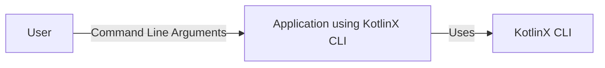
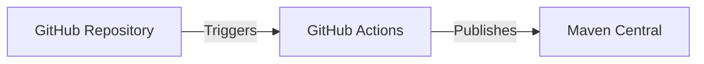
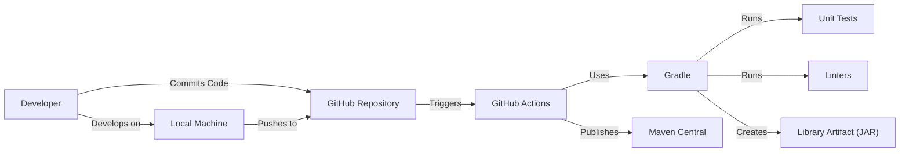

# BUSINESS POSTURE

Business Priorities and Goals:

The kotlinx.cli project aims to provide a pure Kotlin multiplatform library for parsing command-line arguments. This enables Kotlin developers to easily build command-line interfaces (CLIs) for their applications, supporting various platforms like JVM, JS, and Native. The project prioritizes ease of use, a clean and idiomatic Kotlin API, and cross-platform compatibility.

Business Risks:

-   Incorrect argument parsing: If the library fails to correctly parse command-line arguments, it could lead to unexpected application behavior, potentially causing data corruption, security vulnerabilities, or denial of service.
-   Lack of support for complex scenarios: If the library doesn't support advanced command-line parsing features, it may limit the functionality and usability of applications built with it.
-   Compatibility issues: As a multiplatform library, inconsistencies in behavior across different platforms could lead to developer frustration and application instability.
-   Security vulnerabilities in argument handling: Maliciously crafted command-line arguments could potentially exploit vulnerabilities in the library or the application using it, leading to security breaches.
-   Maintenance and updates: As an open-source library, its long-term maintenance and updates depend on community contributions and project maintainers. Lack of activity could lead to the library becoming outdated and insecure.

# SECURITY POSTURE

Existing Security Controls:

-   security control: The project uses GitHub Actions for continuous integration, which includes build and test steps. (Described in .github/workflows directory)
-   security control: The project has a defined code style and uses linters to enforce it. (Described in .editorconfig file)
-   security control: The project has extensive unit tests to ensure the correctness of the parsing logic. (Described in src/commonTest/kotlin directory)
-   accepted risk: The library itself does not perform any explicit input sanitization or validation beyond parsing the structure of the command-line arguments. It is the responsibility of the application using the library to validate the values provided by the user.
-   accepted risk: The library does not directly handle sensitive data like passwords or API keys. It is the responsibility of the application using the library to securely manage such data.

Recommended Security Controls:

-   security control: Integrate static analysis tools (e.g., SAST) into the CI pipeline to automatically detect potential security vulnerabilities in the code.
-   security control: Consider adding fuzz testing to the test suite to identify potential edge cases and vulnerabilities related to unexpected input.
-   security control: Provide clear documentation and examples on how to securely handle sensitive data (e.g., passwords) when using the library.

Security Requirements:

-   Authentication: Not directly applicable to this library, as it focuses on argument parsing, not user authentication.
-   Authorization: Not directly applicable to this library. Authorization is the responsibility of the application using it.
-   Input Validation: The library should correctly parse command-line arguments according to the defined grammar. The application using the library *must* validate the *values* of the arguments to ensure they are within expected ranges and formats.
-   Cryptography: Not directly applicable to this library, unless it's used to handle encrypted configuration values, in which case standard cryptographic best practices should be followed by the application using the library.

# DESIGN

## C4 CONTEXT

Element Description:

-   User:
    -   Name: User
    -   Type: Person
    -   Description: The person interacting with the application through the command line.
    -   Responsibilities: Provides command-line arguments to the application.
    -   Security controls: None (relies on the application and operating system for security).

-   KotlinX CLI:
    -   Name: KotlinX CLI
    -   Type: Library
    -   Description: The kotlinx.cli library for parsing command-line arguments.
    -   Responsibilities: Parses command-line arguments and provides a structured representation to the application.
    -   Security controls: Code style enforcement, unit tests.

-   Application using KotlinX CLI:
    -   Name: Application using KotlinX CLI
    -   Type: Software System
    -   Description: An application that uses the kotlinx.cli library to handle command-line arguments.
    -   Responsibilities: Implements the application's functionality and uses kotlinx.cli to parse user input.
    -   Security controls: Input validation, application-specific security measures.

## C4 CONTAINER

Since this is a library, the container diagram is essentially the same as the context diagram. The library itself is the single "container."

Element Description:

-   User:
    -   Name: User
    -   Type: Person
    -   Description: The person interacting with the application through the command line.
    -   Responsibilities: Provides command-line arguments to the application.
    -   Security controls: None (relies on the application and operating system for security).

-   KotlinX CLI:
    -   Name: KotlinX CLI
    -   Type: Library
    -   Description: The kotlinx.cli library for parsing command-line arguments.
    -   Responsibilities: Parses command-line arguments and provides a structured representation to the application.
    -   Security controls: Code style enforcement, unit tests.

-   Application using KotlinX CLI:
    -   Name: Application using KotlinX CLI
    -   Type: Software System
    -   Description: An application that uses the kotlinx.cli library to handle command-line arguments.
    -   Responsibilities: Implements the application's functionality and uses kotlinx.cli to parse user input.
    -   Security controls: Input validation, application-specific security measures.

## DEPLOYMENT

Kotlinx.cli is a library, not a standalone application, so "deployment" refers to its publication to a repository where it can be used as a dependency by other projects. The primary deployment target is Maven Central.

Possible deployment solutions:

1.  Manual publication to Maven Central.
2.  Automated publication to Maven Central using a CI/CD pipeline (e.g., GitHub Actions).

Chosen solution: Automated publication to Maven Central using GitHub Actions.

Element Description:

-   GitHub Repository:
    -   Name: GitHub Repository
    -   Type: Code Repository
    -   Description: The source code repository for kotlinx.cli.
    -   Responsibilities: Stores the source code, build scripts, and configuration files.
    -   Security controls: Access controls, branch protection rules.

-   GitHub Actions:
    -   Name: GitHub Actions
    -   Type: CI/CD Platform
    -   Description: The CI/CD platform used to build and publish the library.
    -   Responsibilities: Executes the build and publication steps.
    -   Security controls: Secure environment, access controls, secrets management.

-   Maven Central:
    -   Name: Maven Central
    -   Type: Artifact Repository
    -   Description: The central repository for Maven artifacts.
    -   Responsibilities: Stores the published library artifacts.
    -   Security controls: Access controls, integrity checks.

## BUILD

The build process is automated using Gradle and GitHub Actions.

Build Process Description:

1.  A developer writes code and commits it to the GitHub repository.
2.  The commit triggers a GitHub Actions workflow.
3.  The workflow checks out the code.
4.  Gradle is used to build the project.
5.  Gradle runs unit tests.
6.  Gradle runs linters.
7.  If the tests and linters pass, Gradle creates the library artifact (JAR file).
8.  GitHub Actions publishes the artifact to Maven Central.

Security Controls:

-   security control: GitHub Actions provides a secure build environment.
-   security control: Unit tests ensure the correctness of the code.
-   security control: Linters enforce code style and help prevent common errors.
-   security control: Branch protection rules in GitHub prevent unauthorized changes to the main branch.
-   security control: Secrets management in GitHub Actions securely stores credentials needed for publication.

# RISK ASSESSMENT

Critical Business Processes:

-   Providing a reliable and easy-to-use library for parsing command-line arguments in Kotlin.
-   Maintaining the library and ensuring its compatibility with different Kotlin platforms.

Data:

-   The library itself does not handle any sensitive data directly.
-   The data being processed are command-line arguments, which are provided by the user and their sensitivity depends on the application using the library. The library itself treats them as strings.

# QUESTIONS & ASSUMPTIONS

Questions:

-   Are there any specific compliance requirements (e.g., GDPR, HIPAA) that the applications using this library might need to adhere to? This would influence recommendations for input validation and data handling.
-   What is the expected level of support and maintenance for this library? This affects the risk assessment related to long-term maintenance.
-   Are there any plans to add features that might involve handling sensitive data directly within the library?

Assumptions:

-   BUSINESS POSTURE: The primary goal is to provide a functional and reliable library. Security is important, but usability and ease of integration are also key priorities.
-   SECURITY POSTURE: The library relies on the application using it to perform thorough input validation and handle sensitive data securely.
-   DESIGN: The library is designed to be simple and focused on its core functionality of argument parsing.