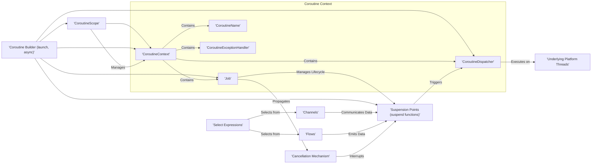

# Project Design Document: kotlinx.coroutines

**Version:** 1.1
**Date:** October 26, 2023
**Author:** AI Software Architect

## 1. Introduction

This document provides a detailed architectural overview of the `kotlinx.coroutines` library. Its primary purpose is to serve as a foundation for subsequent threat modeling activities. By clearly outlining the library's components, their interactions, and the data flow, this document aims to facilitate the identification of potential security vulnerabilities. The focus is on aspects of the library directly relevant to security considerations.

## 2. Goals and Non-Goals

**Goals:**

* Provide a clear and comprehensive architectural description of `kotlinx.coroutines`.
* Identify and describe the key components of the library and their responsibilities.
* Illustrate the data flow and interactions between these components using diagrams.
* Highlight potential areas of interest and concerns for security analysis and threat modeling.

**Non-Goals:**

* Provide exhaustive code-level implementation details for every class and function within the library.
* Offer a formal security assessment or a fully developed threat model within this document. This document serves as input for such activities.
* Describe the internal workings of the Kotlin compiler, the Java Virtual Machine (JVM), or other underlying platform specifics beyond their direct interaction with `kotlinx.coroutines`.
* Detail specific application-level use cases or provide guidance on how to implement secure applications using `kotlinx.coroutines`.

## 3. High-Level Architecture

The `kotlinx.coroutines` library enables asynchronous and non-blocking programming in Kotlin through the concept of coroutines. These are lightweight, concurrent units of execution managed by the library.



**Key Components:**

* **CoroutineContext:**  A fundamental concept representing a persistent, indexed set of elements that define the context of a coroutine.
    * **Job:**  An element of the context that represents the lifecycle of a coroutine. It can be used to manage the coroutine's execution and cancellation.
    * **CoroutineDispatcher:** Determines the thread or threads on which the coroutine will execute. This is crucial for managing concurrency and offloading work.
    * **CoroutineName:**  An optional element used for debugging purposes, providing a human-readable name for the coroutine.
    * **CoroutineExceptionHandler:**  An optional element that provides a mechanism for handling uncaught exceptions within a coroutine.
* **CoroutineScope:**  An interface that defines a scope for launching new coroutines. Coroutines launched within a scope inherit its context and are tied to its lifecycle, enabling structured concurrency.
* **Coroutine Builders (launch, async):** Functions used to initiate new coroutines. `launch` starts a coroutine that does not return a result, while `async` starts a coroutine that returns a `Deferred`, representing a future result.
* **Suspension Points (suspend functions):**  Specific locations within the code marked by the `suspend` keyword where a coroutine can be paused without blocking the underlying thread. This allows for cooperative multitasking.
* **Channels:**  A concurrency primitive that provides a way for coroutines to communicate and exchange data safely. They can be configured with different buffering strategies.
* **Flows:**  A representation of an asynchronous stream of data. Flows are built upon coroutines and provide a declarative way to handle sequences of values over time.
* **Select Expressions:**  A construct that allows a coroutine to wait for the first available event from a set of suspending functions, typically involving channel receives or deferred values.
* **Cancellation Mechanism:**  A cooperative mechanism for stopping the execution of coroutines. It involves checking for cancellation status and cleaning up resources.
* **Underlying Platform Threads:** The actual operating system threads managed by the platform's threading mechanisms, upon which coroutines are ultimately executed by dispatchers.

## 4. Component Details

This section provides a more detailed description of the key components and their functionalities, highlighting aspects relevant to security considerations.

* **CoroutineContext:**
    * Acts as an immutable container for contextual information associated with a coroutine's execution.
    * Elements within the context can be accessed and combined.
    * The immutability ensures that the context remains consistent throughout the coroutine's lifecycle.
    * Security relevance:  Improper propagation or sharing of context elements could potentially lead to unintended access or behavior.

* **Job:**
    * Manages the lifecycle of a coroutine, transitioning through states like active, completing, completed, cancelling, and cancelled.
    * Provides methods for initiating cancellation and waiting for completion.
    * Supports hierarchical relationships between jobs, where cancelling a parent job also cancels its children.
    * Security relevance:  Uncontrolled or malicious cancellation could disrupt operations. Improper handling of job states might lead to resource leaks or inconsistent states.

* **CoroutineDispatcher:**
    * Responsible for scheduling the execution of coroutines on specific threads or thread pools.
    * Standard dispatchers include `Dispatchers.Default` (for CPU-intensive tasks), `Dispatchers.IO` (for I/O-bound operations), and `Dispatchers.Main` (for UI-related tasks).
    * Custom dispatchers can be created, potentially introducing security risks if not implemented carefully.
    * Security relevance:  A malicious or compromised dispatcher could potentially execute code in an unintended context or exhaust resources.

* **CoroutineScope:**
    * Enforces structured concurrency by tying the lifecycle of child coroutines to the scope's lifecycle.
    * When a scope is cancelled, all coroutines launched within that scope are also cancelled.
    * Helps prevent resource leaks and ensures proper cleanup.
    * Security relevance:  Improper scope management could lead to orphaned coroutines or delayed resource release.

* **Coroutine Builders (launch, async):**
    * Serve as the primary entry points for creating and starting coroutines.
    * Accept an optional `CoroutineContext` argument, allowing customization of the coroutine's execution environment.
    * Security relevance:  Incorrectly configured contexts could lead to coroutines running with unintended privileges or on inappropriate threads.

* **Suspension Points (suspend functions):**
    * Mark points where a coroutine can be paused without blocking the underlying thread, allowing other coroutines to execute.
    * The Kotlin compiler transforms suspend functions to manage their state and continuation.
    * Security relevance:  While not directly a security vulnerability, the logic within and around suspension points needs careful review to prevent race conditions or unexpected state transitions.

* **Channels:**
    * Provide a mechanism for safe communication and data exchange between coroutines.
    * Offer different buffering strategies, impacting how data is queued and delivered.
    * Security relevance:  Unbounded channels could lead to memory exhaustion. Improper handling of channel closure or data serialization could introduce vulnerabilities.

* **Flows:**
    * Represent asynchronous streams of data, enabling reactive programming patterns.
    * Built using coroutines and suspension, providing a composable way to handle asynchronous data.
    * Security relevance:  Similar to channels, unbounded flows could lead to resource exhaustion. Care must be taken when processing data within flows, especially if it involves sensitive information.

* **Select Expressions:**
    * Allow a coroutine to efficiently wait for the first available event from multiple suspending operations.
    * Useful for implementing complex communication patterns and reacting to multiple inputs.
    * Security relevance:  The logic within `select` blocks needs careful review to prevent race conditions or unintended behavior based on the order of events.

* **Cancellation Mechanism:**
    * A cooperative mechanism where coroutines need to explicitly check for cancellation and clean up resources.
    * Involves checking the `isActive` property of the `Job` or using functions like `ensureActive()`.
    * Security relevance:  Failure to handle cancellation properly can lead to resource leaks, inconsistent state, or the continuation of operations that should have been stopped.

## 5. Data Flow

The data flow within `kotlinx.coroutines` primarily involves the exchange of information between coroutines and the management of their execution state.

```mermaid
graph LR
    subgraph "Coroutine 1"
        A["'Suspension Point'"]
        B["'Channel Send'"]
        C["'Flow Emission'"]
    end
    subgraph "Coroutine 2"
        D["'Suspension Point'"]
        E["'Channel Receive'"]
        F["'Flow Collection'"]
    end
    G["'Shared Mutable State'"]

    A -- "Suspends/Resumes" --> "CoroutineDispatcher"
    B -- "Sends Data to" --> E
    C -- "Emits Data to" --> F
    E -- "Receives Data from" --> B
    F -- "Collects Data from" --> C
    subgraph "Dispatcher"
        H["'Thread Pool'"]
    end
    "CoroutineDispatcher" -- "Executes on" --> H
    subgraph "Potential Data Sharing Risks"
        I["'Shared Objects'"]
    end
    Coroutine 1 -- "Accesses/Modifies (Unsafe)" --> I
    Coroutine 2 -- "Accesses/Modifies (Unsafe)" --> I
```

**Key Data Flow Patterns:**

* **Suspension and Resumption:** When a coroutine encounters a suspension point, its execution is paused, and control is yielded to the `CoroutineDispatcher`. Upon the fulfillment of the suspension condition, the dispatcher resumes the coroutine's execution.
* **Channel Communication:** Data flows between coroutines through channels. A sending coroutine places data into the channel, and a receiving coroutine retrieves it. The flow can be synchronous or asynchronous depending on the channel's buffering.
* **Flow Emission and Collection:** Flows emit a sequence of values asynchronously. These values are then consumed by collecting coroutines. The data flows from the emitter to the collector.
* **Shared Mutable State:** Coroutines can potentially access and modify shared mutable state. This is a critical area for security concerns, as concurrent access without proper synchronization can lead to race conditions and data corruption.
* **Cancellation Propagation:** When a coroutine is cancelled, the cancellation signal can propagate to its child coroutines and other related components, influencing the flow of execution and resource management.

## 6. Security Considerations (Pre-Threat Modeling)

While `kotlinx.coroutines` primarily focuses on concurrency, several aspects have potential security implications that need to be considered during threat modeling:

* **Resource Exhaustion (DoS):** Uncontrolled creation of coroutines or unbounded channel/flow buffers can lead to excessive memory consumption or thread exhaustion, resulting in denial-of-service.
* **Deadlocks and Livelocks:** Improper synchronization when accessing shared mutable state within coroutines can lead to deadlocks (where coroutines are blocked indefinitely) or livelocks (where coroutines repeatedly change state but make no progress).
* **Cancellation Vulnerabilities:** Failure to properly handle cancellation can lead to resource leaks, inconsistent application state, or the continuation of sensitive operations after they should have been stopped.
* **Exception Handling Weaknesses:** Uncaught exceptions within coroutines can propagate up the hierarchy and potentially disrupt the application or expose sensitive information through error messages. The `CoroutineExceptionHandler` is crucial for mitigating this.
* **Dispatcher Security Risks:** Custom dispatchers, if not implemented securely, could introduce vulnerabilities by executing code in unintended contexts or exposing sensitive resources.
* **Data Races and Inconsistent State:** Concurrent access to shared mutable state without proper synchronization mechanisms (like mutexes or atomic operations) can lead to data races and unpredictable, potentially exploitable, application behavior.
* **Information Disclosure:** Improper handling or logging of sensitive data within coroutines could lead to unintended information disclosure.
* **Timing Attacks:** In specific scenarios, the timing of coroutine execution or communication could potentially be exploited for timing attacks, although this is generally less of a concern at the coroutine level than at lower levels of the system.
* **Channel and Flow Security:**  Unsecured channels or flows transmitting sensitive data could be intercepted if the underlying communication mechanisms are not secure. Serialization and deserialization of data within channels and flows also present potential vulnerabilities.

## 7. Deployment Considerations

`kotlinx.coroutines` is a library that is typically included as a dependency in Kotlin projects. Its behavior and security implications can be influenced by the deployment environment:

* **JVM Applications:** Coroutines are executed on JVM threads managed by the configured `CoroutineDispatcher`. The security of the underlying JVM and its thread management is relevant.
* **Android Applications:** `Dispatchers.Main` typically runs on the UI thread, while background tasks often use `Dispatchers.IO` or `Dispatchers.Default`. Android's permission model and security features are important considerations.
* **Native Applications (Kotlin/Native):** Coroutines are managed by the Kotlin/Native runtime. Security considerations specific to native execution environments apply.
* **JavaScript Applications (Kotlin/JS):** Coroutines are implemented using JavaScript's asynchronous features. Browser security models and JavaScript security best practices are relevant.

The specific deployment environment dictates the underlying threading model, available resources, and security mechanisms, all of which can impact the security posture of applications using `kotlinx.coroutines`.

## 8. Future Considerations

Potential future developments and enhancements in `kotlinx.coroutines` could introduce new security considerations:

* **New Concurrency Primitives:** The introduction of new concurrency primitives or features might introduce new attack vectors if not designed and implemented with security in mind.
* **Integration with External Systems:**  As `kotlinx.coroutines` is used to interact with more external systems (databases, network services, etc.), the security of these interactions becomes increasingly important.
* **Performance Optimizations:**  Performance optimizations that involve lower-level system interactions or bypass standard safety checks could potentially introduce new security risks.
* **Changes to Cancellation or Exception Handling:** Modifications to the core mechanisms of cancellation or exception handling could have unforeseen security implications if not carefully considered.

This document provides a comprehensive architectural overview of `kotlinx.coroutines`, serving as a crucial input for subsequent threat modeling activities. By understanding the components, data flow, and potential security considerations outlined here, security professionals can effectively identify and mitigate potential vulnerabilities in applications utilizing this powerful concurrency library.