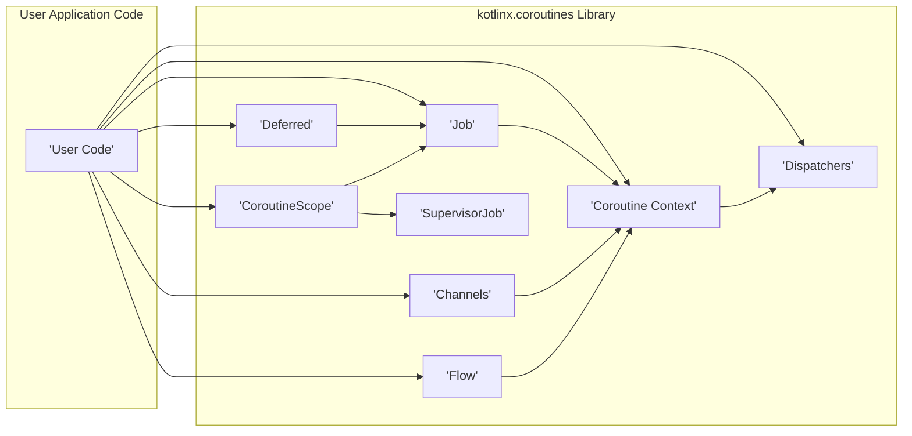
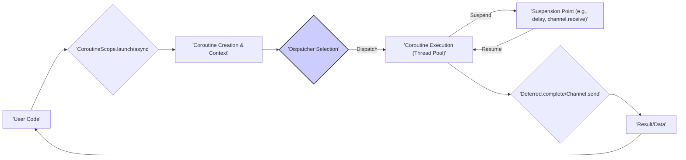

## Project Design Document: kotlinx.coroutines (Improved)

**1. Introduction**

This document provides an enhanced design overview of the `kotlinx.coroutines` library, emphasizing aspects relevant for security threat modeling. It details the library's architecture, key components, data flows, and dependencies to facilitate a comprehensive understanding of potential security vulnerabilities. This document will serve as the foundation for subsequent threat modeling activities.

**2. Project Overview**

`kotlinx.coroutines` is a comprehensive library developed by JetBrains for Kotlin, enabling efficient and manageable asynchronous programming using coroutines. It allows developers to write non-blocking, concurrent code in a sequential style, enhancing readability and simplifying complex asynchronous logic. The library is designed for multiplatform compatibility, supporting JVM, Native, and JavaScript environments.

**3. Goals and Objectives**

* **Efficient Concurrency:** To provide a high-performance and resource-efficient mechanism for managing concurrent operations, surpassing traditional threading models in terms of overhead.
* **Simplified Asynchronous Programming:** To abstract away the complexities of asynchronous programming with a structured and intuitive API, reducing boilerplate and improving code maintainability.
* **Structured Concurrency Enforcement:** To promote safe and predictable concurrency through features like `CoroutineScope`, ensuring proper lifecycle management of coroutines and preventing resource leaks.
* **Multiplatform Consistency:** To offer a consistent API and behavior across all supported Kotlin target platforms, minimizing platform-specific code.
* **Seamless Kotlin Integration:** To leverage Kotlin's language features, such as extension functions and DSLs, to provide a natural and idiomatic development experience for Kotlin developers.

**4. Target Audience**

* Kotlin application developers requiring asynchronous capabilities for tasks like network requests, I/O operations, and background processing.
* Developers building concurrent systems seeking a more robust and easier-to-manage alternative to traditional threads.
* Library authors aiming to create asynchronous APIs that are safe and easy to use.

**5. High-Level Architecture**

**Description:**

* **User Code:** The application-specific Kotlin code that utilizes the `kotlinx.coroutines` library to perform asynchronous operations.
* **Coroutine Context:** A collection of elements that define the execution environment for a coroutine. This includes the `Dispatcher`, `Job`, `CoroutineName`, and `CoroutineExceptionHandler`.
* **Dispatchers:** Responsible for determining the thread or threads on which a coroutine's execution will take place. Examples include `Dispatchers.Default`, `Dispatchers.IO`, and platform-specific main dispatchers.
* **Job:** Represents the lifecycle of a coroutine and provides mechanisms for cancellation and hierarchical management of coroutines.
* **Deferred:** Represents a computation that will provide a result at some point in the future. It is a subtype of `Job` with the added capability of retrieving the computed value.
* **Channels:** Provide a mechanism for coroutines to communicate and exchange data with each other in a safe and synchronized manner.
* **Flow:** Represents an asynchronous stream of data that emits values over time. It provides operators for transforming and processing these streams.
* **SupervisorJob:** A type of `Job` where the failure of a child coroutine does not automatically cancel its parent or other sibling coroutines.
* **CoroutineScope:** Defines a context for launching new coroutines, ensuring that all coroutines launched within the scope are tracked and can be cancelled together.

**6. Key Components and Their Interactions**

* **Coroutines:**
    * Lightweight, independently executable units of code.
    * Can be suspended and resumed at specific points without blocking the underlying thread, allowing for efficient concurrency.
    * Always launched within a specific `CoroutineScope`.
* **Coroutine Context:**
    * A `ContinuationInterceptor` (typically a `Dispatcher`) that determines the execution thread.
    * A `Job` instance that manages the coroutine's lifecycle and cancellation.
    * An optional `CoroutineName` for debugging and logging purposes.
    * An optional `CoroutineExceptionHandler` for handling uncaught exceptions within the coroutine.
    * Other context elements can be added for specific purposes.
* **Dispatchers:**
    * `Dispatchers.Default`: The default dispatcher, optimized for CPU-intensive tasks and backed by a shared pool of threads.
    * `Dispatchers.IO`: Optimized for I/O-bound operations (network, disk), typically backed by a larger shared pool of threads.
    * `Dispatchers.Main`: Executes coroutines on the main UI thread or event loop of the platform.
    * `newSingleThreadContext`: Creates a new thread for the coroutine's exclusive use. **Security Note:**  Careless creation of single-threaded contexts can lead to resource exhaustion.
    * `newFixedThreadPoolContext`: Creates a thread pool with a fixed number of threads. **Security Note:**  Incorrectly sized thread pools can lead to performance bottlenecks or denial of service.
* **Job:**
    * Manages the lifecycle of a coroutine, transitioning through states like New, Active, Completing, Completed, Cancelling, and Cancelled.
    * Supports hierarchical cancellation, where cancelling a parent job cancels all its child jobs.
    * `Job()` creates a standard job, while `SupervisorJob()` creates a job where child failures are isolated.
* **Deferred:**
    * Extends `Job` and represents a future result of an asynchronous computation.
    * Provides `await()` to suspend the coroutine until the result is available.
    * Can be cancelled, which will also cancel the underlying computation.
* **Channels:**
    * Provide a safe way for coroutines to communicate by sending and receiving elements.
    * **RendezvousChannel:** Synchronous channel where the sender blocks until the receiver is ready.
    * **BufferedChannel:** Allows a specified number of elements to be buffered. **Security Note:** Unbounded buffers can lead to memory exhaustion if producers outpace consumers.
    * **ConflatedChannel:** Only keeps the most recently sent element, overwriting previous ones.
    * **UnlimitedChannel:** Can buffer an unlimited number of elements. **Security Note:**  High risk of memory exhaustion.
* **Flow:**
    * Represents a sequence of asynchronously emitted values.
    * Built using the `flow { ... }` builder.
    * Operators like `map`, `filter`, `collect`, and `flatMap` allow for declarative data stream processing.
    * Supports backpressure mechanisms to manage the rate of data emission and consumption.
* **Cancellation:**
    * Coroutines can be cancelled using `job.cancel()`. Cancellation is cooperative, requiring coroutines to periodically check `isActive` or use cancellable suspending functions.
    * `NonCancellable` context can be used to execute critical sections of code that should not be interrupted by cancellation. **Security Note:** Overuse of `NonCancellable` can hinder proper resource cleanup.
* **Exception Handling:**
    * Standard `try-catch` blocks can be used within coroutines.
    * `CoroutineExceptionHandler` in the `CoroutineContext` provides a mechanism for handling uncaught exceptions at a higher level.
    * Exceptions in child coroutines propagate to the parent job, causing its cancellation (unless using `SupervisorJob`).
* **Select Expression:**
    * Allows waiting for the first of several suspending operations to complete without blocking the thread.
    * Useful for implementing non-blocking communication patterns with multiple channels or deferred values.

**7. Data Flow**

**Description:**

1. **User Code** initiates a coroutine using `CoroutineScope.launch` (for fire-and-forget tasks) or `CoroutineScope.async` (for tasks that return a result).
2. **Coroutine Creation & Context:** A new coroutine instance is created, associated with a specific `CoroutineContext` that defines its execution environment.
3. **Dispatcher Selection:** The `Dispatcher` from the `CoroutineContext` is used to determine the thread or thread pool where the coroutine's code will be executed.
4. **Coroutine Execution (Thread Pool):** The coroutine's code begins execution on a thread managed by the selected `Dispatcher`.
5. **Suspend:** When the coroutine encounters a suspension point (e.g., `delay`, `channel.receive()`, network I/O), its execution is paused, and the underlying thread is released to perform other tasks.
6. **Resume:** When the condition for resumption is met (e.g., the delay has elapsed, data is available on the channel), the coroutine is scheduled for resumption on a thread managed by its `Dispatcher`.
7. **Deferred.complete/Channel.send:** Upon completion or when data needs to be sent, `Deferred.complete()` is called to provide the result, or `Channel.send()` is used to transmit data to another coroutine.
8. **Result/Data:** The result of the asynchronous operation or the data sent through the channel becomes available to the user code or the receiving coroutine.

**8. Dependencies**

* **kotlin-stdlib:** The fundamental library for the Kotlin language, providing core language features and utilities.
* **kotlin-stdlib-common:** Contains common Kotlin standard library declarations shared across different platforms.
* **kotlin-reflect (optional):** Required for certain advanced features like reflection-based channel implementations and serialization within coroutines.
* **Platform-specific libraries:** Depending on the target platform (JVM, Native, JavaScript), there might be underlying platform-specific dependencies for threading primitives, event loops, and other low-level functionalities.

**9. Security Considerations (Detailed)**

This section expands on potential security considerations, providing more specific examples and potential attack vectors.

* **Resource Exhaustion:**
    * **Unbounded Coroutine Launch:**  Allowing uncontrolled launching of coroutines (e.g., in response to external requests without proper rate limiting) can lead to excessive thread creation and memory consumption, resulting in denial of service.
    * **Dispatcher Misconfiguration:** Using `Dispatchers.Default` for blocking I/O operations can starve the thread pool, while creating too many custom thread pools can exhaust system resources.
    * **Unbounded Channels:**  Using `UnlimitedChannel` or `BufferedChannel` without proper consumption can lead to memory exhaustion as producers continuously add elements. **Mitigation:** Use bounded channels or backpressure mechanisms in Flows.
* **Data Races and Concurrency Issues:**
    * **Shared Mutable State:** Accessing and modifying shared mutable variables from multiple coroutines without proper synchronization (e.g., using `Mutex` or atomic variables) can lead to data corruption and inconsistent application state.
    * **Incorrect Channel Usage:**  Sending or receiving on closed channels without proper handling can lead to exceptions or unexpected behavior.
    * **Flow Concurrency Issues:**  Applying stateful operators on Flows without considering concurrency can lead to race conditions.
* **Cancellation Vulnerabilities:**
    * **Resource Leaks on Cancellation:** If coroutines performing resource acquisition (e.g., opening files, network connections) are cancelled abruptly without proper cleanup, it can lead to resource leaks. **Mitigation:** Use `finally` blocks or `use` function for resource management.
    * **Inconsistent State on Cancellation:** Cancelling a coroutine in the middle of a critical operation can leave the application in an inconsistent state. **Mitigation:** Use `NonCancellable` sparingly and ensure proper state management.
    * **Malicious Cancellation:**  External actors might attempt to induce cancellation at critical points to disrupt application logic or cause denial of service.
* **Dependency Vulnerabilities:**
    * Vulnerabilities in `kotlin-stdlib` or platform-specific libraries could be exploited through `kotlinx.coroutines`. Keeping dependencies updated is crucial.
* **Exception Handling and Information Disclosure:**
    * **Leaking Sensitive Information:** Unhandled exceptions might expose sensitive data (e.g., database credentials, API keys) in error messages or logs. **Mitigation:** Implement robust exception handling and sanitize error messages.
    * **Denial of Service through Exceptions:**  Repeatedly triggering exceptions can consume resources and lead to denial of service.
* **Dispatcher Security:**
    * **Custom Dispatcher Vulnerabilities:**  Custom dispatchers that don't properly manage threads or security contexts can introduce vulnerabilities.
    * **Shared Dispatcher Risks:** Using a shared dispatcher for untrusted code can allow resource interference or information leakage.
* **Channel Security:**
    * **Data Interception:** Data transmitted through channels is not inherently secure. Sensitive data should be encrypted if transmitted across trust boundaries.
    * **Channel Manipulation:** Vulnerabilities in channel implementations could potentially allow malicious actors to manipulate data flow or cause denial of service.
* **Flow Security:**
    * **Backpressure Exploitation:**  Malicious producers might intentionally overwhelm consumers by ignoring backpressure signals, leading to resource exhaustion.
    * **Data Injection:**  If Flows are sourced from external inputs, proper validation and sanitization are necessary to prevent data injection attacks.

**10. Deployment Model**

`kotlinx.coroutines` is typically deployed as a library dependency within Kotlin applications. Developers include the library in their project's build configuration (e.g., using Gradle or Maven). The library's functionalities are then accessed through its API within the application's codebase. The deployment environment can range from server-side applications to mobile apps and web browsers (for Kotlin/JS).

**11. Future Considerations**

* **Evolving Coroutine Features:** Future versions of Kotlin and `kotlinx.coroutines` might introduce new concurrency primitives or changes to existing ones, potentially introducing new security considerations that need to be evaluated.
* **Integration with Emerging Platforms:** As Kotlin expands to new platforms and environments, `kotlinx.coroutines` will need to adapt, potentially exposing new attack surfaces or requiring platform-specific security considerations.
* **Performance Optimizations and Security Trade-offs:** Optimizations aimed at improving performance might inadvertently introduce security vulnerabilities if not carefully designed and reviewed. Security testing should be an integral part of the development process.

This improved design document provides a more detailed and security-focused overview of the `kotlinx.coroutines` library. It serves as a more robust foundation for understanding the library's architecture and identifying potential security vulnerabilities during subsequent threat modeling activities.