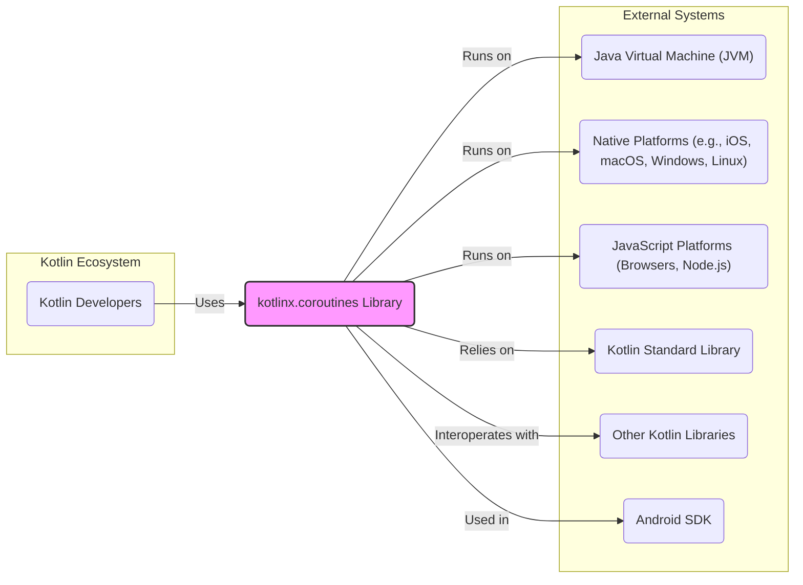
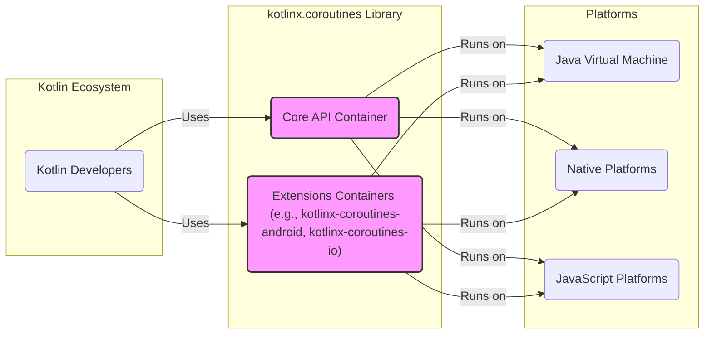
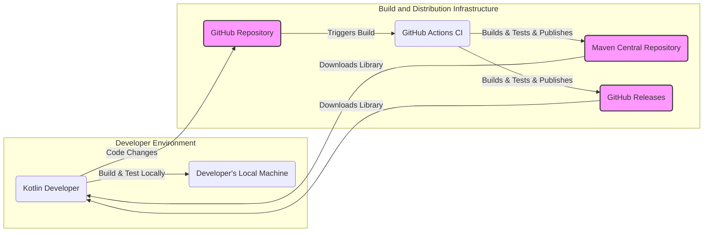
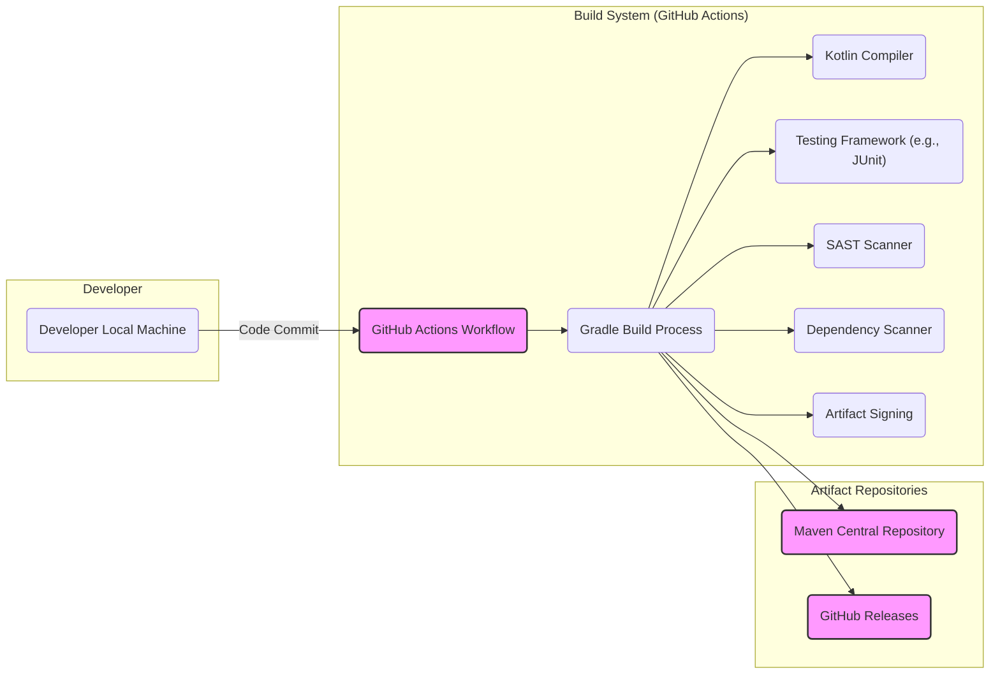

# BUSINESS POSTURE

The kotlinx.coroutines project provides a library for coroutines and asynchronous programming in Kotlin.

- Business Priorities:
  - Enable efficient and performant asynchronous operations in Kotlin applications.
  - Improve developer productivity by providing a structured and easy-to-use concurrency framework.
  - Support a wide range of platforms including JVM, Native, and JavaScript.
  - Foster a strong community around Kotlin asynchronous programming.

- Business Goals:
  - Become the standard library for coroutines in the Kotlin ecosystem.
  - Ensure stability, reliability, and performance of the library.
  - Maintain compatibility with different Kotlin versions and platforms.
  - Encourage adoption of coroutines for asynchronous programming in Kotlin.

- Business Risks:
  - Security vulnerabilities in the library could impact applications using it.
  - Performance regressions could negatively affect application performance.
  - Breaking changes in new versions could disrupt existing applications.
  - Lack of adoption could limit the impact and value of the library.

# SECURITY POSTURE

- Security Controls:
  - security control Open source development model with public code repository on GitHub. Implemented in: GitHub repository.
  - security control Community review and contributions. Implemented in: GitHub pull requests and issue tracking.
  - security control Dependency scanning using GitHub Dependabot. Implemented in: GitHub Dependabot alerts.
  - security control Standard Kotlin coding practices and code reviews. Implemented in: Development guidelines and pull request process.
  - security control Unit and integration testing. Implemented in: Gradle build scripts and CI workflows.

- Accepted Risks:
  - accepted risk Risks inherent in open source software, including potential for undiscovered vulnerabilities.
  - accepted risk Reliance on community contributions for security vulnerability identification and patching.
  - accepted risk Potential for vulnerabilities in third-party dependencies.

- Recommended Security Controls:
  - security control Implement Static Application Security Testing (SAST) in the CI/CD pipeline to automatically detect potential code vulnerabilities.
  - security control Conduct regular security code reviews by security experts, especially for critical components and new features.
  - security control Establish a clear vulnerability disclosure policy and process for reporting and handling security issues.
  - security control Perform dependency vulnerability scanning as part of the build process and monitor for updates.

- Security Requirements:
  - Authentication: Not directly applicable to a library. Authentication is the responsibility of applications using the library.
  - Authorization: Not directly applicable to a library. Authorization is the responsibility of applications using the library.
  - Input Validation: The library APIs should perform input validation to prevent unexpected behavior or crashes due to invalid input from applications. This is especially important for public facing APIs.
  - Cryptography: The core coroutines library itself is unlikely to require cryptography. If specific extensions or modules are developed that handle sensitive data, appropriate cryptographic measures should be implemented in those modules.

# DESIGN

## C4 CONTEXT

- Elements of Context Diagram:
  - - Name: Kotlin Developers
    - Type: Person
    - Description: Software developers who use the kotlinx.coroutines library to build Kotlin applications.
    - Responsibilities: Develop applications using Kotlin and coroutines for asynchronous programming.
    - Security controls: Responsible for secure coding practices in their applications, including proper use of coroutines and handling of asynchronous operations securely.

  - - Name: kotlinx.coroutines Library
    - Type: Software System
    - Description: A Kotlin library providing support for coroutines and asynchronous programming.
    - Responsibilities: Provide a robust, performant, and easy-to-use API for coroutines in Kotlin. Handle asynchronous operations and concurrency management.
    - Security controls: Input validation in public APIs, secure coding practices during development, dependency vulnerability management, and adherence to secure software development lifecycle principles.

  - - Name: Java Virtual Machine (JVM)
    - Type: Software System
    - Description: The Java Virtual Machine, a runtime environment for executing Java and Kotlin bytecode.
    - Responsibilities: Execute Kotlin bytecode, provide runtime environment for kotlinx.coroutines on JVM.
    - Security controls: JVM security features, sandboxing, and security updates provided by JVM vendors.

  - - Name: Native Platforms (e.g., iOS, macOS, Windows, Linux)
    - Type: Software System
    - Description: Operating systems and hardware platforms where Kotlin Native applications run.
    - Responsibilities: Provide runtime environment for kotlinx.coroutines on native platforms.
    - Security controls: Operating system security features, platform-specific security mechanisms.

  - - Name: JavaScript Platforms (Browsers, Node.js)
    - Type: Software System
    - Description: JavaScript runtime environments where Kotlin/JS applications run.
    - Responsibilities: Provide runtime environment for kotlinx.coroutines on JavaScript platforms.
    - Security controls: Browser security features, Node.js security best practices.

  - - Name: Kotlin Standard Library
    - Type: Software System
    - Description: The standard library for the Kotlin programming language, providing core functionalities.
    - Responsibilities: Provide basic functionalities used by kotlinx.coroutines.
    - Security controls: Security of the Kotlin Standard Library, maintained by JetBrains and the Kotlin community.

  - - Name: Other Kotlin Libraries
    - Type: Software System
    - Description: Other Kotlin libraries that may interoperate with or be used alongside kotlinx.coroutines.
    - Responsibilities: Provide additional functionalities that can be combined with coroutines.
    - Security controls: Security of individual Kotlin libraries, responsibility of their respective developers.

  - - Name: Android SDK
    - Type: Software System
    - Description: The Android Software Development Kit, used for developing Android applications.
    - Responsibilities: Provide platform-specific APIs and functionalities for Android applications using kotlinx.coroutines.
    - Security controls: Android platform security features and security guidelines for Android development.

## C4 CONTAINER

- Elements of Container Diagram:
  - - Name: Core API Container
    - Type: Library Component
    - Description: Contains the core API of kotlinx.coroutines, including fundamental coroutine constructs, dispatchers, and basic asynchronous primitives.
    - Responsibilities: Provide the foundational building blocks for coroutine-based asynchronous programming in Kotlin.
    - Security controls: Input validation in public API functions, secure coding practices, unit and integration testing, SAST in CI/CD pipeline.

  - - Name: Extensions Containers (e.g., kotlinx-coroutines-android, kotlinx-coroutines-io)
    - Type: Library Components
    - Description:  A set of extension libraries that provide platform-specific or domain-specific functionalities built on top of the core API. Examples include Android support, IO operations, and reactive streams integration.
    - Responsibilities: Extend the core coroutines functionality to specific platforms or domains. Provide convenient APIs for common use cases.
    - Security controls: Input validation in public API functions, secure coding practices, unit and integration testing, dependency vulnerability scanning, and security reviews for extension-specific functionalities.

## DEPLOYMENT

The kotlinx.coroutines library itself is not deployed as a standalone application. It is distributed as a library that developers integrate into their Kotlin projects. The deployment context is therefore the distribution of the library to developers.

- Elements of Deployment Diagram:
  - - Name: GitHub Repository
    - Type: Code Repository
    - Description: The source code repository for kotlinx.coroutines hosted on GitHub.
    - Responsibilities: Store and manage the source code, track changes, facilitate collaboration.
    - Security controls: GitHub access controls, branch protection rules, code review process, vulnerability scanning by GitHub Dependabot.

  - - Name: GitHub Actions CI
    - Type: CI/CD System
    - Description: GitHub Actions workflows used for continuous integration and continuous delivery of the library.
    - Responsibilities: Automate building, testing, and publishing the library. Run security checks during the build process.
    - Security controls: Secure configuration of CI workflows, secrets management, access control to CI environment, SAST and dependency scanning integrated into CI.

  - - Name: Maven Central Repository
    - Type: Package Registry
    - Description: A central repository for Java and Kotlin libraries, used to distribute kotlinx.coroutines as a Maven artifact.
    - Responsibilities: Host and distribute the library artifacts to developers.
    - Security controls: Maven Central security policies, artifact signing, checksum verification.

  - - Name: GitHub Releases
    - Type: File Hosting
    - Description: GitHub Releases used to distribute compiled JAR files and source code archives of kotlinx.coroutines.
    - Responsibilities: Host and distribute release artifacts.
    - Security controls: GitHub security features, access controls, checksum verification for downloaded artifacts.

  - - Name: Developer's Local Machine
    - Type: Development Environment
    - Description: The local computer used by Kotlin developers to develop applications and integrate the kotlinx.coroutines library.
    - Responsibilities: Development, building, and testing of applications using kotlinx.coroutines.
    - Security controls: Security of the developer's environment is the responsibility of the developer and their organization. Best practices include secure coding practices, keeping development tools up-to-date, and protecting development machines from malware.

## BUILD

- Elements of Build Diagram:
  - - Name: Developer Local Machine
    - Type: Development Environment
    - Description: Developer's local machine where code changes are made and committed.
    - Responsibilities: Writing and committing code, potentially running local builds and tests.
    - Security controls: Developer's responsibility to maintain a secure development environment.

  - - Name: GitHub Actions Workflow
    - Type: CI/CD Pipeline
    - Description: Automated workflow defined in GitHub Actions to build, test, and publish the library.
    - Responsibilities: Orchestrate the build process, run tests, perform security checks, and publish artifacts.
    - Security controls: Secure workflow definition, secrets management, access control to workflow execution, logging and monitoring of build process.

  - - Name: Gradle Build Process
    - Type: Build Automation Tool
    - Description: Gradle build system used to compile, test, and package the kotlinx.coroutines library.
    - Responsibilities: Compile Kotlin code, run tests, manage dependencies, package artifacts.
    - Security controls: Secure build scripts, dependency management, plugin security.

  - - Name: Kotlin Compiler
    - Type: Compiler
    - Description: Kotlin compiler used to compile Kotlin source code into bytecode.
    - Responsibilities: Compile Kotlin code into JVM bytecode, Native binaries, or JavaScript code.
    - Security controls: Security of the Kotlin compiler itself, typically assumed to be secure as part of the Kotlin toolchain.

  - - Name: Testing Framework (e.g., JUnit)
    - Type: Testing Tool
    - Description: Framework used for running unit and integration tests to ensure code quality and functionality.
    - Responsibilities: Execute automated tests, report test results.
    - Security controls: Secure testing practices, test environment security.

  - - Name: SAST Scanner
    - Type: Security Tool
    - Description: Static Application Security Testing tool integrated into the build process to automatically detect potential code vulnerabilities.
    - Responsibilities: Analyze source code for security vulnerabilities, report findings.
    - Security controls: Configuration and maintenance of SAST scanner, secure handling of scan results.

  - - Name: Dependency Scanner
    - Type: Security Tool
    - Description: Tool to scan project dependencies for known vulnerabilities.
    - Responsibilities: Identify vulnerable dependencies, report findings.
    - Security controls: Configuration and maintenance of dependency scanner, secure handling of scan results, automated dependency updates.

  - - Name: Artifact Signing
    - Type: Security Process
    - Description: Process of digitally signing build artifacts to ensure integrity and authenticity.
    - Responsibilities: Sign JAR files and other artifacts before publishing.
    - Security controls: Secure key management for signing, verification of signatures by consumers.

  - - Name: Maven Central Repository
    - Type: Artifact Repository
    - Description: Public repository for distributing Maven artifacts.
    - Responsibilities: Host and distribute signed library artifacts.
    - Security controls: Maven Central security policies, artifact verification.

  - - Name: GitHub Releases Repository
    - Type: Artifact Repository
    - Description: GitHub Releases for distributing library artifacts.
    - Responsibilities: Host and distribute signed library artifacts.
    - Security controls: GitHub security features, release management.

# RISK ASSESSMENT

- Critical Business Processes:
  - Development of Kotlin applications that rely on concurrent and asynchronous operations.
  - Distribution of a reliable and secure coroutines library to the Kotlin developer community.
  - Maintaining the reputation and trust in the Kotlin ecosystem.

- Data to Protect and Sensitivity:
  - Source Code: Intellectual property, publicly accessible but integrity is important. Sensitivity: Medium.
  - Build Artifacts (JAR files, binaries): Distribution artifacts, integrity and authenticity are critical. Sensitivity: High.
  - Developer Environments: Potentially contain sensitive information and access to build infrastructure. Sensitivity: Medium to High (depending on developer access).
  - Build Infrastructure (GitHub Actions, signing keys): Critical for build process integrity and security. Sensitivity: High.

# QUESTIONS & ASSUMPTIONS

- Questions:
  - What is the intended audience for this design document? Is it for internal security review, external communication, or threat modeling exercises?
  - What is the acceptable risk level for the kotlinx.coroutines project?
  - Are there any specific regulatory compliance requirements that the library needs to adhere to?
  - What is the process for handling reported security vulnerabilities in the library?

- Assumptions:
  - The primary goal of kotlinx.coroutines is to provide a robust and performant library for asynchronous programming.
  - Security is a secondary but important consideration for the project.
  - The library is intended for general-purpose use in a wide range of Kotlin applications.
  - The development team follows secure coding practices and is responsive to security concerns.
  - The open-source nature of the project contributes to transparency and community security review.