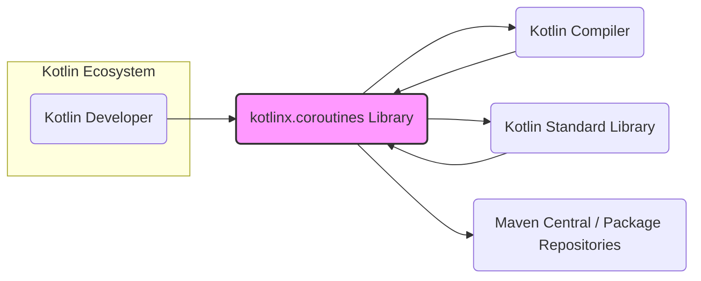
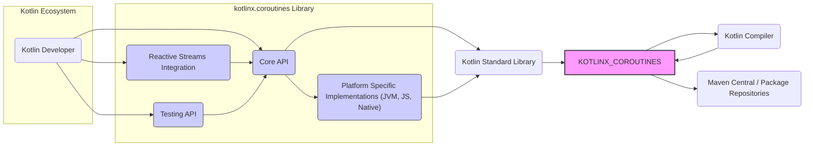

# BUSINESS POSTURE

This project is the kotlinx.coroutines library, a fundamental component for asynchronous programming in Kotlin. Its primary business goal is to empower Kotlin developers to write efficient, concurrent, and reactive applications across various platforms (JVM, Native, JS).

Business priorities are:
- Developer Productivity: Providing a concise and expressive API for asynchronous operations, reducing boilerplate code and improving developer experience.
- Performance and Efficiency: Enabling high-performance concurrency with lightweight coroutines, minimizing overhead compared to traditional threads.
- Platform Compatibility: Ensuring seamless operation across all supported Kotlin platforms, allowing developers to write portable asynchronous code.
- Community Adoption and Growth: Fostering a vibrant community around kotlinx.coroutines, encouraging contributions and ensuring the library remains relevant and up-to-date.

Key business risks associated with kotlinx.coroutines include:
- Library Defects: Bugs or vulnerabilities in the library can negatively impact applications relying on it, leading to application failures, performance degradation, or security issues.
- Performance Bottlenecks: Inefficiencies in the library's implementation could lead to performance bottlenecks in applications, hindering their responsiveness and scalability.
- Platform Incompatibility: Issues with platform-specific implementations could limit the portability of applications and create fragmentation within the Kotlin ecosystem.
- Supply Chain Vulnerabilities: Compromises in the build or distribution process could introduce malicious code into the library, affecting all users.
- Security Vulnerabilities: Security flaws in the library could be exploited by attackers to compromise applications using kotlinx.coroutines.

# SECURITY POSTURE

Existing security controls for the kotlinx.coroutines project:
- security control: GitHub code scanning is enabled, automatically scanning the codebase for potential security vulnerabilities. Implemented in: GitHub repository settings.
- security control: GitHub dependency scanning is enabled, alerting maintainers to known vulnerabilities in project dependencies. Implemented in: GitHub repository settings.
- security control: Code review process is in place, where pull requests are reviewed by maintainers before merging. Implemented in: Project development workflow.
- security control: Publicly accessible issue tracker for reporting bugs and potential security issues. Implemented in: GitHub issue tracker.

Accepted risks for the kotlinx.coroutines project:
- accepted risk: Reliance on community contributions, which may introduce unforeseen security vulnerabilities or coding errors.
- accepted risk: Open-source nature of the project, making the codebase publicly available for scrutiny by both security researchers and malicious actors.
- accepted risk: Potential vulnerabilities in third-party dependencies that are beyond the direct control of the project maintainers.

Recommended security controls to implement:
- recommended security control: Implement automated security testing as part of the CI/CD pipeline, including SAST (Static Application Security Testing) and DAST (Dynamic Application Security Testing) tools.
- recommended security control: Establish a formal vulnerability disclosure policy and security contact to streamline the reporting and handling of security issues.
- recommended security control: Generate and publish a Software Bill of Materials (SBOM) for each release to enhance transparency and facilitate vulnerability management for users.
- recommended security control: Conduct regular security audits and penetration testing by external security experts to identify and address potential weaknesses.

Security requirements for kotlinx.coroutines:
- Authentication: Not directly applicable to a library. Authentication is the responsibility of applications using the library.
- Authorization: Not directly applicable to a library. Authorization is the responsibility of applications using the library.
- Input Validation: Input validation is relevant for the kotlinx.coroutines API. The library should perform input validation to prevent unexpected behavior or crashes due to invalid or malicious inputs from developers using the library. This includes validating parameters passed to coroutine builders, channel operations, and other API functions.
- Cryptography: Cryptography is not a core requirement for kotlinx.coroutines. However, if the library were to introduce features that involve handling sensitive data or secure communication in the future, cryptography would become a relevant security requirement. Currently, it's not a primary concern.

# DESIGN

## C4 CONTEXT



Context Diagram Elements:

- 1. Name: Kotlin Developer
  - 2. Type: Person
  - 3. Description: Software developers who use the Kotlin programming language to build applications.
  - 4. Responsibilities: Uses kotlinx.coroutines library to implement asynchronous and concurrent logic in their Kotlin applications.
  - 5. Security controls: Follows secure coding practices when using the library, including proper input validation and handling of asynchronous operations.

- 1. Name: kotlinx.coroutines Library
  - 2. Type: Software System
  - 3. Description: A Kotlin library providing support for coroutines and asynchronous programming.
  - 4. Responsibilities: Provides APIs and runtime mechanisms for creating, managing, and synchronizing coroutines; offers various asynchronous primitives like channels, actors, and flow.
  - 5. Security controls: Input validation within the library API; adherence to secure coding practices during development; vulnerability scanning and dependency management.

- 1. Name: Kotlin Compiler
  - 2. Type: Software System
  - 3. Description: The Kotlin compiler that translates Kotlin code into bytecode or native code.
  - 4. Responsibilities: Compiles Kotlin code that uses kotlinx.coroutines into executable code; performs static analysis and optimizations.
  - 5. Security controls: Compiler security checks; prevention of code injection vulnerabilities during compilation.

- 1. Name: Kotlin Standard Library
  - 2. Type: Software System
  - 3. Description: The standard library for the Kotlin programming language, providing core functionalities.
  - 4. Responsibilities: Provides essential functionalities used by kotlinx.coroutines and Kotlin applications in general.
  - 5. Security controls: Security controls of the Kotlin Standard Library itself, ensuring its stability and security.

- 1. Name: Maven Central / Package Repositories
  - 2. Type: External System
  - 3. Description: Central repositories for distributing and managing Java and Kotlin libraries, including kotlinx.coroutines.
  - 4. Responsibilities: Hosts and distributes kotlinx.coroutines library artifacts, making them available to Kotlin developers through dependency management tools.
  - 5. Security controls: Repository security measures to prevent tampering and malicious package injection; checksum verification for downloaded artifacts.

## C4 CONTAINER



Container Diagram Elements:

- 1. Name: Core API
  - 2. Type: Library Module
  - 3. Description: The main module of kotlinx.coroutines, providing core coroutine functionalities, builders, dispatchers, channels, and basic asynchronous primitives.
  - 4. Responsibilities: Exposes the primary API for developers to use coroutines; implements core coroutine runtime logic; manages coroutine contexts and dispatchers.
  - 5. Security controls: Input validation for API functions; secure coding practices in core logic; unit and integration testing.

- 1. Name: Reactive Streams Integration
  - 2. Type: Library Module
  - 3. Description: Module providing integration with Reactive Streams, allowing interoperability between coroutines and reactive streams libraries.
  - 4. Responsibilities: Bridges the gap between coroutine flows and Reactive Streams publishers/subscribers; handles data conversion and flow control between the two paradigms.
  - 5. Security controls: Input validation and sanitization when interacting with external reactive streams; secure handling of data streams.

- 1. Name: Testing API
  - 2. Type: Library Module
  - 3. Description: Module offering utilities and extensions for testing coroutine-based code, simplifying unit and integration testing of asynchronous logic.
  - 4. Responsibilities: Provides tools for controlling coroutine execution in tests; offers assertions and utilities for verifying asynchronous behavior.
  - 5. Security controls: Secure design of testing utilities to prevent unintended side effects or vulnerabilities in test environments.

- 1. Name: Platform Specific Implementations (JVM, JS, Native)
  - 2. Type: Library Module
  - 3. Description: Platform-specific implementations of coroutine dispatchers and other platform-dependent functionalities for JVM, JavaScript, and Native targets.
  - 4. Responsibilities: Adapts core coroutine logic to different platform environments; provides platform-optimized dispatchers and concurrency primitives.
  - 5. Security controls: Platform-specific security considerations; secure interaction with underlying platform APIs; careful handling of platform-specific concurrency mechanisms.

## DEPLOYMENT

kotlinx.coroutines is a library, and it is not deployed as a standalone application. Instead, it is published to package repositories and then included as a dependency in other Kotlin projects. Therefore, the "deployment" in this context refers to the distribution of the library itself.

Deployment Architecture: Package Repository Distribution

```mermaid
flowchart LR
    DEVELOPER["Developer's Machine"]
    GITHUB_ACTIONS["GitHub Actions CI"]
    PACKAGE_REGISTRY["Package Registry (Maven Central, etc.)"]
    KOTLIN_PROJECT["Kotlin Project (User Application)"]

    DEVELOPER --> GITHUB_ACTIONS: Push Code
    GITHUB_ACTIONS --> PACKAGE_REGISTRY: Publish Artifacts
    PACKAGE_REGISTRY --> KOTLIN_PROJECT: Dependency Resolution

    style PACKAGE_REGISTRY fill:#f9f,stroke:#333,stroke-width:2px
```

Deployment Diagram Elements:

- 1. Name: Developer's Machine
  - 2. Type: Environment
  - 3. Description: The local development environment of a kotlinx.coroutines library developer.
  - 4. Responsibilities: Writing code, running local builds and tests, and pushing code changes to the GitHub repository.
  - 5. Security controls: Developer workstation security practices, including OS and software updates, malware protection, and secure code storage.

- 1. Name: GitHub Actions CI
  - 2. Type: Environment
  - 3. Description: GitHub Actions environment used for continuous integration and continuous delivery (CI/CD) of kotlinx.coroutines.
  - 4. Responsibilities: Automated building, testing, and publishing of the library upon code changes.
  - 5. Security controls: Secure configuration of GitHub Actions workflows, secret management for publishing credentials, and build process security measures.

- 1. Name: Package Registry (Maven Central, etc.)
  - 2. Type: Environment
  - 3. Description: Public package registries like Maven Central, npm, or Kotlin's own package repositories where kotlinx.coroutines library artifacts are published.
  - 4. Responsibilities: Hosting and distributing kotlinx.coroutines library artifacts to Kotlin developers worldwide.
  - 5. Security controls: Package registry security measures to prevent unauthorized uploads, tampering, and malware distribution; checksum verification and signing of published artifacts.

- 1. Name: Kotlin Project (User Application)
  - 2. Type: Environment
  - 3. Description: The application project of a Kotlin developer who uses kotlinx.coroutines as a dependency.
  - 4. Responsibilities: Downloading and incorporating kotlinx.coroutines library into their project to utilize coroutine functionalities.
  - 5. Security controls: Dependency management practices, including verifying package integrity and staying updated with library releases.

## BUILD

```mermaid
flowchart LR
    DEVELOPER["Developer"] --> GIT_REPO["Git Repository (GitHub)"]: Code Commit
    GIT_REPO --> GITHUB_ACTIONS["GitHub Actions CI"]: Trigger Build
    subgraph GITHUB_ACTIONS
        BUILD_ENV["Build Environment (Docker Container)"]
        GIT_CHECKOUT["Git Checkout"] --> BUILD_ENV
        GRADLE_BUILD["Gradle Build"] --> BUILD_ENV: Build & Test
        SAST["SAST Scanner"] --> BUILD_ENV: Security Scan
        PUBLISH["Publish Artifacts"] --> BUILD_ENV: To Package Registry
    end
    BUILD_ENV --> ARTIFACTS["Build Artifacts (JARs, etc.)"]
    ARTIFACTS --> PACKAGE_REGISTRY["Package Registry"]
    PACKAGE_REGISTRY --> DEVELOPER_CONSUMER["Developer (Consumer)"]: Dependency Download

    style GITHUB_ACTIONS fill:#ccf,stroke:#333,stroke-width:1px
```

Build Process Description:

1. Developer commits code changes to the Git repository (GitHub).
2. GitHub Actions CI is triggered by the code commit.
3. GitHub Actions sets up a secure Build Environment, typically using a Docker container with necessary build tools.
4. Git Checkout step retrieves the latest code from the Git repository.
5. Gradle Build step executes the Gradle build script to compile the Kotlin code, run unit tests, and generate build artifacts.
6. SAST Scanner step performs Static Application Security Testing to identify potential security vulnerabilities in the codebase.
7. Publish Artifacts step uploads the generated build artifacts (JAR files, etc.) to the Package Registry (e.g., Maven Central).
8. Build Artifacts are stored in the Package Registry, ready for consumption.
9. Developer (Consumer) can then download kotlinx.coroutines as a dependency in their Kotlin projects from the Package Registry.

Security Controls in Build Process:
- security control: Secure Build Environment: Using isolated and hardened build environments (e.g., Docker containers) to prevent build process contamination. Implemented in: GitHub Actions workflows.
- security control: Automated Build Process: Fully automated build process using GitHub Actions to reduce manual intervention and potential errors. Implemented in: GitHub Actions workflows.
- security control: Static Application Security Testing (SAST): Integration of SAST scanners to automatically detect potential security vulnerabilities in the code during the build process. Implemented in: GitHub Actions workflows (example: using CodeQL or similar tools).
- security control: Dependency Scanning: GitHub dependency scanning to identify vulnerabilities in third-party dependencies used by the project. Implemented in: GitHub dependency scanning feature.
- security control: Code Signing: Signing of build artifacts to ensure integrity and authenticity. (Potentially recommended, but not explicitly stated in the input).
- security control: Access Control: Restricting access to the build environment and CI/CD pipelines to authorized personnel. Implemented in: GitHub repository and GitHub Actions permissions.

# RISK ASSESSMENT

Critical business process we are trying to protect:
- The integrity and availability of the kotlinx.coroutines library itself. This is critical because many Kotlin applications rely on it for core asynchronous functionalities. Any compromise or unavailability of the library can have a wide-reaching impact on the Kotlin ecosystem.
- The trust and reputation of the kotlinx.coroutines project and its maintainers. Security vulnerabilities or supply chain attacks can severely damage the project's reputation and erode user trust.

Data we are trying to protect and their sensitivity:
- Source code of kotlinx.coroutines: Publicly available, but integrity is crucial. Modification by unauthorized parties or introduction of malicious code would be a high-impact security incident. Sensitivity: Public, Integrity: High.
- Build artifacts (JARs, etc.): Publicly distributed, but integrity and authenticity are paramount. Compromised artifacts could be distributed to a large number of developers and applications. Sensitivity: Public, Integrity: High, Authenticity: High.
- Build process and CI/CD pipeline configurations: Sensitive, as they control the build and release process. Compromise could lead to unauthorized code injection or supply chain attacks. Sensitivity: Confidential, Integrity: High.
- Secrets and credentials used in the build and release process (e.g., package registry credentials): Highly sensitive. Exposure could lead to unauthorized publishing or tampering with releases. Sensitivity: Highly Confidential, Integrity: High.

# QUESTIONS & ASSUMPTIONS

Questions:
- What is the target audience for this design document? Is it primarily for security auditors, developers, or project maintainers? (Assumption: Broad audience including security and development teams).
- Are there any specific compliance requirements or industry standards that the kotlinx.coroutines project needs to adhere to? (Assumption: General secure development best practices are sufficient for now).
- What is the process for handling security vulnerabilities reported by the community or identified through security scanning? (Assumption: Standard open-source vulnerability disclosure and patching process).
- Are there any plans to introduce features that handle sensitive data or require cryptographic operations in the future? (Assumption: Current focus is on core asynchronous functionalities, no immediate plans for sensitive data handling).

Assumptions:
- BUSINESS POSTURE: The primary business goal is to provide a robust, performant, and developer-friendly asynchronous programming library for Kotlin. Security is a high priority to maintain user trust and prevent disruptions.
- SECURITY POSTURE: The project currently leverages basic security controls provided by GitHub. There is a willingness to enhance security posture with recommended controls like SAST, vulnerability disclosure policy, and SBOM.
- DESIGN: The library is designed as a modular system with core API and platform-specific implementations. Deployment is through standard package repositories. The build process is automated using GitHub Actions.