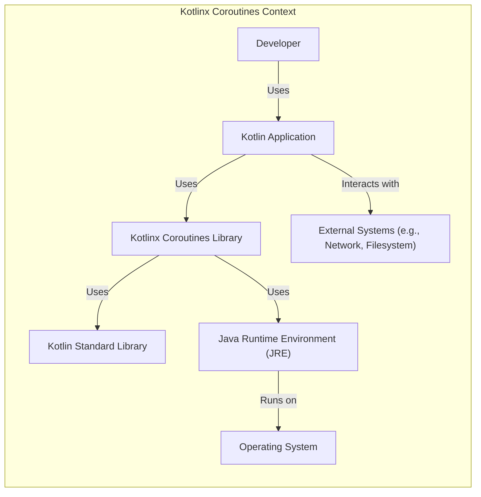
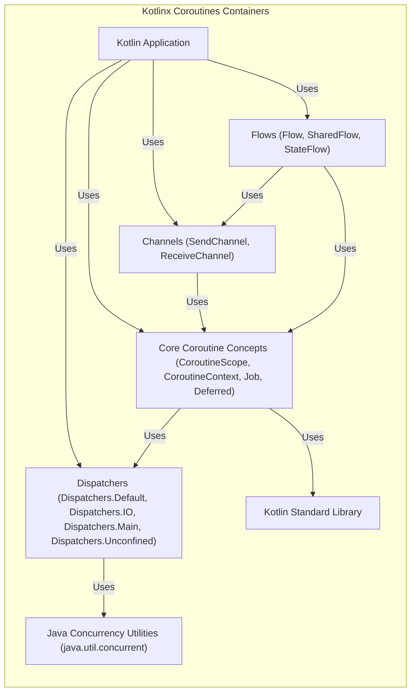
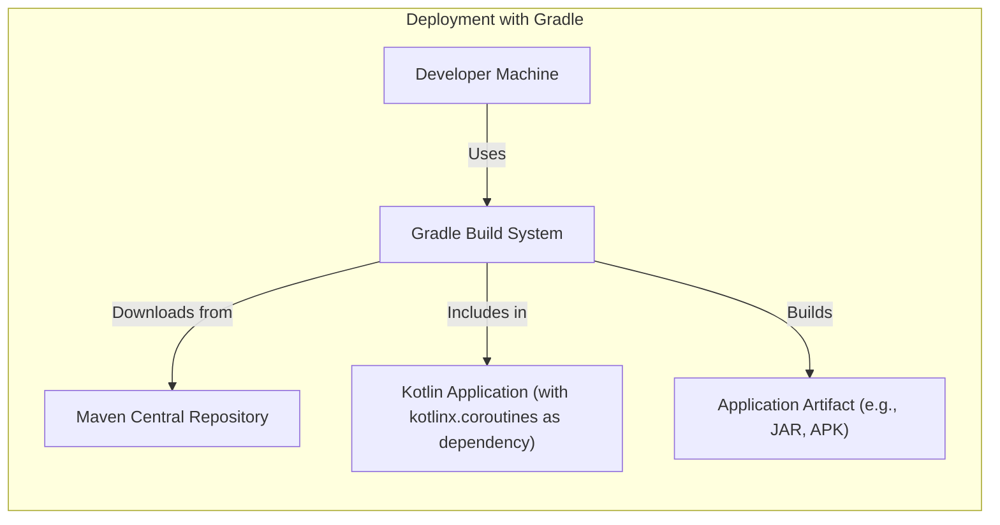
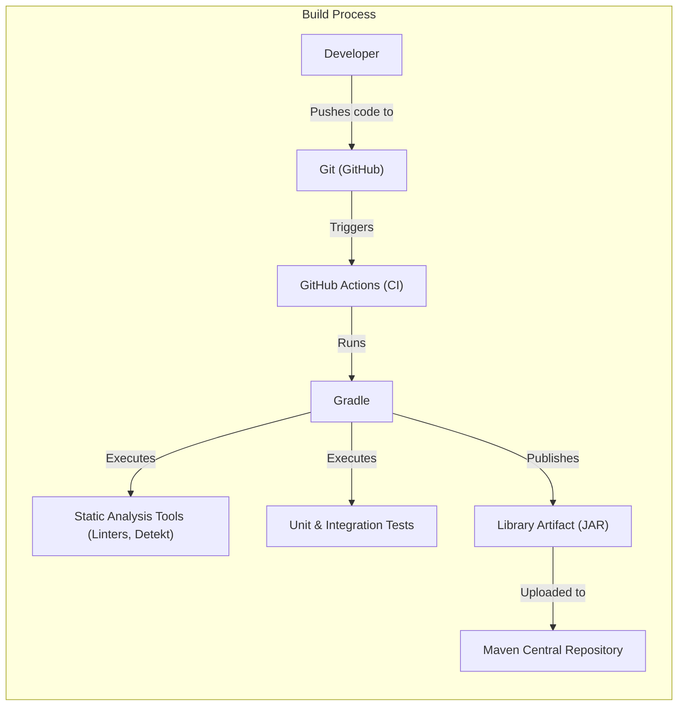

Okay, let's create a design document for the `kotlinx.coroutines` library. This is a fascinating project, as it's a library, not a standalone application, which changes the perspective slightly.  We'll focus on how the library *itself* is designed and secured, and how it *enables* secure application development.

# BUSINESS POSTURE

*   Priorities and Goals:
    *   Provide a robust and efficient concurrency framework for Kotlin developers.
    *   Simplify asynchronous programming, making it easier to write and maintain.
    *   Improve application performance and responsiveness by leveraging non-blocking operations.
    *   Maintain backward compatibility and stability for existing users.
    *   Provide excellent documentation and support to the developer community.
    *   Ensure the library itself is secure and doesn't introduce vulnerabilities into applications that use it.

*   Business Risks:
    *   Security vulnerabilities within the library could be exploited in applications using it, leading to widespread impact.
    *   Performance issues or bugs in the library could negatively affect the performance and stability of applications.
    *   Lack of adoption due to complexity or poor documentation could limit the library's impact.
    *   Incompatibility with future Kotlin versions or other libraries could create maintenance challenges.
    *   Reputational damage due to security incidents or major bugs.

# SECURITY POSTURE

*   Existing Security Controls:
    *   security control: Code Reviews: The project uses GitHub's pull request system, requiring code reviews before merging changes. This is evident from the project's contribution guidelines and the presence of reviewed pull requests.
    *   security control: Static Analysis: The project uses static analysis tools, including linters and code quality checks, integrated into their build process (Gradle). This is visible in the build configuration files.
    *   security control: Continuous Integration: The project employs continuous integration (GitHub Actions) to automatically build and test the library on every commit and pull request. This is evident from the `.github/workflows` directory.
    *   security control: Dependency Management: The project uses Gradle for dependency management, allowing for controlled updates and vulnerability scanning (though explicit vulnerability scanning configuration isn't immediately apparent in the repository root).
    *   security control: Issue Tracking: The project uses GitHub Issues for tracking bugs and security vulnerabilities reported by the community.
    *   security control: Security Policy: The project has a `SECURITY.md` file, providing instructions for reporting security vulnerabilities.
    *   security control: Extensive Testing: The project has a comprehensive suite of unit and integration tests to ensure the correctness and stability of the library. This is evident from the `test` directories.

*   Accepted Risks:
    *   accepted risk: Reliance on Underlying Platform: The library relies on the security and stability of the underlying Java/Kotlin runtime and operating system. Vulnerabilities in these platforms could impact the library.
    *   accepted risk: Complexity of Concurrency: Concurrency is inherently complex, and subtle bugs can be difficult to detect and reproduce. While the library aims to simplify concurrency, the potential for user error remains.
    *   accepted risk: Third-Party Dependencies: While dependencies are managed, vulnerabilities in third-party libraries could potentially impact `kotlinx.coroutines`.

*   Recommended Security Controls:
    *   security control: Explicit Dependency Vulnerability Scanning: Integrate a tool like OWASP Dependency-Check or Snyk into the CI pipeline to automatically scan for known vulnerabilities in dependencies.
    *   security control: Fuzz Testing: Implement fuzz testing to automatically generate a wide range of inputs to test the library's resilience to unexpected data.
    *   security control: Dynamic Analysis: Consider incorporating dynamic analysis tools (e.g., runtime instrumentation) to detect potential concurrency issues or memory leaks during testing.
    *   security control: Security Audits: Conduct periodic security audits by external experts to identify potential vulnerabilities that might be missed by internal reviews.

*   Security Requirements:
    *   Authentication: Not directly applicable, as this is a library, not an application with user authentication.
    *   Authorization: Not directly applicable in the traditional sense. However, the library should be designed to prevent unintended access to shared resources or data when used in multi-threaded applications.  Developers using the library are responsible for implementing appropriate authorization mechanisms in their applications.
    *   Input Validation: The library should validate its internal inputs (e.g., parameters passed to its functions) to prevent unexpected behavior or crashes.  It should also provide mechanisms (e.g., structured concurrency) to help developers manage potentially dangerous operations (like cancellation) safely.
    *   Cryptography: If the library handles sensitive data (which it generally shouldn't, as a concurrency library), it should use appropriate cryptographic algorithms and libraries.  However, this is primarily the responsibility of applications *using* the library. The library itself should not be directly involved in cryptographic operations unless specifically designed for that purpose (and this library is not).

# DESIGN

## C4 CONTEXT

*   Elements Description:

    *   1.  Name: Developer
        *   2.  Type: Person
        *   3.  Description: A software developer who uses the `kotlinx.coroutines` library to build Kotlin applications.
        *   4.  Responsibilities: Writes, tests, and debugs code that utilizes coroutines.
        *   5.  Security controls: Follows secure coding practices; uses strong authentication for development tools.

    *   1.  Name: Kotlin Application
        *   2.  Type: Software System
        *   3.  Description: An application built using Kotlin that leverages `kotlinx.coroutines` for asynchronous programming.
        *   4.  Responsibilities: Performs the application's core logic, potentially interacting with external systems.
        *   5.  Security controls: Implements application-specific security controls (authentication, authorization, input validation, etc.).

    *   1.  Name: External Systems (e.g., Network, Filesystem)
        *   2.  Type: Software System
        *   3.  Description: External resources that the Kotlin application interacts with.
        *   4.  Responsibilities: Provides services or data to the Kotlin application.
        *   5.  Security controls: Implements appropriate security controls for the specific system (e.g., network firewalls, file permissions).

    *   1.  Name: Kotlinx Coroutines Library
        *   2.  Type: Software System
        *   3.  Description: The `kotlinx.coroutines` library itself.
        *   4.  Responsibilities: Provides the core coroutine functionality, including dispatchers, channels, flows, etc.
        *   5.  Security controls: Code reviews, static analysis, continuous integration, dependency management, issue tracking, security policy, extensive testing.

    *   1.  Name: Kotlin Standard Library
        *   2.  Type: Software System
        *   3.  Description: The standard library for the Kotlin programming language.
        *   4.  Responsibilities: Provides fundamental building blocks for Kotlin applications.
        *   5.  Security controls: Managed and secured by JetBrains.

    *   1.  Name: Java Runtime Environment (JRE)
        *   2.  Type: Software System
        *   3.  Description: The runtime environment for executing Kotlin/Java bytecode.
        *   4.  Responsibilities: Provides the underlying platform for running Kotlin applications.
        *   5.  Security controls: Managed and secured by the JRE provider (e.g., Oracle, OpenJDK).

    *   1.  Name: Operating System
        *   2.  Type: Software System
        *   3.  Description: The underlying operating system (e.g., Windows, Linux, macOS).
        *   4.  Responsibilities: Provides the foundation for the JRE and manages system resources.
        *   5.  Security controls: Managed and secured by the OS vendor.

## C4 CONTAINER

Since `kotlinx.coroutines` is a library, the "container" view is less about separate deployable units and more about the major internal components and their interactions.

*   Elements Description:

    *   1.  Name: Kotlin Application
        *   2.  Type: Software System
        *   3.  Description: An application built using Kotlin that leverages `kotlinx.coroutines`.
        *   4.  Responsibilities:  Utilizes coroutine components to manage asynchronous operations.
        *   5.  Security controls:  Application-specific security controls.

    *   1.  Name: Core Coroutine Concepts (CoroutineScope, CoroutineContext, Job, Deferred)
        *   2.  Type: Component
        *   3.  Description:  The fundamental building blocks of coroutines, defining their lifecycle and execution context.
        *   4.  Responsibilities:  Provides the core mechanisms for creating, managing, and canceling coroutines.
        *   5.  Security controls:  Internal validation of parameters; careful design to prevent resource leaks or deadlocks.

    *   1.  Name: Dispatchers (Dispatchers.Default, Dispatchers.IO, Dispatchers.Main, Dispatchers.Unconfined)
        *   2.  Type: Component
        *   3.  Description:  Components that determine the thread or thread pool on which a coroutine executes.
        *   4.  Responsibilities:  Manages the execution of coroutines on different threads.
        *   5.  Security controls:  Uses thread pools safely; avoids excessive thread creation.

    *   1.  Name: Channels (SendChannel, ReceiveChannel)
        *   2.  Type: Component
        *   3.  Description:  Primitives for communication and synchronization between coroutines.
        *   4.  Responsibilities:  Enables safe and efficient data transfer between coroutines.
        *   5.  Security controls:  Designed to prevent race conditions and deadlocks; uses appropriate synchronization mechanisms.

    *   1.  Name: Flows (Flow, SharedFlow, StateFlow)
        *   2.  Type: Component
        *   3.  Description:  A cold asynchronous stream of data.
        *   4.  Responsibilities:  Provides a reactive programming model for asynchronous data streams.
        *   5.  Security controls:  Designed to handle backpressure and cancellation safely.

    *   1.  Name: Kotlin Standard Library
        *   2.  Type: Library
        *   3.  Description:  The standard library for the Kotlin programming language.
        *   4.  Responsibilities: Provides fundamental building blocks.
        *   5.  Security controls: Managed and secured by JetBrains.

    *   1.  Name: Java Concurrency Utilities (java.util.concurrent)
        *   2.  Type: Library
        *   3.  Description:  Underlying Java concurrency primitives used by `kotlinx.coroutines`.
        *   4.  Responsibilities:  Provides low-level concurrency mechanisms.
        *   5.  Security controls: Managed and secured by the JRE provider.

## DEPLOYMENT

`kotlinx.coroutines` is a library, so deployment is about how it's included in other projects.

*   Possible Solutions:
    *   Dependency Management Systems: Most common approach, using Gradle, Maven, or other build tools.
    *   Manual Download: Less common, but users could download the JAR files directly.
    *   Bundled with Application:  Extremely rare, but theoretically, the library's code could be directly included in an application's source code (not recommended).

*   Chosen Solution (Dependency Management with Gradle):

*   Elements Description:

    *   1.  Name: Developer Machine
        *   2.  Type: Node
        *   3.  Description: The machine where the developer writes and builds the application.
        *   4.  Responsibilities: Hosts the development environment and build tools.
        *   5.  Security controls:  Developer machine security (antivirus, firewall, etc.).

    *   1.  Name: Gradle Build System
        *   2.  Type: Software System
        *   3.  Description:  The build system used to manage dependencies and build the application.
        *   4.  Responsibilities:  Downloads dependencies, compiles code, and packages the application.
        *   5.  Security controls:  Uses secure connections (HTTPS) to download dependencies; can be configured to verify dependency checksums.

    *   1.  Name: Maven Central Repository
        *   2.  Type: Node
        *   3.  Description:  A public repository hosting the `kotlinx.coroutines` library artifacts.
        *   4.  Responsibilities:  Provides a reliable and secure source for library artifacts.
        *   5.  Security controls:  Managed and secured by Sonatype (the organization behind Maven Central).

    *   1.  Name: Kotlin Application (with kotlinx.coroutines as dependency)
        *   2.  Type: Software System
        *   3.  Description:  The application being built, which includes `kotlinx.coroutines` as a dependency.
        *   4.  Responsibilities:  The application's core logic.
        *   5.  Security controls:  Application-specific security controls.

    *   1.  Name: Application Artifact (e.g., JAR, APK)
        *   2.  Type: Artifact
        *   3.  Description: The final packaged application, including the `kotlinx.coroutines` library.
        *   4.  Responsibilities:  The deployable unit of the application.
        *   5.  Security controls:  Code signing (if applicable); secure deployment practices.

## BUILD

*   Build Process Description:

    1.  **Developer Commits Code:** A developer writes code and commits it to the Git repository (hosted on GitHub).
    2.  **GitHub Actions Triggered:**  A push to the repository or a pull request triggers GitHub Actions, the CI/CD system used by the project.
    3.  **Gradle Build:** GitHub Actions executes the Gradle build script.
    4.  **Static Analysis:**  Gradle runs static analysis tools (linters, code quality checks) to identify potential issues.
    5.  **Tests:** Gradle executes the unit and integration test suite.
    6.  **Artifact Creation:** If all checks and tests pass, Gradle builds the library artifact (JAR file).
    7.  **Publish to Maven Central:**  The artifact is published to Maven Central, making it available for other projects to use.

*   Security Controls in Build Process:

    *   security control: **Source Code Management (Git):**  Provides version control and a history of changes.
    *   security control: **Continuous Integration (GitHub Actions):**  Automates the build and testing process, ensuring consistent quality and security checks.
    *   security control: **Static Analysis:**  Identifies potential code quality and security issues early in the development lifecycle.
    *   security control: **Automated Testing:**  Ensures the library functions correctly and helps prevent regressions.
    *   security control: **Dependency Management (Gradle):**  Manages dependencies and allows for controlled updates.
    *   security control: **Secure Artifact Repository (Maven Central):** Provides a trusted source for the library artifact.

# RISK ASSESSMENT

*   Critical Business Processes:
    *   Providing a stable and reliable concurrency framework for Kotlin developers.
    *   Maintaining the trust and confidence of the developer community.
    *   Ensuring the library's continued development and maintenance.

*   Data to Protect:
    *   Source Code: The library's source code itself is a valuable asset.  Unauthorized modification could introduce vulnerabilities.
    *   Developer Credentials:  Access to the GitHub repository and publishing credentials for Maven Central must be protected.
    *   User Data (Indirectly): While the library itself doesn't directly handle user data, vulnerabilities in the library could be exploited to compromise user data in applications that *use* the library.  This makes the *security* of the library a critical concern for protecting user data *indirectly*.

*   Data Sensitivity:
    *   Source Code:  Publicly available, but integrity is critical.
    *   Developer Credentials: Highly sensitive.
    *   User Data (Indirectly):  The sensitivity depends on the applications using the library. The library itself should be designed to minimize the risk of data breaches in those applications.

# QUESTIONS & ASSUMPTIONS

*   Questions:
    *   Are there any specific performance benchmarks or targets that the library must meet?
    *   Are there any plans to support specific platforms or environments beyond the standard JVM?
    *   What is the process for handling security vulnerabilities reported by external researchers? (This is partially answered by `SECURITY.md`, but more details on the internal process would be helpful).
    *   Are there any specific compliance requirements (e.g., industry regulations) that the library needs to consider?

*   Assumptions:
    *   BUSINESS POSTURE: The primary goal is to provide a high-quality, secure, and performant concurrency library for Kotlin.  Adoption and community trust are paramount.
    *   SECURITY POSTURE: The project follows good security practices, but there's always room for improvement.  The developers are responsive to security concerns.
    *   DESIGN: The library is designed to be modular and extensible.  The core components are well-defined and interact in a predictable way. The build and deployment processes are automated and reliable.
    *   The Java Runtime Environment and Operating System are kept up-to-date with security patches.
    *   Developers using the library will also follow secure coding practices in their own applications.