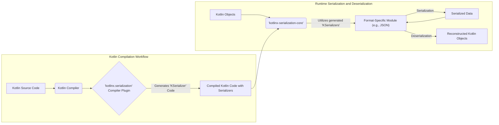
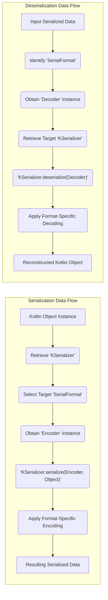

# Project Design Document: kotlinx.serialization

**Version:** 1.1
**Date:** October 26, 2023
**Author:** AI Software Architect

## 1. Introduction

This document provides an enhanced and detailed design overview of the `kotlinx.serialization` library, a robust framework enabling the seamless serialization of Kotlin objects into various formats and their subsequent deserialization. This document is specifically crafted to serve as a foundational artifact for comprehensive threat modeling activities. It meticulously outlines the key components, intricate data flow, and critical architectural considerations inherent to the library's design.

## 2. Goals and Scope

The primary objective of `kotlinx.serialization` is to offer a type-safe, extensible, performant, and developer-friendly mechanism for converting Kotlin object instances into a persistent stream of bytes or a human-readable textual representation, and conversely, reconstructing objects from such representations. The core aims of the library are:

*   **Type Safety:**  Leveraging Kotlin's strong type system to guarantee the correctness and safety of serialization and deserialization processes, minimizing runtime errors.
*   **Extensibility:**  Providing a flexible architecture that allows for the integration of new serialization formats through a well-defined plugin mechanism.
*   **Performance:**  Optimizing for both speed and memory efficiency during serialization and deserialization operations.
*   **Developer Experience:**  Offering a clear, intuitive, and easy-to-use API for developers.

The scope of this document encompasses the fundamental architecture and essential components of the `kotlinx.serialization` library. A particular emphasis is placed on aspects directly relevant to security considerations, providing a solid basis for subsequent threat analysis. This includes a detailed examination of the compiler plugin, the core library functionalities, and the responsibilities of the format-specific modules.

## 3. High-Level Architecture

`kotlinx.serialization` employs a dual-pronged approach, integrating a Kotlin compiler plugin with runtime libraries to achieve its serialization and deserialization capabilities.

*   **Kotlin Compiler Plugin:** This crucial component operates during the Kotlin compilation phase. It intelligently analyzes Kotlin source code, specifically identifying classes annotated for serialization. Upon identification, it automatically generates the necessary boilerplate code, primarily `KSerializer` implementations, tailored to the structure of the serializable classes.
*   **Core Library (`kotlinx-serialization-core`):**  This library forms the bedrock of the framework, providing the essential interfaces and core classes that govern the serialization and deserialization processes. Key elements include the `Serializer` interface, the `SerialFormat` interface, and the mechanisms for processing serialization-related annotations.
*   **Format-Specific Modules:** These modules are responsible for the concrete implementation of serialization and deserialization for particular data formats. Examples include modules for JSON, CBOR, and ProtoBuf. Each module provides a specific implementation of the `SerialFormat` interface, encapsulating the logic for encoding Kotlin objects into the target format and decoding the format back into Kotlin objects.

## 4. Detailed Design

### 4.1. Key Components

*   **`@Serializable` Annotation:**
    *   This annotation serves as a marker, explicitly designating Kotlin classes whose instances are intended to be serializable.
    *   Its presence acts as a trigger for the `kotlinx.serialization` compiler plugin, instructing it to automatically generate a concrete `KSerializer` implementation tailored to the annotated class's structure and properties.

*   **`KSerializer` Interface:**
    *   This interface defines the fundamental contract for handling the serialization and deserialization of objects of a specific Kotlin type.
    *   It mandates the implementation of two core functions: `serialize()`, responsible for converting an object into its serialized representation, and `deserialize()`, responsible for reconstructing an object from its serialized form.
    *   Implementations of this interface are typically generated automatically by the compiler plugin, although developers can also provide custom implementations for specialized serialization needs.

*   **`SerialFormat` Interface:**
    *   This interface abstracts the concept of a specific serialization format, such as JSON, CBOR, or ProtoBuf.
    *   It defines the common operations required for encoding and decoding data according to the rules and syntax of the represented format.
    *   Concrete implementations of this interface are provided within the format-specific modules of the `kotlinx.serialization` library.

*   **`Encoder` Interface:**
    *   This interface is employed during the serialization process to facilitate the writing of data to an output stream or buffer.
    *   Format-specific implementations of the `Encoder` handle the actual encoding of various data types, including primitive types, collections, and complex objects, into the target serialization format.

*   **`Decoder` Interface:**
    *   This interface is the counterpart to `Encoder`, used during deserialization to read data from an input stream or buffer.
    *   Format-specific implementations of the `Decoder` are responsible for parsing the incoming serialized data and decoding it back into its corresponding Kotlin representations.

*   **Compiler Plugin:**
    *   This integral component seamlessly integrates with the standard Kotlin compilation process.
    *   It meticulously analyzes Kotlin classes, specifically looking for the `@Serializable` annotation.
    *   Upon encountering this annotation, the plugin automatically generates the necessary `KSerializer` implementations. This generated code includes the logic required to handle class properties, nullability constraints, and polymorphism scenarios during serialization and deserialization.

*   **Format-Specific Modules (e.g., `'kotlinx-serialization-json'`, `'kotlinx-serialization-cbor'`):**
    *   These modules provide the concrete implementations that bring the abstract concepts of `SerialFormat`, `Encoder`, and `Decoder` to life for specific serialization formats.
    *   They encapsulate the format-specific syntax, encoding rules, and decoding logic necessary to convert Kotlin objects into and from the target format.

### 4.2. Data Flow

The following details the typical flow of data during the serialization and deserialization processes within `kotlinx.serialization`:

*   **Serialization Workflow:**
    1. A Kotlin object, previously marked with the `@Serializable` annotation, is targeted for serialization.
    2. The appropriate `KSerializer` for the object's specific Kotlin type is retrieved. This serializer is either the one automatically generated by the compiler plugin or a custom-provided implementation.
    3. An instance of `SerialFormat` corresponding to the desired output format (e.g., JSON format via `Json` instance) is selected.
    4. An `Encoder` instance, specific to the chosen `SerialFormat`, is obtained. This encoder will handle the formatting of the output.
    5. The `KSerializer`'s `serialize()` method is invoked. This method receives the `Encoder` instance and the Kotlin object to be serialized as input.
    6. Within the `serialize()` method, the process iterates through the properties of the Kotlin object. For each property, the `Encoder` is used to write the property's data in accordance with the rules of the selected serialization format.
    7. The `Encoder` leverages the underlying format-specific encoding logic to transform the data into the target representation.
    8. The culmination of this process is the generation of a stream of bytes or a textual representation that encapsulates the serialized state of the original Kotlin object.

*   **Deserialization Workflow:**
    1. Serialized data, originating from a `kotlinx.serialization` process, needs to be transformed back into a Kotlin object.
    2. The target Kotlin class to which the data should be deserialized is identified, along with the `SerialFormat` that was used to originally serialize the data.
    3. The corresponding `KSerializer` for the target Kotlin class is retrieved.
    4. A `Decoder` instance, specific to the identified `SerialFormat`, is obtained. This decoder is initialized with the serialized data as its input source.
    5. The `KSerializer`'s `deserialize()` method is invoked, receiving the `Decoder` instance as input.
    6. The `deserialize()` method utilizes the `Decoder` to read and interpret the incoming serialized data, adhering to the structural and syntactic rules of the format.
    7. The `Decoder` employs the format-specific parsing and decoding logic to convert the serialized representation back into Kotlin data types.
    8. Finally, a new instance of the target Kotlin object is created, and its properties are populated with the data extracted from the deserialized input.

### 4.3. Key Interfaces and Classes

Here's an expanded list of significant interfaces and classes within the `kotlinx.serialization` framework:

*   `kotlinx.serialization.Serializable`
*   `kotlinx.serialization.KSerializer`
*   `kotlinx.serialization.SerialFormat`
*   `kotlinx.serialization.Encoder`
*   `kotlinx.serialization.Decoder`
*   `kotlinx.serialization.modules.SerializersModule` (Used for registering custom serializers and handling polymorphism)
*   `kotlinx.serialization.json.Json` (A concrete implementation of `SerialFormat` for JSON)
*   `kotlinx.serialization.cbor.Cbor` (A concrete implementation of `SerialFormat` for CBOR)
*   `kotlinx.serialization.protobuf.ProtoBuf` (A concrete implementation of `SerialFormat` for Protocol Buffers)
*   `kotlinx.serialization.descriptors.SerialDescriptor` (Describes the structure of a serializable class)
*   `kotlinx.serialization.encoding.CompositeEncoder` (Extends `Encoder` for encoding structured data)
*   `kotlinx.serialization.encoding.CompositeDecoder` (Extends `Decoder` for decoding structured data)

## 5. Security Considerations (For Threat Modeling)

This section provides a more detailed exploration of potential security considerations, intended to inform the subsequent threat modeling process.

*   **Deserialization of Untrusted Data: A Primary Attack Vector:** The process of deserializing data originating from untrusted sources presents a significant security risk. Maliciously crafted serialized data has the potential to exploit vulnerabilities, leading to:
    *   **Remote Code Execution (RCE):** If custom serializers or the handling of polymorphic deserialization are not implemented with extreme care, an attacker might be able to inject and execute arbitrary code on the system. This could involve crafting serialized payloads that, upon deserialization, instantiate malicious objects or manipulate program flow to execute attacker-controlled code.
    *   **Denial of Service (DoS) Attacks:** Carefully crafted, oversized, or deeply nested serialized payloads can consume excessive system resources (CPU, memory, network bandwidth) during the deserialization process. This can lead to application slowdowns, crashes, or complete service unavailability.
    *   **Object Instantiation Exploits:** Deserialization can be manipulated to instantiate unexpected or malicious objects within the application's memory space. These objects could then be used to bypass security checks, gain unauthorized access, or perform other malicious actions.
    *   **Injection Attacks:** Depending on the format and custom serializer implementations, vulnerabilities similar to SQL injection or command injection could arise if deserialized data is directly used in sensitive operations without proper sanitization.

*   **Compiler Plugin Security:** While less probable, vulnerabilities within the `kotlinx.serialization` compiler plugin itself could potentially compromise the software build process. A malicious actor could, in theory, attempt to introduce vulnerabilities that are then baked into the generated serializer code. This highlights the importance of maintaining the integrity and security of the build environment and dependencies.

*   **Format-Specific Vulnerabilities:** Each serialization format possesses its own inherent set of potential vulnerabilities related to parsing and handling specific data structures or syntax. For instance, JSON parsing has known vulnerabilities related to deeply nested objects or excessively large strings. It's crucial to be aware of the specific security considerations for each format supported by the application.

*   **Data Integrity Concerns:** Ensuring that serialized data remains unaltered during transit or storage is paramount. `kotlinx.serialization` itself focuses on the serialization and deserialization process and does not inherently provide mechanisms for verifying data integrity (such as digital signatures or checksums). Applications that require data integrity must implement these mechanisms separately, potentially by integrating cryptographic hashing or signing techniques.

*   **Confidentiality Requirements:** `kotlinx.serialization` handles the transformation of data into a serialized format but does not inherently provide encryption capabilities. If the serialized data contains sensitive information that requires confidentiality, encryption mechanisms must be applied to the data either before serialization or after deserialization.

*   **Polymorphism and Type Handling Risks:** Incorrectly configured or maliciously exploited polymorphic serialization can introduce type confusion vulnerabilities. If the deserialization process can be tricked into instantiating an object of an unexpected type, it could lead to security bypasses or unexpected behavior. Careful configuration and validation of polymorphic serialization are essential.

## 6. Dependencies

The `kotlinx.serialization` library relies on the Kotlin standard library as its primary dependency. Furthermore, the format-specific modules may have their own internal dependencies to handle the specifics of each format.

*   `org.jetbrains.kotlin:kotlin-stdlib`
*   Dependencies specific to format modules (e.g., `kotlinx-serialization-json` might depend on other libraries for JSON parsing).

## 7. Deployment

The `kotlinx.serialization` library is typically integrated into Kotlin projects by declaring it as a dependency within the project's build configuration files, using build tools such as Gradle or Maven. The compiler plugin component also requires specific configuration within the build setup to ensure it is invoked during the compilation process.

## 8. Future Considerations

Potential future developments and enhancements that could have implications for the design and security of `kotlinx.serialization` include:

*   **Introduction of support for new serialization formats:**  The addition of new format modules could introduce new format-specific vulnerabilities that need to be considered.
*   **Enhancements to the compiler plugin:** Performance improvements or new features in the compiler plugin could potentially introduce new security considerations.
*   **New APIs or features within the core library:**  Additions to the core library might introduce new attack surfaces or require adjustments to existing security measures.
*   **Integration with other Kotlin libraries or frameworks:**  Interactions with other libraries could introduce new dependencies and potential security implications arising from those integrations.

This comprehensively enhanced document provides a robust foundation for understanding the architecture and components of the `kotlinx.serialization` library. The detailed information presented here is crucial for conducting a thorough and effective threat model, enabling the identification of potential security vulnerabilities and the design of appropriate mitigation strategies.