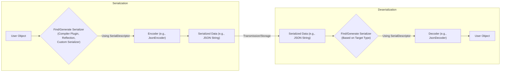

## Project Design Document: kotlinx.serialization

**Version:** 1.1
**Date:** October 26, 2023
**Author:** AI Software Architect
**Intended Audience:** Security Engineers, Software Developers

### 1. Introduction

This document provides an enhanced and detailed design overview of the `kotlinx.serialization` library. It aims to provide a comprehensive understanding of the library's architecture, components, and data flow, specifically tailored for security analysis and threat modeling activities. This document focuses on the core functionalities and key aspects relevant to security considerations, offering a deeper dive into potential vulnerabilities and attack surfaces.

### 2. Goals

*   Provide a clear, concise, and in-depth description of the `kotlinx.serialization` library's architecture.
*   Identify key components, their interactions, and their security implications.
*   Illustrate the data flow during serialization and deserialization processes with a focus on potential security checkpoints.
*   Highlight potential areas of security concern with specific examples and recommendations for future threat modeling and mitigation strategies.

### 3. Overview

`kotlinx.serialization` is a powerful Kotlin library designed for serializing Kotlin objects into various formats (like JSON, CBOR, ProtoBuf) and deserializing them back. It facilitates the transformation of in-memory object graphs into a stream of bytes or a textual representation and vice versa. The library achieves this through two primary mechanisms: a compiler plugin that generates optimized serialization code at compile time, and a reflection-based approach used as a fallback or in specific scenarios. The compiler plugin generally offers better performance and type safety, reducing the runtime overhead and potential for reflection-related vulnerabilities. Understanding these different approaches is crucial for assessing the library's security posture in various deployment contexts.

### 4. Key Components

*   **`@Serializable` Annotation:**
    *   Marks Kotlin classes as eligible for serialization.
    *   Acts as a directive for the compiler plugin to generate serialization logic or as a marker for reflection-based serialization.
    *   Incorrect or malicious use of this annotation in user code could potentially lead to unexpected serialization behavior.

*   **`KSerializer` Interface:**
    *   The central interface responsible for handling the serialization and deserialization of a specific Kotlin type.
    *   Defines the `serialize(encoder: Encoder, value: T)` and `deserialize(decoder: Decoder): T` functions.
    *   Implementations can be generated by the compiler plugin, provided by the user, or generated via reflection. The source and correctness of these implementations are critical for security.

*   **`Encoder` Interface:**
    *   An abstraction for writing serialized data to an output.
    *   Concrete implementations exist for different serialization formats (e.g., `JsonEncoder`, `CborEncoder`).
    *   Provides methods for encoding primitive types, collections, and structured data. Potential vulnerabilities could arise from improper handling of data types or encoding logic within specific implementations.

*   **`Decoder` Interface:**
    *   An abstraction for reading serialized data from an input.
    *   Concrete implementations exist for different serialization formats (e.g., `JsonDecoder`, `CborDecoder`).
    *   Provides methods for decoding primitive types, collections, and structured data. This is a critical point for security, as vulnerabilities in the decoding logic can lead to exploits when processing untrusted data.

*   **`SerialFormat` Interface:**
    *   Represents a specific serialization format (e.g., JSON, CBOR, ProtoBuf).
    *   Provides factory methods for creating `Encoder` and `Decoder` instances tailored to that format.
    *   Allows configuration of format-specific settings (e.g., handling of null values, pretty printing). Incorrect or insecure configurations can introduce vulnerabilities.

*   **`SerialDescriptor` Interface:**
    *   Describes the structure of a serializable class, including its properties and their types.
    *   Used by `Encoder` and `Decoder` to understand the layout of the data being processed.
    *   Ensuring the integrity and correctness of the `SerialDescriptor` is important for preventing data corruption or misinterpretation.

*   **Compiler Plugin (`kotlinx-serialization-compiler-plugin`):**
    *   A Kotlin compiler plugin that automatically generates `KSerializer` implementations at compile time for classes annotated with `@Serializable`.
    *   Offers performance benefits and enhanced type safety compared to reflection.
    *   Potential security concerns could arise from vulnerabilities within the compiler plugin itself or from incorrect code generation.

*   **Reflection-based Serialization:**
    *   A fallback mechanism used when the compiler plugin is not applied or for certain scenarios.
    *   Utilizes Kotlin reflection to introspect class structure and serialize/deserialize fields.
    *   Reflection can introduce performance overhead and potentially expose internal class structures, increasing the attack surface.

*   **Contextual Serialization:**
    *   Allows developers to provide custom serializers for specific properties or types within a serializable class.
    *   Useful for handling external types or applying specific serialization logic.
    *   Introduces a potential security risk if custom serializers are not implemented securely, as they have direct control over the serialization/deserialization process.

*   **Polymorphic Serialization:**
    *   Enables the serialization and deserialization of objects belonging to a hierarchy of classes.
    *   Requires explicit registration of subtypes to ensure correct deserialization.
    *   Misconfiguration or lack of proper validation in polymorphic deserialization can lead to type confusion vulnerabilities.

*   **Built-in Serializers:**
    *   Provides default `KSerializer` implementations for common Kotlin types (e.g., `String`, `Int`, `List`, `Map`).
    *   The security of these built-in serializers is crucial, as they are widely used.

### 5. Data Flow

Below is a more detailed flowchart illustrating the data flow during serialization and deserialization, highlighting key components.

**Detailed Data Flow - Serialization:**

1. The user initiates the serialization process with a Kotlin object.
2. The appropriate `KSerializer` for the object's type is located or generated. This involves checking for:
    *   A compiler-generated serializer (preferred for performance and safety).
    *   A user-provided custom serializer (requires careful security review).
    *   Reflection-based serializer generation (as a fallback).
3. The `SerialFormat` (e.g., `Json`) is used to obtain an `Encoder` instance.
4. The `serialize` function of the `KSerializer` is invoked, passing the `Encoder` and the user object. The `SerialDescriptor` of the object guides the serialization process.
5. The `Encoder` writes the object's data to the output stream or buffer according to the specified format. This involves encoding individual properties and their values, potentially performing data sanitization or transformation based on the format.

**Detailed Data Flow - Deserialization:**

1. Serialized data is received from an external source (e.g., a network request, file). **This is a critical point for security, as the data source might be untrusted.**
2. The `SerialFormat` (e.g., `Json`) is used to obtain a `Decoder` instance.
3. The target Kotlin class to deserialize into is specified.
4. The appropriate `KSerializer` for the target class is located (similar to serialization).
5. The `deserialize` function of the `KSerializer` is invoked, passing the `Decoder`. The `SerialDescriptor` of the target class guides the deserialization process.
6. The `Decoder` reads the data from the input stream or buffer according to the specified format. **Input validation and error handling within the `Decoder` are crucial to prevent attacks.**
7. The `KSerializer` constructs an instance of the target class by reading and assigning values from the decoded data. **Care must be taken to prevent object injection or other deserialization vulnerabilities.**

### 6. Security Considerations (Detailed)

These are detailed security considerations to be explored during threat modeling:

*   **Deserialization of Untrusted Data:**
    *   **Object Injection Attacks:** Maliciously crafted serialized data could lead to the instantiation of arbitrary classes with attacker-controlled properties. This can result in remote code execution (RCE) if these classes have exploitable methods or side effects during instantiation. **Mitigation:** Employ input validation, use allow-lists for deserializable classes (if possible), and avoid deserializing data from completely untrusted sources without thorough scrutiny.
    *   **Denial of Service (DoS) Attacks:** Carefully crafted data can consume excessive resources (CPU, memory, network) during deserialization. This can be achieved through deeply nested objects, excessively large strings, or by exploiting algorithmic complexity in the deserialization process. **Mitigation:** Implement resource limits, timeouts, and consider using formats with built-in size limitations.
    *   **Information Disclosure:** Vulnerabilities in the deserialization process might allow attackers to access sensitive information that should not be exposed. This could involve bypassing access controls or exploiting flaws in how data is handled. **Mitigation:** Ensure proper access controls on serialized data, avoid serializing sensitive information unnecessarily, and carefully review custom serializers for potential information leaks.
    *   **Type Confusion:** In polymorphic deserialization, attackers might manipulate the serialized data to force the deserialization of an object into an unexpected type, leading to unexpected behavior or security vulnerabilities. **Mitigation:** Explicitly register allowed subtypes and implement robust validation of the type information during deserialization.

*   **Custom Serializers:**
    *   **Code Injection:** If custom serializers handle external input without proper sanitization, they could be vulnerable to code injection attacks.
    *   **Bypass of Security Measures:** Malicious custom serializers could be designed to bypass security checks or introduce vulnerabilities into the application. **Mitigation:** Thoroughly review and audit all custom serializers, enforce secure coding practices, and consider using static analysis tools.

*   **Polymorphic Deserialization:**
    *   **Missing Subtype Registration:** If subtypes are not properly registered, deserialization might fail or lead to unexpected behavior. Insecure handling of unregistered types could introduce vulnerabilities. **Mitigation:** Ensure all possible subtypes are explicitly registered and handle unregistered types securely (e.g., by throwing an exception).

*   **Format-Specific Vulnerabilities:**
    *   **JSON Parsing Vulnerabilities:**  Vulnerabilities in the underlying JSON parsing library (if used) could be exploited through `kotlinx.serialization`. This includes issues like integer overflows, buffer overflows, or vulnerabilities related to specific JSON features. **Mitigation:** Keep the underlying format-specific libraries up-to-date and be aware of known vulnerabilities.
    *   **CBOR or ProtoBuf Vulnerabilities:** Similar vulnerabilities can exist in other format implementations. **Mitigation:** Stay informed about security advisories for the specific formats being used.

*   **Reflection Usage:**
    *   **Access to Non-Public Members:** Reflection can potentially bypass access modifiers and allow access to non-public members, which could be exploited. **Mitigation:** Minimize reliance on reflection-based serialization where possible and carefully consider the security implications when it is necessary.

*   **Dependency Vulnerabilities:**
    *   Vulnerabilities in the dependencies of `kotlinx.serialization` (e.g., `kotlin-stdlib`, format-specific libraries) could indirectly affect the security of applications using the library. **Mitigation:** Regularly update dependencies and monitor for security advisories.

*   **Data Integrity and Confidentiality:**
    *   **Tampering:** Serialized data might be tampered with during transmission or storage. **Mitigation:** Consider using cryptographic signatures or message authentication codes (MACs) to ensure data integrity.
    *   **Eavesdropping:** Sensitive data might be intercepted during transmission. **Mitigation:** Use encryption (e.g., TLS/SSL) to protect data in transit.

### 7. Dependencies

*   `kotlin-stdlib`: Provides core Kotlin functionalities. Vulnerabilities in the standard library could have widespread impact.
*   `kotlinx.coroutines`: Used by some format implementations (e.g., JSON). Security vulnerabilities in coroutines could affect serialization.
*   Format-specific libraries (e.g., `kotlinx-serialization-json`, `kotlinx-serialization-cbor`, `kotlinx-serialization-protobuf`). Each of these introduces its own set of potential vulnerabilities related to parsing and handling of the respective format.

### 8. Deployment Considerations

The security implications of using `kotlinx.serialization` can vary depending on the deployment environment:

*   **Backend Servers:**  Servers handling external requests are particularly vulnerable to deserialization attacks if they deserialize data from untrusted clients.
*   **Mobile Applications:**  While less exposed to direct external attacks, mobile apps might deserialize data from local storage or remote servers, and vulnerabilities could be exploited if the app is compromised.
*   **Desktop Applications:** Similar to mobile apps, desktop applications might handle serialized data from various sources.
*   **Libraries:** If `kotlinx.serialization` is used within a library, vulnerabilities could impact all applications that depend on that library.

### 9. Future Considerations

*   **Enhanced Security Audits:** Regular security audits of the library's codebase and its dependencies are crucial.
*   **Improved Input Validation Mechanisms:** Explore options for more robust and configurable input validation during deserialization.
*   **Sandboxing or Isolation:** Investigate possibilities for sandboxing or isolating the deserialization process to limit the impact of potential vulnerabilities.
*   **Security-Focused Documentation:** Provide more comprehensive documentation and best practices for secure usage of the library.
*   **Static Analysis Integration:** Explore integration with static analysis tools to automatically detect potential security flaws in user-provided serializers or configurations.

This enhanced design document provides a more in-depth understanding of the `kotlinx.serialization` library's architecture and highlights key areas of security concern. This information will be invaluable for conducting thorough threat modeling and developing appropriate mitigation strategies.