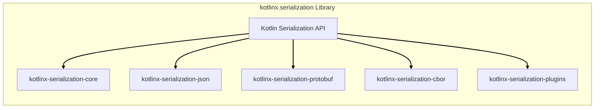

# BUSINESS POSTURE

This project, kotlinx.serialization, provides a Kotlin library for serializing and deserializing Kotlin objects into various formats. The primary business goal is to empower Kotlin developers with a robust, efficient, and versatile serialization solution. This directly contributes to increased developer productivity and enables the creation of more sophisticated and data-driven Kotlin applications.

Key business priorities include:
- Ease of use and developer experience: The library should be intuitive and simple to integrate into Kotlin projects.
- Performance and efficiency: Serialization and deserialization processes should be fast and resource-efficient.
- Format versatility: Support for a wide range of serialization formats (e.g., JSON, ProtoBuf, CBOR) to cater to diverse application needs.
- Stability and reliability: The library must be dependable and function correctly across different Kotlin environments and platforms.
- Community adoption and support: A thriving community ensures the library's long-term viability and provides a resource for users.

The most important business risks associated with this project are:
- Security vulnerabilities in the library: Exploits could lead to data corruption, information disclosure, or denial of service in applications using the library.
- Performance bottlenecks: Inefficient serialization or deserialization could negatively impact application performance and user experience.
- Compatibility issues: Problems arising from changes in Kotlin, serialization formats, or dependencies could break existing applications.
- Lack of adoption: If the library is not widely adopted, its long-term maintenance and support may be jeopardized.

# SECURITY POSTURE

Existing security controls for the kotlinx.serialization project:
- security control: Open source project with public code repository on GitHub. This allows for community review and scrutiny of the codebase. Implemented: GitHub repository.
- security control: Reliance on Kotlin's type system and memory safety features to reduce certain classes of vulnerabilities. Implemented: Kotlin language design.
- security control: Unit and integration testing to ensure functional correctness and identify potential bugs. Implemented: Project's test suite.
- security control: Dependency management using Gradle, allowing for control over external libraries used. Implemented: build.gradle.kts files.

Accepted risks for the kotlinx.serialization project:
- accepted risk: Vulnerabilities may exist in the code that have not yet been identified through community review or testing.
- accepted risk: Dependencies on external libraries may introduce vulnerabilities that are outside the direct control of the project.
- accepted risk: Malicious contributions could be introduced into the codebase if the contribution review process is insufficient.

Recommended security controls to implement:
- security control: Implement automated static analysis security testing (SAST) tools in the CI/CD pipeline to identify potential code-level vulnerabilities.
- security control: Integrate dependency scanning tools to detect known vulnerabilities in third-party libraries used by the project.
- security control: Conduct regular security audits and penetration testing, especially before major releases, to proactively identify and address security weaknesses.
- security control: Implement fuzz testing to discover unexpected behavior and potential vulnerabilities when processing malformed or unexpected input data during deserialization.
- security control: Establish a clear vulnerability reporting and response process to handle security issues reported by the community or discovered internally.

Security requirements for the kotlinx.serialization project:
- Authentication: Not directly applicable as this is a library and does not handle user authentication. However, secure distribution channels (e.g., HTTPS for Maven Central) are important.
- Authorization: Not directly applicable as this is a library and does not manage user authorization. Applications using the library are responsible for their own authorization logic.
- Input validation: Critical for deserialization processes. The library must robustly handle invalid or malicious input data to prevent vulnerabilities like injection attacks or denial of service. Deserialization logic should validate input data against expected schemas and formats.
- Cryptography: May be relevant depending on the serialization formats supported. If formats like CBOR or custom formats with encryption are supported, proper and secure cryptographic implementations are essential. Ensure usage of well-vetted cryptographic libraries and algorithms.

# DESIGN

The kotlinx.serialization project is designed as a Kotlin library that provides a framework for converting Kotlin objects into various data formats and vice versa. It consists of several modules, each responsible for different aspects of serialization, including core functionalities, format-specific implementations, and plugin integrations.

## C4 CONTEXT

```mermaid
flowchart LR
    subgraph "Kotlin Ecosystem"
        A["Kotlin Developers"]
    end
    B("kotlinx.serialization Library")
    subgraph "External Systems"
        C["Kotlin Projects"]
        D["Serialization Formats (JSON, ProtoBuf, CBOR, etc.)"]
        E["Build Tools (Gradle, Maven)"]
        F["Package Repositories (Maven Central)"]
    end

    A --> B
    B --> C
    B --> D
    B --> E
    B --> F
    C --> B
    D --> B
    E --> B
    F --> B

    linkStyle 0,1,2,3,4,5,6,7,8,9 stroke-width:2px,stroke:black;
```

Context Diagram Elements:

- Name: Kotlin Developers
  - Type: Person
  - Description: Software developers who use the kotlinx.serialization library to serialize and deserialize data in their Kotlin applications.
  - Responsibilities: Utilize the library to handle data serialization and deserialization within Kotlin projects. Report issues and contribute to the library's development.
  - Security controls: Responsible for using the library correctly and securely in their applications, including handling sensitive data appropriately and validating external data sources.

- Name: kotlinx.serialization Library
  - Type: Software System
  - Description: A Kotlin library providing a framework for serialization and deserialization of Kotlin objects into various formats.
  - Responsibilities: Provide a robust, efficient, and versatile serialization solution for Kotlin developers. Support multiple serialization formats and extension points. Ensure data integrity and security during serialization and deserialization processes.
  - Security controls: Input validation during deserialization, secure handling of data structures, protection against common serialization vulnerabilities (e.g., deserialization attacks).

- Name: Kotlin Projects
  - Type: Software System
  - Description: Kotlin applications and libraries that integrate and use the kotlinx.serialization library for data handling.
  - Responsibilities: Utilize the kotlinx.serialization library to manage data persistence, data transfer, and data processing. Define data models and serialization configurations.
  - Security controls: Application-level security controls, including authentication, authorization, data encryption, and secure data storage, which may utilize serialization for data handling.

- Name: Serialization Formats (JSON, ProtoBuf, CBOR, etc.)
  - Type: External System
  - Description: Various data serialization formats supported by the library. These formats define the structure and encoding of serialized data.
  - Responsibilities: Define the standards and specifications for data serialization. Provide parsers and serializers for their respective formats (often implemented within kotlinx.serialization).
  - Security controls: Format-specific security considerations, such as vulnerabilities in parsers or format specifications. kotlinx.serialization aims to use secure and well-vetted format implementations.

- Name: Build Tools (Gradle, Maven)
  - Type: External System
  - Description: Build automation tools used to build, test, and package Kotlin projects, including projects that use kotlinx.serialization.
  - Responsibilities: Manage project dependencies, compile code, run tests, and package libraries for distribution.
  - Security controls: Build tool security, including secure dependency resolution, plugin security, and secure build environments.

- Name: Package Repositories (Maven Central)
  - Type: External System
  - Description: Central repositories where the kotlinx.serialization library is published and distributed for use in Kotlin projects.
  - Responsibilities: Host and distribute the library artifacts. Ensure the integrity and availability of packages.
  - Security controls: Repository security, including secure package publishing, integrity checks (e.g., checksums, signatures), and protection against malicious package injection.

## C4 CONTAINER



Container Diagram Elements:

- Name: Kotlin Serialization API
  - Type: Library API
  - Description: Public API surface of the kotlinx.serialization library. Provides interfaces and classes for developers to interact with the serialization framework.
  - Responsibilities: Define the entry points for serialization and deserialization operations. Offer configuration options and extension points. Abstract away the underlying implementation details of different serialization formats.
  - Security controls: API design to prevent misuse and encourage secure coding practices. Input validation at API boundaries.

- Name: kotlinx-serialization-core
  - Type: Library Module
  - Description: Core module of the library, providing the fundamental serialization framework, annotations, and runtime infrastructure.
  - Responsibilities: Implement the core serialization logic, including reflection-based serialization, schema handling, and support for custom serializers. Manage the serialization context and metadata.
  - Security controls: Core serialization logic must be robust and secure. Handle potential vulnerabilities related to reflection and dynamic code execution carefully.

- Name: kotlinx-serialization-json
  - Type: Library Module
  - Description: Module providing JSON format support for kotlinx.serialization. Implements JSON-specific serialization and deserialization logic.
  - Responsibilities: Handle JSON parsing and generation. Implement JSON-specific features and configurations. Ensure compliance with JSON standards.
  - Security controls: Secure JSON parsing to prevent injection attacks or denial of service. Handle potentially malicious JSON input safely.

- Name: kotlinx-serialization-protobuf
  - Type: Library Module
  - Description: Module providing Protocol Buffers (ProtoBuf) format support for kotlinx.serialization. Implements ProtoBuf-specific serialization and deserialization logic.
  - Responsibilities: Handle ProtoBuf encoding and decoding. Integrate with ProtoBuf compiler and runtime libraries. Ensure compatibility with ProtoBuf specifications.
  - Security controls: Secure ProtoBuf parsing and encoding. Address potential vulnerabilities in ProtoBuf implementations.

- Name: kotlinx-serialization-cbor
  - Type: Library Module
  - Description: Module providing Concise Binary Object Representation (CBOR) format support for kotlinx.serialization. Implements CBOR-specific serialization and deserialization logic.
  - Responsibilities: Handle CBOR encoding and decoding. Implement CBOR-specific features and configurations. Ensure compliance with CBOR standards.
  - Security controls: Secure CBOR parsing and encoding. Address potential vulnerabilities in CBOR implementations.

- Name: kotlinx-serialization-plugins
  - Type: Library Module
  - Description: Module providing plugins and extensions for kotlinx.serialization, such as support for different data types or formats.
  - Responsibilities: Offer extension points for developers to customize and extend the serialization framework. Provide pre-built plugins for common use cases.
  - Security controls: Plugin architecture should be secure and prevent malicious plugins from compromising the library or applications using it. Plugin development guidelines should emphasize security best practices.

## DEPLOYMENT

The kotlinx.serialization library itself is not deployed as a standalone service. Instead, it is deployed as a dependency within Kotlin applications. The deployment context is therefore the deployment environment of the Kotlin applications that utilize the library.

Deployment Diagram (Example - Kotlin Application using kotlinx.serialization deployed to a Server):

```mermaid
flowchart LR
    subgraph "Server Environment"
        A["Server Instance"]
        subgraph "Application Runtime"
            B["Kotlin Application"]
            C["kotlinx.serialization Library"]
        end
    end
    D["External Data Source"]

    B --> C
    B -- Serializes/Deserializes Data --> D
    A -- Hosts --> B

    linkStyle 0,1,2,3 stroke-width:2px,stroke:black;
```

Deployment Diagram Elements:

- Name: Server Instance
  - Type: Infrastructure
  - Description: A physical or virtual server instance where the Kotlin application is deployed and running.
  - Responsibilities: Provide the runtime environment for the Kotlin application. Ensure availability, scalability, and security of the server infrastructure.
  - Security controls: Server hardening, operating system security, network security (firewalls, intrusion detection), access control, monitoring and logging.

- Name: Kotlin Application
  - Type: Software Component
  - Description: The Kotlin application that uses the kotlinx.serialization library to handle data serialization and deserialization.
  - Responsibilities: Implement application logic, manage data, interact with external systems, and utilize the kotlinx.serialization library for data processing.
  - Security controls: Application-level security controls, including authentication, authorization, input validation, secure data handling, and logging.

- Name: kotlinx.serialization Library
  - Type: Software Component (Library)
  - Description: The kotlinx.serialization library embedded within the Kotlin application.
  - Responsibilities: Provide serialization and deserialization functionalities to the Kotlin application.
  - Security controls: Security controls inherent in the library's design and implementation, as described in previous sections.

- Name: External Data Source
  - Type: External System
  - Description: External systems or data sources that the Kotlin application interacts with, potentially exchanging serialized data. This could be databases, APIs, message queues, or other services.
  - Responsibilities: Provide data to the Kotlin application or receive data from it. Ensure data integrity and availability.
  - Security controls: Security controls of the external data source, including authentication, authorization, data encryption, and access control. Network security for communication with the Kotlin application.

## BUILD

The build process for kotlinx.serialization aims to produce distributable library artifacts and ensure the quality and security of the codebase. It typically involves automated steps executed in a Continuous Integration (CI) environment.

Build Process Diagram:

```mermaid
flowchart LR
    A["Developer"] --> B("Code Changes");
    B --> C["GitHub Repository"];
    C --> D["GitHub Actions CI"];
    D --> E{Build Process};
    E -- Compile Code --> F["Kotlin Compiler"];
    E -- Run Tests --> G["Test Suite"];
    E -- SAST Scan --> H["SAST Scanner"];
    E -- Dependency Scan --> I["Dependency Scanner"];
    E --> J["Build Artifacts (JARs)"];
    J --> K["Package Repositories (Maven Central)"];

    linkStyle 0,1,2,3,4,5,6,7,8,9,10 stroke-width:2px,stroke:black;
```

Build Process Elements:

- Name: Developer
  - Type: Person
  - Description: Software developers who contribute code changes to the kotlinx.serialization project.
  - Responsibilities: Write code, fix bugs, implement new features, and submit code changes via pull requests. Adhere to coding standards and security guidelines.
  - Security controls: Secure development practices, code review, and adherence to project security policies.

- Name: Code Changes
  - Type: Data
  - Description: Modifications to the codebase submitted by developers.
  - Responsibilities: Represent new features, bug fixes, or improvements to the library.
  - Security controls: Code review process to identify potential security vulnerabilities or malicious code.

- Name: GitHub Repository
  - Type: Code Repository
  - Description: The Git repository hosted on GitHub that stores the source code of kotlinx.serialization.
  - Responsibilities: Version control, code storage, collaboration platform for development.
  - Security controls: Access control to the repository, branch protection, audit logging, and vulnerability scanning of the repository infrastructure.

- Name: GitHub Actions CI
  - Type: CI/CD System
  - Description: GitHub Actions workflows configured to automate the build, test, and release processes for kotlinx.serialization.
  - Responsibilities: Automate build steps, run tests, perform security checks, and publish artifacts. Ensure consistent and repeatable builds.
  - Security controls: Secure CI/CD pipeline configuration, access control to CI/CD workflows, secret management, and secure build environment.

- Name: Build Process
  - Type: Automated Process
  - Description: Sequence of automated steps defined in the CI/CD pipeline to build, test, and package the library.
  - Responsibilities: Compile code, run unit and integration tests, perform static analysis security testing (SAST), scan dependencies for vulnerabilities, and generate build artifacts.
  - Security controls: Secure build scripts, use of trusted build tools and dependencies, and implementation of security checks within the build process.

- Name: Kotlin Compiler
  - Type: Build Tool
  - Description: The Kotlin compiler used to compile the Kotlin source code into bytecode.
  - Responsibilities: Compile Kotlin code into executable bytecode.
  - Security controls: Use of a trusted and verified Kotlin compiler version.

- Name: Test Suite
  - Type: Automated Tests
  - Description: Collection of unit and integration tests designed to verify the functionality and correctness of the library.
  - Responsibilities: Ensure code quality, detect bugs, and validate that the library functions as expected.
  - Security controls: Tests should include security-relevant test cases to verify the library's resilience to vulnerabilities.

- Name: SAST Scanner
  - Type: Security Tool
  - Description: Static Application Security Testing tool integrated into the build process to automatically analyze the source code for potential security vulnerabilities.
  - Responsibilities: Identify potential code-level vulnerabilities such as injection flaws, buffer overflows, and insecure configurations.
  - Security controls: Configuration and use of a reputable SAST scanner with up-to-date vulnerability rules.

- Name: Dependency Scanner
  - Type: Security Tool
  - Description: Dependency scanning tool used to identify known vulnerabilities in third-party libraries used by the project.
  - Responsibilities: Detect vulnerable dependencies and alert developers to update or mitigate them.
  - Security controls: Use of a reliable dependency scanning tool with up-to-date vulnerability databases.

- Name: Build Artifacts (JARs)
  - Type: Software Artifacts
  - Description: Compiled JAR files containing the kotlinx.serialization library, ready for distribution.
  - Responsibilities: Distributable packages of the library.
  - Security controls: Signing of JAR artifacts to ensure integrity and authenticity. Secure storage and transfer of build artifacts.

- Name: Package Repositories (Maven Central)
  - Type: Distribution Platform
  - Description: Maven Central repository where the build artifacts are published for public consumption.
  - Responsibilities: Distribute the kotlinx.serialization library to Kotlin developers. Ensure availability and integrity of packages.
  - Security controls: Secure package publishing process, integrity checks (checksums, signatures), and repository security measures to prevent malicious package injection.

# RISK ASSESSMENT

Critical business process being protected:
- Secure and reliable data serialization and deserialization within Kotlin applications. This is crucial for data persistence, data exchange between systems, and data processing workflows in applications using kotlinx.serialization.

Data being protected and sensitivity:
- Application data being serialized and deserialized by the library. The sensitivity of this data varies depending on the application using kotlinx.serialization. It can range from publicly available data to highly sensitive personal or financial information. The library itself should be designed to handle data securely regardless of its sensitivity, as it is a general-purpose serialization tool. Protecting the integrity and confidentiality of this data during serialization and deserialization is paramount.

# QUESTIONS & ASSUMPTIONS

Questions:
- What are the specific performance benchmarks and requirements for serialization and deserialization?
- What is the intended scope of supported serialization formats in the long term?
- Are there specific compliance requirements (e.g., GDPR, HIPAA) that the library needs to adhere to?
- What is the process for handling and disclosing security vulnerabilities in the library?
- Are there specific use cases or industries that are the primary target for kotlinx.serialization?

Assumptions:
- The primary goal is to provide a general-purpose, high-performance, and user-friendly serialization library for Kotlin.
- Security is a significant concern, but not the sole priority. Usability, performance, and feature richness are also important.
- The library is intended to be used in a wide range of Kotlin applications, from small projects to large enterprise systems.
- The development team is committed to maintaining the library and addressing security vulnerabilities in a timely manner.
- The community will play a role in identifying and reporting potential issues, including security vulnerabilities.