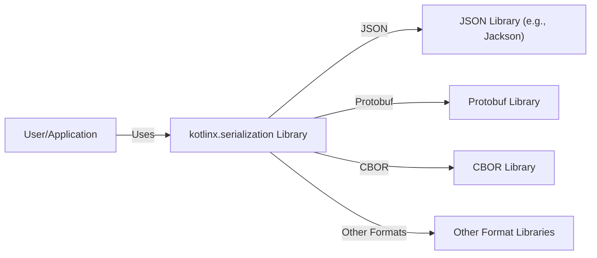
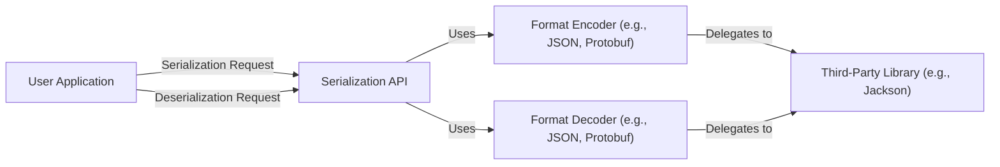
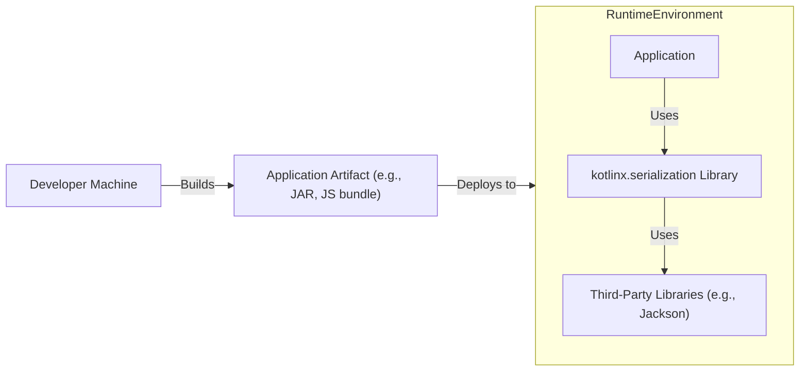
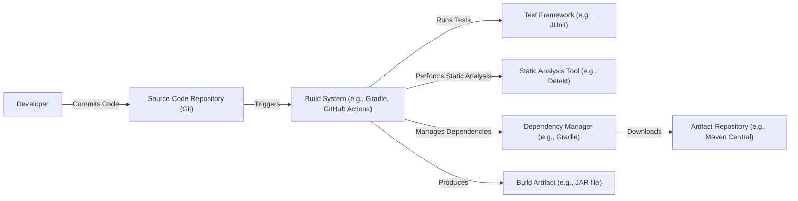

# Project Design Document: kotlinx.serialization

# BUSINESS POSTURE

Business Priorities and Goals:

*   Provide a serialization and deserialization library for Kotlin objects.
*   Support multiple serialization formats (JSON, Protobuf, CBOR, etc.).
*   Offer a seamless developer experience with compile-time safety and minimal boilerplate.
*   Ensure high performance and efficiency.
*   Maintain cross-platform compatibility (JVM, JS, Native, etc.).
*   Enable easy integration with existing Kotlin projects.
*   Reduce the risk of manual serialization errors.

Most Important Business Risks:

*   Data corruption or loss due to serialization/deserialization errors.
*   Security vulnerabilities introduced by the library (e.g., injection attacks, denial of service).
*   Performance bottlenecks impacting application responsiveness.
*   Compatibility issues with different Kotlin versions or platforms.
*   Lack of adoption due to complexity or poor developer experience.
*   Inability to support new or evolving serialization formats.

# SECURITY POSTURE

Existing Security Controls:

*   security control: Compile-time type safety enforced by the Kotlin compiler and the library's design. This significantly reduces the risk of runtime errors related to type mismatches. (Implemented in: Kotlin compiler, library source code)
*   security control: Use of annotations and code generation to minimize manual coding and potential errors. (Implemented in: Library source code, compiler plugin)
*   security control: Extensive testing suite, including unit and integration tests, to ensure correctness and prevent regressions. (Described in: GitHub repository, test directory)
*   security control: Support for custom serializers, allowing developers to implement specific security measures for sensitive data. (Described in: Library documentation, source code)
*   security control: Regular updates and bug fixes to address reported issues and vulnerabilities. (Described in: GitHub repository, release notes)
*   security control: Community contributions and code reviews to identify and address potential security concerns. (Described in: GitHub repository, contribution guidelines)

Accepted Risks:

*   accepted risk: Reliance on third-party libraries for specific serialization formats (e.g., Jackson for JSON). This introduces a dependency on the security of those libraries.
*   accepted risk: Potential for denial-of-service attacks if the library is used to deserialize untrusted data without proper validation.
*   accepted risk: The library itself does not provide encryption; it's the responsibility of the user to encrypt sensitive data before serialization if needed.

Recommended Security Controls:

*   security control: Implement input validation and sanitization for data being deserialized, especially from untrusted sources.
*   security control: Provide clear documentation and guidelines on secure usage of the library, including best practices for handling sensitive data.
*   security control: Consider integrating with security scanning tools to automatically detect potential vulnerabilities in the library's code and dependencies.
*   security control: Explore options for built-in support for data encryption/decryption.

Security Requirements:

*   Authentication: Not directly applicable to a serialization library. Authentication should be handled at a higher level in the application.
*   Authorization: Not directly applicable. Authorization should be handled separately.
*   Input Validation:
    *   Deserialization should validate input against the expected schema.
    *   Mechanisms to prevent excessive memory allocation during deserialization (e.g., limits on collection sizes, string lengths).
    *   Protection against common injection vulnerabilities (e.g., by escaping special characters where appropriate).
*   Cryptography:
    *   The library itself does not handle cryptography directly.
    *   Provide clear guidance on how to integrate with cryptographic libraries for encrypting/decrypting data before/after serialization.
*   Configuration:
    *   Secure defaults for all configuration options.
    *   Clear documentation on how to configure the library securely.

# DESIGN

## C4 CONTEXT

Context Diagram Element List:

*   Element:
    *   Name: User/Application
    *   Type: User/System
    *   Description: A Kotlin application or user that utilizes the kotlinx.serialization library for serializing and deserializing data.
    *   Responsibilities: Initiates serialization/deserialization requests, provides data to be serialized, and consumes deserialized data.
    *   Security controls: Implements application-level security controls (authentication, authorization, input validation).

*   Element:
    *   Name: kotlinx.serialization Library
    *   Type: Library
    *   Description: The core library providing serialization and deserialization functionality.
    *   Responsibilities: Provides APIs for serialization/deserialization, handles format-specific encoding/decoding, manages serializers.
    *   Security controls: Compile-time type safety, code generation, custom serializer support.

*   Element:
    *   Name: JSON Library (e.g., Jackson)
    *   Type: Third-party Library
    *   Description: An external library used for JSON serialization/deserialization.
    *   Responsibilities: Handles the low-level details of JSON encoding and decoding.
    *   Security controls: Relies on the security controls of the chosen JSON library (e.g., Jackson's security features).

*   Element:
    *   Name: Protobuf Library
    *   Type: Third-party Library
    *   Description: An external library used for Protocol Buffers serialization/deserialization.
    *   Responsibilities: Handles the low-level details of Protobuf encoding and decoding.
    *   Security controls: Relies on the security controls of the chosen Protobuf library.

*   Element:
    *   Name: CBOR Library
    *   Type: Third-party Library
    *   Description: An external library used for CBOR serialization/deserialization.
    *   Responsibilities: Handles the low-level details of CBOR encoding and decoding.
    *   Security controls: Relies on the security controls of the chosen CBOR library.

*   Element:
    *   Name: Other Format Libraries
    *   Type: Third-party Library
    *   Description: External libraries used for other serialization formats.
    *   Responsibilities: Handles the low-level details of encoding and decoding for their respective formats.
    *   Security controls: Relies on the security controls of the chosen libraries.

## C4 CONTAINER

Container Diagram Element List:

*   Element:
    *   Name: User Application
    *   Type: Application
    *   Description: The Kotlin application using kotlinx.serialization.
    *   Responsibilities: Initiates serialization/deserialization requests.
    *   Security controls: Application-level security.

*   Element:
    *   Name: Serialization API
    *   Type: API
    *   Description: The public API of kotlinx.serialization.
    *   Responsibilities: Provides methods for serialization and deserialization.
    *   Security controls: Compile-time type safety, custom serializer support.

*   Element:
    *   Name: Format Encoder (e.g., JSON, Protobuf)
    *   Type: Component
    *   Description: Handles encoding data into a specific format.
    *   Responsibilities: Translates Kotlin objects into the target format.
    *   Security controls: Format-specific escaping and validation.

*   Element:
    *   Name: Format Decoder (e.g., JSON, Protobuf)
    *   Type: Component
    *   Description: Handles decoding data from a specific format.
    *   Responsibilities: Translates data from the target format into Kotlin objects.
    *   Security controls: Format-specific parsing and validation.

*   Element:
    *   Name: Third-Party Library (e.g., Jackson)
    *   Type: Library
    *   Description: External library for low-level format handling.
    *   Responsibilities: Performs the actual encoding/decoding.
    *   Security controls: Relies on the security of the third-party library.

## DEPLOYMENT

Possible Deployment Solutions:

1.  **Embedded Library:** The library is typically included as a dependency in the application's build process (e.g., using Gradle or Maven).  The application, along with the serialization library, is then deployed as a single unit (e.g., a JAR file for JVM applications, a JavaScript bundle for web applications, or a native executable).
2.  **Plugin for other systems:** The library can be used as plugin for other systems, e.g. Ktor framework.

Chosen Solution (Embedded Library):

Deployment Diagram Element List:

*   Element:
    *   Name: Developer Machine
    *   Type: Environment
    *   Description: The machine where the application is built.
    *   Responsibilities: Compiles the code, resolves dependencies, and creates the deployment artifact.
    *   Security controls: Developer machine security (e.g., access controls, malware protection).

*   Element:
    *   Name: Application Artifact (e.g., JAR, JS bundle)
    *   Type: Artifact
    *   Description: The deployable unit containing the application and its dependencies.
    *   Responsibilities: Contains all necessary code and resources for the application to run.
    *   Security controls: Code signing (optional), artifact integrity checks.

*   Element:
    *   Name: Runtime Environment (e.g., JVM, Browser, Native)
    *   Type: Environment
    *   Description: The environment where the application runs.
    *   Responsibilities: Provides the necessary resources for the application to execute.
    *   Security controls: Runtime environment security (e.g., JVM security manager, browser sandboxing).

*   Element:
    *   Name: Application
    *   Type: Application
    *   Description: The user's Kotlin application.
    *   Responsibilities: Performs the application's core functionality.
    *   Security controls: Application-level security.

*   Element:
    *   Name: kotlinx.serialization Library
    *   Type: Library
    *   Description: The embedded serialization library.
    *   Responsibilities: Handles serialization and deserialization.
    *   Security controls: Compile-time type safety, custom serializer support.

*   Element:
    *   Name: Third-Party Libraries (e.g., Jackson)
    *   Type: Library
    *   Description: Embedded third-party libraries for specific formats.
    *   Responsibilities: Handles low-level format encoding/decoding.
    *   Security controls: Relies on the security of the third-party libraries.

## BUILD

Build Process Description:

1.  **Code Commit:** Developers commit code changes to the source code repository (e.g., Git).
2.  **Build Trigger:** The build system (e.g., Gradle, GitHub Actions) is triggered by the code commit.
3.  **Dependency Management:** The dependency manager (e.g., Gradle) resolves and downloads project dependencies from artifact repositories (e.g., Maven Central). This includes kotlinx.serialization and any required third-party libraries.
4.  **Compilation:** The build system compiles the Kotlin code.
5.  **Static Analysis:** Static analysis tools (e.g., Detekt, linters) are run to check for code quality and potential security issues.
6.  **Testing:** The build system executes unit and integration tests using a test framework (e.g., JUnit).
7.  **Artifact Creation:** If all steps are successful, the build system produces the build artifact (e.g., a JAR file).

Security Controls in Build Process:

*   security control: **Dependency Management:** Use of a dependency manager (Gradle) to ensure consistent and reproducible builds.
*   security control: **Dependency Verification:** Verify the integrity of downloaded dependencies (e.g., using checksums or digital signatures).
*   security control: **Static Analysis:** Employ static analysis tools to identify potential code quality and security issues.
*   security control: **Testing:** Comprehensive test suite to ensure code correctness and prevent regressions.
*   security control: **Build Automation:** Automated build process to reduce manual errors and ensure consistency.
*   security control: **Supply Chain Security:** Use of trusted artifact repositories (e.g., Maven Central) and potentially scanning dependencies for known vulnerabilities.

# RISK ASSESSMENT

Critical Business Processes:

*   Serialization and deserialization of data for various purposes, including data persistence, inter-process communication, and data exchange with external systems.
*   Maintaining data integrity and consistency during serialization and deserialization.

Data Sensitivity:

*   The library itself does not handle specific data. The sensitivity of the data being serialized/deserialized depends entirely on the application using the library.
*   The library *should* be capable of handling sensitive data (e.g., PII, financial data) correctly, but the responsibility for protecting that data (e.g., through encryption) lies with the application.

# QUESTIONS & ASSUMPTIONS

Questions:

*   Are there any specific compliance requirements (e.g., GDPR, HIPAA) that need to be considered?
*   What are the expected performance requirements (e.g., throughput, latency)?
*   What are the target deployment environments (e.g., specific JVM versions, cloud platforms)?
*   Are there any specific security concerns or known attack vectors related to the supported serialization formats?
*   What level of support is expected for custom serializers and their security implications?

Assumptions:

*   BUSINESS POSTURE: The primary goal is to provide a robust and efficient serialization library for Kotlin. Security is a high priority, but performance and ease of use are also important.
*   SECURITY POSTURE: Developers using the library are responsible for implementing appropriate security measures at the application level, including input validation, encryption, and access control. The library is assumed to be used in a generally secure environment.
*   DESIGN: The library will continue to support multiple serialization formats through external dependencies. The build process will include standard security checks (static analysis, testing). The deployment model will primarily be as an embedded library.