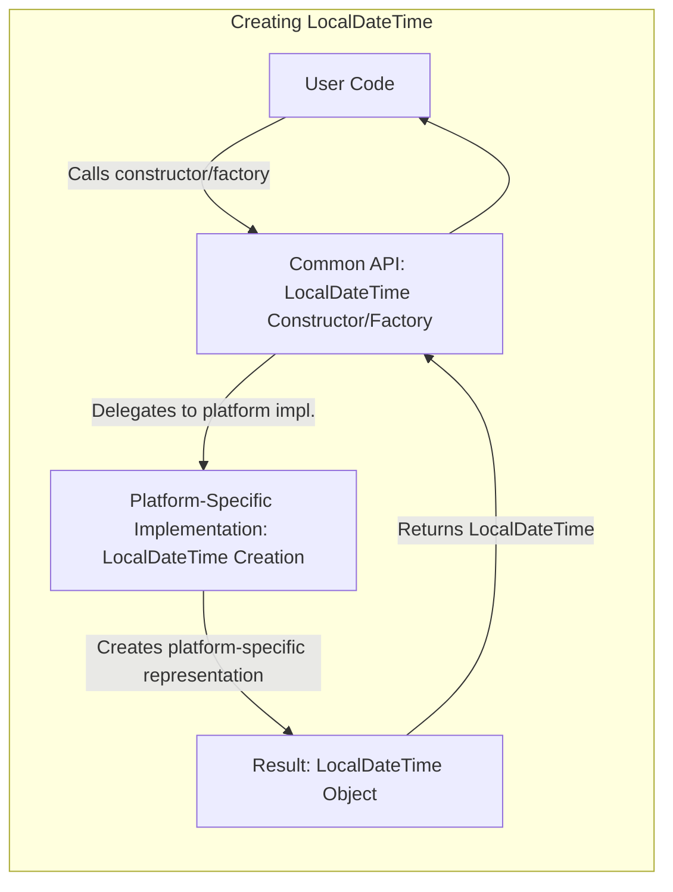
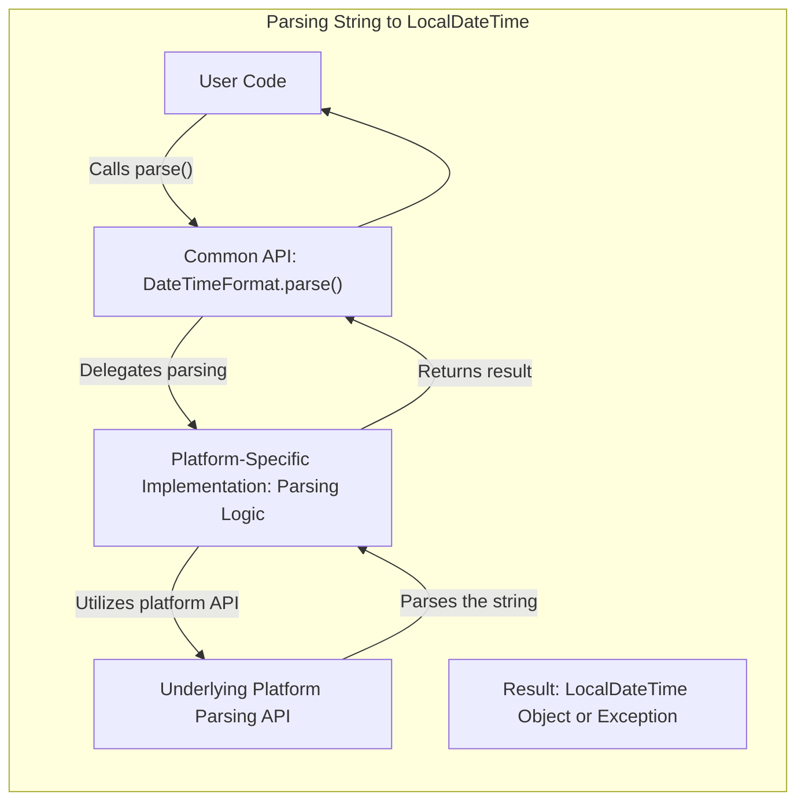
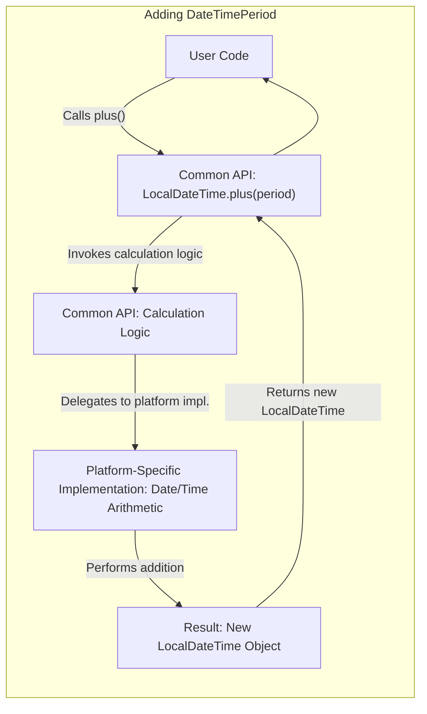

# Project Design Document: kotlinx-datetime Library

**Version:** 1.1
**Date:** October 26, 2023
**Author:** AI Software Architect

## 1. Introduction

This document provides an enhanced design overview of the `kotlinx-datetime` library, a multiplatform Kotlin library designed for robust and accurate date and time manipulation. This document is specifically tailored to facilitate subsequent threat modeling activities by providing a detailed understanding of the library's architecture, key components, data flow, and dependencies.

## 2. Goals and Objectives

The primary goals of the `kotlinx-datetime` library are:

* Provide a comprehensive and accurate API for date and time manipulation in Kotlin, minimizing platform inconsistencies.
* Offer seamless multiplatform support, ensuring consistent behavior and data representation across JVM, JavaScript, and Native targets.
* Achieve high performance and efficiency in date and time operations.
* Maintain a clear, intuitive, and user-friendly API for developers.
* Abstract away platform-specific quirks and complexities related to date and time handling.

## 3. Scope

This design document focuses on the internal architecture and functionality of the core `kotlinx-datetime` library. It specifically covers:

* The common API and its core abstractions.
* The interaction between the common API and platform-specific implementations.
* Key data structures and algorithms used within the library.

This document does *not* cover:

* Applications that consume the `kotlinx-datetime` library.
* The intricacies of the build and release pipeline for the library.
* The detailed implementation specifics of the underlying platform date and time APIs (e.g., the internal workings of `java.time` on the JVM).

## 4. High-Level Architecture

The `kotlinx-datetime` library employs a multiplatform architecture, carefully separating the common API from platform-specific implementations:

* **Common API Layer:** This layer, written in pure Kotlin, defines the public API and implements core date and time logic that is platform-independent. It provides abstractions and interfaces used by developers.
* **Platform-Specific Implementation Layer:** For each supported platform (JVM, JS, Native), a dedicated implementation layer provides the underlying functionality. These implementations adapt the common API to the specific date and time capabilities of each platform, often wrapping or delegating to native APIs.

```mermaid
graph LR
    subgraph "kotlinx-datetime Library"
        direction LR
        "Common API (Kotlin)" --- "JVM Implementation"
        "Common API (Kotlin)" --- "JavaScript Implementation"
        "Common API (Kotlin)" --- "Native Implementation"
    end
```

## 5. Key Components

The library is structured around several key components, each responsible for distinct aspects of date and time management. Understanding these components is crucial for identifying potential threat vectors:

* **`Instant`:** Represents a precise point in time, measured in nanoseconds from the epoch. Its primary responsibility is to provide a platform-independent representation of a timestamp.
* **`LocalDateTime`:** Represents a date and time without any time zone information. Its responsibility is to handle local date and time calculations, independent of geographical location.
* **`LocalDate`:** Represents a calendar date without a time-of-day component or time zone. Its responsibility is to manage date-specific operations like calculating the difference between dates.
* **`LocalTime`:** Represents a time of day, independent of any specific date or time zone. Its responsibility is to handle time-related operations.
* **`TimeZone`:** Represents a geographical region with specific rules for observing time offsets. Its responsibility is to manage time zone information and perform conversions between instants and local date-times.
* **`DateTimeUnit`:** Represents units of time, such as seconds, days, months, etc. Its responsibility is to define and manipulate time units for calculations.
* **`DateTimePeriod`:** Represents a duration of time composed of date and time components (years, months, days, hours, minutes, seconds, nanoseconds). Its responsibility is to represent and manipulate time durations.
* **`DateTimeFormat`:** Provides functionality for formatting `Instant`, `LocalDateTime`, etc., into human-readable strings and parsing strings back into date and time objects. Its responsibility is to handle the serialization and deserialization of date and time data.
* **`Clock`:** An abstraction for obtaining the current `Instant`. This allows for testing and scenarios where a controlled time source is needed. Its responsibility is to provide the current time.
* **Internal Platform Implementations:** These are platform-specific classes and functions that provide the concrete implementations for the common API's abstractions, interacting with the underlying OS or platform libraries. Their responsibility is to bridge the gap between the common API and the platform.

## 6. Data Flow

The following diagrams illustrate the data flow for common operations within the library, highlighting the interaction between the common API and platform-specific implementations:

**Data Flow for Creating a `LocalDateTime`:**



**Data Flow for Parsing a String to `LocalDateTime`:**



**Data Flow for Adding a `DateTimePeriod` to a `LocalDateTime`:**



## 7. Security Considerations (Detailed for Threat Modeling)

This section outlines potential security considerations relevant for threat modeling:

* **Input Validation Vulnerabilities (Parsing):**
    * **Threat:** Maliciously crafted date/time strings passed to `DateTimeFormat.parse()` could exploit vulnerabilities in the parsing logic, leading to exceptions, incorrect date/time values, or even denial-of-service.
    * **Example:**  Providing extremely long or complex date/time strings that consume excessive processing time or memory.
* **Time Zone Data Manipulation:**
    * **Threat:** If the library relies on external time zone data sources, vulnerabilities in these sources or the process of updating them could lead to incorrect time zone information, affecting calculations and potentially causing security issues in dependent applications (e.g., incorrect access control based on time).
    * **Example:**  A compromised time zone database could report incorrect daylight saving time transitions.
* **Integer Overflow in Calculations:**
    * **Threat:** Performing arithmetic operations on date and time components (especially with large periods or distant dates) could potentially lead to integer overflows if not handled carefully, resulting in incorrect results or unexpected behavior.
    * **Example:** Adding an extremely large number of years to a date.
* **Platform-Specific API Vulnerabilities:**
    * **Threat:** The platform-specific implementations rely on underlying platform APIs (e.g., `java.time` on the JVM). Vulnerabilities in these underlying APIs could be indirectly exploitable through `kotlinx-datetime`.
    * **Example:** A bug in the JVM's `java.time` implementation could be triggered through `kotlinx-datetime`.
* **Denial of Service (Formatting):**
    * **Threat:**  Providing excessively complex or deeply nested formatting patterns to `DateTimeFormat.format()` could consume significant resources, potentially leading to a denial-of-service.
    * **Example:** A formatting pattern with a very large number of optional sections or repeated elements.
* **Locale Handling Vulnerabilities:**
    * **Threat:** If formatting or parsing is locale-dependent, vulnerabilities in the underlying locale data or handling mechanisms could be exploited.
    * **Example:** A maliciously crafted locale setting could cause unexpected behavior during formatting.

## 8. Dependencies

The `kotlinx-datetime` library has minimal direct dependencies to maintain a lean core. However, it inherently relies on the Kotlin Standard Library and platform-specific date/time capabilities:

* **Kotlin Standard Library:** Provides fundamental language features and utilities. *Security Consideration:*  Vulnerabilities in the Kotlin Standard Library could impact `kotlinx-datetime`.
* **Platform-Specific Date/Time APIs:**
    * **JVM:**  Relies on the `java.time` package. *Security Consideration:* Vulnerabilities in `java.time` could be a concern.
    * **JavaScript:** Utilizes the native `Date` object. *Security Consideration:* Inconsistencies and potential vulnerabilities in the JavaScript `Date` object across different browsers/environments are a consideration.
    * **Native:**  Uses platform-specific time functions provided by the operating system or runtime environment. *Security Consideration:* Security of these underlying native APIs is crucial.

It's important to note the potential for transitive dependencies introduced by the platform-specific implementations. Careful dependency management is crucial to mitigate risks associated with these dependencies.

## 9. Deployment

The `kotlinx-datetime` library is typically deployed as a dependency within other Kotlin projects. Common deployment scenarios include:

* **Backend Applications (JVM):** Used in server-side applications built with Kotlin/JVM. *Security Consideration:*  The security of the server environment and other dependencies is important.
* **Frontend Applications (JS):** Used in web applications built with Kotlin/JS. *Security Consideration:*  Client-side vulnerabilities and the security of the browser environment are relevant.
* **Mobile Applications (Native):** Used in Android and iOS applications built with Kotlin/Native. *Security Consideration:*  Mobile platform security and potential vulnerabilities in the native runtime are factors.
* **Multiplatform Libraries:**  `kotlinx-datetime` itself can be a dependency of other multiplatform libraries. *Security Consideration:*  Security implications propagate through the dependency chain.

## 10. Future Considerations

Potential future enhancements to the library that might have security implications include:

* **Support for more calendar systems:** Introducing new calendar systems could introduce new complexities and potential vulnerabilities in handling their specific rules.
* **More advanced time zone handling features:**  More complex time zone calculations or data handling could introduce new attack surfaces.
* **Integration with external time services:** Relying on external services for time synchronization could introduce vulnerabilities related to the security of those services and the communication with them.

This improved design document provides a more detailed and security-focused overview of the `kotlinx-datetime` library, making it a more effective foundation for subsequent threat modeling activities. The enhanced descriptions of components, data flow, and security considerations offer a clearer understanding of potential attack vectors and vulnerabilities.