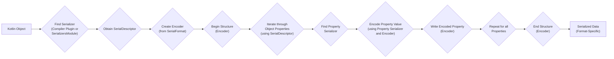
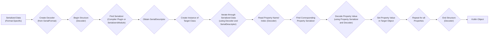

# Project Design Document: kotlinx.serialization

**Version:** 1.1
**Date:** October 26, 2023
**Prepared By:** Gemini (AI Language Model)

## 1. Introduction

This document provides a detailed design overview of the `kotlinx.serialization` library. Its primary purpose is to clearly articulate the architecture, key components, and data flow within the library to facilitate effective threat modeling. This document serves as a foundational resource for security assessments, enabling the identification of potential vulnerabilities and the development of appropriate mitigation strategies.

## 2. Goals and Scope

The primary goal of this document is to provide a clear and comprehensive understanding of the `kotlinx.serialization` library's design specifically for security analysis. The scope includes:

*   Detailed architecture of the library, emphasizing security-relevant components.
*   Responsibilities of key components and their interactions during serialization and deserialization.
*   Detailed data flow diagrams illustrating the movement and transformation of data.
*   Explanation of extension points and plugin mechanisms with a focus on potential security implications.
*   Overview of supported serialization formats and their inherent security characteristics.
*   Identification of key dependencies and their potential impact on the library's security posture.

This document does not cover:

*   Low-level implementation details of individual classes or functions beyond what is necessary for understanding the architecture and data flow.
*   Performance metrics or optimization strategies.
*   Specific code examples or usage scenarios unrelated to the library's internal workings.

## 3. Overview

`kotlinx.serialization` is a multiplatform Kotlin library designed for efficient and type-safe object serialization and deserialization. It enables the conversion of Kotlin objects into various formats suitable for storage or transmission and the reconstruction of those objects from their serialized representation. A key design principle is to leverage Kotlin's compiler plugin to automatically generate serialization logic, minimizing boilerplate and improving performance. The library also provides a reflection-based fallback for scenarios where compiler plugin generation is not possible. Its modular architecture allows for extensibility and support for diverse serialization formats.

## 4. Architectural Design

The `kotlinx.serialization` library is structured around several core components that work together to manage the serialization and deserialization processes.

### 4.1. Core Components

*   **`Serializers`:** Define the logic for serializing and deserializing instances of specific Kotlin types. These can be:
    *   **Generated Serializers:** Automatically created by the Kotlin compiler plugin for classes annotated with `@Serializable`. This is the preferred and most efficient approach.
    *   **Built-in Serializers:** Provided by the library for common Kotlin types (e.g., `String`, `Int`, `List`).
    *   **Custom Serializers:** Implemented by developers to handle specific serialization requirements or to serialize types not supported by the compiler plugin.
*   **`Encoder` Interface:**  Responsible for writing serialized data to an output. Implementations are format-specific (e.g., `JsonEncoder` writes JSON). Key responsibilities include:
    *   Writing primitive values.
    *   Writing structured data (objects, lists, maps).
    *   Handling null values.
    *   Potentially managing metadata.
*   **`Decoder` Interface:** Responsible for reading serialized data from an input. Implementations are format-specific (e.g., `JsonDecoder` reads JSON). Key responsibilities include:
    *   Reading primitive values.
    *   Reading structured data.
    *   Handling null values.
    *   Potentially validating data integrity.
*   **`SerialFormat` Interface:** Represents a specific serialization format (e.g., JSON, CBOR). It acts as a factory for creating `Encoder` and `Decoder` instances for that format. Implementations encapsulate the format-specific rules and syntax.
*   **`SerialDescriptor`:**  A metadata object that describes the structure of a serializable class. It contains information about the class's properties, their types, and any associated annotations. This information is used by `Encoder` and `Decoder` to correctly serialize and deserialize objects. The `SerialDescriptor` is typically generated by the compiler plugin.
*   **`SerializationContext`:** Provides contextual information during serialization and deserialization, such as:
    *   Configuration options (e.g., polymorphic serialization settings).
    *   User-defined context objects.
    *   Potentially information about the current serialization scope.
*   **`SerializersModule`:** A registry for custom serializers, polymorphic serializers, and other serialization-related configurations. It allows developers to extend and customize the default serialization behavior.
*   **Kotlin Compiler Plugin (`kotlinx-serialization-compiler-plugin`):**  A crucial build-time component that automatically generates `Serializers` and `SerialDescriptor` instances for classes annotated with `@Serializable`. This significantly reduces boilerplate and improves performance by performing serialization logic generation ahead of time.
*   **Reflection-based Serialization (Fallback Mechanism):** Used when the compiler plugin cannot generate a serializer (e.g., for open classes without `@Serializable` or in certain dynamic scenarios). This mechanism uses Kotlin reflection at runtime to access object properties and their types.

### 4.2. Data Flow

The following diagrams illustrate the data flow during the serialization and deserialization processes, highlighting the interaction between key components.

#### 4.2.1. Serialization Flow

#### 4.2.2. Deserialization Flow

## 5. Security Considerations

This section details potential security considerations based on the architecture and data flow of `kotlinx.serialization`.

*   **Deserialization of Untrusted Data:** This is a primary attack vector. Maliciously crafted serialized data can exploit vulnerabilities in the deserialization process:
    *   **Code Injection/Remote Code Execution (RCE):** If custom serializers are poorly implemented or if polymorphic deserialization is not properly configured, attackers might be able to instantiate arbitrary classes, potentially leading to code execution. Reflection-based deserialization, if used on attacker-controlled data without proper safeguards, increases this risk.
    *   **Denial of Service (DoS):**  Attackers can provide deeply nested or excessively large data structures, causing the deserialization process to consume excessive CPU, memory, or other resources, leading to a denial of service.
    *   **Information Disclosure:**  Carelessly implemented serializers or format implementations might inadvertently expose sensitive information during the deserialization process or through error messages.
    *   **Object Graph Exploitation:**  Circular references or excessively complex object graphs in the serialized data can lead to stack overflow errors or infinite loops during deserialization.
*   **Vulnerabilities in Custom Serializers:**  Developers implementing custom serializers must be vigilant about input validation and sanitization. Failure to do so can introduce vulnerabilities specific to those serializers.
*   **Polymorphic Serialization Risks:** Incorrectly configured or exploited polymorphic serialization can allow an attacker to specify the type of object to be instantiated during deserialization, potentially leading to the instantiation of malicious classes. It's crucial to restrict the set of allowed polymorphic types.
*   **Risks Associated with Reflection-based Serialization:** While providing flexibility, reflection bypasses compile-time safety checks and can be more vulnerable if used with untrusted data. It's important to understand when and how reflection is being used.
*   **Security of Supported Serialization Formats:**  Each supported format has its own set of potential vulnerabilities (e.g., JSON parsing vulnerabilities). The library's format implementations must be robust against these known issues.
*   **Supply Chain Security:**  The security of `kotlinx.serialization` depends on the security of its dependencies. Vulnerabilities in these dependencies could be exploited to compromise the library. Regularly updating dependencies and verifying their integrity is crucial.
*   **Configuration Errors:**  Incorrect configuration of serialization settings (e.g., allowing unrestricted polymorphic deserialization) can create security vulnerabilities.

## 6. Extension Points and Plugin Mechanisms

`kotlinx.serialization` offers several extension points for customization, which also introduce potential security considerations:

*   **Custom Serializers:**  Allow developers to override the default serialization logic for specific types. Malicious or poorly written custom serializers can introduce vulnerabilities.
*   **`SerializersModule`:** Enables the registration of custom serializers, polymorphic serializers, and contextual serializers. Improperly managed `SerializersModule` configurations can lead to security issues, especially with polymorphic serialization.
*   **Format Plugins:**  Developers can create plugins to support new serialization formats. Untrusted or malicious format plugins could introduce vulnerabilities in the encoding and decoding processes.
*   **Contextual Serialization:**  Allows providing serializers based on the context of serialization. Incorrectly managed contextual serializers could lead to unexpected behavior or vulnerabilities.

It is crucial to carefully review and control the use of these extension points, especially when dealing with untrusted data or in security-sensitive contexts.

## 7. Supported Serialization Formats

`kotlinx.serialization` provides built-in support for several serialization formats, each with its own security characteristics:

*   **JSON (JavaScript Object Notation):** A widely used text-based format. Known vulnerabilities include:
    *   **JSON Injection:**  If not handled carefully, untrusted JSON data can be injected into systems that process it.
    *   **Parsing Vulnerabilities:**  Specific JSON parsing implementations might have vulnerabilities that can be exploited with malformed JSON.
*   **CBOR (Concise Binary Object Representation):** A binary data serialization format designed for efficiency. While generally considered more secure than text-based formats, potential vulnerabilities include:
    *   **Parsing Vulnerabilities:**  Like any binary format, CBOR parsers can have vulnerabilities.
    *   **DoS Attacks:**  Maliciously crafted CBOR data could potentially cause excessive resource consumption during parsing.
*   **ProtoBuf (Protocol Buffers):** A language-neutral, platform-neutral mechanism for serializing structured data. Security considerations include:
    *   **Parsing Vulnerabilities:**  Similar to other binary formats.
    *   **Schema Evolution Issues:**  Mismatched schemas between the sender and receiver can lead to unexpected behavior or vulnerabilities.

Understanding the security implications of each format is important when choosing a format for a particular application.

## 8. Key Dependencies

The security of `kotlinx.serialization` is also influenced by its dependencies. Key dependencies include:

*   **`kotlinx-coroutines-core`:** While primarily for concurrency, vulnerabilities in this library could indirectly affect `kotlinx.serialization` if used in asynchronous serialization scenarios.
*   **`kotlin-reflect`:** Used for reflection-based serialization. Vulnerabilities in the reflection API itself could be a concern.
*   **Format-specific dependencies:** Libraries used for handling specific formats (e.g., a JSON parsing library) can introduce vulnerabilities if they are not secure.

It is essential to keep these dependencies up-to-date and to be aware of any reported security vulnerabilities in them.

## 9. Deployment and Usage

`kotlinx.serialization` is typically deployed as a library dependency in Kotlin projects. Its usage context can impact the potential attack surface:

*   **Backend Services (APIs):**  Deserializing data from external requests is a high-risk area.
*   **Mobile Applications:**  Deserializing data from network requests or local storage.
*   **Data Processing Pipelines:**  Deserializing data from various sources.

The security requirements and potential threats will vary depending on the deployment environment.

## 10. Future Considerations

Future developments in `kotlinx.serialization` that could have security implications include:

*   **Introduction of new serialization formats:** Each new format will need to be analyzed for potential vulnerabilities.
*   **Changes to the compiler plugin:**  Security vulnerabilities could be introduced in the code generation process.
*   **New features related to polymorphic serialization or custom serializers:** These areas are inherently complex and require careful design to avoid security issues.

Ongoing security reviews and threat modeling should be conducted as the library evolves.

This improved design document provides a more detailed and security-focused overview of `kotlinx.serialization`, making it more suitable for threat modeling activities. The enhanced descriptions, detailed data flow diagrams, and comprehensive security considerations offer a solid foundation for identifying and mitigating potential vulnerabilities.
