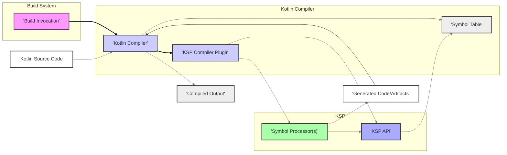

# Project Design Document: Kotlin Symbol Processing (KSP)

**Version:** 1.1
**Date:** October 26, 2023
**Author:** AI Software Architect

## 1. Introduction

This document provides a detailed design overview of the Kotlin Symbol Processing (KSP) library. It aims to clearly articulate the architecture, components, and data flow within KSP. This document will serve as the foundation for subsequent threat modeling activities, enabling a deeper understanding of potential security vulnerabilities.

### 1.1. Purpose

The primary purpose of this document is to provide a comprehensive technical description of KSP to facilitate thorough threat modeling. It meticulously outlines the key components, their interactions, and the data they process. This granular understanding is crucial for identifying potential security vulnerabilities and designing appropriate mitigation strategies to ensure the robustness and integrity of systems utilizing KSP.

### 1.2. Scope

This document covers the core architecture and functionality of the KSP library as of the current understanding of the project based on the provided GitHub repository. It focuses on the intricate interaction between KSP, the Kotlin compiler, and user-defined symbol processors. It deliberately avoids delving into the low-level internal implementation details of the Kotlin compiler itself, except where such details are directly and significantly relevant to understanding KSP's operation and potential security implications.

### 1.3. Goals

*   Clearly define the major components of the KSP system and their specific roles.
*   Describe the data flow and interactions between these components with precision.
*   Provide sufficient detail about the system's workings to enable effective threat identification and analysis by security experts.
*   Use clear and concise language, minimizing technical jargon where possible to ensure broad understanding.
*   Adhere strictly to the specified formatting requirements (markdown, mermaid, no tables), ensuring readability and consistency.

## 2. Overview of Kotlin Symbol Processing (KSP)

Kotlin Symbol Processing (KSP) is a powerful library developed by Google to simplify the creation of lightweight compiler plugins for the Kotlin language. It empowers developers to analyze Kotlin code and generate new code or other artifacts seamlessly during the compilation process. A key advantage of KSP over traditional Kotlin compiler plugins is its stable and user-friendly API, built upon the concept of Kotlin symbols. This abstraction from the often-complex internal compiler APIs significantly reduces the learning curve and maintenance burden associated with building code generation tools and other compiler extensions. KSP enables more efficient and reliable metaprogramming in Kotlin.

## 3. System Architecture

The KSP system comprises several essential components that collaborate closely during the Kotlin compilation lifecycle.

### 3.1. Key Components

*   **Kotlin Compiler:** The foundational component responsible for the entire process of transforming Kotlin source code into executable bytecode. KSP operates as a specifically designed plugin that extends the compiler's capabilities.
*   **KSP Compiler Plugin:** This acts as the designated entry point for KSP's functionality within the Kotlin compilation workflow. Its primary responsibilities include initializing the KSP environment, managing the lifecycle of symbol processors, and orchestrating their interaction with the compiler.
*   **KSP API:** A well-defined set of interfaces and classes provided by the KSP library. Symbol processors interact with the Kotlin code's structure exclusively through this API. It offers a stable and abstract representation of Kotlin code elements, including declarations (classes, functions, properties), annotations, and type information. This abstraction shields processors from internal compiler changes.
*   **Symbol Processor:** This represents the custom logic implemented by developers to perform specific tasks during compilation. Symbol processors, built using the KSP API, are the core of KSP's extensibility. They analyze the code's symbols and can perform actions such as generating boilerplate code, validating coding conventions, or creating documentation.
*   **Kotlin Source Code:** The initial input to the compilation process, written by developers in the Kotlin programming language. This code is the subject of analysis and transformation by KSP.
*   **Generated Code/Artifacts:** The output produced by the execution of symbol processors. This can encompass a variety of artifacts, including new Kotlin source files that are then compiled, resource files, configuration files, or documentation.
*   **Build System (e.g., Gradle, Maven):** The overarching tool responsible for managing the entire build process of a software project. This includes invoking the Kotlin compiler with the necessary KSP plugin and configuring the execution of symbol processors.

### 3.2. Component Interactions

The following list details the sequential interactions between the core components of the KSP system during a typical compilation process:

1. The **Build System** initiates the compilation process by invoking the **Kotlin Compiler**.
2. The **Kotlin Compiler**, as part of its initialization, loads the configured **KSP Compiler Plugin**.
3. The **KSP Compiler Plugin** takes the lead in setting up the **KSP API** environment, making it available for use by symbol processors.
4. The **KSP Compiler Plugin** identifies and creates instances of the registered **Symbol Processors** that are configured for the project.
5. The **Kotlin Compiler** parses the provided **Kotlin Source Code** and constructs an in-memory representation of the code's structure, known as the symbol table.
6. The **KSP Compiler Plugin** facilitates the interaction between the **Symbol Processors** and the compiler's symbol table by providing access through the **KSP API**.
7. **Symbol Processors**, utilizing the **KSP API**, analyze the code's symbols according to their defined logic and perform their intended tasks.
8. **Symbol Processors** can generate new **Generated Code/Artifacts** based on their analysis of the source code.
9. The **Kotlin Compiler** proceeds to compile both the original **Kotlin Source Code** and any newly **Generated Code** produced by the processors.
10. Finally, the **Build System** packages the resulting compiled code and any other generated artifacts into the final distributable form.

## 4. Data Flow

The subsequent diagram visually represents the flow of data through the KSP system during the compilation process, illustrating the dependencies and transformations involved.

**Detailed Data Flow Description:**

*   **Kotlin Source Code** (G), the developer's written code, serves as the initial input to the **Kotlin Compiler** (B).
*   The compilation process is initiated by a **Build Invocation** (A) from the build system.
*   The **Kotlin Compiler** (B) then loads the **KSP Compiler Plugin** (C), enabling KSP's functionality.
*   The **KSP Compiler Plugin** (C) initializes the **KSP API** (E), providing the interface for symbol processors.
*   The **Kotlin Compiler** (B) analyzes the **Kotlin Source Code** and constructs an internal **Symbol Table** (D) representing the code's structure.
*   The **KSP API** (E) grants **Symbol Processors** (F) read-only access to the information contained within the **Symbol Table** (D).
*   **Symbol Processors** (F) leverage the **KSP API** (E) to examine the symbols and execute their designated logic.
*   Based on their analysis, **Symbol Processors** (F) can generate new **Generated Code/Artifacts** (H).
*   The **Kotlin Compiler** (B) integrates and compiles both the original source code and any newly generated code.
*   Finally, the **Kotlin Compiler** (B) produces the **Compiled Output** (I), which includes the bytecode and other compiled resources.

## 5. Security Considerations (Detailed for Threat Modeling)

This section expands upon the initial security considerations, providing more specific examples of potential threats that could arise within the KSP architecture. These points will be the focus of a more in-depth threat modeling exercise.

*   **Malicious Symbol Processors:** The fact that symbol processors are essentially user-provided code introduces a significant risk. A compromised or intentionally malicious processor could perform harmful actions during the build process:
    *   **Malicious Code Generation:** Injecting backdoors or vulnerabilities into the **Generated Code/Artifacts** (H). For example, a processor could generate code that bypasses authentication or introduces remote code execution flaws.
    *   **Sensitive Data Exfiltration:** Accessing and transmitting sensitive information present in the **Kotlin Source Code** (G) or the build environment (e.g., API keys, credentials). A processor could scan for specific patterns or annotations to locate sensitive data.
    *   **Denial of Service (DoS):** Consuming excessive computational resources (CPU, memory) during compilation, significantly slowing down or halting the build process. A poorly written or malicious processor could enter infinite loops or perform computationally expensive operations.
    *   **Supply Chain Attacks:** If a project depends on a third-party symbol processor, a compromise of that processor's development or distribution could introduce vulnerabilities into dependent projects.
*   **Code Injection through Generated Code:** Errors or vulnerabilities in a symbol processor's logic when generating code can lead to exploitable weaknesses in the final application:
    *   **Cross-Site Scripting (XSS):** If a processor generates web-related code, improper handling of user inputs could lead to XSS vulnerabilities in the generated output.
    *   **SQL Injection:** Processors generating database access code could introduce SQL injection flaws if they don't properly sanitize data used in queries.
    *   **Command Injection:** If a processor generates code that executes system commands, vulnerabilities could arise if the processor doesn't properly validate or escape inputs used in those commands.
*   **Information Disclosure:** Symbol processors have broad access to the project's codebase structure through the **KSP API** (E). This access, while necessary for their function, presents a risk:
    *   **Accidental Exposure:** A poorly written processor might unintentionally log or expose sensitive information present in the source code during its operation.
    *   **Intentional Leakage:** A malicious processor could deliberately extract and transmit sensitive data like intellectual property, internal APIs, or security configurations.
*   **Build System Security:** The security of the **Build System** (e.g., Gradle, Maven) is paramount, as it's responsible for managing dependencies and executing build scripts:
    *   **Compromised Build Scripts:** Malicious modifications to build scripts could introduce rogue KSP plugins or alter the configuration to use compromised repositories.
    *   **Dependency Confusion:** Attackers could introduce malicious packages with the same name as internal dependencies, potentially including malicious symbol processors.
*   **Dependency Management Vulnerabilities:** Symbol processors often rely on external libraries. Vulnerabilities in these dependencies can be exploited during the compilation process:
    *   **Transitive Dependencies:** Vulnerabilities in the dependencies of a symbol processor's dependencies can also pose a risk.
    *   **Outdated Dependencies:** Using outdated versions of libraries with known security flaws can create vulnerabilities.
*   **KSP API Vulnerabilities:** While KSP aims to provide a stable and secure API, potential vulnerabilities within the **KSP API** (E) itself could be exploited:
    *   **Bypass Security Checks:** A flaw in the API could allow symbol processors to access information or perform actions they shouldn't.
    *   **Compiler Instability:** Exploiting API vulnerabilities could potentially destabilize the **Kotlin Compiler** (B).

## 6. Deployment

KSP is typically integrated into a Kotlin project's build process by adding the KSP plugin and its dependencies within the project's build configuration file (e.g., `build.gradle.kts` for Gradle). Developers then declare the specific symbol processors they intend to utilize. During the build process, the build system invokes the Kotlin compiler, which in turn loads and executes the configured KSP plugin and its associated symbol processors.

## 7. Future Considerations

The evolution of KSP and the Kotlin ecosystem could introduce new functionalities and potential security implications. Future developments to consider for their security impact include:

*   **Enhanced KSP API Capabilities:**  Introducing more powerful features within the **KSP API** (E) could provide symbol processors with greater control and access, potentially expanding the attack surface if not carefully secured. For example, allowing processors to modify existing code rather than just generate new code could introduce new risks.
*   **Tighter Integration with Kotlin Compiler Features:**  Closer integration with advanced compiler features might expose new internal interfaces or data structures, potentially creating new avenues for exploitation if vulnerabilities exist in those integrations.
*   **New Types of Symbol Processors and APIs:** The introduction of new categories of symbol processors designed for different purposes (e.g., security analysis, code optimization) could necessitate new security models and considerations specific to those processor types.
*   **Remote Symbol Processor Execution or Distribution:** If future versions allow for the remote execution or distribution of symbol processors, this would introduce significant new security challenges related to trust, integrity, and secure communication.

This document provides a comprehensive design overview of the KSP architecture, serving as a crucial foundation for subsequent threat modeling activities. A thorough analysis of each component, interaction, and potential future development is essential to proactively identify and mitigate potential security vulnerabilities.