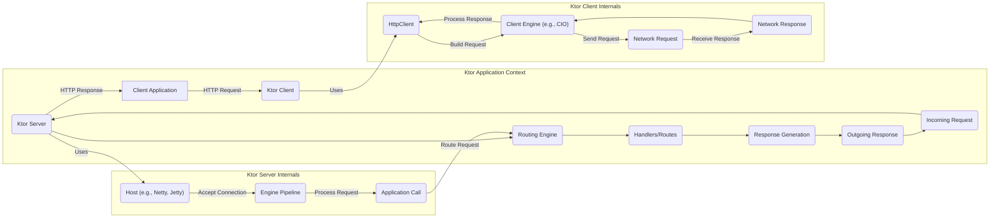
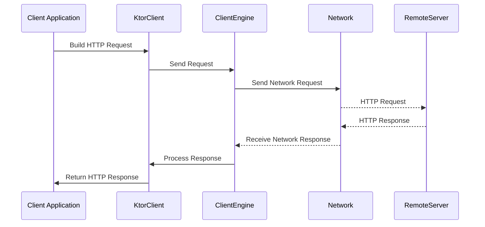

## Project Design Document: Ktor Framework (Improved)

**1. Introduction**

This document provides an enhanced architectural overview of the Ktor framework (https://github.com/ktorio/ktor). It aims to offer a clearer description of the key components, their interactions, and the overall structure of the framework. This improved document will serve as a more robust foundation for subsequent threat modeling activities.

**2. Goals and Objectives**

*   Deliver a more detailed and easily understandable architectural description of the Ktor framework.
*   Clearly define the responsibilities of each key component within the framework.
*   Provide enhanced illustrations of the data flow within the framework for both client and server interactions.
*   Emphasize critical security considerations inherent in the framework's design and usage.
*   Serve as a more precise and actionable basis for identifying potential threats and vulnerabilities.

**3. Scope**

This document focuses on the core architectural elements of the Ktor framework itself, providing a deeper dive into its internal workings. It covers both the server-side and client-side aspects of the framework, including:

*   Detailed explanation of the core engine and its responsibilities.
*   In-depth analysis of the request processing pipeline with specific stages.
*   Comprehensive overview of the routing mechanism and its components.
*   Detailed breakdown of the Client API and its internal components.
*   Examination of key features and plugins and their integration points.
*   Precise description of the interactions between different components with data flow direction.

This document still does not cover:

*   Specific applications built using Ktor, focusing instead on the framework itself.
*   Fine-grained implementation specifics of individual modules, maintaining a higher level of abstraction.
*   Third-party libraries integrated with Ktor unless they are fundamental to its core functionality.

**4. High-Level Architecture**

**5. Component Details**

This section provides a more detailed explanation of the key components within the Ktor framework.

*   **Ktor Server:** The central component responsible for managing and processing incoming network requests.
    *   **Host:** The concrete server implementation (e.g., Netty, Jetty, Tomcat) responsible for low-level network operations, listening for connections, and accepting them.
    *   **Engine:** Ktor's abstraction layer over the underlying host, providing a consistent API for managing connection and request lifecycles, regardless of the specific host implementation.
    *   **Engine Pipeline:** A configurable interceptor chain that processes incoming requests and outgoing responses. This is the primary mechanism for implementing cross-cutting concerns like authentication, logging, compression, and more.
    *   **Application:** Represents the user-defined application logic built using Ktor. It's where developers define routes, handlers, install features/plugins, and configure the application's behavior.
    *   **Application Call:** An object created for each incoming request, encapsulating the request details (headers, parameters, body) and providing a mechanism to build and send the response.
    *   **Routing Engine:**  The component responsible for matching incoming request paths and methods to the appropriate user-defined handlers based on the configured routes.
    *   **Handlers/Routes:** User-defined functions or objects that contain the core application logic for processing specific requests and generating the corresponding responses.
    *   **Response Generation:** The process within a handler where the response object is constructed, including setting headers, status codes, and the response body.

*   **Ktor Client:** A powerful component for making asynchronous HTTP requests to external services.
    *   **HttpClient:** The main entry point for creating and configuring HTTP clients. It provides a fluent API for building and executing various types of requests (GET, POST, PUT, DELETE, etc.).
    *   **Client Engine:** The underlying implementation responsible for the actual network communication (e.g., CIO, Java Net, OkHttp). It handles connection management, request sending, and response receiving.
    *   **Request:** An object representing an outgoing HTTP request, containing all necessary information like headers, body, HTTP method, and URL.
    *   **Response:** An object representing the incoming HTTP response from the server, including the status code, headers, and the response body.

*   **Features/Plugins:**  Modular extensions that add specific functionalities to Ktor, both on the server and client side. Examples include:
    *   **Authentication:** Provides various mechanisms for authenticating clients, such as Basic Auth, OAuth, and JWT.
    *   **Authorization:** Enables the implementation of access control policies to restrict access to specific resources based on user roles or permissions.
    *   **Content Negotiation:**  Automates the process of selecting the best representation format (e.g., JSON, XML) for requests and responses based on client preferences.
    *   **Serialization (Content Conversion):** Facilitates the conversion of data between different formats (e.g., JSON, XML, Protobuf) and Kotlin data classes.
    *   **Logging:** Provides interceptors for logging request and response details, aiding in debugging and monitoring.
    *   **WebSockets:** Enables bidirectional, full-duplex communication over a single TCP connection.

**6. Data Flow**

This section provides a more detailed description of the data flow within the Ktor framework for both server and client interactions.

**6.1. Server-Side Request Processing:**

1. An **Incoming Request** arrives at the **Host**.
2. The **Host** accepts the connection and passes the request to the **Engine Pipeline**.
3. The **Engine Pipeline** processes the request through a series of configured interceptors (e.g., logging, compression).
4. An **Application Call** object is created, encapsulating the request and providing a context for the response.
5. The **Routing Engine** analyzes the request path and method to match it against defined **Handlers/Routes**.
6. The matched **Handler/Route** executes, processing the request and performing necessary business logic.
7. Within the **Handler/Route**, **Response Generation** occurs, creating the appropriate response object with headers, status code, and body.
8. The **Engine Pipeline** processes the **Outgoing Response** through its interceptors (e.g., adding security headers).
9. The **Engine** sends the **Response** back to the client via the **Host**.

**6.2. Client-Side Request Processing:**

1. The **Client Application** uses the **HttpClient** to build a **Request** object, specifying the URL, headers, body, and HTTP method.
2. The **HttpClient** passes the **Request** to the configured **Client Engine**.
3. The **Client Engine** creates a **Network Request** and sends it over the network.
4. The **Remote Server** processes the request and sends back a **Network Response**.
5. The **Client Engine** receives the **Network Response**.
6. The **Client Engine** processes the **Network Response** and creates a Ktor **Response** object.
7. The **HttpClient** provides the **Response** object back to the **Client Application**.

**7. Security Considerations**

The Ktor framework provides various features and mechanisms to enhance the security of applications built with it. However, developers must be aware of potential security risks and implement appropriate safeguards.

*   **Input Validation and Sanitization:**
    *   **Risk:**  Failure to validate and sanitize user inputs can lead to injection attacks (e.g., SQL injection, XSS).
    *   **Ktor's Role:** Ktor provides mechanisms for request parameter parsing and data binding. Developers should use validation libraries and Ktor's features to validate data before processing.
*   **Authentication and Authorization:**
    *   **Risk:** Unauthorized access to resources and data.
    *   **Ktor's Role:** Ktor offers flexible authentication and authorization features through plugins. Developers need to choose appropriate authentication schemes and implement robust authorization policies.
*   **Transport Layer Security (TLS/SSL):**
    *   **Risk:**  Data transmitted over the network can be intercepted if not encrypted.
    *   **Ktor's Role:** Ktor supports configuring TLS/SSL for both server and client applications. Proper certificate management and HTTPS configuration are crucial.
*   **Cross-Origin Resource Sharing (CORS):**
    *   **Risk:**  Malicious websites can make requests to your application on behalf of users.
    *   **Ktor's Role:** Ktor provides a plugin for configuring CORS policies, allowing developers to control which origins can access resources.
*   **Content Security Policy (CSP):**
    *   **Risk:**  Reduces the risk of XSS attacks by controlling the sources from which the browser is allowed to load resources.
    *   **Ktor's Role:** Ktor allows setting CSP headers in responses. Developers should configure a restrictive CSP.
*   **Dependency Management:**
    *   **Risk:**  Using outdated or vulnerable dependencies can introduce security flaws.
    *   **Ktor's Role:** Developers are responsible for managing their project's dependencies and keeping them updated.
*   **Rate Limiting and Throttling:**
    *   **Risk:**  Susceptible to denial-of-service (DoS) attacks.
    *   **Ktor's Role:**  While Ktor doesn't have built-in rate limiting, it can be implemented using middleware or plugins.
*   **Secure Configuration:**
    *   **Risk:**  Misconfigured servers can expose sensitive information or create vulnerabilities.
    *   **Ktor's Role:** Developers need to carefully configure the Ktor server, including disabling unnecessary features and setting appropriate timeouts.
*   **Error Handling and Logging:**
    *   **Risk:**  Verbose error messages can leak sensitive information. Insufficient logging hinders security monitoring.
    *   **Ktor's Role:** Developers should implement proper error handling and configure secure logging practices.
*   **Session Management:**
    *   **Risk:**  Vulnerable session management can lead to session hijacking or fixation attacks.
    *   **Ktor's Role:** Ktor provides features for session management. Developers must use secure session configurations (e.g., secure cookies, HTTPOnly flags).

**8. Assumptions and Constraints**

*   This document assumes a foundational understanding of networking principles, the HTTP protocol, and general software development concepts.
*   The architectural description is based on the current understanding of the Ktor framework's design principles and publicly available information.
*   The security considerations highlighted are not exhaustive but represent key areas of concern for applications built using Ktor. Developers should conduct thorough security assessments.
*   The level of detail provided is intended to be suitable for threat modeling and architectural understanding. It does not delve into the intricacies of every single module or implementation detail.

This improved document provides a more comprehensive and detailed architectural overview of the Ktor framework, enhancing its value for threat modeling and understanding the framework's inner workings. By clearly outlining the components, data flow, and security considerations, it aims to facilitate the identification and mitigation of potential vulnerabilities.