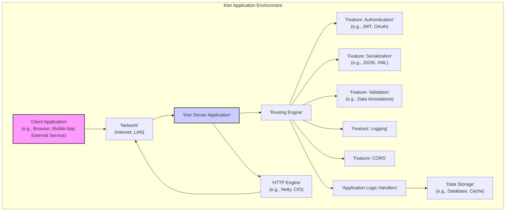
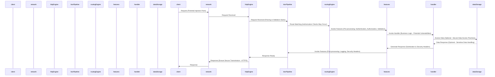

# Project Design Document: Ktor Framework - v1.1

**Version:** 1.1
**Date:** October 26, 2023
**Author:** AI Software Architect

## 1. Introduction

This document provides an enhanced architectural design of the Ktor framework, an asynchronous open-source framework for creating microservices, web applications, and more. This revised document aims to offer a more detailed and precise understanding of Ktor's components, their interactions, and data flow, specifically tailored to serve as a robust foundation for subsequent threat modeling activities. We have expanded on key security aspects and clarified certain architectural details.

## 2. Project Overview

Ktor is a Kotlin-based framework leveraging coroutines for efficient concurrency management. It empowers developers to build networked applications with a strong focus on asynchronous and non-blocking operations, leading to highly performant and scalable systems. Ktor's design emphasizes a lightweight core, modularity through features (plugins), and high extensibility. It comprehensively supports both server-side application development for handling incoming requests and client-side development for making outgoing requests.

## 3. High-Level Architecture

**Components:**

*   **Client Application:** The entity initiating a request to the Ktor server. This can be a variety of applications, including web browsers, mobile apps, command-line tools, or even other backend services.
*   **Network:** Represents the communication infrastructure facilitating the exchange of data between the client and the server. This could be the public internet, a private local area network (LAN), or a virtual private network (VPN).
*   **Ktor Server Application:** The core runtime environment of the Ktor framework, deployed on a server infrastructure. It's responsible for listening for incoming requests, processing them, and generating appropriate responses.
*   **HTTP Engine:** The low-level component responsible for handling the intricacies of the HTTP protocol. It manages socket connections, request parsing, and response construction. Different engines (like Netty or CIO) offer varying performance characteristics and underlying implementations.
*   **Routing Engine:** A crucial component that interprets the incoming request's URL and HTTP method to determine the appropriate Application Logic Handler to invoke. It acts as a dispatcher, mapping requests to specific functionalities.
*   **Features (Plugins):**  Modular, self-contained units of functionality that can be easily added to a Ktor application to extend its capabilities. These features handle cross-cutting concerns and specific functionalities. Examples include:
    *   **Authentication:** Verifying the identity of the requester.
    *   **Serialization:** Converting data between different formats (e.g., JSON, XML) and application objects.
    *   **Validation:** Ensuring the integrity and correctness of incoming data.
    *   **Logging:** Recording application events and request details for monitoring and debugging.
    *   **CORS (Cross-Origin Resource Sharing):** Managing permissions for requests originating from different domains.
*   **Application Logic Handlers:** The developer-written code that implements the core business logic of the application. These handlers are responsible for processing requests, interacting with data storage, and generating responses.
*   **Data Storage:**  Persistent or temporary storage mechanisms used by the application to store and retrieve data. This could include relational databases, NoSQL databases, in-memory caches, or file systems.

## 4. Detailed Design

### 4.1. Ktor Server Application - Enhanced Detail

The Ktor Server Application forms the central processing unit for incoming client requests. Its lifecycle and request handling are crucial for security considerations.

*   **Initialization Phase:**
    *   **Engine Configuration:** The server starts by initializing the selected HTTP engine (e.g., Netty, CIO), configuring its network interfaces, port bindings, and thread pool settings. This phase is critical for setting up secure communication channels (e.g., TLS configuration).
    *   **Feature Loading and Configuration:**  Installed features (plugins) are loaded and initialized. This involves configuring feature-specific settings, such as authentication providers, serialization formats, and CORS policies. Incorrectly configured features can introduce vulnerabilities.
    *   **Routing Definition:** The application defines its routing rules, mapping specific URL paths and HTTP methods to corresponding Application Logic Handlers. Carefully designed routes are essential to prevent unintended access to resources.
*   **Request Processing Flow - Granular View:**
    *   **Network Reception:** The HTTP Engine receives an incoming request from the network. This is the initial entry point and a key area for potential network-level attacks.
    *   **Request Parsing:** The engine parses the raw HTTP request, extracting headers, the request body, HTTP method, and the URL. Vulnerabilities can arise if the parsing process is flawed or doesn't handle malformed requests correctly.
    *   **Pipeline Interception:** The parsed request is passed to the Ktor pipeline, a chain of interceptors. Features (plugins) act as interceptors in this pipeline.
    *   **Routing and Handler Selection:** The Routing Engine analyzes the request URL and method, comparing it against the defined routes. If a match is found, the corresponding Application Logic Handler is identified. Improperly defined or overlapping routes can lead to unexpected behavior.
    *   **Feature Execution (Pre-processing):** Before the handler is invoked, the request passes through the installed features in a predefined order. Features can modify the request (e.g., authentication, request enrichment), perform validation, or even short-circuit the pipeline. The order of features is significant for security (e.g., authentication should typically happen before authorization).
    *   **Application Logic Handler Invocation:** The selected Application Logic Handler is executed. This is where the core business logic resides, and vulnerabilities within this code are common.
    *   **Data Storage Interaction (Optional):** The handler may interact with Data Storage to retrieve or persist data. Secure data access practices are crucial here.
    *   **Response Generation:** The Application Logic Handler generates a response. This response needs to be carefully constructed to avoid information leakage or injection vulnerabilities.
    *   **Feature Execution (Post-processing):** The response passes back through the features in reverse order. Features can modify the response (e.g., adding security headers, logging).
    *   **Response Transmission:** The HTTP Engine serializes the response and sends it back to the client over the network.

### 4.2. Ktor Client - Enhanced Detail

The Ktor client module facilitates making HTTP requests to external services, and its configuration impacts the security of these interactions.

*   **Client Instantiation and Configuration:**
    *   A Ktor client is instantiated with a chosen HTTP engine (e.g., OkHttp, CIO). The selection of the engine can impact performance and security features.
    *   Client-specific features (plugins) can be installed to add functionalities like authentication (e.g., adding API keys or tokens), logging, or custom error handling.
    *   Configuration options include timeouts, proxy settings, and TLS settings, all of which have security implications.
*   **Request Construction and Execution:**
    *   The client constructs an HTTP request object, specifying the target URL, HTTP method, headers, and request body. Care must be taken to sanitize data included in the request.
    *   Installed client features can intercept and modify the outgoing request (e.g., adding authentication headers).
    *   The HTTP engine sends the request over the network. Secure communication protocols (HTTPS) should be enforced.
    *   The engine receives the response from the server.
    *   Installed client features can intercept and process the response (e.g., handling authentication challenges, logging the response).
    *   The response is returned to the calling code. Error handling and response validation are important security considerations on the client side.

### 4.3. Key Components and Modules - Security Focus

*   **`ktor-server-core`:**  The foundation, responsible for the request processing pipeline. Security considerations include the robustness of the pipeline against malicious requests and the secure handling of internal state.
*   **`ktor-client-core`:**  Manages client-side request building and execution. Security concerns involve the secure storage and transmission of credentials and the validation of responses.
*   **HTTP Engines:** The underlying implementation significantly impacts security.
    *   **`ktor-server-netty`:** Netty's security features and configuration are crucial. Vulnerabilities in Netty could directly impact Ktor applications.
    *   **`ktor-server-cio`:**  Security depends on the underlying Kotlin/Native networking implementation.
    *   **`ktor-client-okhttp`:** OkHttp's security features, such as certificate pinning and TLS configuration, are important.
    *   **`ktor-client-cio`:** Security relies on the Kotlin/Native networking implementation for client requests.
*   **Routing:**  Incorrectly configured routes can expose unintended endpoints or functionalities. Security measures include ensuring routes are specific and access is controlled.
*   **Features (Plugins) - Security Critical:**
    *   **`ktor-server-auth`:**  Handles authentication and authorization. Security depends on the chosen authentication mechanisms (e.g., JWT, OAuth) and their correct implementation. Vulnerabilities here can lead to unauthorized access.
    *   **`ktor-serialization`:**  Handles data conversion. Vulnerabilities in serialization libraries can lead to remote code execution or information disclosure. Proper configuration and usage are essential.
    *   **`ktor-server-websockets`:**  Manages WebSocket connections. Security considerations include handling connection hijacking and message injection.
    *   **`ktor-server-static-resources`:**  Serves static files. Improper configuration can expose sensitive files.
    *   **`ktor-server-call-logging`:** Logs request information. Sensitive data should be masked or excluded from logs.
*   **Content Negotiation:** While not directly a security feature, improper handling of content negotiation could potentially lead to unexpected data being processed.
*   **Serialization:**  The choice of serialization library and its configuration are critical. Vulnerabilities in serialization libraries are a known attack vector.

## 5. Data Flow - Security Annotations

The following diagram illustrates the typical data flow for a request to a Ktor server application, with annotations highlighting security-relevant stages:

**Data Flow Description with Security Focus:**

1. The **Client** sends a request over the **Network**. This is a primary entry point for attacks, such as injecting malicious data.
2. The **HTTP Engine** receives the request. Initial parsing and basic validation begin here.
3. The **HTTP Engine** passes the request to the **Ktor Pipeline**. This is where the framework's security mechanisms start to engage.
4. The **Routing Engine** attempts to match the request to a defined route. Authorization checks based on the route might be performed here or by features.
5. If a route is matched, the request passes through configured **Features** (plugins) for pre-processing. This stage is critical for **authentication**, **authorization**, and **input validation**.
6. The request is then passed to the designated **Handler** function. This is where the core business logic is executed, and vulnerabilities in this code are a significant concern.
7. The **Handler** may interact with **Data Storage**. Secure data access practices, such as parameterized queries and least privilege, are essential.
8. The **Handler** generates a response. Care must be taken to sanitize output and avoid information leakage.
9. The response passes back through the **Features** for post-processing. This includes adding security headers (e.g., Content-Security-Policy, X-Frame-Options) and logging.
10. The **Ktor Pipeline** passes the completed response to the **HTTP Engine**.
11. The **HTTP Engine** sends the response back over the **Network**. **Ensuring HTTPS is used is crucial for protecting data in transit.**
12. The **Client** receives the response.

## 6. Key Technologies - Security Implications

*   **Kotlin:**  While the language itself has security features, developers must still follow secure coding practices.
*   **Kotlin Coroutines:**  Improper use of concurrency can lead to race conditions and other vulnerabilities.
*   **HTTP:** Understanding HTTP security mechanisms (e.g., headers, methods) is crucial for secure application development.
*   **Specific HTTP Engines:** The security features and vulnerabilities of the chosen engine directly impact the application's security. Regular updates are essential.
*   **Serialization Libraries:**  Vulnerabilities in these libraries (e.g., deserialization attacks) are a significant concern. Choosing secure and well-maintained libraries is important.
*   **Logging Frameworks:**  Properly configuring logging to avoid exposing sensitive information is necessary.

## 7. Security Considerations (Actionable for Threat Modeling)

This section provides a more detailed and actionable list of security considerations, directly relevant for threat modeling activities.

*   **Input Validation and Sanitization:**
    *   Where are the primary input points (request parameters, headers, body)?
    *   What validation mechanisms are in place for each input?
    *   Are inputs sanitized to prevent injection attacks (SQL, XSS, command injection)?
*   **Authentication and Authorization:**
    *   What authentication schemes are supported (e.g., Basic Auth, JWT, OAuth)?
    *   How are user credentials stored and managed?
    *   How is authorization implemented? Are access controls granular and enforced correctly?
    *   Are there any bypass vulnerabilities in the authentication/authorization logic?
*   **Transport Layer Security (TLS/HTTPS):**
    *   Is HTTPS enforced for all sensitive communication?
    *   What TLS versions and cipher suites are supported? Are they secure?
    *   Is proper certificate management in place?
*   **Cross-Site Scripting (XSS) Prevention:**
    *   Are output encoding mechanisms in place to prevent XSS attacks?
    *   Are appropriate security headers (e.g., Content-Security-Policy) configured?
*   **Cross-Site Request Forgery (CSRF) Prevention:**
    *   Are CSRF tokens used for state-changing requests?
    *   Is the `SameSite` attribute set for cookies?
*   **Dependency Management:**
    *   What are the project's dependencies?
    *   Is there a process for tracking and updating dependencies to address known vulnerabilities?
*   **Rate Limiting and Throttling:**
    *   Are rate limiting mechanisms in place to prevent denial-of-service attacks?
    *   Are there different rate limits for different types of requests?
*   **Secure Configuration:**
    *   Are default configurations changed to more secure settings?
    *   Are sensitive configuration values stored securely (e.g., using environment variables or secrets management)?
*   **Logging and Monitoring:**
    *   What information is logged? Are sensitive data masked?
    *   Are logs monitored for suspicious activity?
    *   Are there alerting mechanisms in place for security events?
*   **Data Protection at Rest and in Transit:**
    *   Is sensitive data encrypted at rest (e.g., in databases)?
    *   Is sensitive data encrypted in transit (HTTPS)?
*   **Error Handling and Information Leakage:**
    *   Are error messages generic enough to avoid revealing sensitive information?
    *   Are stack traces or internal details exposed to clients?
*   **Session Management:**
    *   How are user sessions managed?
    *   Are session IDs generated securely?
    *   Are session timeouts configured appropriately?
    *   Is there protection against session fixation and hijacking?
*   **WebSockets Security:**
    *   Is the WebSocket handshake process secure?
    *   Are messages validated to prevent injection attacks?
    *   Are appropriate authorization checks in place for WebSocket connections?

## 8. Assumptions and Dependencies

*   The underlying operating system and network infrastructure are assumed to be reasonably secure and properly maintained.
*   The security of the chosen HTTP engine and other third-party dependencies is crucial. Regular updates and security audits of these dependencies are assumed.
*   Developers implementing application logic are expected to adhere to secure coding principles and best practices.

## 9. Future Considerations

*   The introduction of new features and plugins may introduce new attack vectors that need to be considered during future threat modeling exercises.
*   Evolutions in the Kotlin language, HTTP standards, and underlying engine technologies may necessitate updates to the framework and its security mechanisms.
*   Security assessments of community contributions and third-party plugins should be performed before integration.

This enhanced design document provides a more comprehensive and security-focused understanding of the Ktor framework's architecture, serving as a more effective foundation for conducting thorough threat modeling. The detailed breakdown of components, data flow with security annotations, and actionable security considerations aim to facilitate the identification of potential vulnerabilities and the design of robust security mitigations.
