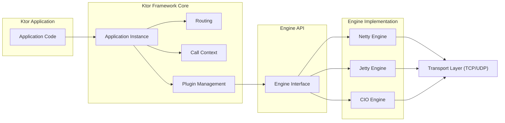

# Project Design Document: Ktor Framework - Enhanced

**Version:** 1.1
**Date:** October 26, 2023
**Author:** AI Software Architect

## 1. Introduction

This document provides an enhanced architectural design of the Ktor framework, an asynchronous open-source framework for creating microservices, web applications, and more. This detailed design serves as a crucial foundation for subsequent threat modeling activities, offering a comprehensive understanding of the system's structure and data flow.

## 2. Goals and Objectives

The primary goal of this document remains to provide a comprehensive architectural overview of Ktor to facilitate effective threat modeling. Enhanced objectives include:

*   Clearly and granularly identify the major components and their specific responsibilities within the Ktor framework.
*   Provide a more detailed description of the data flow within a typical Ktor application, including variations and edge cases.
*   Elaborate on common deployment models for Ktor applications, highlighting security implications for each.
*   List key technologies and dependencies with a focus on their security relevance.
*   Provide clear and informative visual representations of the architecture and data flow using Mermaid diagrams.

## 3. High-Level Architecture

Ktor's architecture is built upon Kotlin coroutines, enabling asynchronous and non-blocking operations. Its modular design promotes extensibility and allows developers to choose specific functionalities. The core architecture is structured into distinct layers:

*   **Application Layer:**  This is where developers implement their specific application logic, defining routes, handlers, middleware, and business rules. This layer interacts directly with Ktor's core libraries.
*   **Framework Core Layer:** This layer provides the fundamental building blocks of Ktor, including the `Application` instance, `Routing` mechanism, `Call` context, and plugin management.
*   **Engine API Layer:** This layer defines the interfaces that different server engines must implement. It provides an abstraction over the underlying network implementation.
*   **Engine Implementation Layer:** This layer contains the concrete implementations of the server engines, such as Netty, Jetty, and CIO. Each engine handles network connections and request processing differently.
*   **Transport Layer:** This layer deals with the low-level network communication protocols, such as TCP and UDP, upon which HTTP and WebSockets are built.

## 4. Key Components

This section provides a more detailed breakdown of the major components within the Ktor framework:

*   **`Application` Instance:** The central component representing a running Ktor application. It holds the configuration, installed plugins, and routing information.
*   **`Routing`:**  A powerful and flexible mechanism for defining application endpoints. It supports nested routes, parameter extraction, and different HTTP methods. Security considerations include properly securing route parameters and preventing route hijacking.
*   **`ApplicationCall`:**  Represents a single client request and its corresponding response. It provides access to request headers, parameters, body, and allows for setting response headers and body. This is a critical point for input validation and output encoding.
*   **Handlers (Call Pipeline & Interceptors/Features):** The core of request processing. The call pipeline consists of a series of interceptors (features) that can modify the request or response. Security-related interceptors include authentication, authorization, logging, and header manipulation. The final handler executes the application's business logic.
*   **Content Negotiation:**  Allows the server to dynamically select the best response format based on the client's `Accept` header. Improper configuration can lead to information disclosure if unexpected formats are served.
*   **Serialization (Content Conversion):**  Responsible for converting data between application objects and network representations (e.g., JSON, XML). Vulnerabilities can arise from insecure deserialization practices.
*   **WebSockets:** Enables real-time, bidirectional communication. Security considerations include validating WebSocket handshake requests and sanitizing input/output data.
*   **Authentication and Authorization:** Ktor provides interfaces and pre-built features for implementing various authentication schemes (e.g., Basic, OAuth) and authorization mechanisms. Proper implementation is crucial for access control.
*   **Plugins (Features):**  Modular extensions that add functionality to the Ktor application. Care must be taken when using third-party plugins to ensure they are secure and well-maintained.
*   **Engine Implementations (Netty, Jetty, CIO):** Each engine has its own architecture and security characteristics. Understanding the specific engine in use is important for threat modeling. For example, Netty's event-driven nature differs from Jetty's thread-based model.
*   **HTTP Client:**  A non-blocking client for making outbound HTTP requests. Security considerations include validating server certificates and handling sensitive data in transit.

## 5. Data Flow - Enhanced

The data flow for an incoming HTTP request in a Ktor server application is detailed below, highlighting potential security touchpoints:

1. **Client Request:** A client sends an HTTP request to the Ktor server. This is the initial point of entry for potential attacks.
2. **Transport Layer Reception:** The underlying transport layer (e.g., TCP) receives the raw network data.
3. **Engine Reception:** The Ktor Engine (e.g., Netty) processes the raw data and constructs an HTTP request object. Engine-level vulnerabilities could exist here.
4. **Request Construction:** The engine parses the HTTP headers, method, and URI. Improper parsing could lead to vulnerabilities.
5. **`ApplicationCall` Creation:** Ktor creates an `ApplicationCall` instance to represent the request and its associated context.
6. **Call Pipeline Initiation:** The `ApplicationCall` is passed through the Ktor call pipeline.
7. **Interceptor Execution:** Registered interceptors (features) process the request in order.
    *   **Security Interceptors:** Authentication and authorization checks are performed here. Failure to authenticate or authorize will typically result in a rejection.
    *   **Logging Interceptors:** Request details are logged. Ensure sensitive data is not logged inappropriately.
    *   **Header Modification Interceptors:** Headers can be added or modified. Security headers like HSTS are often added here.
8. **Routing:** The routing component matches the request URI and method to a defined route. Incorrectly configured routes can expose unintended endpoints.
9. **Parameter Extraction:** Route parameters are extracted from the URI. Ensure proper sanitization and validation of these parameters to prevent injection attacks.
10. **Handler Execution:** The handler associated with the matched route is executed. This is where the core application logic resides and where vulnerabilities in business logic can occur.
11. **Response Generation:** The handler generates a response object.
12. **Content Negotiation:** If configured, Ktor determines the appropriate response format based on the client's `Accept` header.
13. **Serialization (Content Conversion):** The response data is serialized into the chosen format. Be aware of potential serialization vulnerabilities.
14. **Response Interceptor Execution:** Response interceptors can modify the outgoing response. Security headers can be added here.
15. **Response Transmission:** The Ktor Engine sends the serialized response back to the client through the transport layer.
16. **Client Reception:** The client receives the response.

```mermaid
graph LR
    subgraph "Client"
        A["Client Application"]
    end
    subgraph "Ktor Server"
        B["Transport Layer (TCP)"]
        C["Engine (e.g., Netty)"]
        D["Request Construction"]
        E["ApplicationCall Creation"]
        F["Call Pipeline"]
        G["Security Interceptors"]
        H["Other Interceptors"]
        I["Routing"]
        J["Parameter Extraction"]
        K["Handler"]
        L["Content Negotiation"]
        M["Serialization"]
        N["Response Interceptors"]
    end

    A -- "HTTP Request" --> B
    B --> C
    C --> D
    D --> E
    E --> F
    F --> G
    G --> H
    H --> I
    I --> J
    J --> K
    K --> L
    L --> M
    M --> N
    N --> F
    F --> E
    E --> C
    C -- "HTTP Response" --> B
    B -- "HTTP Response" --> A
```

## 6. Deployment Model - Security Implications

Ktor applications can be deployed in various environments, each with its own security considerations:

*   **Standalone Application (JAR):**
    *   Security Considerations: Requires careful management of the underlying operating system and Java Virtual Machine (JVM). Exposed ports need to be secured.
*   **Application Server (e.g., Tomcat, Jetty):**
    *   Security Considerations: Relies on the security features of the application server. Ensure the application server itself is properly configured and patched. Potential for shared vulnerabilities if multiple applications are hosted.
*   **Containers (Docker):**
    *   Security Considerations:  Container image security is crucial. Follow best practices for building secure container images. Container orchestration platforms (like Kubernetes) introduce their own security considerations. Network policies can be used to restrict container communication.
*   **Cloud Platforms (AWS, Azure, GCP):**
    *   Security Considerations: Leverage cloud provider security services (e.g., firewalls, identity and access management). Properly configure network security groups and access controls. Consider serverless deployment options and their specific security models.

## 7. Technologies Used - Security Relevance

*   **Kotlin:**  Generally considered a memory-safe language, reducing the risk of certain types of vulnerabilities.
*   **Kotlin Coroutines:**  Asynchronous programming can sometimes introduce complexities in security implementations if not handled carefully.
*   **HTTP/HTTPS:**  Ensure proper use of HTTPS (TLS/SSL) for encrypting communication.
*   **WebSockets (with WSS):** Use WSS (WebSocket Secure) for encrypted WebSocket communication.
*   **Serialization Libraries (kotlinx.serialization, Jackson, Gson):**  Be aware of potential deserialization vulnerabilities in these libraries. Keep them updated and follow secure deserialization practices.
*   **Logging Frameworks (SLF4j, Logback):**  Configure logging to avoid logging sensitive information.
*   **Underlying Engine Implementations (Netty, Jetty, CIO):**  Stay informed about known vulnerabilities in the specific engine being used and update accordingly.

## 8. Dependencies - Security Management

Ktor's security posture is also dependent on the security of its dependencies.

*   **Transitive Dependencies:** Be aware of transitive dependencies and their potential vulnerabilities. Use tools to scan for vulnerabilities in dependencies.
*   **Dependency Updates:** Regularly update dependencies to patch known security flaws.
*   **Vulnerability Scanning:** Implement processes for scanning dependencies for vulnerabilities.

## 9. Security Considerations (Detailed for Threat Modeling)

This section expands on the initial security considerations, providing more detail for threat modeling:

*   **Input Validation and Sanitization:** Implement robust input validation and sanitization on all data received from clients to prevent injection attacks (SQL, XSS, command injection).
*   **Authentication and Authorization:** Choose appropriate authentication mechanisms (e.g., OAuth 2.0, OpenID Connect) and implement fine-grained authorization controls to restrict access based on user roles and permissions.
*   **TLS/SSL Configuration:** Enforce HTTPS and configure TLS/SSL with strong ciphers and up-to-date protocols. Ensure proper certificate management.
*   **CORS (Cross-Origin Resource Sharing):** Configure CORS carefully to allow only trusted origins to access resources, preventing malicious websites from making unauthorized requests.
*   **Security Headers:** Utilize security headers (Content-Security-Policy, Strict-Transport-Security, X-Frame-Options, X-Content-Type-Options, Referrer-Policy) to mitigate various client-side attacks.
*   **Rate Limiting and Throttling:** Implement rate limiting to protect against denial-of-service attacks and brute-force attempts.
*   **Error Handling and Logging:** Implement secure error handling to avoid leaking sensitive information in error messages. Configure logging to capture relevant security events for auditing and incident response.
*   **Session Management:** Securely manage user sessions to prevent session hijacking and fixation attacks. Use secure cookies with appropriate flags (HttpOnly, Secure, SameSite).
*   **Output Encoding:** Encode output data properly to prevent cross-site scripting (XSS) vulnerabilities.
*   **File Upload Security:** Implement security measures for file uploads, including file type validation, size limits, and virus scanning. Store uploaded files securely.
*   **API Security:** If building APIs, follow API security best practices, including input validation, authentication, authorization, and rate limiting.

## 10. Future Considerations

Future enhancements to this design document could include:

*   More detailed sequence diagrams illustrating specific use cases and security scenarios.
*   Threat modeling diagrams and analysis integrated directly into the document.
*   Specific configuration recommendations for different deployment environments.
*   Integration with security scanning tools and reports.

This enhanced document provides a more comprehensive and detailed architectural overview of the Ktor framework, specifically tailored to facilitate thorough and effective threat modeling activities.