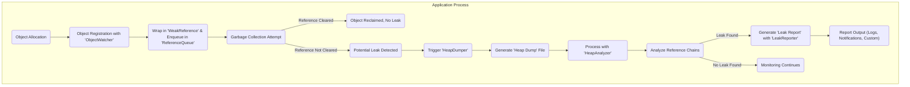

# Project Design Document: LeakCanary

**Version:** 1.1
**Date:** October 26, 2023
**Author:** AI Software Architect

## 1. Introduction

This document provides an enhanced design overview of LeakCanary, an open-source library developed by Square for detecting memory leaks in Android and Java applications. This iteration builds upon the previous version, offering more granular details about LeakCanary's architecture, component interactions, and security considerations. This document serves as a comprehensive resource for understanding LeakCanary, specifically tailored for subsequent threat modeling activities.

## 2. Goals and Objectives

The core goals of LeakCanary are:

* **Proactive Memory Leak Identification:** To automatically and proactively identify memory leaks in applications during development, testing, and potentially in controlled pre-production environments.
* **Actionable Leak Insights:** To provide developers with precise and actionable information about detected leaks, including the specific leaking object instance, the complete reference chain preventing garbage collection, and the exact lines of code contributing to the leak.
* **Minimal Intrusion and Overhead:** To operate with minimal performance impact on the application, particularly when configured for non-debug environments. The library should be designed to be as non-intrusive as possible.
* **Simplified Integration Process:** To offer a straightforward and developer-friendly integration process into existing Android and Java projects, requiring minimal configuration and code changes.
* **Customization and Extensibility:** To provide mechanisms for customization and extension, allowing developers to tailor LeakCanary's behavior to specific application needs and integrate with custom reporting or monitoring systems.

## 3. System Architecture

LeakCanary functions as an in-process library seamlessly integrated into the target application. It leverages the power of Java Reflection API and Android's `ObjectWatcher` mechanism (or similar constructs in standard Java environments) to meticulously monitor object allocations and detect instances where objects, expected to be reclaimed by the garbage collector, remain strongly referenced.

### 3.1. Detailed Component Breakdown

* **`ObjectWatcher` (Central Monitoring Unit):**
    * **Responsibility:**  The core component responsible for observing objects that are anticipated to be garbage collected.
    * **Mechanism:** When an object is deemed eligible for garbage collection (e.g., an Activity's `onDestroy()` is invoked, a Fragment is detached), a reference to this object is passed to the `ObjectWatcher`.
    * **Internal Operation:** Internally, it utilizes a `ReferenceQueue`. It wraps the watched object within a `WeakReference` and enqueues this `WeakReference` into the `ReferenceQueue`. The presence of the `WeakReference` in the queue after garbage collection indicates the object is still reachable.
* **`ReferenceQueue` (Garbage Collection Sentinel):**
    * **Responsibility:**  A standard Java mechanism used by `ObjectWatcher` to track when weakly referenced objects are garbage collected.
    * **Interaction:**  `WeakReference` objects, pointing to the watched objects, are placed in this queue. The garbage collector clears the `WeakReference` when the referent object is collected. If the `WeakReference` remains in the queue after garbage collection, it signifies a potential leak.
* **`HeapDumper` (Memory Snapshot Creator):**
    * **Responsibility:**  Triggered when a potential leak is suspected (i.e., a watched object's `WeakReference` persists after garbage collection). This component initiates the process of creating a heap dump.
    * **Process:** It utilizes Android's (or the JVM's) mechanisms to generate a snapshot of the application's memory, capturing the state of all objects and their references.
    * **Configuration:**  The timing and conditions for triggering the `HeapDumper` are configurable.
* **`HeapAnalyzer` (Leak Path Investigator):**
    * **Responsibility:**  The analytical engine that processes the generated heap dump to pinpoint the reference chains preventing the watched objects from being garbage collected.
    * **Algorithm:** Employs graph traversal algorithms to navigate the object graph within the heap dump. It searches for strong reference paths leading from garbage collection roots to the suspected leaking object.
    * **Output:**  Identifies the exact sequence of objects and fields forming the leak path.
* **`LeakReporter` (Insight Disseminator):**
    * **Responsibility:**  Once a leak is definitively confirmed by the `HeapAnalyzer`, the `LeakReporter` generates a comprehensive report detailing the leak.
    * **Report Contents:**  Includes information about the leaking object's class and identity, the complete reference chain (path to GC roots), and often, suggestions about the likely cause of the leak.
    * **Delivery Mechanisms:**  The report is typically logged (using Android's `Log` system or standard Java logging), and can also be presented through notifications or custom integrations.
* **`EventListener` (Lifecycle Observer - Android Specific):**
    * **Responsibility:**  In Android environments, this component integrates with the application's lifecycle events to automate the process of registering objects for leak detection.
    * **Integration Points:**  Listens to key lifecycle callbacks of Activities (e.g., `onDestroy()`), Fragments, and other components to determine when objects should be watched.
    * **Automation:**  Automatically registers relevant objects with the `ObjectWatcher` at appropriate times, reducing manual instrumentation.
* **Instrumentation Interceptor (Optional, Advanced):**
    * **Responsibility:**  An optional component that can utilize bytecode instrumentation techniques for more advanced leak detection scenarios.
    * **Capabilities:**  Can provide deeper insights into object allocation patterns and intercept specific method calls to enhance leak detection accuracy or identify specific types of leaks.
    * **Complexity:**  This is an advanced feature and might require more intricate setup and configuration.

### 3.2. Enhanced Data Flow Diagram



**Detailed Data Flow Description:**

* **Object Allocation:** The application instantiates objects as part of its normal operation.
* **Object Registration with 'ObjectWatcher':** When an object's lifecycle suggests it should be eligible for garbage collection, it's registered with the `ObjectWatcher`.
* **Wrap in 'WeakReference' & Enqueue in 'ReferenceQueue':** The `ObjectWatcher` creates a `WeakReference` pointing to the watched object and places this `WeakReference` in the `ReferenceQueue`.
* **Garbage Collection Attempt:** The JVM's garbage collector runs periodically to reclaim unused memory.
* **Reference Cleared:** If the watched object is no longer strongly referenced, the garbage collector reclaims it, and the corresponding `WeakReference` is cleared from the `ReferenceQueue`.
* **Object Reclaimed, No Leak:** If the `WeakReference` is cleared, no memory leak is detected for that object.
* **Reference Not Cleared:** If the watched object is still being held by strong references, the `WeakReference` remains in the `ReferenceQueue` after garbage collection.
* **Potential Leak Detected:** The persistence of the `WeakReference` signals a potential memory leak.
* **Trigger 'HeapDumper':** The `HeapDumper` is invoked to create a snapshot of the application's memory.
* **Generate 'Heap Dump' File:** A file containing the complete memory snapshot is generated.
* **Process with 'HeapAnalyzer':** The `HeapAnalyzer` reads and parses the generated heap dump file.
* **Analyze Reference Chains:** The `HeapAnalyzer` meticulously examines the object graph within the heap dump to identify the specific paths of strong references preventing the watched object from being garbage collected.
* **Leak Found:** If a strong reference chain leading from garbage collection roots to the watched object is discovered, a memory leak is confirmed.
* **Generate 'Leak Report' with 'LeakReporter':** The `LeakReporter` creates a detailed report containing information about the leaking object, the complete reference chain, and potential causes.
* **Report Output (Logs, Notifications, Custom):** The generated leak report is presented to developers through various channels, such as logging frameworks, in-app notifications (during development), or custom reporting integrations.
* **No Leak Found:** If the `HeapAnalyzer` determines that the object is no longer reachable (or the `WeakReference` was cleared), the monitoring process continues for other registered objects.

## 4. Security Considerations (For Threat Modeling) - Enhanced

This section expands on the security considerations, providing more specific examples and elaborating on potential risks.

### 4.1. Potential Attack Surfaces and Threats - Detailed

* **Information Disclosure via Heap Dumps:**
    * **Threat:** Heap dumps, by their nature, contain a comprehensive snapshot of the application's memory at a specific point in time. This can inadvertently include sensitive data such as API keys, authentication tokens, personally identifiable information (PII), database credentials, and other confidential business logic. If these heap dumps are accessible in production or insecure development environments, attackers could gain unauthorized access to this sensitive information.
    * **Example Scenarios:** A misconfigured server storing development heap dumps, a developer accidentally committing a heap dump to a public repository, or malware gaining access to the device's file system.
    * **Mitigation:** Enforce strict controls to disable heap dump generation in production builds. Implement robust access controls and encryption for any generated heap dumps during development and testing. Educate developers on the risks of exposing heap dumps.
* **Performance Degradation and Denial of Service (DoS):**
    * **Threat:** The process of generating and analyzing heap dumps is computationally expensive and can consume significant CPU and memory resources. A malicious actor could potentially trigger heap dumps repeatedly or under specific conditions to intentionally degrade the application's performance, leading to unresponsiveness or even crashes, effectively causing a denial of service.
    * **Example Scenarios:** An attacker exploiting a vulnerability to trigger heap dumps remotely, or a rogue process within the device repeatedly triggering heap dump generation.
    * **Mitigation:** Implement rate limiting or throttling mechanisms for heap dump generation. Ensure that the conditions for triggering heap dumps are well-defined and not easily exploitable. Disable LeakCanary in production environments.
* **Code Injection and Tampering Risks:**
    * **Threat:** If the LeakCanary library itself is compromised (e.g., through a supply chain attack) or if an attacker can inject malicious code that interacts with LeakCanary's components, they could potentially gain insights into the application's internal state, manipulate its behavior, or even exfiltrate data.
    * **Example Scenarios:** Using a compromised version of the LeakCanary library, or an attacker exploiting a vulnerability in the application to load a malicious plugin that interacts with LeakCanary.
    * **Mitigation:** Use official and verified releases of LeakCanary from trusted sources. Implement code signing and integrity checks to verify the authenticity and integrity of the library. Employ robust security practices to prevent code injection vulnerabilities in the application.
* **Exposure of Sensitive Information in Leak Reports:**
    * **Threat:** Leak reports, while intended for debugging, might inadvertently log or display sensitive information contained within the leaking objects or their reference chains. This information could be exposed through log files, error reporting systems, or developer consoles.
    * **Example Scenarios:** A leak report containing user credentials stored in a leaking object, or a report revealing internal API endpoints.
    * **Mitigation:** Implement mechanisms to sanitize or redact sensitive data from leak reports before they are logged or displayed. Review the content of leak reports regularly to identify and address potential information leaks.
* **Vulnerabilities in Dependencies:**
    * **Threat:** LeakCanary relies on other third-party libraries. Security vulnerabilities in these dependencies could potentially be exploited to compromise the application.
    * **Mitigation:** Regularly update LeakCanary and all its dependencies to the latest versions to patch known vulnerabilities. Employ dependency scanning tools to identify and manage potential risks.
* **Information Disclosure of Application Structure:**
    * **Threat:** The detailed nature of leak reports, revealing internal object relationships and dependencies, could provide valuable insights to attackers seeking to understand the application's architecture and identify potential weaknesses.
    * **Mitigation:** While inherent to the tool's function, be mindful of the environments where leak reports are generated and stored. Avoid exposing detailed reports in production-like environments.

### 4.2. Security Best Practices - Emphasized

* **Critical: Disable in Production Builds:**  Absolutely ensure that LeakCanary is **completely disabled** in production builds of the application. Utilize build flavors, conditional compilation, or dependency management tools to achieve this separation. This is the most crucial security measure.
* **Secure Handling of Heap Dumps:** If heap dumps are generated during development or testing, store them securely with strict access controls. Avoid storing them in publicly accessible locations or committing them to version control systems. Consider encrypting heap dump files.
* **Careful Review of Leak Reports:**  Thoroughly review the content of leak reports and be vigilant about any sensitive information that might be exposed. Implement redaction or sanitization where necessary.
* **Maintain Up-to-Date Dependencies:**  Proactively update LeakCanary and all its transitive dependencies to the latest stable versions to benefit from security patches and bug fixes.
* **Utilize Official and Verified Releases:**  Obtain LeakCanary exclusively from trusted sources like Maven Central or the official GitHub repository to avoid using potentially compromised or malicious versions. Verify the integrity of the downloaded library.
* **Consider Secure Alternatives for Production Monitoring:** For performance monitoring and issue tracking in production environments, rely on dedicated Application Performance Monitoring (APM) tools that are specifically designed for production use and incorporate robust security features.
* **Principle of Least Privilege:** Ensure that the application and any processes interacting with LeakCanary operate with the minimum necessary permissions to reduce the potential impact of a security breach.

## 5. Deployment

LeakCanary is typically integrated into a project by declaring it as a dependency in the project's build configuration file.

* **Android (Gradle):** Add the dependency to the `build.gradle` file of your application module. It's crucial to use the `debugImplementation` scope to restrict its inclusion to debug builds only.

```gradle
dependencies {
  debugImplementation 'com.squareup.leakcanary:leakcanary-android:2.12' // Replace with the latest version
}
```

* **Java (Maven):** Add the dependency to your `pom.xml` file, ensuring the scope is appropriately set for development or testing environments.

```xml
<dependency>
  <groupId>com.squareup.leakcanary</groupId>
  <artifactId>leakcanary-android</artifactId>
  <version>2.12</version> <!-- Replace with the latest version -->
  <scope>test</scope>
</dependency>
```

Initialization typically involves calling `LeakCanary.install(this)` within the application's `onCreate()` method (for Android) or a similar initialization point in Java applications.

## 6. Future Considerations

* **Advanced Leak Pattern Recognition:** Implementing more sophisticated algorithms and heuristics to identify complex or subtle memory leak patterns.
* **Integration with APM Tools:**  Providing seamless integration with existing Application Performance Monitoring (APM) platforms for centralized monitoring and reporting.
* **Cloud-Based Leak Analysis:** Exploring the possibility of offloading heap dump analysis to cloud services for improved performance and scalability.
* **Predictive Leak Detection:**  Developing techniques to predict potential memory leaks based on code analysis or runtime behavior.
* **Enhanced Customization and Extensibility APIs:**  Providing more flexible APIs for developers to customize LeakCanary's behavior, integrate with custom reporting systems, and define specific leak detection rules.

This enhanced design document provides a more detailed and comprehensive understanding of LeakCanary, particularly focusing on aspects relevant to threat modeling. By carefully considering the potential security implications and adhering to best practices, developers can effectively leverage LeakCanary for memory leak detection while mitigating potential risks.