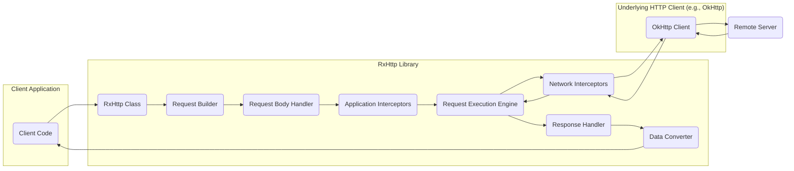

# Project Design Document: RxHttp Library

**Version:** 1.1
**Date:** October 26, 2023
**Prepared By:** Gemini (AI Language Model)

## 1. Introduction

This document provides an enhanced design overview of the RxHttp library, as found in the GitHub repository [https://github.com/liujingxing/rxhttp](https://github.com/liujingxing/rxhttp). This iteration builds upon the previous version, providing more detailed insights into the library's architecture, component interactions, and data flow, specifically tailored for effective threat modeling. The focus remains on the core functionalities and design principles relevant to security considerations.

## 2. Goals

The primary goals of the RxHttp library are to:

* Simplify the process of making HTTP requests within Android and Java applications.
* Seamlessly integrate with the reactive programming paradigm offered by RxJava.
* Offer a fluent and intuitive Application Programming Interface (API) for constructing and executing network requests.
* Provide comprehensive support for standard HTTP methods (GET, POST, PUT, DELETE, PATCH, etc.).
* Facilitate the serialization and deserialization of request and response data.
* Equip developers with features such as request cancellation, progress monitoring for uploads and downloads, and caching mechanisms.
* Abstract the underlying complexities associated with low-level HTTP client implementations.

## 3. Scope

This design document encompasses the core architecture and functionalities of the RxHttp library, derived from its public interface, common usage patterns, and a deeper analysis of its components. It includes:

* A detailed breakdown of key components and their interactions, emphasizing data flow and potential security implications.
* A comprehensive depiction of the typical data flow involved in making HTTP requests, highlighting potential attack surfaces.
* In-depth security considerations based on the architectural design and component responsibilities.

This document explicitly excludes:

* The intricate internal implementation details of the underlying HTTP client library (e.g., OkHttp), focusing instead on its interaction with RxHttp.
* Highly granular error handling strategies within the library, beyond the general mechanisms for reporting failures.
* Specific performance optimization techniques implemented within the library.
* Detailed, line-by-line code-level implementation specifics.

## 4. Architecture Overview

RxHttp acts as an abstraction layer built on top of a robust HTTP client (commonly OkHttp). It presents a reactive, high-level interface for managing network communications. The fundamental principle involves constructing requests using a user-friendly, fluent API and executing them as reactive streams (RxJava Observables or Singles).

The architecture can be conceptually divided into the following layers:

* **Client Application Layer:** The application code that directly interacts with and utilizes the RxHttp library to perform network operations.
* **RxHttp API Layer:** The public-facing interface of the library, exposing methods and classes for creating, configuring, and executing HTTP requests. This layer defines how developers interact with the library.
* **Request Construction Layer:** Components responsible for building and configuring HTTP requests based on the provided API. This includes setting headers, query parameters, request bodies, and other request attributes.
* **Request Processing and Interception Layer:**  This layer handles the preparation of the request for execution and allows for interception and modification of requests and responses.
* **HTTP Client Interaction Layer:** The part of the library that interfaces directly with the underlying HTTP client to execute the network request.
* **Response Processing Layer:** Components dedicated to handling the raw HTTP response received from the server, including status code checks, header processing, and data deserialization.
* **Data Conversion Layer:** Responsible for converting data between different formats (e.g., JSON, XML, form data) for both requests and responses.
* **Underlying HTTP Client Layer:** The actual HTTP client library (e.g., OkHttp) responsible for the low-level network communication.

## 5. Detailed Component Description

* **`RxHttp` Class:**
    * Serves as the primary entry point for utilizing the library's functionalities.
    * Offers static methods to initiate the request building process.
    * Facilitates the configuration of global settings for the underlying HTTP client, such as base URLs, connection and read timeouts, and SSL/TLS configurations.

* **Request Builder Interfaces (e.g., `Get`, `Post`, `Put`, `Delete`, `Patch`):**
    * Provide a fluent and chainable API for configuring specific aspects of an HTTP request.
    * Allow setting request parameters (query parameters, form data), headers, and request bodies.
    * Enable the specification of the target request Uniform Resource Locator (URL) and path parameters.
    * Offer specialized options for handling file uploads and downloads, including progress monitoring.

* **Request Body Handling Components:**
    * Responsible for serializing request data into the appropriate format based on the `Content-Type` header (e.g., JSON, XML, form URL-encoded).
    * Supports various content types and allows for custom serialization implementations.

* **Call Execution Methods (`executeXXX()`, `asXXX()`):**
    * Methods that trigger the actual execution of the configured HTTP request.
    * Return RxJava `Observable`, `Single`, or other reactive types that emit the response or handle errors.
    * Manage the asynchronous execution of the network request, preventing blocking of the main thread.

* **Response Handling and Conversion Components:**
    * Responsible for processing the raw HTTP response received from the server.
    * Perform checks on the HTTP status code to determine success or failure.
    * Deserialize the response body into Java/Kotlin objects using configured converters (e.g., Gson, Jackson, Moshi).
    * Handle potential errors encountered during the response processing, such as network issues or deserialization failures.

* **Interceptors (Application and Network):**
    * Provide a mechanism to intercept and modify HTTP requests before they are sent and responses before they are received.
    * Application interceptors operate closer to the application code, while network interceptors operate closer to the underlying network layer.
    * Can be used for various purposes, including logging, authentication token injection, caching, and request/response modification. **Crucially, these represent a point where custom logic can introduce both security benefits and vulnerabilities.**

* **Error Handling Mechanisms:**
    * Provide structured ways to handle different types of errors that can occur during the request lifecycle, such as network connectivity issues, HTTP errors (4xx, 5xx status codes), and data processing errors.
    * Typically leverage RxJava's error handling operators (e.g., `onErrorReturn`, `retry`).

* **Caching Mechanisms:**
    * May offer built-in caching functionalities or integration points with external caching libraries to improve performance and reduce network traffic.
    * Caching behavior can be configured through headers and library settings.

## 6. Data Flow Diagram

**Detailed Data Flow Description:**

1. The **"Client Code"** initiates an HTTP request using the **"RxHttp Class"**.
2. The **"RxHttp Class"** provides access to specific **"Request Builder"** components (e.g., `Get`, `Post`).
3. The **"Request Builder"** constructs the HTTP request object, including setting headers, parameters, and invoking the **"Request Body Handler"** if a request body is required.
4. The **"Request Body Handler"** serializes the request data into the appropriate format (e.g., JSON).
5. **"Application Interceptors"** intercept the request, allowing for modifications or logging before it reaches the network layer.
6. The request is passed to the **"Request Execution Engine"**, which prepares it for transmission.
7. **"Network Interceptors"** intercept the request closer to the network level, potentially adding network-specific headers or performing other network-related operations.
8. The request is handed off to the **"OkHttp Client"** (or another configured HTTP client).
9. The **"OkHttp Client"** sends the HTTP request to the **"Remote Server"**.
10. The **"Remote Server"** processes the request and sends an HTTP response back to the **"OkHttp Client"**.
11. **"Network Interceptors"** intercept the response as it returns, allowing for inspection or modification.
12. The response is passed back to the **"Request Execution Engine"**.
13. **"Application Interceptors"** intercept the response, enabling application-level processing or modification.
14. The **"Response Handler"** processes the raw HTTP response, checking the status code and handling potential errors.
15. The **"Data Converter"** deserializes the response body into Java/Kotlin objects.
16. The processed response data is returned to the **"Client Code"**.

## 7. Security Considerations

Building upon the architectural understanding, the following security considerations are paramount:

* **Transport Layer Security (TLS/HTTPS):** RxHttp relies on the underlying HTTP client (e.g., OkHttp) for establishing secure connections using TLS/HTTPS. **Proper configuration of the underlying client is crucial to ensure data in transit is encrypted and protected from eavesdropping and manipulation.**
* **Input Validation and Output Encoding:** While RxHttp facilitates sending data, it does not inherently validate input data. **The responsibility for validating input to prevent injection attacks (e.g., SQL injection, XSS if rendering server responses) lies primarily with the client application *before* sending the request and the remote server upon receiving it.** Similarly, proper output encoding on the client-side when displaying data received from the server is essential to prevent XSS vulnerabilities.
* **Data Serialization and Deserialization Vulnerabilities:** RxHttp utilizes libraries like Gson, Jackson, or Moshi for data conversion. **Vulnerabilities in these libraries or insecure configurations can lead to remote code execution or denial-of-service attacks if untrusted data is deserialized.** Keeping these libraries up-to-date is critical.
* **Dependency Management:** The security posture of RxHttp is directly influenced by the security of its dependencies, most notably the underlying HTTP client. **Vulnerabilities in these dependencies can be exploited through RxHttp.** Regular dependency updates and security audits are necessary.
* **Interceptors: A Double-Edged Sword:** Interceptors offer powerful capabilities but can introduce security risks if not implemented carefully. **Malicious or poorly written interceptors could leak sensitive information (e.g., authentication tokens), modify requests in unintended ways, or introduce vulnerabilities.** Secure coding practices and thorough review are essential for custom interceptors.
* **Certificate Pinning:** RxHttp, through its underlying HTTP client, can implement certificate pinning to prevent man-in-the-middle attacks by ensuring that the server's certificate matches an expected certificate. **Correct implementation and management of pinned certificates are crucial.**
* **Secure Credential Handling:** RxHttp itself does not manage credentials, but applications using it often need to handle authentication. **Storing credentials securely (e.g., using the Android Keystore) and avoiding hardcoding them are critical security practices.**
* **Rate Limiting and Denial of Service (DoS) Prevention:** While RxHttp doesn't inherently provide rate limiting, applications using it should consider implementing mechanisms to prevent abuse and DoS attacks by limiting the number of requests sent to a server within a specific timeframe. This is often implemented on the server-side as well.
* **HTTP Header Security:** Pay attention to security-related HTTP headers (e.g., `Content-Security-Policy`, `Strict-Transport-Security`, `X-Frame-Options`) that might be set by the server. RxHttp facilitates receiving and processing these headers, and the application should respect and act upon them appropriately.

## 8. Deployment Considerations

RxHttp is typically deployed as a library embedded within Android or Java applications. Security considerations during deployment include:

* **Keeping the Library and Dependencies Up-to-Date:** Regularly updating RxHttp and all its dependencies is crucial to patch known security vulnerabilities.
* **Secure Build Pipeline:** Ensuring the application's build process is secure and free from malicious modifications that could compromise the RxHttp library or its configuration.
* **Proper Configuration for the Environment:** Configuring the underlying HTTP client (e.g., timeouts, SSL settings, proxy configurations) appropriately for the specific deployment environment.
* **Code Obfuscation (ProGuard/R8):** Using code obfuscation tools can make it more difficult for attackers to reverse engineer the application and understand how RxHttp is being used, although it's not a foolproof security measure.

## 9. Assumptions

This design document is based on the following assumptions:

* The information available in the public GitHub repository accurately reflects the current design and functionality of the RxHttp library.
* The library primarily utilizes OkHttp as its underlying HTTP client, although the general principles apply to other potential underlying clients.
* Developers using the library possess a fundamental understanding of HTTP protocols and reactive programming principles.

## 10. Out of Scope

The following aspects are explicitly outside the scope of this document:

* Detailed performance benchmarking and optimization strategies for the library.
* Specific code examples demonstrating the implementation of various features.
* A comprehensive comparison of RxHttp with other alternative HTTP client libraries.
* The internal implementation details of third-party libraries utilized by RxHttp, focusing primarily on their interaction with RxHttp.

This enhanced design document provides a more detailed and security-focused understanding of the RxHttp library, facilitating a more effective and comprehensive threat modeling process. By understanding the components, data flow, and potential security considerations, developers and security professionals can better identify and mitigate potential risks associated with using this library.