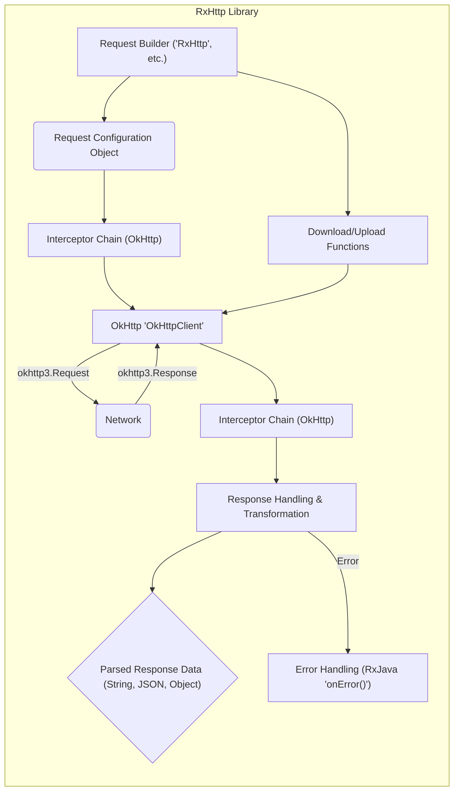

# Project Design Document: RxHttp Library

**Version:** 1.1
**Date:** October 26, 2023
**Author:** AI Software Architect

## 1. Introduction

This document provides an enhanced and more detailed design overview of the RxHttp library, as found in the GitHub repository [https://github.com/liujingxing/rxhttp](https://github.com/liujingxing/rxhttp). This revised document aims to provide an even clearer articulation of the library's architecture, components, and data flow, specifically tailored for comprehensive threat modeling activities.

## 2. Goals

*   Provide a comprehensive and granular architectural overview of the RxHttp library.
*   Identify key components and their specific interactions and responsibilities.
*   Describe the data flow within the library in detail during request processing, including data transformations.
*   Highlight potential areas of security concern with specific examples for future threat modeling.

## 3. Overview

RxHttp is an Android library built upon the robust foundation of OkHttp and the reactive capabilities of RxJava. It is designed to streamline and enhance the process of making HTTP requests within Android applications. The library offers a fluent and expressive API for constructing requests, managing responses, and handling asynchronous operations using Reactive Programming principles. Compared to directly utilizing OkHttp, RxHttp aims to provide a more concise, type-safe, and reactive approach to interacting with RESTful APIs and other HTTP endpoints.

## 4. Architectural Design

The RxHttp library's architecture is composed of several distinct yet interconnected components, each playing a crucial role in facilitating HTTP communication.

### 4.1. Key Components (Detailed)

*   **Request Builder (`RxHttp`, `RxHttpForm`, `RxHttpJsonParam`, etc.):** This set of classes provides a fluent and type-safe interface for constructing various types of HTTP requests. It allows developers to precisely define:
    *   **HTTP Method:** Specification of the HTTP verb (GET, POST, PUT, DELETE, PATCH, HEAD, OPTIONS).
    *   **URL Endpoint:** Definition of the target URL, potentially with path parameters.
    *   **Headers:** Custom headers to be included in the request.
    *   **Query Parameters:** Parameters appended to the URL.
    *   **Request Body:** Data to be sent in the request body, with specific builders for:
        *   Form data (`RxHttpForm`)
        *   JSON payloads (`RxHttpJsonParam`)
        *   Raw data (e.g., `RequestBody.create()`)
        *   Multipart form data for file uploads.
    *   **Request Type Configuration:** Setting content type and other request-related attributes.
    *   **Timeout Settings:** Configuration of connection and read timeouts.
    *   **Cache Directives:**  Instructions for caching behavior.
    *   **Progress Listeners:** For monitoring upload and download progress.
*   **Request Execution Core (`RealCall`, `Call`):** This component is responsible for the actual execution of the constructed HTTP request. It internally utilizes OkHttp's `OkHttpClient` and `Call` objects to perform the network communication. This involves:
    *   Building the `okhttp3.Request` object from the RxHttp request configuration.
    *   Delegating the network call to OkHttp.
    *   Handling network-level events and errors.
*   **Response Handling and Transformation (`await()`, `asString()`, `asJson()`, etc.):** This component processes the raw `okhttp3.Response` received from the server and transforms it into a usable format. Key functionalities include:
    *   **Status Code Handling:** Checking the HTTP status code to determine success or failure.
    *   **Response Body Extraction:** Accessing the raw response body as a stream or byte array.
    *   **Data Conversion:** Converting the response body to various data types:
        *   String
        *   JSON objects (using libraries like Gson or Jackson)
        *   Byte arrays
        *   Custom Java/Kotlin objects.
    *   **Error Handling:**  Wrapping OkHttp exceptions and providing RxJava error signals.
*   **Interceptor Integration (`Interceptor` interface):** RxHttp seamlessly integrates with OkHttp's interceptor mechanism, allowing for powerful request and response manipulation. Interceptors can be used for:
    *   **Request Modification:** Adding authentication tokens, logging request details, modifying headers.
    *   **Response Modification:** Logging response details, handling specific error codes, caching responses.
    *   **Custom Logic:** Implementing cross-cutting concerns related to network communication.
*   **Cache Management (Leveraging OkHttp's Cache):** RxHttp relies on OkHttp's built-in caching capabilities for storing and retrieving HTTP responses. This component manages:
    *   **Cache Storage:**  Persisting responses based on cache directives.
    *   **Cache Retrieval:**  Serving cached responses to reduce network requests.
    *   **Cache Invalidation:**  Mechanisms for updating or removing cached responses.
*   **Error Handling and Propagation (RxJava's `onError()`):** This component manages errors that occur during the request process and propagates them through RxJava's error signaling mechanisms. It handles:
    *   **Network Errors:** Connection timeouts, DNS resolution failures, etc.
    *   **Server Errors:** HTTP 5xx status codes.
    *   **Parsing Errors:** Issues encountered while converting the response body.
    *   **Custom Exceptions:**  Exceptions thrown by interceptors or custom logic.
*   **Download and Upload Functionality (`download()`, `uploadFile()`):**  Specialized functions for handling large file transfers, including:
    *   **Progress Reporting:** Providing updates on the download or upload progress.
    *   **Chunking (for uploads):**  Breaking large files into smaller chunks for efficient transfer.
    *   **Resumable Downloads:**  Potentially supporting the resumption of interrupted downloads.
*   **RxJava Integration (`Observable`, `Flowable`):**  A fundamental aspect of RxHttp is its use of RxJava to represent asynchronous operations. It returns `Observable` or `Flowable` instances for:
    *   Executing requests.
    *   Handling responses.
    *   Managing asynchronous data streams.

### 4.2. Component Interactions (Detailed)

## 5. Data Flow (Detailed)

The data flow within the RxHttp library for a typical HTTP request involves several distinct stages:

*   **Request Construction and Configuration:** The developer utilizes the `RequestBuilder` (e.g., `RxHttp.get()`, `RxHttpForm.post()`) to specify all aspects of the HTTP request. This results in an internal request configuration object containing details like URL, headers, body, etc.
*   **Request Interception (Outbound):** The request configuration object is passed through the configured OkHttp `Interceptor` chain. Each interceptor in the chain has the opportunity to inspect and modify the outgoing `okhttp3.Request` before it's sent to the network. This might involve adding authentication headers, logging details, or applying custom logic.
*   **Network Transmission (OkHttp):** The modified `okhttp3.Request` is handed over to OkHttp's `OkHttpClient`, which handles the actual network communication. This involves DNS resolution, establishing a connection, sending the request data, and receiving the response headers and body.
*   **Response Reception (OkHttp):**  OkHttp receives the raw `okhttp3.Response` from the server, including the status code, headers, and body (as a byte stream).
*   **Response Interception (Inbound):** The raw `okhttp3.Response` is passed through the OkHttp `Interceptor` chain again. Response interceptors can inspect and modify the incoming response before it's processed by RxHttp. This might involve logging response details, handling specific error codes, or modifying response headers.
*   **Response Handling and Transformation:** The `Response Handling` component takes the (potentially modified) `okhttp3.Response` and performs several operations:
    *   **Status Code Check:** The HTTP status code is evaluated to determine if the request was successful.
    *   **Body Extraction:** The response body (if present) is extracted as a byte stream.
    *   **Data Conversion:** Based on the method called by the developer (e.g., `asString()`, `asJson()`), the response body is converted to the desired data type using appropriate parsing mechanisms (e.g., UTF-8 decoding, JSON parsing).
    *   **Object Mapping:** If a specific object type is expected, the response body is mapped to an instance of that class using libraries like Gson or Jackson.
*   **Success or Error Emission (RxJava):**
    *   **On Success:** The successfully parsed or mapped response data is emitted as the next item in the `Observable` or `Flowable` stream.
    *   **On Error:** If an error occurred at any stage (network error, server error, parsing error, interceptor exception), an error signal is emitted through the `Observable` or `Flowable` using RxJava's `onError()` mechanism.

## 6. Security Considerations (Detailed with Examples)

The following areas represent potential security considerations for the RxHttp library and applications utilizing it. These should be thoroughly investigated during threat modeling.

*   **Data in Transit Security:**
    *   **Cleartext Communication (HTTP):** If RxHttp is used with HTTP URLs instead of HTTPS, all data transmitted (including sensitive information like credentials or personal data) is vulnerable to eavesdropping (e.g., man-in-the-middle attacks). **Example:** An attacker on a shared Wi-Fi network could intercept login credentials sent over HTTP.
    *   **Weak TLS Configuration:** The underlying OkHttp client's TLS configuration might support outdated or weak protocols and cipher suites, making connections susceptible to downgrade attacks. **Example:** An attacker could force the connection to use SSLv3, which has known vulnerabilities.
    *   **Certificate Pinning Issues:** If certificate pinning is implemented incorrectly or not at all, the application might trust fraudulent certificates issued by attackers. **Example:** An attacker could intercept traffic by presenting a rogue certificate for the target domain.
*   **Data at Rest Security (Caching):**
    *   **Sensitive Data in Cache:** If sensitive information is cached (e.g., API keys, authentication tokens), it could be exposed if the device is compromised (rooted, malware). **Example:** An attacker gaining physical access to a device could extract cached API keys.
    *   **Lack of Cache Expiration:**  If cache entries for sensitive data do not have appropriate expiration times, the data might persist longer than necessary, increasing the window of vulnerability. **Example:** Cached session tokens might remain valid even after the user has logged out.
    *   **Insecure Cache Storage:** The default cache storage location might not be adequately protected by the operating system. **Example:** Cached data might be accessible to other applications with sufficient permissions.
*   **Input Validation Vulnerabilities:**
    *   **URL Manipulation:**  If user-provided data is directly incorporated into URLs without proper validation, attackers could manipulate the URL to access unintended resources or perform unauthorized actions. **Example:** An attacker could modify a URL parameter to access another user's data.
    *   **Header Injection:** Improper handling of user input in request headers could lead to header injection attacks, potentially allowing attackers to manipulate server behavior or inject malicious content. **Example:** An attacker could inject a `Set-Cookie` header to hijack user sessions.
*   **Output Sanitization Issues:**
    *   **Displaying Unsanitized Responses:** If data received in the response body is displayed in a web view or other UI components without proper sanitization, it could lead to Cross-Site Scripting (XSS) vulnerabilities. **Example:** Malicious JavaScript code injected in a server response could be executed in the user's web view.
*   **Dependency Vulnerabilities:**
    *   **Outdated OkHttp or RxJava:** Using outdated versions of OkHttp or RxJava with known security vulnerabilities could expose the application to attacks. **Example:** A vulnerability in an older version of OkHttp could allow an attacker to bypass security checks.
*   **Interceptor-Related Risks:**
    *   **Malicious Interceptors:**  Developers might inadvertently introduce vulnerabilities through custom interceptors, such as logging sensitive information or modifying requests in an insecure way. **Example:** An interceptor might log authentication tokens to the device's logs.
    *   **Data Leakage in Interceptors:** Interceptors might unintentionally expose sensitive data through logging or other mechanisms. **Example:** An interceptor might log the entire request and response body, including sensitive personal data.
*   **Error Handling and Information Disclosure:**
    *   **Verbose Error Messages:**  Detailed error messages returned by the server or exposed by the library could reveal sensitive information about the server's internal workings or the application's logic. **Example:** An error message might reveal the exact database query being executed.
*   **Download/Upload Security Concerns:**
    *   **Path Traversal during Downloads:** If the application doesn't properly validate the file paths provided by the server during downloads, attackers could potentially overwrite arbitrary files on the device. **Example:** A malicious server could provide a file path like `/../../../../sdcard/important.txt` to overwrite a critical file.
    *   **Insecure Storage of Downloaded Files:** Downloaded files might be stored in insecure locations on the device, making them accessible to other applications. **Example:** Files downloaded to the public download directory might be accessible to any application.
    *   **Lack of Integrity Checks for Downloads:**  Without proper integrity checks (e.g., checksum verification), downloaded files could be tampered with during transit. **Example:** An attacker could intercept a file download and replace it with a malicious version.

## 7. Dependencies

The RxHttp library has the following key dependencies:

*   **OkHttp (com.squareup.okhttp3:okhttp):**  The underlying HTTP client library responsible for network communication.
*   **RxJava (io.reactivex.rxjava3:rxjava):**  For asynchronous and reactive programming paradigms.
*   **Potentially RxAndroid (io.reactivex.rxjava3:rxandroid):** For using RxJava components specifically within Android applications.
*   **JSON Parsing Libraries (e.g., com.google.code.gson:gson, com.fasterxml.jackson.core:jackson-databind):**  Depending on the specific features used for JSON serialization and deserialization.
*   **Logging Libraries (e.g., com.squareup.okhttp3:logging-interceptor):** For logging HTTP requests and responses (often used in development).

## 8. Deployment

The RxHttp library is deployed as a dependency within an Android application. Developers integrate the library by adding the appropriate dependency declarations to their project's `build.gradle` files. Once included, developers can utilize RxHttp's API within their application code to perform network operations.

## 9. Future Considerations

*   **Regular Security Audits and Penetration Testing:** Conducting periodic security audits and penetration testing specifically targeting RxHttp and applications using it is crucial for identifying and mitigating potential vulnerabilities.
*   **Secure Defaults and Best Practices Enforcement:**  Consider implementing secure default configurations (e.g., encouraging HTTPS usage) and providing mechanisms to enforce security best practices.
*   **Comprehensive Security Documentation and Guidance:**  Providing clear and detailed documentation on security considerations and best practices for using RxHttp securely is essential for developers. This should include guidance on topics like input validation, output sanitization, and secure caching.
*   **Static Analysis Security Testing (SAST) Integration:**  Encourage the use of SAST tools to automatically identify potential security flaws in code that utilizes RxHttp.
*   **Dynamic Analysis Security Testing (DAST) Guidance:** Provide guidance on how to perform DAST on applications using RxHttp to identify runtime vulnerabilities.

This enhanced design document provides a more granular and detailed understanding of the RxHttp library's architecture and data flow, making it even more suitable for comprehensive threat modeling activities. The expanded security considerations section offers specific examples of potential threats to guide the threat modeling process.