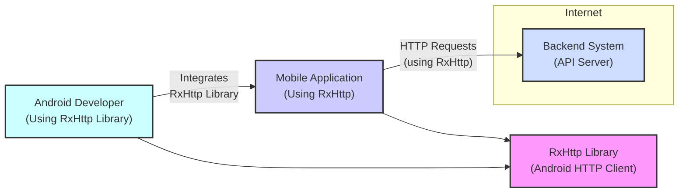

# BUSINESS POSTURE

This project, rxhttp, is an Android HTTP client library designed to simplify and enhance network requests in Android applications.

- Business Priorities and Goals:
  - Simplify network operations for Android developers.
  - Improve code readability and maintainability related to network requests.
  - Enhance developer productivity by providing a more intuitive and efficient HTTP client.
  - Potentially improve application performance by optimizing network interactions.

- Business Risks:
  - Vulnerabilities in the library could be exploited in applications using it, leading to data breaches or application compromise.
  - Improper use of the library by developers could introduce security weaknesses in applications.
  - Lack of updates or maintenance could lead to compatibility issues and unaddressed security flaws.
  - Dependency on this library could create supply chain risks if the library itself or its dependencies are compromised.

# SECURITY POSTURE

- Security Controls:
  - security control: HTTPS support for secure communication (implicitly provided by underlying Android HTTP stack). Implemented by default in Android network libraries.
  - security control: Input validation on parameters passed to the library (e.g., URLs). Implemented by developers using the library.
  - security control: Dependency management to ensure dependencies are up-to-date and free of known vulnerabilities. Responsibility of library maintainers and developers using the library.

- Accepted Risks:
  - accepted risk:  Vulnerabilities in underlying Android HTTP stack are accepted as they are managed by the Android platform.
  - accepted risk:  Improper usage of the library by developers leading to security issues in applications. This is mitigated by documentation and developer education.

- Recommended Security Controls:
  - security control: Implement automated security scanning (SAST/DAST) in the library's CI/CD pipeline to detect potential vulnerabilities.
  - security control: Regularly update dependencies and monitor for security advisories.
  - security control: Provide clear security guidelines and best practices in the library's documentation for developers.
  - security control: Consider code signing the library artifacts to ensure integrity and authenticity.

- Security Requirements:
  - Authentication: The library should support various authentication mechanisms (e.g., Basic Auth, Bearer tokens) commonly used in HTTP APIs.
  - Authorization: The library itself does not handle authorization, but it should facilitate the implementation of authorization in applications using it by correctly handling authorization headers and responses.
  - Input Validation: The library should perform basic input validation on URLs and other critical parameters to prevent common injection attacks. However, comprehensive input validation is the responsibility of the application using the library.
  - Cryptography: The library should rely on secure cryptographic protocols provided by the Android platform (e.g., TLS/SSL for HTTPS). It should not implement custom cryptography.

# DESIGN

## C4 CONTEXT



- Context Diagram Elements:
  - - Name: RxHttp Library
    - Type: Software System
    - Description: An Android library that simplifies HTTP requests for Android applications.
    - Responsibilities: Provides an API for making HTTP requests, handles request construction and response parsing, integrates with Android networking stack.
    - Security controls: Relies on underlying Android platform security controls for network communication (HTTPS).

  - - Name: Mobile Application
    - Type: Software System
    - Description: Android application that utilizes the RxHttp library to communicate with backend systems.
    - Responsibilities: Implements application logic, uses RxHttp to perform network requests, handles user interactions, manages application data.
    - Security controls: Application-level security controls, including authentication, authorization, input validation, data protection, and secure storage.

  - - Name: Backend System
    - Type: Software System
    - Description: API server that provides data and services to the mobile application.
    - Responsibilities: Handles business logic, data storage, user authentication and authorization, processes requests from mobile applications, and returns responses.
    - Security controls: Server-side security controls, including authentication, authorization, input validation, secure API design, and infrastructure security.

  - - Name: Android Developer
    - Type: Person
    - Description: Software developer who uses the RxHttp library to build Android applications.
    - Responsibilities: Integrates RxHttp into mobile applications, writes code to use RxHttp for network requests, ensures proper usage of the library.
    - Security controls: Secure coding practices, proper configuration and usage of RxHttp library, adherence to security guidelines.

## C4 CONTAINER

```mermaid
flowchart LR
    subgraph Android Device
        subgraph MobileAppContainer [Mobile Application\n(Container)]
            RxHttpContainer["RxHttp Library\n(Container)"]
            AppCode["Application Code\n(Container)"]
            AppCode -- "Uses" --> RxHttpContainer
        end
    end
    BackendSystemContainer["Backend System\n(Container)"] -- "HTTP Requests\n(using RxHttp)" --> MobileAppContainer

    style RxHttpContainer fill:#f9f,stroke:#333,stroke-width:2px
    style AppCode fill:#ccf,stroke:#333,stroke-width:2px
    style MobileAppContainer fill:#cdf,stroke:#333,stroke-width:2px,dasharray: 5 5
    style BackendSystemContainer fill:#cdf,stroke:#333,stroke-width:2px

```

- Container Diagram Elements:
  - - Name: RxHttp Library Container
    - Type: Container (Library)
    - Description:  The RxHttp library itself, packaged as an Android library (AAR).
    - Responsibilities: Provides HTTP client functionality, request building, response handling, and integration with Android networking.
    - Security controls: Code reviews, static analysis, dependency management, and secure coding practices during library development.

  - - Name: Application Code Container
    - Type: Container (Application Code)
    - Description: The application-specific code within the Android mobile application that utilizes the RxHttp library.
    - Responsibilities: Implements application logic, uses RxHttp to make network requests, handles user interface, and manages application data.
    - Security controls: Application-level security controls, input validation, authorization logic, secure data handling, and proper usage of RxHttp API.

  - - Name: Mobile Application Container
    - Type: Container (Mobile Application)
    - Description: The overall Android application, containing both the application code and the integrated RxHttp library.
    - Responsibilities:  Provides the runtime environment for the application and the RxHttp library.
    - Security controls: Android OS security features, application sandboxing, and permissions management.

  - - Name: Backend System Container
    - Type: Container (Server)
    - Description: The backend server infrastructure that hosts the API and services accessed by the mobile application.
    - Responsibilities: Hosts the API endpoints, processes requests, manages data, and handles server-side security.
    - Security controls: Server-side security controls, firewalls, intrusion detection systems, access control lists, and secure API design.

## DEPLOYMENT

```mermaid
flowchart LR
    subgraph User Device [Android Device\n(User's Mobile Phone/Tablet)]
        AndroidOS["Android OS"]
        MobileAppDeployment["Mobile Application\n(Installed App)"]
        AndroidOS --> MobileAppDeployment
    end
    subgraph CloudInfrastructure [Backend Infrastructure\n(Cloud Provider/Data Center)]
        WebServer["Web Server\n(e.g., Nginx, Apache)"]
        ApplicationServer["Application Server\n(e.g., Tomcat, Ktor)"]
        DatabaseServer["Database Server\n(e.g., PostgreSQL, MySQL)"]
        LoadBalancer["Load Balancer"]

        LoadBalancer --> WebServer
        WebServer --> ApplicationServer
        ApplicationServer --> DatabaseServer
    end

    MobileAppDeployment -- "HTTP Requests\n(Internet)" --> LoadBalancer

    style MobileAppDeployment fill:#ccf,stroke:#333,stroke-width:2px
    style AndroidOS fill:#cdf,stroke:#333,stroke-width:2px
    style UserDevice fill:#cdf,stroke:#333,stroke-width:2px,dasharray: 5 5
    style WebServer fill:#cdf,stroke:#333,stroke-width:2px
    style ApplicationServer fill:#cdf,stroke:#333,stroke-width:2px
    style DatabaseServer fill:#cdf,stroke:#333,stroke-width:2px
    style LoadBalancer fill:#cdf,stroke:#333,stroke-width:2px
    style CloudInfrastructure fill:#cdf,stroke:#333,stroke-width:2px,dasharray: 5 5
```

- Deployment Diagram Elements:
  - - Name: Android Device
    - Type: Infrastructure (Physical Device)
    - Description: User's mobile phone or tablet running the Android operating system.
    - Responsibilities: Provides the runtime environment for the mobile application.
    - Security controls: Device-level security controls, screen lock, device encryption, and user authentication.

  - - Name: Android OS
    - Type: Software (Operating System)
    - Description: The Android operating system running on the user's device.
    - Responsibilities: Manages device resources, provides security features, and runs applications.
    - Security controls: Operating system security features, permissions management, and sandboxing.

  - - Name: Mobile Application (Installed App)
    - Type: Software (Application Instance)
    - Description: An instance of the mobile application installed on the user's Android device, including the RxHttp library.
    - Responsibilities: Executes application logic, uses RxHttp for network requests, interacts with the user.
    - Security controls: Application-level security controls, secure data storage, and protection against reverse engineering.

  - - Name: Cloud Infrastructure
    - Type: Infrastructure (Cloud Environment)
    - Description: Cloud-based or data center infrastructure hosting the backend system.
    - Responsibilities: Provides the infrastructure for the backend system, including servers, databases, and network components.
    - Security controls: Cloud provider security controls, network security, server hardening, and access management.

  - - Name: Load Balancer
    - Type: Infrastructure (Network Component)
    - Description: Distributes incoming HTTP requests across multiple web servers for scalability and availability.
    - Responsibilities: Load balancing, traffic distribution, and potentially SSL termination.
    - Security controls: DDoS protection, rate limiting, and access control.

  - - Name: Web Server
    - Type: Software (Web Server)
    - Description: Handles incoming HTTP requests and forwards them to application servers.
    - Responsibilities: Serving static content, reverse proxy, and request routing.
    - Security controls: Web server hardening, access control, and security configurations.

  - - Name: Application Server
    - Type: Software (Application Runtime)
    - Description: Executes the backend application code and processes business logic.
    - Responsibilities: Running application code, handling business logic, and interacting with databases.
    - Security controls: Application server hardening, secure coding practices, and input validation.

  - - Name: Database Server
    - Type: Software (Database)
    - Description: Stores and manages application data.
    - Responsibilities: Data persistence, data retrieval, and data integrity.
    - Security controls: Database security controls, access control, encryption at rest, and regular backups.

## BUILD

```mermaid
flowchart LR
    DeveloperPC["Developer PC"] -- "Code Changes\nPush" --> VersionControl["Version Control\n(e.g., GitHub)"]
    VersionControl -- "Webhook\nTrigger" --> CI_CD_System["CI/CD System\n(e.g., GitHub Actions)"]
    CI_CD_System -- "Build & Test" --> BuildEnvironment["Build Environment\n(Automated Build Server)"]
    BuildEnvironment -- "Security Scans\n(SAST, Dependency Check)" --> SecurityChecks["Security Checks"]
    SecurityChecks -- "Artifacts\nPublish" --> ArtifactRepository["Artifact Repository\n(e.g., Maven Central)"]

    style DeveloperPC fill:#cff,stroke:#333,stroke-width:2px
    style VersionControl fill:#cdf,stroke:#333,stroke-width:2px
    style CI_CD_System fill:#cdf,stroke:#333,stroke-width:2px
    style BuildEnvironment fill:#cdf,stroke:#333,stroke-width:2px
    style SecurityChecks fill:#cdf,stroke:#333,stroke-width:2px
    style ArtifactRepository fill:#cdf,stroke:#333,stroke-width:2px
```



- Build Process Elements:
  - - Name: Developer PC
    - Type: Infrastructure (Developer Workstation)
    - Description: Developer's local machine where code is written and tested.
    - Responsibilities: Code development, local testing, and committing code changes.
    - Security controls: Developer workstation security, code review, and secure coding practices.

  - - Name: Version Control
    - Type: Software (Version Control System)
    - Description: System like GitHub used to manage source code and track changes.
    - Responsibilities: Source code management, version control, and collaboration.
    - Security controls: Access control, branch protection, and audit logging.

  - - Name: CI/CD System
    - Type: Software (Automation System)
    - Description: Continuous Integration and Continuous Delivery system that automates the build, test, and release process.
    - Responsibilities: Automated build, testing, security scanning, and deployment.
    - Security controls: Secure CI/CD pipeline configuration, access control, and secret management.

  - - Name: Build Environment
    - Type: Infrastructure (Build Server)
    - Description: Automated server environment where the library is compiled and built.
    - Responsibilities: Compiling code, running tests, and creating build artifacts.
    - Security controls: Secure build environment, access control, and regular patching.

  - - Name: Security Checks
    - Type: Software (Security Tools)
    - Description: Automated security scanning tools integrated into the build process (e.g., SAST, dependency checkers).
    - Responsibilities: Static code analysis, dependency vulnerability scanning, and reporting security issues.
    - Security controls: Properly configured security tools and vulnerability management process.

  - - Name: Artifact Repository
    - Type: Software (Package Repository)
    - Description: Repository like Maven Central where the built library artifacts are published and stored.
    - Responsibilities: Storing and distributing library artifacts.
    - Security controls: Access control, artifact integrity checks, and secure artifact storage.

# RISK ASSESSMENT

- Critical Business Processes:
  - Functionality of Android applications that rely on network communication to fetch data, interact with backend services, or perform online operations. If RxHttp has vulnerabilities or is misused, these functionalities could be compromised.
  - Developer productivity and efficiency in building Android applications. Issues with RxHttp could slow down development or introduce bugs.

- Data to Protect and Sensitivity:
  - Data transmitted over HTTP requests made using RxHttp. This data's sensitivity depends on the application using the library. It could range from publicly available data to highly sensitive personal or financial information.
  - API keys, authentication tokens, and other secrets used in network requests. These are highly sensitive and must be protected from exposure.
  - Source code of the RxHttp library itself. Protecting the integrity and confidentiality of the source code is important to prevent malicious modifications.

# QUESTIONS & ASSUMPTIONS

- Questions:
  - What is the intended scope of security testing for RxHttp? (e.g., penetration testing, fuzzing)
  - Are there specific compliance requirements that applications using RxHttp must adhere to (e.g., GDPR, HIPAA)?
  - What is the process for reporting and addressing security vulnerabilities in RxHttp?
  - What are the typical use cases and data sensitivity levels for applications that are expected to use RxHttp?
  - Is there a dedicated security team or individual responsible for the security of the RxHttp library?

- Assumptions:
  - Assumption: Applications using RxHttp will handle sensitive data and require secure network communication.
  - Assumption: Developers using RxHttp are expected to have a basic understanding of security best practices for Android development and network communication.
  - Assumption: The RxHttp library is intended to be used in a wide range of Android applications, from small projects to large enterprise applications.
  - Assumption: The maintainers of RxHttp are committed to addressing security vulnerabilities and providing timely updates.
  - Assumption: The build and release process for RxHttp will be automated and include basic security checks.