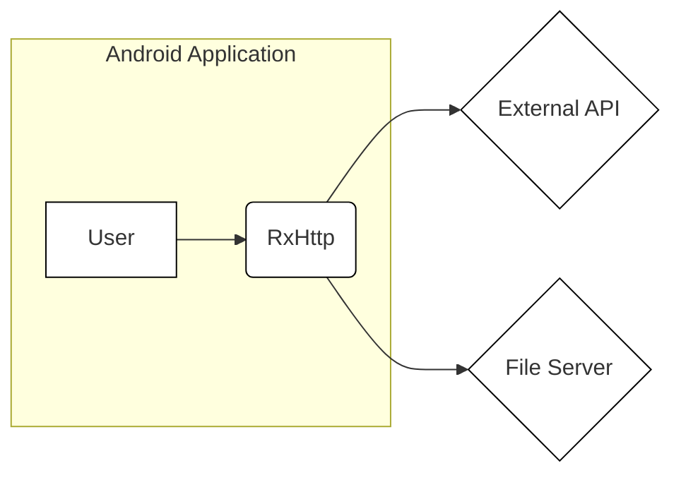
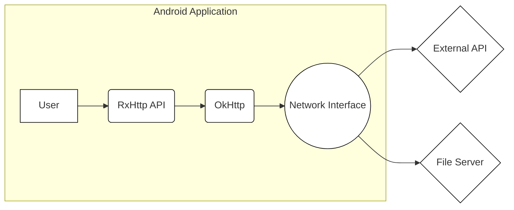
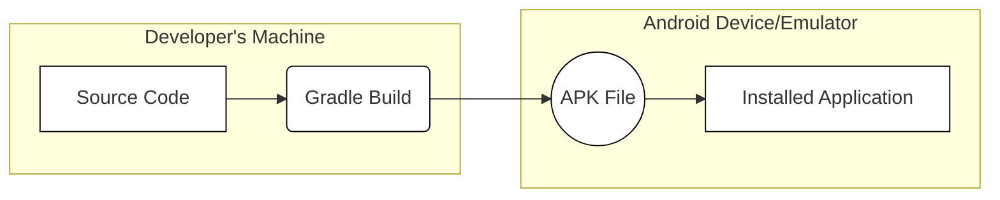

Okay, let's create a design document for the RxHttp project.

# BUSINESS POSTURE

RxHttp is a lightweight, feature-rich Android HTTP client library built on OkHttp, offering RxJava-based asynchronous operations, simplified file upload/download, and various request customizations.  It appears to be an open-source project aiming to improve the developer experience for making network requests in Android applications.

Priorities:

*   Ease of Use:  Provide a simple, intuitive API for developers.
*   Performance:  Ensure efficient network operations and minimal overhead.
*   Flexibility:  Support a wide range of HTTP request types and configurations.
*   Maintainability:  Keep the codebase clean, well-documented, and easy to update.
*   Community Adoption:  Attract and retain users by providing a valuable and reliable library.

Goals:

*   Become a popular choice for Android developers needing an HTTP client.
*   Provide a robust and reliable alternative to existing solutions.
*   Simplify common networking tasks, reducing boilerplate code.

Business Risks:

*   Low Adoption:  If developers don't find it significantly better than existing solutions, the project may not gain traction.
*   Security Vulnerabilities:  Flaws in the library could expose applications using it to security risks.
*   Maintenance Burden:  If the project becomes popular, maintaining it and addressing issues could become overwhelming for the maintainers.
*   Compatibility Issues:  Changes in Android, OkHttp, or RxJava could break compatibility, requiring significant updates.
*   Lack of Contribution: Insufficient community contributions could slow down development and bug fixes.

# SECURITY POSTURE

Existing Security Controls:

*   security control: Relies on OkHttp for underlying HTTP communication, inheriting its security features (e.g., TLS/SSL handling). OkHttp is a mature and widely used library with a strong security track record. (Described in OkHttp documentation)
*   security control: Offers options for customizing SSL certificates and hostname verification (though specifics need further investigation in the code). (Described in RxHttp documentation)
*   security control: Supports request/response interceptors, allowing developers to implement custom security logic (e.g., adding authentication headers, logging, or data validation). (Described in RxHttp documentation)

Accepted Risks:

*   accepted risk: Developers using the library are ultimately responsible for securely configuring their network requests (e.g., using HTTPS, validating server certificates, handling sensitive data appropriately).
*   accepted risk: The library's reliance on external dependencies (OkHttp, RxJava) introduces a potential risk if vulnerabilities are found in those dependencies.
*   accepted risk: The library might not cover all edge cases or specific security requirements of every application.

Recommended Security Controls:

*   security control: Implement static analysis security testing (SAST) in the build process to identify potential vulnerabilities in the RxHttp codebase.
*   security control: Implement dependency scanning to automatically detect and report known vulnerabilities in OkHttp, RxJava, and other dependencies.
*   security control: Provide clear documentation and examples on how to securely configure the library, including best practices for handling sensitive data, authentication, and certificate validation.
*   security control: Establish a security vulnerability disclosure process to allow researchers and users to report potential security issues responsibly.
*   security control: Regularly review and update the library's dependencies to address security patches and performance improvements.

Security Requirements:

*   Authentication:
    *   The library should facilitate the implementation of common authentication mechanisms (e.g., Basic Auth, Bearer Tokens, API Keys).
    *   Sensitive credentials should never be hardcoded or stored insecurely.
    *   Support for OAuth 2.0/OpenID Connect would be beneficial.
*   Authorization:
    *   While RxHttp primarily handles the transport layer, it should allow developers to easily integrate with authorization systems (e.g., by adding authorization headers to requests).
*   Input Validation:
    *   The library should encourage developers to validate and sanitize all data received from external sources (e.g., server responses).
    *   Consider providing built-in mechanisms for common validation tasks (e.g., checking response codes, validating JSON schemas).
*   Cryptography:
    *   RxHttp should rely on OkHttp's secure TLS/SSL implementation for encrypted communication.
    *   Developers should be guided to use HTTPS for all sensitive data transmission.
    *   If the library handles any cryptographic operations directly (which is unlikely), it should use well-established and secure cryptographic algorithms and libraries.

# DESIGN

## C4 CONTEXT



Element Description:

*   Element:
    *   Name: User
    *   Type: Person
    *   Description: A user interacting with the Android application.
    *   Responsibilities: Initiates actions that trigger network requests.
    *   Security controls: None (handled by the application).

*   Element:
    *   Name: RxHttp
    *   Type: Software System
    *   Description: The RxHttp library embedded within the Android application.
    *   Responsibilities: Handles HTTP requests and responses, manages connections, provides asynchronous operations.
    *   Security controls: Relies on OkHttp for secure communication, provides interceptors for custom security logic.

*   Element:
    *   Name: External API
    *   Type: Software System
    *   Description: A remote API that the Android application communicates with.
    *   Responsibilities: Provides data and services to the application.
    *   Security controls: Should implement appropriate security measures (e.g., authentication, authorization, input validation).

*   Element:
    *   Name: File Server
    *   Type: Software System
    *   Description: A server for uploading and downloading files.
    *   Responsibilities: Stores and serves files.
    *   Security controls: Should implement appropriate security measures (e.g., authentication, authorization, access control).

## C4 CONTAINER



Element Description:

*   Element:
    *   Name: User
    *   Type: Person
    *   Description: A user interacting with the Android application.
    *   Responsibilities: Initiates actions that trigger network requests.
    *   Security controls: None (handled by the application).

*   Element:
    *   Name: RxHttp API
    *   Type: Container
    *   Description: The public API of the RxHttp library.
    *   Responsibilities: Provides a simplified interface for making HTTP requests, manages RxJava observables.
    *   Security controls: Input validation (to some extent), relies on OkHttp for secure communication.

*   Element:
    *   Name: OkHttp
    *   Type: Container
    *   Description: The OkHttp library used internally by RxHttp.
    *   Responsibilities: Handles low-level HTTP communication, connection pooling, TLS/SSL.
    *   Security controls: Implements TLS/SSL, hostname verification, certificate pinning (configurable).

*   Element:
    *   Name: Network Interface
    *   Type: Container
    *   Description: The Android system's network interface.
    *   Responsibilities: Provides access to the network.
    *   Security controls: Android system security features.

*   Element:
    *   Name: External API
    *   Type: Software System
    *   Description: A remote API that the Android application communicates with.
    *   Responsibilities: Provides data and services to the application.
    *   Security controls: Should implement appropriate security measures (e.g., authentication, authorization, input validation).

*   Element:
    *   Name: File Server
    *   Type: Software System
    *   Description: A server for uploading and downloading files.
    *   Responsibilities: Stores and serves files.
    *   Security controls: Should implement appropriate security measures (e.g., authentication, authorization, access control).

## DEPLOYMENT

Possible Deployment Solutions:

1.  **Direct Dependency:** The most common approach. The RxHttp library is added as a direct dependency to the Android application project (e.g., using Gradle). The library's code is compiled and packaged along with the application's code into an APK file.
2.  **Local Maven Repository:** The library could be built and published to a local Maven repository for use within a specific organization or development team.
3.  **Public Maven Repository (e.g., Maven Central, JCenter):** The library is published to a public repository, making it easily accessible to any developer.

Chosen Solution (Direct Dependency):



Element Description:

*   Element:
    *   Name: Source Code
    *   Type: Code
    *   Description: The source code of the Android application and the RxHttp library (as a dependency).
    *   Responsibilities: Contains the application logic and the RxHttp integration.
    *   Security controls: Code reviews, static analysis.

*   Element:
    *   Name: Gradle Build
    *   Type: Process
    *   Description: The Gradle build process that compiles the code, resolves dependencies, and packages the application.
    *   Responsibilities: Builds the APK file.
    *   Security controls: Dependency scanning, SAST (recommended).

*   Element:
    *   Name: APK File
    *   Type: File
    *   Description: The Android Package Kit file, containing the compiled application code, resources, and the RxHttp library.
    *   Responsibilities: Represents the deployable application.
    *   Security controls: Code signing.

*   Element:
    *   Name: Installed Application
    *   Type: Application
    *   Description: The installed application on the Android device or emulator.
    *   Responsibilities: Runs the application logic, including network requests using RxHttp.
    *   Security controls: Android system security features, runtime permissions.

## BUILD

```mermaid
graph LR
    subgraph "Developer's Machine"
        A[Source Code] --> B(Git)
    end
    subgraph "CI Environment (e.g., GitHub Actions)"
        B --> C{Clone Repository}
        C --> D[Linting]
        C --> E[Static Analysis (SAST)]
        C --> F[Dependency Scanning]
        C --> G(Gradle Build)
        G --> H((Build Artifacts - JAR/AAR))
    end
    subgraph "Maven Repository (e.g., Maven Central)"
        H --> I[Published Library]
    end
    classDef default fill:#fff,stroke:#000,stroke-width:1px;
```

Build Process Description:

1.  **Developer:** A developer writes code and commits it to a Git repository.
2.  **CI Environment:** A CI system (e.g., GitHub Actions, Jenkins) is triggered by the commit.
3.  **Clone Repository:** The CI system clones the repository.
4.  **Linting:** Code linters (e.g., ktlint for Kotlin) are run to enforce code style and identify potential issues.
5.  **Static Analysis (SAST):** SAST tools (e.g., SonarQube, FindBugs) are used to analyze the code for potential security vulnerabilities.
6.  **Dependency Scanning:** Dependency scanning tools (e.g., OWASP Dependency-Check) are used to identify known vulnerabilities in the project's dependencies.
7.  **Gradle Build:** The Gradle build system compiles the code, runs tests, and creates the build artifacts (JAR/AAR files).
8.  **Build Artifacts:** The build artifacts are stored.
9.  **Maven Repository:** The build artifacts are published to a Maven repository (e.g., Maven Central, JCenter, or a local repository).

Security Controls:

*   security control: Code reviews before merging code changes.
*   security control: Linting to enforce code style and prevent common errors.
*   security control: Static analysis (SAST) to identify potential security vulnerabilities in the code.
*   security control: Dependency scanning to detect known vulnerabilities in dependencies.
*   security control: Automated build process to ensure consistency and repeatability.
*   security control: Secure storage of build artifacts.
*   security control: Signed releases to ensure the integrity of the published library.

# RISK ASSESSMENT

Critical Business Processes:

*   Providing a reliable and efficient HTTP client library for Android developers.
*   Maintaining the library and addressing issues promptly.
*   Ensuring the security of applications that use the library.

Data Protection:

*   RxHttp itself does not store or manage any sensitive data directly. It acts as a conduit for data transmission.
*   The sensitivity of the data transmitted depends on the specific application using RxHttp.
*   Developers using RxHttp are responsible for protecting any sensitive data they transmit or receive.
*   Data Sensitivity: Varies depending on the application. Could range from non-sensitive public data to highly sensitive personal or financial information.

# QUESTIONS & ASSUMPTIONS

Questions:

*   What specific SSL/TLS configurations are supported by RxHttp (e.g., certificate pinning, custom trust managers)?
*   Are there any built-in mechanisms for handling common security scenarios (e.g., retries with exponential backoff, circuit breakers)?
*   What is the project's policy on addressing security vulnerabilities?
*   Is there a public issue tracker or forum for reporting bugs and security concerns?
*   Are there any plans to add support for HTTP/2 or other advanced protocols?

Assumptions:

*   BUSINESS POSTURE: The project is actively maintained and aims to be a competitive alternative to other Android HTTP client libraries.
*   SECURITY POSTURE: Developers using RxHttp are aware of basic security principles and are responsible for implementing appropriate security measures in their applications.
*   DESIGN: The library primarily relies on OkHttp for secure communication and does not implement its own cryptographic protocols. The provided diagrams are simplified representations and may not capture all the internal details of the library.