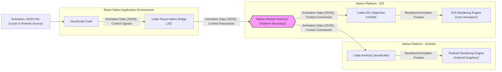
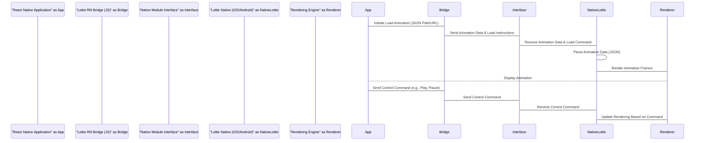

# Project Design Document: Lottie React Native

**Version:** 1.1
**Date:** October 26, 2023
**Author:** AI Software Architect

## 1. Introduction

This document provides a detailed design overview of the `lottie-react-native` project. This project acts as a crucial bridge, enabling the integration of the powerful Lottie animation library (originally developed by Airbnb) within the React Native ecosystem. It empowers developers to render intricate, vector-based animations, crafted using industry-standard tools like Adobe After Effects, directly within their cross-platform React Native applications. This document aims to establish a clear and comprehensive understanding of the project's underlying architecture, its core components, the flow of animation data, and its typical deployment patterns. This detailed understanding is a foundational prerequisite for conducting thorough and effective threat modeling exercises.

## 2. Goals

*   To facilitate the seamless and straightforward integration of Lottie animations into React Native applications.
*   To ensure a high-performance and resource-efficient rendering mechanism, even for complex and visually rich animations.
*   To offer a developer-friendly and intuitive API for controlling and dynamically manipulating animations at runtime.
*   To maintain a high degree of compatibility with the core Lottie library and its evolving feature set, ensuring access to the latest animation capabilities.

## 3. Target Audience

This document is primarily intended for:

*   Security engineers tasked with performing comprehensive threat modeling and security assessments of systems utilizing `lottie-react-native`.
*   Software developers actively contributing to the development and maintenance of the `lottie-react-native` project itself.
*   System architects and technical leads responsible for designing and overseeing the architecture of applications that incorporate `lottie-react-native`.

## 4. System Architecture

The `lottie-react-native` library functions as a carefully designed wrapper around the platform-specific, native Lottie implementations available for both iOS and Android. It exposes a well-defined JavaScript API that serves as the primary interface for developers. This API internally communicates with the underlying native modules to orchestrate the rendering and control of animations.

**Detailed Breakdown of Architectural Components:**

*   **`JavaScript Code` (Within the React Native Application):** This represents the application code written by developers where the `lottie-react-native` API is utilized to integrate and manage animations. Developers interact with the `LottieView` component and its associated methods and properties.
*   **`Lottie React Native Bridge (JS)`:** This JavaScript module acts as the crucial intermediary layer, providing the public-facing API for developers. It handles the marshalling and unmarshalling of data and commands between the JavaScript realm and the underlying platform-specific native modules. This bridge ensures seamless communication across the JavaScript-to-native boundary.
*   **`Native Module Interface` (Platform Boundary):** This represents the standardized interface through which JavaScript code communicates with native code in React Native. It acts as a well-defined contract, allowing the JavaScript bridge to invoke methods and pass data to the native modules in a platform-agnostic way.
*   **`Lottie iOS (Objective-C/Swift)`:** This is the native iOS implementation of the core Lottie animation rendering library. It is responsible for the complex tasks of parsing the animation data (typically in JSON format), interpreting the animation instructions, and leveraging Apple's Core Animation framework to render the animation frames efficiently.
*   **`Lottie Android (Java/Kotlin)`:** This is the native Android implementation of the core Lottie animation rendering library. Similar to its iOS counterpart, it handles parsing the animation data, interpreting animation instructions, and utilizing the Android graphics framework to render the animation frames smoothly on Android devices.
*   **`iOS Rendering Engine (Core Animation)`:** This refers to Apple's powerful framework for performing animations and other visual effects on iOS. The Lottie iOS library leverages Core Animation's capabilities to achieve high-performance rendering of vector-based animations.
*   **`Android Rendering Engine (Android Graphics)`:** This refers to the Android operating system's graphics subsystem, which provides the tools and APIs for drawing and manipulating visual elements on the screen. The Lottie Android library utilizes these capabilities for rendering animations.
*   **`Animation JSON File` (Local or Remote Source):** This file contains the structured data that describes the animation. It is typically exported from Adobe After Effects using the Bodymovin plugin and encodes information about shapes, keyframes, colors, transformations, and other animation properties. This file can be bundled directly with the application or fetched dynamically from a remote server.

## 5. Data Flow

The rendering of a Lottie animation within a React Native application involves a well-defined sequence of data transfer and processing steps:

1. **Animation Data Acquisition:** The React Native application first needs to obtain the animation data. This is typically in the form of a JSON file and can occur in two primary ways:
    *   **Bundled Locally:** The JSON file is included directly within the application's asset bundle during the build process.
    *   **Fetched Remotely:** The application makes a network request to download the JSON file from a remote server at runtime.
2. **Loading and Initialization:** The developer utilizes the `LottieView` component provided by `lottie-react-native`, specifying the source of the animation data through the `source` prop. This prop can point to a local file path (using `require()`) or a remote URL.
3. **Bridging to Native Platform:** The `lottie-react-native` JavaScript bridge intercepts the request to load the animation. It then marshals the animation data (or the path/URL to it) and any initial control commands (such as whether to autoplay or loop) and sends this information across the React Native bridge to the appropriate native module (either the iOS or Android module, depending on the platform).
4. **Native Processing and Parsing:** The designated native Lottie library (either Lottie iOS or Lottie Android) receives the animation data and control commands. It then proceeds to parse the JSON data, interpreting the animation instructions and building an internal representation of the animation's structure and properties.
5. **Rendering on Native Side:** The native Lottie library utilizes the platform's underlying rendering engine (Core Animation on iOS, Android Graphics on Android) to draw the individual frames of the animation. This rendering process is driven by the parsed animation data and the current animation state (e.g., current frame, playback speed).
6. **Display within React Native View:** The rendered animation frames are then integrated into the React Native view hierarchy, making the animation visible within the application's user interface.
7. **Interactive Control and Updates:** The JavaScript code can further interact with the animation at runtime by sending control commands to the native module. This includes actions like pausing, playing, stopping, changing playback speed, seeking to a specific frame, or dynamically updating animation properties. This control data flows back through the React Native bridge to the native module, which in turn updates the animation rendering accordingly.

## 6. Key Components

*   **`LottieView` Component (JavaScript):** This is the primary and most visible component exposed by the `lottie-react-native` library. Developers use this React Native component to embed and manage Lottie animations within their application's UI. It accepts a variety of props to configure the animation's behavior and appearance.
    *   **`source` prop:** This crucial prop specifies the origin of the animation data. It can accept either:
        *   A local file path using the `require()` function, pointing to an animation JSON file bundled with the application.
        *   A remote URL, allowing the animation data to be fetched dynamically from a web server. **Security Consideration:**  Fetching from untrusted URLs introduces risk.
    *   **`progress` prop:** Enables programmatic control over the animation's playback progress. By setting a value between 0 and 1, developers can directly jump to or animate to a specific point in the animation timeline.
    *   **`loop` prop:** A boolean prop that determines whether the animation should repeat automatically upon reaching the end.
    *   **`autoPlay` prop:** A boolean prop that dictates whether the animation should start playing immediately after the `LottieView` component is mounted.
    *   **Animation Events:** The component provides callbacks for various animation lifecycle events, allowing developers to execute custom logic at specific points, such as:
        *   `onAnimationFinish`: Triggered when the animation completes a full cycle (or a single play if not looping).
        *   Other events might be available depending on the library version.
*   **Native Modules (iOS and Android):** These are platform-specific modules written in Objective-C/Swift (for iOS) and Java/Kotlin (for Android). They act as the crucial interface between the JavaScript world and the native Lottie rendering libraries. Their responsibilities include:
    *   Receiving animation data and control commands from the JavaScript bridge. **Security Consideration:** Input validation is critical here to prevent unexpected behavior or crashes.
    *   Parsing the JSON animation data using the native Lottie SDKs. **Security Consideration:** Vulnerabilities in the parsing logic of the native SDKs could be exploited.
    *   Creating and managing the native animation rendering objects provided by the underlying Lottie iOS and Lottie Android libraries.
    *   Orchestrating the rendering process using the platform's graphics APIs (Core Animation or Android Graphics).
    *   Communicating rendering updates and events back to the React Native view through the bridge.
*   **Lottie Native Libraries (iOS and Android):** These are the core animation rendering engines, the heart of the Lottie ecosystem on each platform. They are responsible for the computationally intensive tasks of:
    *   Interpreting the complex animation data contained within the JSON file.
    *   Calculating the positions, sizes, colors, and other properties of animated elements at each frame.
    *   Leveraging the platform's graphics capabilities to efficiently draw the animation frames. **Security Consideration:** Bugs or vulnerabilities within these core libraries could have significant security implications.

## 7. Deployment Model

The `lottie-react-native` library is integrated into React Native applications as a standard dependency. The typical deployment process involves:

*   **Installation via Package Managers:** Developers install the library using popular JavaScript package managers like npm or yarn. This adds the library and its dependencies to the project.
*   **Native Linking:**  Depending on the React Native version and project setup, native modules might need to be linked to the native iOS and Android projects. This ensures that the native code is included in the final application bundle.
*   **Component Usage:** Developers import the `LottieView` component into their React Native components and configure it with the desired animation source and control properties.
*   **Animation Data Packaging and Delivery:** The animation JSON files are typically handled in one of two ways:
    *   **Bundled with the Application:** The JSON files are included as assets within the application bundle during the build process. This ensures that the animations are readily available offline.
    *   **Dynamically Downloaded:** The application fetches the JSON files from a remote server at runtime. This allows for updating animations without requiring a full application update. **Security Consideration:** Secure communication protocols (HTTPS) are essential when downloading animation data.

## 8. Security Considerations (Pre-Threat Modeling)

This section highlights potential security considerations that warrant further investigation during a dedicated threat modeling exercise.

*   **Malicious Animation Data from Untrusted Sources:** If the `source` prop of the `LottieView` component points to a URL controlled by an attacker, the downloaded JSON data could be malicious. This could lead to:
    *   **Denial of Service (DoS):**  Crafted animation data with excessive complexity or infinite loops could consume excessive CPU and memory resources, causing the application to freeze or crash.
    *   **Resource Exhaustion:**  Very large animation files could lead to excessive memory usage, potentially causing out-of-memory errors and application termination.
    *   **Potential Exploitation of Parsing Vulnerabilities:** Although JSON itself is generally safe, vulnerabilities in the specific JSON parsing logic within the native Lottie libraries could be exploited by carefully crafted malicious JSON payloads. This could potentially lead to unexpected behavior or even code execution in the worst-case scenario.
*   **Man-in-the-Middle (MITM) Attacks on Remote Data:** If animation data is fetched over an insecure HTTP connection, an attacker could intercept the traffic and replace the legitimate animation data with malicious content. This could result in the display of misleading or harmful animations to the user. **Mitigation:** Enforce the use of HTTPS for fetching remote animation data.
*   **Resource Exhaustion due to Complex Animations:** Even with legitimate animation data, overly complex animations with a large number of layers, shapes, and keyframes can consume significant resources, potentially impacting the application's performance and responsiveness, especially on lower-end devices.
*   **Data Privacy Implications of Animation Content:** The content of the animations themselves might contain sensitive information. If this data is transmitted or stored insecurely, it could pose a privacy risk. Consider the sensitivity of the visual information being displayed.
*   **Vulnerabilities in Underlying Dependencies:** The `lottie-react-native` library relies on the native Lottie SDKs for iOS and Android, as well as other transitive dependencies. Known vulnerabilities in these dependencies could potentially be exploited by attackers. **Mitigation:** Regularly update dependencies to their latest secure versions.
*   **Client-Side Injection (Less Likely but Possible):** While less direct, if the application logic dynamically constructs parts of the animation data based on user input without proper sanitization, it could theoretically introduce client-side injection vulnerabilities, although this is less common with Lottie's declarative nature.

## 9. Dependencies

*   **React Native:** The foundational framework upon which `lottie-react-native` is built.
*   **`lottie-ios` (via CocoaPods for iOS):** The native iOS library providing the core Lottie rendering capabilities on iOS.
*   **`com.airbnb.android:lottie` (via Gradle for Android):** The native Android library providing the core Lottie rendering capabilities on Android.
*   **Potentially other transitive dependencies** required by the native Lottie libraries for tasks like JSON parsing and graphics rendering.

## 10. Conclusion

This document provides a comprehensive and detailed design overview of the `lottie-react-native` project. By outlining the architecture, data flow, and key components, it aims to provide a solid foundation for understanding the library's inner workings and potential security considerations. This document serves as a crucial input for subsequent threat modeling activities, enabling security engineers to systematically analyze the project and identify potential vulnerabilities and risks associated with its use.