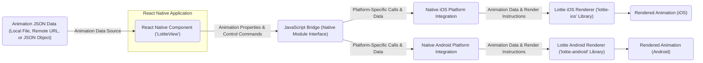

## Project Design Document: Lottie React Native (Improved)

**Document Version:** 1.1
**Date:** October 26, 2023
**Author:** AI Software Architect

**1. Introduction**

This document provides an enhanced architectural design of the `lottie-react-native` project, building upon the previous version. This detailed design serves as the foundation for comprehensive threat modeling activities, enabling a thorough assessment of potential security vulnerabilities and informing mitigation strategies. `lottie-react-native` facilitates the rendering of intricate vector-based animations within React Native applications, utilizing Adobe After Effects animations exported as JSON via the Bodymovin/Lottie plugin. It effectively bridges the declarative nature of React Native components with the platform-specific animation rendering engines provided by iOS and Android.

**2. Goals**

The primary goals of `lottie-react-native` are to:

* **Enable High-Fidelity Animation:** Provide a robust mechanism for rendering complex, vector-based animations within React Native applications, maintaining visual fidelity with the original After Effects design.
* **Cross-Platform Compatibility:** Offer a seamless, cross-platform animation solution, ensuring consistent behavior and appearance across both iOS and Android platforms with minimal platform-specific code.
* **Declarative Integration:** Furnish a simple and declarative API for integrating animations directly into React Native components, aligning with the React paradigm.
* **Performance and Efficiency:** Maintain optimal performance and efficiency in animation rendering to avoid impacting the responsiveness and battery life of the mobile application.
* **Feature Richness:** Support a wide array of Lottie animation features, including keyframe animations, masks, mattes, expressions (with limitations), and more.
* **Maintainability and Extensibility:**  Provide a codebase that is maintainable, well-documented, and extensible to accommodate future animation features and platform updates.

**3. Target Audience**

This document is intended for:

* Security engineers tasked with performing threat modeling, security audits, and penetration testing of applications utilizing `lottie-react-native`.
* Developers actively contributing to the development, maintenance, and extension of the `lottie-react-native` library.
* Architects and technical leads responsible for designing systems and mobile applications that integrate `lottie-react-native` as a core component.
* Quality assurance engineers involved in testing the functionality and security of applications using `lottie-react-native`.

**4. Architecture Overview**

The `lottie-react-native` library employs a bridge pattern to facilitate communication between the JavaScript (React Native) realm and the native platform rendering engines. This architecture isolates platform-specific rendering logic while exposing a unified JavaScript API. The core components and their interactions are illustrated below:

**5. Detailed Design**

The following sections provide a more in-depth look at the key aspects of the `lottie-react-native` architecture:

**5.1. React Native Component (`LottieView`)**

* **Primary API Entry Point:** The `<LottieView>` component serves as the primary interface for developers to integrate Lottie animations into their React Native applications.
* **Property Handling:** It accepts a rich set of properties that control the animation's behavior and appearance:
    * `"source"`:  Specifies the origin of the animation data. This can be:
        * A local file path (e.g., `require('./animations/my_animation.json')`).
        * A remote URL pointing to the JSON animation file (e.g., `'https://example.com/animation.json'`).
        * A pre-loaded JavaScript object representing the animation data.
    * `"autoPlay"`: A boolean value indicating whether the animation should commence playback immediately upon mounting.
    * `"loop"`: A boolean determining if the animation should repeat indefinitely upon completion. It can also accept a number specifying the number of loops.
    * `"progress"`: A numerical value between 0 and 1, allowing programmatic control over the animation's playback position.
    * `"speed"`: A number that adjusts the animation's playback speed (e.g., 0.5 for half speed, 2 for double speed).
    * `"onAnimationFinish"`: A callback function that is invoked when the animation reaches its end (or completes a specified number of loops).
    * `"onAnimationLoaded"`: A callback function triggered after the animation data has been successfully loaded and parsed.
    * Style properties inherited from `View`, enabling control over the component's layout and visual presentation.
    * Event handlers for user interactions (though typically limited for animation components).
* **Lifecycle Management:** The `<LottieView>` component manages the creation, updating, and destruction of the underlying native animation view instances based on its props and lifecycle events.

**5.2. JavaScript Bridge (Native Module Interface)**

* **Communication Layer:** The JavaScript bridge acts as a crucial intermediary, facilitating bidirectional communication between the JavaScript thread (where React Native logic resides) and the native UI threads (iOS and Android).
* **React Native Native Modules:** It leverages React Native's Native Modules infrastructure to expose native functionality to JavaScript. This involves creating platform-specific implementations (Objective-C/Swift for iOS, Java/Kotlin for Android) that can be invoked from JavaScript.
* **Command Marshalling:** The bridge is responsible for marshalling commands and data from JavaScript into a format suitable for the native platform and vice versa. This includes:
    * Receiving animation properties (e.g., `source`, `autoPlay`, `progress`) from the `<LottieView>` component.
    * Passing the animation JSON data to the native renderers.
    * Sending control signals (e.g., play, pause, stop, set progress, set speed) to the native animation views.
    * Receiving events and notifications from the native renderers (e.g., animation finished, animation loaded) and propagating them back to the JavaScript side via callbacks.
* **UI Management:** The bridge interacts with React Native's UI Manager to create and manage the native view instances that will host the rendered animations.

**5.3. Native Renderers**

* **Platform-Specific Implementation:** The rendering of Lottie animations is delegated to platform-specific libraries for optimal performance and integration with the underlying operating system.
* **iOS (Lottie iOS - `lottie-ios`):**
    * **Technology:**  Utilizes the `lottie-ios` library, primarily written in Objective-C and Swift.
    * **Rendering Engine:** Leverages CoreAnimation, Apple's powerful animation framework, for rendering the vector graphics and applying animation effects.
    * **JSON Parsing:** Responsible for parsing the animation JSON data and constructing an internal representation of the animation.
    * **Animation Interpretation:** Interprets the animation instructions within the JSON data, including keyframes, transforms, masks, and other animation properties.
    * **Frame Management:** Manages the animation timeline, calculates intermediate values between keyframes, and updates the display on each frame.
* **Android (Lottie Android - `lottie-android`):**
    * **Technology:** Employs the `lottie-android` library, primarily written in Java and Kotlin.
    * **Rendering Engine:** Utilizes the Android Canvas API, potentially leveraging hardware acceleration, to draw the vector graphics and animate them.
    * **JSON Parsing:** Handles the parsing of the animation JSON data on the Android platform.
    * **Animation Interpretation:** Interprets the animation instructions and translates them into drawing operations on the Canvas.
    * **Performance Optimization:** Includes optimizations for smooth animation rendering on Android devices, considering the diverse range of hardware capabilities.

**5.4. Animation Data (JSON)**

* **Format:** The animation data is structured as a JSON file, adhering to the Lottie specification defined by the Bodymovin/Lottie plugin for Adobe After Effects.
* **Content Description:** This JSON structure meticulously describes every aspect of the animation, including:
    * Layers (shapes, images, text).
    * Keyframes (defining property values at specific points in time).
    * Transforms (position, scale, rotation, opacity).
    * Masks and mattes (controlling the visibility of layers).
    * Animation properties (e.g., easing functions, expressions).
    * Assets (images and other media used in the animation).
* **Source Flexibility:** The `source` property of the `<LottieView>` component provides flexibility in how this data is accessed:
    * **Local Files:** The JSON file is bundled with the application and accessed directly from the device's file system.
    * **Remote URLs:** The JSON data is fetched over the network from a specified web server.
    * **JSON Objects:** The animation data is provided directly as a JavaScript object, potentially generated dynamically.

**6. Data Flow (Detailed)**

The process of rendering an animation involves a detailed flow of data between the different components:

1. **Component Instantiation:** The developer includes the `<LottieView>` component in their React Native application's render tree, configuring its properties (including the `source` of the animation data).
2. **Property Propagation:** When the component mounts or its props update, the React Native framework passes these properties to the underlying native view through the JavaScript bridge.
3. **Source Handling:**
    * **Local File:** The JavaScript bridge (native module) receives the local file path. The native module then reads the JSON file content from the application's bundle.
    * **Remote URL:** The native module initiates an asynchronous HTTP request to the specified URL to fetch the JSON animation data. This involves network communication and potential security considerations (HTTPS).
    * **JSON Object:** The JavaScript object representing the animation data is directly passed to the native module.
4. **Data Transmission:** The animation JSON data (either read from a local file, fetched remotely, or provided as an object) is transmitted from the JavaScript bridge to the appropriate native renderer (iOS or Android).
5. **JSON Parsing:** The native renderer (either `lottie-ios` or `lottie-android`) parses the received JSON data, converting it into an internal data structure that represents the animation's structure and properties. This parsing process is crucial and a potential point of vulnerability if the JSON is malformed or malicious.
6. **Animation Setup:** The native renderer uses the parsed data to set up the animation scene, creating layers, shapes, and other graphical elements according to the animation's definition.
7. **Rendering Loop:**
    * Based on the `autoPlay` and control properties, the native renderer starts its animation loop.
    * For each frame of the animation, the renderer calculates the current values of animated properties based on the keyframes and easing functions.
    * The renderer then draws the animation frame onto the screen using the platform's graphics APIs (CoreAnimation on iOS, Android Canvas on Android).
8. **Display:** The rendered animation frame is displayed within the bounds of the `<LottieView>` component in the React Native application's user interface.
9. **Control and Events:**
    * Changes to control properties (e.g., `progress`, `speed`) are passed through the JavaScript bridge to the native renderer, which updates the animation playback accordingly.
    * Events occurring within the native renderer (e.g., animation finished) are communicated back to the JavaScript side through the bridge, triggering the corresponding callback functions (e.g., `onAnimationFinish`).

**7. Key Components and Modules (Elaborated)**

* **`LottieView.js` (JavaScript):**
    * **Purpose:**  The primary React component responsible for rendering Lottie animations. It acts as a wrapper around the native animation view.
    * **Responsibilities:** Manages the component's lifecycle, handles property updates, and communicates with the native module.
* **Native Module (iOS - Objective-C/Swift):**
    * **Purpose:**  Provides the platform-specific implementation for iOS.
    * **Responsibilities:**  Receives commands and data from the JavaScript bridge, interacts with the `lottie-ios` library, and manages the native animation view (`LAAnimationView`).
* **Native Module (Android - Java/Kotlin):**
    * **Purpose:** Provides the platform-specific implementation for Android.
    * **Responsibilities:** Receives commands and data from the JavaScript bridge, interacts with the `lottie-android` library (`LottieAnimationView`), and manages the animation rendering.
* **`lottie-ios` (External Dependency - Objective-C/Swift):**
    * **Purpose:**  The core iOS library for rendering Lottie animations.
    * **Responsibilities:** JSON parsing, animation interpretation, and rendering using CoreAnimation.
* **`lottie-android` (External Dependency - Java/Kotlin):**
    * **Purpose:** The core Android library for rendering Lottie animations.
    * **Responsibilities:** JSON parsing, animation interpretation, and rendering using the Android Canvas API.

**8. Security Considerations (Detailed)**

This section expands on potential security concerns, providing more context for threat modeling:

* **Loading Animation Data from External Sources (Remote URLs):**
    * **Unsecured Connections (HTTP):**  Fetching animation data over HTTP exposes the application to Man-in-the-Middle (MITM) attacks. Attackers can intercept the network traffic and potentially inject malicious animation data, leading to unexpected behavior, crashes, or even potential code execution if vulnerabilities exist in the rendering libraries. **Mitigation:** Enforce HTTPS for all remote animation sources.
    * **Server-Side Vulnerabilities:** If the server hosting the animation data is compromised, attackers could replace legitimate animation files with malicious ones. **Mitigation:** Implement robust security measures on the animation data server, including access controls, regular security audits, and integrity checks.
    * **Denial of Service (DoS):**  A malicious actor could provide a URL to an extremely large animation file, potentially causing excessive resource consumption on the user's device, leading to application slowdown or crashes. **Mitigation:** Implement safeguards against excessively large files, such as size limits or timeouts.
* **Malicious Animation Data:**
    * **Exploiting Parsing Vulnerabilities:**  Maliciously crafted JSON data could exploit vulnerabilities in the parsing logic of the `lottie-ios` or `lottie-android` libraries, potentially leading to crashes, memory corruption, or even remote code execution. **Mitigation:** Regularly update the `lottie-ios` and `lottie-android` dependencies to benefit from security patches. Implement input validation and sanitization where possible (though limited with complex JSON structures).
    * **Resource Exhaustion:**  Complex animations with a large number of layers, keyframes, or intricate effects can consume significant CPU and memory resources, potentially leading to performance degradation or application crashes. **Mitigation:** Educate developers on best practices for creating efficient animations. Implement mechanisms to detect and potentially limit the rendering of overly complex animations.
* **Dependency Vulnerabilities:**
    * The security of `lottie-react-native` is inherently tied to the security of its dependencies (`lottie-ios` and `lottie-android`). Vulnerabilities discovered in these libraries could directly impact applications using `lottie-react-native`. **Mitigation:** Regularly monitor security advisories for `lottie-ios` and `lottie-android` and update the dependencies promptly when security patches are released. Utilize dependency scanning tools.
* **Data Injection (Limited Scope):** While direct user input into animation data is less common, if parts of the animation data or control parameters are derived from unsanitized user input, it could potentially lead to unexpected behavior or, in rare cases, exploit vulnerabilities if the rendering libraries are susceptible to specific data patterns. **Mitigation:**  Sanitize any user input that influences animation data or control parameters.
* **Privacy Concerns:** If animation data contains sensitive information (though unlikely in typical animation use cases), ensure secure transmission and storage.

**9. Assumptions and Constraints (Security Focused)**

* **Secure Network Communication:** It is assumed that when fetching animation data from remote URLs, developers will prioritize and enforce the use of HTTPS to ensure secure communication and prevent MITM attacks.
* **Dependency Security:** The security of `lottie-react-native` is heavily reliant on the security of the underlying `lottie-ios` and `lottie-android` libraries. It is assumed that these libraries are actively maintained and security vulnerabilities are addressed promptly by their respective maintainers.
* **Platform Security:** The design assumes the inherent security mechanisms provided by the underlying iOS and Android platforms are in place and functioning correctly.
* **Developer Awareness:** It is assumed that developers integrating `lottie-react-native` are aware of the potential security implications of loading external resources and will exercise caution when specifying animation sources.

**10. Future Considerations (Actionable)**

* **Implement a Mechanism for Verifying Animation Data Integrity:** Explore methods for verifying the integrity of animation data loaded from remote sources, such as using checksums or digital signatures.
* **Investigate Sandboxing Techniques:** Research the feasibility of sandboxing the animation rendering process to limit the potential impact of vulnerabilities within the rendering libraries. This could involve using separate processes or security contexts.
* **Develop Guidelines for Secure Animation Development:** Create and disseminate best practices for developers on how to create and load animations securely, including recommendations for animation complexity and source management.
* **Automated Security Testing:** Integrate automated security testing into the development pipeline, including static analysis and dynamic analysis, to identify potential vulnerabilities early in the development lifecycle.
* **Explore Content Security Policy (CSP) for Animations:** Investigate the possibility of implementing a CSP-like mechanism to restrict the sources from which animation data can be loaded, providing an additional layer of security.
* **Regular Security Audits and Penetration Testing:** Conduct periodic security audits and penetration testing of `lottie-react-native` and applications that utilize it to proactively identify and address potential vulnerabilities.

This improved document provides a more detailed and security-focused architectural design of the `lottie-react-native` project, serving as a stronger foundation for subsequent threat modeling activities.