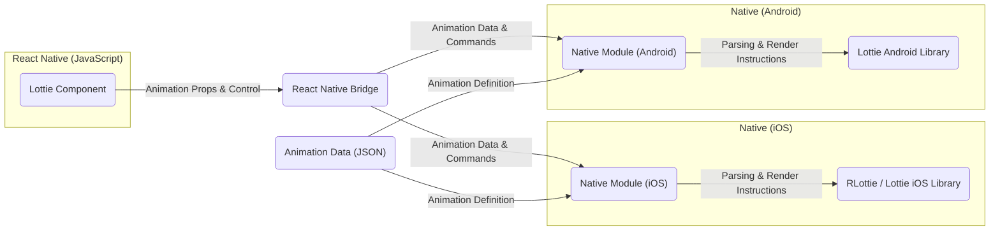
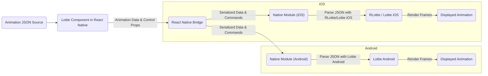

# Project Design Document: Lottie React Native

**Version:** 1.1
**Date:** October 26, 2023
**Author:** AI Software Architect

## 1. Introduction

This document provides a detailed design overview of the `lottie-react-native` project, a React Native library that renders Adobe After Effects animations exported as JSON with Bodymovin and its successor, the Lottie web player. This document aims to provide a comprehensive understanding of the project's architecture, components, and data flow, which will be crucial for subsequent threat modeling activities. This version includes more detail on component responsibilities and potential security considerations.

## 2. Goals

The primary goals of the `lottie-react-native` project are:

* To provide a performant and reliable way to render Lottie animations within React Native applications.
* To offer a simple and intuitive API for developers to integrate Lottie animations.
* To support a wide range of Lottie features and animation complexities.
* To be compatible with both iOS and Android platforms.
* To maintain a lightweight footprint and minimize impact on application performance.
* To provide a secure way to render animations, mitigating potential risks associated with untrusted animation data.

## 3. System Architecture

The `lottie-react-native` library acts as a bridge between the JavaScript realm of React Native and the native rendering capabilities of iOS and Android. The core architecture involves the following key components:

* **JavaScript Interface (`lottie-react-native` component):** This is the primary interface developers interact with in their React Native code. It's a React component responsible for:
    * Accepting animation data (JSON) or a reference to it (local file path or remote URL).
    * Managing animation control properties like loop, autoplay, speed, and progress.
    * Communicating with the native modules via the React Native Bridge.
    * Providing lifecycle methods and event handlers for animation events.
* **React Native Bridge:** This is the framework-provided mechanism that facilitates asynchronous communication between the JavaScript thread and the native modules. It handles:
    * Serializing data (animation JSON, control commands) from JavaScript to a format understandable by native code.
    * Deserializing data (events, status updates) from native code back to JavaScript.
    * Invoking methods on the native modules.
* **Native Module (iOS):**  This module, typically written in Objective-C or Swift, acts as an intermediary on the iOS platform. Its responsibilities include:
    * Receiving animation data and control commands from the React Native Bridge.
    * Parsing the animation JSON using the `RLottie` library or the official Lottie iOS library.
    * Managing the lifecycle of the animation rendering on the native side.
    * Communicating rendering instructions to the underlying Lottie rendering library.
    * Handling potential errors during parsing and rendering.
* **Native Module (Android):** This module, typically written in Java or Kotlin, acts as an intermediary on the Android platform. Its responsibilities include:
    * Receiving animation data and control commands from the React Native Bridge.
    * Parsing the animation JSON using the official Lottie Android library.
    * Managing the lifecycle of the animation rendering on the native side.
    * Communicating rendering instructions to the underlying Lottie rendering library.
    * Handling potential errors during parsing and rendering.
* **Animation Data (JSON):** This is the core input to the system. It's a JSON file exported from Adobe After Effects using the Bodymovin or Lottie plugins. It describes:
    * The structure of the animation (layers, shapes, keyframes).
    * Animation properties (position, scale, rotation, opacity).
    * Assets used in the animation (images, fonts).

## 4. Data Flow

The typical data flow for rendering a Lottie animation is as follows:

1. **Animation Source:** The animation data originates as a JSON file, which can be:
    * Bundled with the application as a static asset.
    * Fetched from a local file path on the device.
    * Downloaded from a remote URL.
2. **Component Initialization:** The developer includes the `<LottieView>` component in their React Native code, providing the animation source (either the JSON data directly or a reference to it).
3. **Data Passing and Bridge Communication:**
    * The `source` prop (containing the JSON data or a reference) and other control props are passed to the `LottieView` component.
    * When the component mounts or its props change, the `LottieView` component serializes the animation data and control parameters.
    * This serialized data is sent across the React Native Bridge to the appropriate native module (iOS or Android).
4. **Native Processing:**
    * **Data Reception:** The native module receives the animation data and control commands.
    * **Parsing:** The native module uses the underlying Lottie library (RLottie/Lottie iOS or Lottie Android) to parse and interpret the animation structure from the JSON. This is a critical step where potential vulnerabilities in the JSON structure could be exploited.
    * **Rendering Preparation:** The native library prepares the animation for rendering, potentially loading assets like images.
    * **Rendering:** The native library renders the animation frame by frame on the native drawing canvas. This process is driven by the animation's timeline and any control parameters.
5. **Display:** The rendered animation is displayed within the React Native view hierarchy as a native view.
6. **Control Updates:** If the animation needs to be controlled programmatically (e.g., pausing, playing, setting progress), the JavaScript component sends updated control commands through the bridge to the native module. The native module then updates the animation playback accordingly.

## 5. Components and Modules

* **`LottieView` (JavaScript):**
    * The primary React Native component used to display Lottie animations.
    * **Responsibilities:**
        * Manages the animation source and control properties.
        * Handles communication with the native modules via the React Native bridge.
        * Provides a declarative API for animation control.
        * Implements basic error handling for common scenarios.
    * **Potential Security Considerations:**
        * Vulnerable if it doesn't properly sanitize or validate the animation source, especially if it's a remote URL.
        * Could be susceptible to injection if animation control properties are derived from untrusted user input.
* **React Native Bridge:**
    * **Responsibilities:**
        * Facilitates communication between JavaScript and native code.
        * Handles serialization and deserialization of data.
    * **Potential Security Considerations:**
        * While the bridge itself is part of React Native, vulnerabilities in its implementation could affect the security of data passed through it.
* **Native Module (iOS):**
    * **Responsibilities:**
        * Receives and forwards animation data to the underlying rendering library.
        * Manages the native animation view.
        * Handles errors from the rendering library.
    * **Potential Security Considerations:**
        * Vulnerable to exploits in the `RLottie` or Lottie iOS library if it doesn't handle parsing errors or resource limits correctly.
        * Could be susceptible to denial-of-service attacks if it attempts to render overly complex or malformed animations.
* **Native Module (Android):**
    * **Responsibilities:**
        * Receives and forwards animation data to the underlying rendering library.
        * Manages the native animation view.
        * Handles errors from the rendering library.
    * **Potential Security Considerations:**
        * Vulnerable to exploits in the Lottie Android library if it doesn't handle parsing errors or resource limits correctly.
        * Could be susceptible to denial-of-service attacks if it attempts to render overly complex or malformed animations.
* **`RLottie` (iOS) / Lottie iOS Library:**
    * **Responsibilities:**
        * Parses the animation JSON data.
        * Renders the animation frames on the iOS platform.
        * Manages animation assets.
    * **Potential Security Considerations:**
        * The primary point of vulnerability related to malicious animation data. Bugs in the parsing or rendering logic could lead to crashes, memory corruption, or even code execution.
        * Handling of external assets (images, fonts) could introduce vulnerabilities if not done securely.
* **Lottie Android Library:**
    * **Responsibilities:**
        * Parses the animation JSON data.
        * Renders the animation frames on the Android platform.
        * Manages animation assets.
    * **Potential Security Considerations:**
        * Similar to the iOS libraries, this is a key area for potential vulnerabilities related to malicious animation data.
        * Secure handling of external assets is crucial.

## 6. Dependencies

The `lottie-react-native` project depends on the following key components:

* **React Native:** The core framework for building cross-platform mobile applications.
* **RLottie (iOS) or Lottie iOS:** The native library used for rendering animations on iOS.
* **Lottie Android:** The native library used for rendering animations on Android.
* **Bodymovin or Lottie After Effects Plugin:** The Adobe After Effects plugin used to export animations as JSON.

## 7. Security Considerations (Detailed for Threat Modeling)

This section outlines more detailed security considerations for threat modeling.

* **Malicious Animation Data (JSON Payload Attacks):**
    * **Parsing Vulnerabilities:** Crafted JSON files could exploit vulnerabilities in the parsing logic of `RLottie`, Lottie iOS, or Lottie Android, leading to crashes, unexpected behavior, or potentially even remote code execution.
    * **Resource Exhaustion:**  Malicious JSON could define extremely complex animations with a large number of layers, shapes, or keyframes, leading to excessive CPU and memory consumption, causing denial of service on the client device.
    * **Integer Overflow/Underflow:**  Carefully crafted numerical values within the JSON could trigger integer overflow or underflow conditions in the rendering libraries, potentially leading to memory corruption.
    * **Property Exploitation:**  Specific animation properties, if handled insecurely, could be manipulated to cause unexpected behavior or crashes.
    * **Asset Path Manipulation:** If the animation JSON references external assets, malicious manipulation of these paths could lead to the loading of unintended or malicious resources.
* **Dependency Vulnerabilities:**
    * **Known Vulnerabilities in Native Libraries:**  `RLottie`, Lottie iOS, and Lottie Android are external dependencies. Known vulnerabilities in these libraries could be exploited through `lottie-react-native`. Regular updates and security audits of these dependencies are crucial.
    * **Supply Chain Attacks:**  Compromised versions of the native libraries could be introduced, potentially containing malicious code.
* **Data Handling and Transmission:**
    * **Insecure Remote Fetching:** If animations are fetched from remote URLs, using insecure protocols (HTTP instead of HTTPS) could allow man-in-the-middle attacks where the animation data is intercepted and tampered with.
    * **Lack of Integrity Checks:**  If animations are downloaded, there might be no mechanism to verify the integrity of the downloaded data, making it susceptible to tampering.
    * **Local Storage Security:** If animations are cached locally, the security of the local storage needs to be considered to prevent unauthorized access or modification.
* **Denial of Service (DoS):**
    * **Complex Animations:**  Serving or attempting to render extremely complex animations could lead to resource exhaustion and DoS on the client device.
    * **Rapid Animation Switching:**  Rapidly switching between different animations, especially complex ones, could overwhelm the rendering pipeline and cause performance issues or crashes.
* **Client-Side Injection Attacks (Less Likely but Possible):**
    * **Control Property Manipulation:** If animation control properties (like `progress`) are derived from untrusted user input without proper sanitization, it might be possible to inject malicious values that cause unexpected behavior.
* **Error Handling and Information Disclosure:**
    * **Verbose Error Messages:**  Detailed error messages from the native libraries, if exposed to the user, could reveal information about the application's internal workings, aiding attackers.

## 8. Deployment

The `lottie-react-native` library is deployed as an npm package that developers can install into their React Native projects. Integration involves:

* **Installation:** Using npm or yarn to add the `lottie-react-native` dependency to the project's `package.json`.
* **Native Linking:** Linking the native modules (iOS and Android) to the React Native project. This process makes the native code available to the React Native application. Modern React Native versions often handle this automatically (autolinking).
* **Component Usage:** Importing the `LottieView` component from the `lottie-react-native` library and using it within React Native components, providing the animation source and desired properties.
* **Considerations for Secure Deployment:**
    * **Dependency Pinning:** Pinning the versions of `lottie-react-native` and its native dependencies in `package.json` and native dependency management files (like `Podfile` for iOS and `build.gradle` for Android) helps ensure consistent builds and reduces the risk of unexpected behavior from dependency updates.
    * **Code Signing:** Properly code-signing the application for both iOS and Android platforms is essential to verify the authenticity and integrity of the application.
    * **Secure Distribution Channels:** Distributing the application through official app stores (Apple App Store, Google Play Store) provides a level of security and vetting.

## 9. Future Considerations

* **Enhanced Input Validation:** Implement more robust validation of the animation JSON data on both the JavaScript and native sides to detect and reject potentially malicious payloads before they reach the rendering libraries.
* **Sandboxing/Isolation:** Explore possibilities for sandboxing or isolating the animation rendering process to limit the impact of potential vulnerabilities.
* **Resource Limits:** Implement mechanisms to enforce resource limits on animation rendering (e.g., maximum number of layers, maximum animation duration) to prevent denial-of-service attacks.
* **Regular Security Audits:** Conduct regular security audits and penetration testing of the `lottie-react-native` library and its dependencies to identify and address potential vulnerabilities proactively.
* **Secure Asset Handling:** Implement secure mechanisms for handling external assets referenced in the animation JSON, including validation of asset paths and secure downloading protocols.
* **Content Security Policy (CSP) Considerations:** Investigate how CSP, if applicable in the React Native context (especially for web views or hybrid apps), could be used to mitigate risks associated with loading remote animation data.

This improved document provides a more detailed and security-focused understanding of the `lottie-react-native` project's design, which will be crucial for conducting a thorough threat model and implementing appropriate security measures.