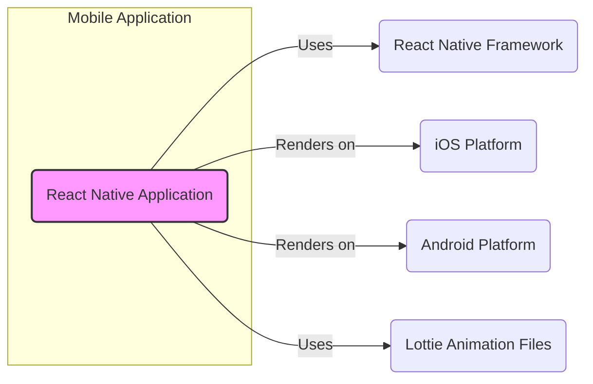
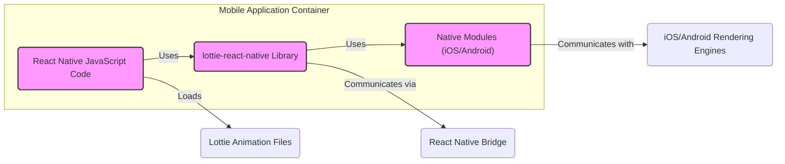
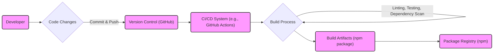

# BUSINESS POSTURE

- Business Priorities and Goals:
 - Enhance user experience in React Native applications by enabling the rendering of high-quality, performant Lottie animations.
 - Simplify the integration of complex vector animations into mobile applications, reducing development time and effort compared to traditional animation methods.
 - Improve user engagement and visual appeal of applications, leading to increased user satisfaction and retention.
 - Provide a cross-platform solution for Lottie animations, ensuring consistent animation rendering across both iOS and Android platforms.

- Business Risks:
 - Dependency on an open-source library introduces potential risks related to library maintenance, security vulnerabilities, and community support.
 - Performance issues related to animation rendering, especially on lower-end devices, could negatively impact user experience.
 - Compatibility issues with future versions of React Native or underlying platform updates could require ongoing maintenance and updates to the library.
 - Potential security vulnerabilities within the Lottie animation parsing or rendering logic could be exploited by malicious animation files.

# SECURITY POSTURE

- Existing Security Controls:
 - security control: Reliance on React Native framework security features. Implemented by: React Native framework. Described in: React Native security documentation.
 - security control: Operating system level security controls provided by iOS and Android. Implemented by: iOS and Android operating systems. Described in: iOS and Android security documentation.
 - accepted risk: Vulnerabilities in third-party dependencies used by the library. Accepted risk description: Open-source libraries may contain undiscovered vulnerabilities.
 - accepted risk: Potential for denial-of-service attacks through maliciously crafted animation files that consume excessive resources. Accepted risk description: Complex animations might be resource intensive.

- Recommended Security Controls:
 - security control: Implement dependency scanning to identify and address known vulnerabilities in third-party libraries used by `lottie-react-native`.
 - security control: Regularly update dependencies to incorporate security patches and bug fixes.
 - security control: Conduct security testing, including fuzzing and static analysis, to identify potential vulnerabilities in the library's code, especially in animation parsing and rendering logic.
 - security control: Implement input validation on animation data to prevent processing of maliciously crafted or unexpected animation structures.

- Security Requirements:
 - Authentication: Not directly applicable to the `lottie-react-native` library itself, as it is a rendering component. Authentication is the responsibility of the application using the library.
 - Authorization: Not directly applicable to the `lottie-react-native` library itself. Authorization is the responsibility of the application using the library to control access to animations or application features.
 - Input Validation:
  - Requirement: The library must validate the structure and content of Lottie animation data to prevent processing of malicious or malformed files.
  - Requirement: Input validation should protect against common injection attacks and denial-of-service attempts through oversized or overly complex animation data.
  - Requirement: Error handling for invalid animation data should be robust and prevent application crashes or unexpected behavior.
 - Cryptography: Not directly applicable to the core functionality of `lottie-react-native`. Cryptography might be relevant if applications using the library load animations from encrypted sources, but this is outside the scope of the library itself.

# DESIGN

## C4 CONTEXT



- Context Diagram Elements:
 - Element:
  - Name: React Native Application
  - Type: Software System
  - Description: The mobile application being developed using React Native that integrates the `lottie-react-native` library to display animations.
  - Responsibilities: Displaying user interfaces, handling user interactions, integrating with device features, rendering Lottie animations using the `lottie-react-native` library.
  - Security controls: Application-level security controls, including authentication, authorization, data protection, and secure communication, implemented by the application developers.
 - Element:
  - Name: React Native Framework
  - Type: Software System
  - Description: The JavaScript framework used to build cross-platform mobile applications. `lottie-react-native` is built as a component within this framework.
  - Responsibilities: Providing the runtime environment for React Native applications, managing UI components, bridging JavaScript code with native platform APIs.
  - Security controls: Security features provided by the React Native framework, including JavaScript execution environment sandboxing and secure communication channels.
 - Element:
  - Name: iOS Platform
  - Type: Platform
  - Description: Apple's mobile operating system on which React Native applications and `lottie-react-native` can run.
  - Responsibilities: Providing the underlying operating system functionalities, managing device resources, enforcing security policies, rendering native UI components.
  - Security controls: Operating system level security controls provided by iOS, including sandboxing, code signing, and permission management.
 - Element:
  - Name: Android Platform
  - Type: Platform
  - Description: Google's mobile operating system on which React Native applications and `lottie-react-native` can run.
  - Responsibilities: Providing the underlying operating system functionalities, managing device resources, enforcing security policies, rendering native UI components.
  - Security controls: Operating system level security controls provided by Android, including sandboxing, permission management, and application signing.
 - Element:
  - Name: Lottie Animation Files
  - Type: Data Store
  - Description: JSON files in the Lottie format that describe vector animations. These files are loaded and rendered by the `lottie-react-native` library.
  - Responsibilities: Storing animation data, defining animation structure and properties.
  - Security controls: Integrity controls to ensure animation files are not tampered with, access controls to restrict access to animation files if necessary, input validation by `lottie-react-native` when parsing animation files.

## C4 CONTAINER



- Container Diagram Elements:
 - Element:
  - Name: React Native JavaScript Code
  - Type: Application Code
  - Description: The JavaScript codebase of the React Native application that utilizes the `lottie-react-native` library.
  - Responsibilities: Application logic, UI management, integration with other application components, loading and controlling Lottie animations.
  - Security controls: Application-level security controls implemented in JavaScript code, secure coding practices, input validation at the application level.
 - Element:
  - Name: lottie-react-native Library
  - Type: Library
  - Description: The `lottie-react-native` library itself, consisting of JavaScript code and native modules, responsible for parsing and rendering Lottie animations within a React Native application.
  - Responsibilities: Parsing Lottie animation files, managing animation state, communicating with native rendering modules, providing a React Native API for animation control.
  - Security controls: Input validation of animation data, secure handling of resources, protection against denial-of-service through animation processing, dependency scanning and updates.
 - Element:
  - Name: Native Modules (iOS/Android)
  - Type: Native Module
  - Description: Platform-specific native code modules (Objective-C/Swift for iOS, Java/Kotlin for Android) that handle the actual rendering of Lottie animations using platform-specific rendering engines.
  - Responsibilities: Efficiently rendering vector animations using native platform capabilities, bridging between JavaScript code and native rendering APIs.
  - Security controls: Secure coding practices in native code, memory management to prevent vulnerabilities, adherence to platform security guidelines.
 - Element:
  - Name: React Native Bridge
  - Type: Communication Channel
  - Description: The bridge mechanism in React Native that enables communication between JavaScript code and native modules.
  - Responsibilities: Marshaling data between JavaScript and native environments, handling asynchronous communication.
  - Security controls: Security features of the React Native bridge, ensuring secure communication between JavaScript and native components.
 - Element:
  - Name: iOS/Android Rendering Engines
  - Type: Rendering Engine
  - Description: Platform-specific animation rendering engines (e.g., Core Animation on iOS, Android's animation framework) used by the native modules to display animations.
  - Responsibilities: Performing the low-level rendering of vector graphics, optimizing animation performance.
  - Security controls: Security features of the platform rendering engines, protection against rendering vulnerabilities provided by the operating system.
 - Element:
  - Name: Lottie Animation Files
  - Type: Data Store
  - Description: JSON files containing animation data, loaded by the React Native JavaScript code and processed by the `lottie-react-native` library.
  - Responsibilities: Storing animation definitions.
  - Security controls: Integrity checks on animation files, access controls at the application level if needed, input validation by the `lottie-react-native` library.

## DEPLOYMENT

```mermaid
flowchart LR
    subgraph User Device (iOS/Android)
        A("Mobile Application")
        subgraph Operating System
            B("iOS or Android OS")
        end
        C("Device Hardware")
    end

    A -- Runs on --> B
    B -- Runs on --> C

    style A fill:#f9f,stroke:#333,stroke-width:2px
```

- Deployment Diagram Elements:
 - Element:
  - Name: Mobile Application
  - Type: Software System Instance
  - Description: An instance of the React Native application, including the `lottie-react-native` library, deployed and running on a user's mobile device.
  - Responsibilities: Providing application functionality to the user, rendering Lottie animations, interacting with the operating system and device hardware.
  - Security controls: Application-level security controls, operating system security controls, device security features.
 - Element:
  - Name: iOS or Android OS
  - Type: Operating System
  - Description: The mobile operating system (iOS or Android) running on the user's device, providing the runtime environment for the application.
  - Responsibilities: Managing device resources, enforcing security policies, providing system services to applications.
  - Security controls: Operating system level security controls, sandboxing, permission management, code signing, secure boot.
 - Element:
  - Name: Device Hardware
  - Type: Infrastructure
  - Description: The physical mobile device (smartphone or tablet) on which the application and operating system are deployed.
  - Responsibilities: Providing the physical resources for application execution, including CPU, memory, storage, and display.
  - Security controls: Device hardware security features, such as secure enclaves, hardware-backed encryption, and physical security controls.

## BUILD



- Build Process Elements:
 - Element:
  - Name: Developer
  - Type: Person
  - Description: Software developers who contribute code changes to the `lottie-react-native` project.
  - Responsibilities: Writing code, fixing bugs, implementing new features, committing and pushing code changes to the version control system.
  - Security controls: Developer workstations security, secure coding practices, code review processes, authentication and authorization for accessing development resources.
 - Element:
  - Name: Version Control (GitHub)
  - Type: Software System
  - Description: GitHub repository hosting the source code of `lottie-react-native`.
  - Responsibilities: Storing source code, managing code versions, tracking changes, facilitating collaboration among developers.
  - Security controls: Access control to the repository, branch protection, audit logging, vulnerability scanning of repository infrastructure.
 - Element:
  - Name: CI/CD System (e.g., GitHub Actions)
  - Type: Software System
  - Description: Automated CI/CD system used to build, test, and publish the `lottie-react-native` library.
  - Responsibilities: Automating the build process, running tests, performing security checks, publishing build artifacts.
  - Security controls: Secure configuration of CI/CD pipelines, access control to CI/CD system, secrets management, vulnerability scanning of CI/CD infrastructure.
 - Element:
  - Name: Build Process
  - Type: Automated Process
  - Description: The automated steps involved in compiling, testing, and packaging the `lottie-react-native` library. Includes linting, unit tests, integration tests, dependency scanning, and packaging.
  - Responsibilities: Compiling code, running tests, performing security checks, generating build artifacts.
  - Security controls: Static analysis security testing (SAST), dependency scanning, software composition analysis (SCA), secure build environment, integrity checks of build artifacts.
 - Element:
  - Name: Build Artifacts (npm package)
  - Type: Data Store
  - Description: The packaged `lottie-react-native` library, typically distributed as an npm package.
  - Responsibilities: Containing the compiled and packaged library code, ready for distribution and consumption by React Native applications.
  - Security controls: Signing of packages, integrity checks during download and installation, vulnerability scanning of packaged dependencies.
 - Element:
  - Name: Package Registry (npm)
  - Type: Software System
  - Description: npm registry where the `lottie-react-native` package is published and made available for download by developers.
  - Responsibilities: Hosting and distributing npm packages, managing package versions, providing package download services.
  - Security controls: Security controls of the npm registry platform, malware scanning, package signing verification, access control to package publishing.

# RISK ASSESSMENT

- Critical Business Processes:
 - Rendering animations within React Native applications to enhance user experience and visual appeal.
 - Providing a stable and reliable animation library for React Native developers.

- Data to Protect and Sensitivity:
 - Lottie animation files: Sensitivity depends on the source and content of the animations. Publicly available animations have low sensitivity. Custom or proprietary animations might contain intellectual property and have medium to high sensitivity.
 - Source code of `lottie-react-native`: Medium sensitivity. Protecting the integrity and confidentiality of the source code is important to prevent unauthorized modifications or disclosure of intellectual property.
 - Build artifacts (npm package): Medium sensitivity. Ensuring the integrity and authenticity of the published npm package is crucial to prevent supply chain attacks and ensure users are downloading a safe and legitimate library.

# QUESTIONS & ASSUMPTIONS

- Questions:
 - What is the intended use case for applications using `lottie-react-native` in terms of data sensitivity? Are these applications handling highly sensitive user data?
 - Are there specific performance requirements for animation rendering in target applications?
 - What is the process for sourcing Lottie animation files? Are they always from trusted sources, or could applications potentially load animations from untrusted or user-provided sources?
 - What is the current level of security testing performed on `lottie-react-native`? Are there regular dependency scans or security audits?

- Assumptions:
 - The primary goal of using `lottie-react-native` is to improve user interface aesthetics and user engagement in React Native applications.
 - Security concerns are mainly focused on preventing vulnerabilities that could lead to application crashes, denial-of-service, or potentially code execution through malicious animation files.
 - The library itself does not directly handle sensitive user data, but applications using it might.
 - The development and build process for `lottie-react-native` follows standard open-source software development practices, including version control and automated builds.