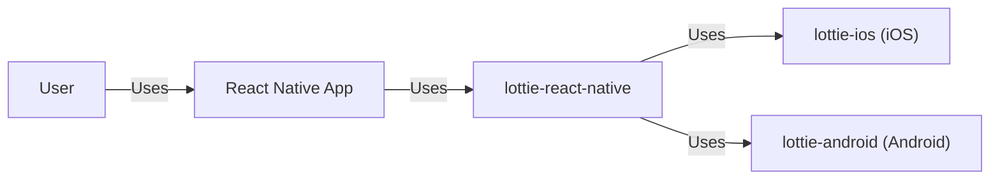
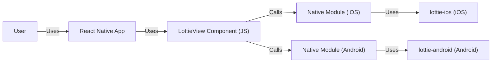
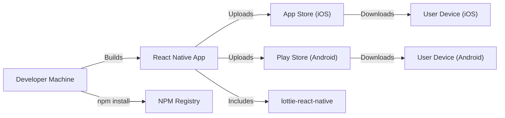
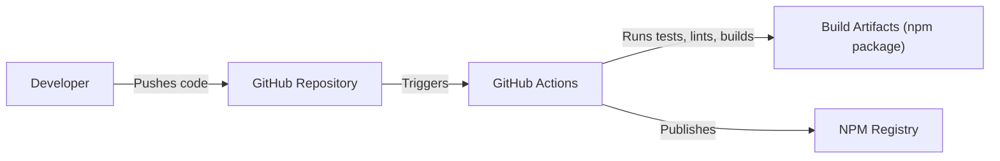

# Project Design Document: lottie-react-native

## BUSINESS POSTURE

*   Priorities and Goals:
    *   Provide a React Native component for rendering Lottie animations.
    *   Maintain high performance and smooth animations.
    *   Ensure compatibility across different React Native versions and platforms (iOS and Android).
    *   Provide an easy-to-use API for developers.
    *   Maintain a vibrant and active open-source community.

*   Business Risks:
    *   Performance issues or crashes leading to poor user experience in applications using the library.
    *   Compatibility issues with specific React Native versions or device configurations, limiting adoption.
    *   Security vulnerabilities that could be exploited in applications using the library.
    *   Lack of maintainer support, leading to unresolved issues and stagnation of the project.
    *   Competition from alternative animation libraries.

## SECURITY POSTURE

*   Existing Security Controls:
    *   security control: The project uses automated builds and tests via GitHub Actions. (Workflows in `.github/workflows`)
    *   security control: Dependency management using npm/yarn, with potential for vulnerability scanning tools to be integrated.
    *   security control: Code style and linting checks are enforced. (eslint configuration)
    *   security control: Basic example app showcasing usage.

*   Accepted Risks:
    *   accepted risk: The library relies on third-party native Lottie libraries (lottie-ios and lottie-android), inheriting any potential vulnerabilities from those dependencies.
    *   accepted risk: Limited built-in input validation, relying on developers to sanitize animation data.
    *   accepted risk: No formal security audits or penetration testing have been conducted.

*   Recommended Security Controls:
    *   security control: Integrate a Software Composition Analysis (SCA) tool (e.g., Snyk, Dependabot) to automatically scan for vulnerabilities in dependencies.
    *   security control: Implement robust input validation to prevent loading malicious Lottie files. This could involve checking file size limits, supported features, and potentially using a schema validator.
    *   security control: Conduct a security review of the native bridge code to identify potential vulnerabilities related to data handling and inter-process communication.
    *   security control: Establish a security policy and vulnerability disclosure process for the project.
    *   security control: Consider adding fuzz testing to test the resilience of the library against malformed input.

*   Security Requirements:

    *   Authentication: Not directly applicable, as the library itself doesn't handle authentication.
    *   Authorization: Not directly applicable.
    *   Input Validation:
        *   The library should validate the input Lottie JSON to ensure it conforms to expected size and structure limitations.
        *   The library should handle potentially malicious or malformed Lottie files gracefully, without crashing or exposing the application to vulnerabilities.
    *   Cryptography: Not directly applicable, unless the library is used to handle encrypted Lottie files (which is not a standard feature).

## DESIGN

### C4 CONTEXT

*   Elements Description:

    *   Element:
        *   Name: User
        *   Type: Person
        *   Description: A user interacting with a React Native application that utilizes the lottie-react-native library.
        *   Responsibilities: Interacts with the UI of the React Native application.
        *   Security controls: None directly applicable to this element in the context of the library.

    *   Element:
        *   Name: React Native App
        *   Type: Software System
        *   Description: A mobile application built using React Native that incorporates Lottie animations via the lottie-react-native library.
        *   Responsibilities: Provides application functionality to the user, including rendering Lottie animations.
        *   Security controls: Application-level security controls, such as input validation, authentication, and authorization, are the responsibility of the application developer.

    *   Element:
        *   Name: lottie-react-native
        *   Type: Software System
        *   Description: This project; a React Native component providing a JavaScript interface to native Lottie libraries.
        *   Responsibilities: Bridges JavaScript calls to native Lottie libraries, manages animation playback, and provides a React component interface.
        *   Security controls: Input validation of Lottie JSON, dependency management, and potential integration with security scanning tools.

    *   Element:
        *   Name: lottie-ios (iOS)
        *   Type: Software System
        *   Description: The native Lottie library for iOS.
        *   Responsibilities: Renders Lottie animations on iOS devices.
        *   Security controls: Security controls implemented within the lottie-ios library itself (external to this project).

    *   Element:
        *   Name: lottie-android (Android)
        *   Type: Software System
        *   Description: The native Lottie library for Android.
        *   Responsibilities: Renders Lottie animations on Android devices.
        *   Security controls: Security controls implemented within the lottie-android library itself (external to this project).

### C4 CONTAINER

*   Elements Description:

    *   Element:
        *   Name: User
        *   Type: Person
        *   Description: A user interacting with a React Native application.
        *   Responsibilities: Interacts with the UI of the React Native application.
        *   Security controls: None directly applicable.

    *   Element:
        *   Name: React Native App
        *   Type: Mobile Application
        *   Description: The application using lottie-react-native.
        *   Responsibilities: Hosts the LottieView component and handles user interactions.
        *   Security controls: Application-specific security controls.

    *   Element:
        *   Name: LottieView Component (JS)
        *   Type: React Component
        *   Description: The JavaScript component provided by lottie-react-native.
        *   Responsibilities: Provides the API for developers to use Lottie animations, handles props, and communicates with the native modules.
        *   Security controls: Basic input validation of props.

    *   Element:
        *   Name: Native Module (iOS)
        *   Type: Native Module
        *   Description: The native iOS code that bridges the JavaScript component to the lottie-ios library.
        *   Responsibilities: Receives calls from the JavaScript component, interacts with lottie-ios, and sends events back to JavaScript.
        *   Security controls: Input validation before passing data to lottie-ios.

    *   Element:
        *   Name: Native Module (Android)
        *   Type: Native Module
        *   Description: The native Android code that bridges the JavaScript component to the lottie-android library.
        *   Responsibilities: Receives calls from the JavaScript component, interacts with lottie-android, and sends events back to JavaScript.
        *   Security controls: Input validation before passing data to lottie-android.

    *   Element:
        *   Name: lottie-ios (iOS)
        *   Type: Library
        *   Description: The native Lottie library for iOS.
        *   Responsibilities: Renders Lottie animations on iOS.
        *   Security controls: Security controls within lottie-ios.

    *   Element:
        *   Name: lottie-android (Android)
        *   Type: Library
        *   Description: The native Lottie library for Android.
        *   Responsibilities: Renders Lottie animations on Android.
        *   Security controls: Security controls within lottie-android.

### DEPLOYMENT

Possible deployment scenarios:

1.  **Bundled with React Native Application:** The most common scenario. The library is included as a dependency in the React Native application, and the native code is linked during the application build process.
2.  **Development Environment:** Developers clone the repository and link it locally to their React Native project for development and testing.

Detailed description of scenario 1 (Bundled with React Native Application):

*   Elements Description:

    *   Element:
        *   Name: Developer Machine
        *   Type: Development Environment
        *   Description: The developer's computer where the React Native application is built.
        *   Responsibilities: Building the application, managing dependencies, and deploying the application.
        *   Security controls: Secure coding practices, use of secure development tools.

    *   Element:
        *   Name: React Native App
        *   Type: Mobile Application
        *   Description: The application being built, which includes lottie-react-native as a dependency.
        *   Responsibilities: The overall application functionality.
        *   Security controls: Application-level security controls.

    *   Element:
        *   Name: App Store (iOS)
        *   Type: Application Store
        *   Description: Apple's App Store for distributing iOS applications.
        *   Responsibilities: Hosting and distributing the iOS application.
        *   Security controls: App Store review process.

    *   Element:
        *   Name: Play Store (Android)
        *   Type: Application Store
        *   Description: Google's Play Store for distributing Android applications.
        *   Responsibilities: Hosting and distributing the Android application.
        *   Security controls: Play Store review process.

    *   Element:
        *   Name: User Device (iOS)
        *   Type: Mobile Device
        *   Description: An iOS device where the application is installed.
        *   Responsibilities: Running the application.
        *   Security controls: Operating system security features.

    *   Element:
        *   Name: User Device (Android)
        *   Type: Mobile Device
        *   Description: An Android device where the application is installed.
        *   Responsibilities: Running the application.
        *   Security controls: Operating system security features.

    *   Element:
        *   Name: NPM Registry
        *   Type: Package Registry
        *   Description: Public registry for JavaScript packages.
        *   Responsibilities: Provides lottie-react-native package.
        *   Security controls: NPM registry security features.

    *   Element:
        *   Name: lottie-react-native
        *   Type: Library
        *   Description: Project library.
        *   Responsibilities: Provides animation functionality.
        *   Security controls: Input validation, dependency management.

### BUILD

The build process for lottie-react-native involves several steps, primarily managed by npm/yarn and automated through GitHub Actions:

*   Build Process Description:

    1.  **Code Commit:** A developer commits code changes to the GitHub repository.
    2.  **GitHub Actions Trigger:** The commit triggers a GitHub Actions workflow (defined in `.github/workflows`).
    3.  **Environment Setup:** The workflow sets up the build environment (e.g., Node.js version, dependencies).
    4.  **Linting:** Code linters (e.g., ESLint) are run to check for code style and potential errors.
    5.  **Testing:** Unit tests and potentially integration tests are executed.
    6.  **Build:** The JavaScript code is transpiled (if necessary), and the native code is compiled (for iOS and Android). This typically involves using tools like `react-native-builder-bob`.
    7.  **Packaging:** The built code is packaged into an npm package.
    8.  **Publish (Optional):** If the workflow is configured for publishing (e.g., on a tagged commit), the npm package is published to the NPM Registry.

*   Security Controls in Build Process:

    *   security control: **Automated Builds:** GitHub Actions ensures consistent and reproducible builds.
    *   security control: **Linting:** Enforces code style and helps prevent common coding errors.
    *   security control: **Testing:** Automated tests help catch bugs and regressions early.
    *   security control: **Dependency Management:** npm/yarn manage dependencies, allowing for vulnerability scanning.
    *   security control: **(Recommended)** Integrate SCA tools (e.g., Snyk, Dependabot) into the GitHub Actions workflow to automatically scan for vulnerabilities in dependencies.
    *   security control: **(Recommended)** Add static code analysis tools to scan for potential security vulnerabilities in the JavaScript and native code.

## RISK ASSESSMENT

*   Critical Business Processes:
    *   Rendering Lottie animations within React Native applications smoothly and reliably.
    *   Maintaining compatibility with various React Native versions and platforms.
    *   Providing a user-friendly API for developers.

*   Data Protection:
    *   **Data:** Lottie animation files (JSON format).
    *   **Sensitivity:** Generally low, as most Lottie animations are not inherently sensitive. However, in some cases, animations *could* contain embedded data or be used in a context where they reveal sensitive information.  The primary concern is malicious Lottie files crafted to exploit vulnerabilities.
    *   **Protection:** Input validation is crucial to prevent loading malicious Lottie files that could exploit vulnerabilities in the native rendering libraries.

## QUESTIONS & ASSUMPTIONS

*   Questions:
    *   Are there any specific performance requirements or limitations for the animations?
    *   Are there any plans to support encrypted or protected Lottie files?
    *   What is the expected frequency of updates and releases?
    *   What level of support is provided for older React Native versions?
    *   Are there any specific device configurations or operating system versions that need to be prioritized?

*   Assumptions:
    *   BUSINESS POSTURE: The primary goal is to provide a stable and performant Lottie animation library for React Native.
    *   SECURITY POSTURE: The project relies on the security of the underlying native Lottie libraries (lottie-ios and lottie-android).
    *   DESIGN: The library will be primarily used by embedding it within React Native applications.
    *   DESIGN: Developers are responsible for providing valid Lottie JSON data.
    *   DESIGN: The library will be distributed via npm.
    *   DESIGN: GitHub Actions will be used for continuous integration and potentially continuous delivery.