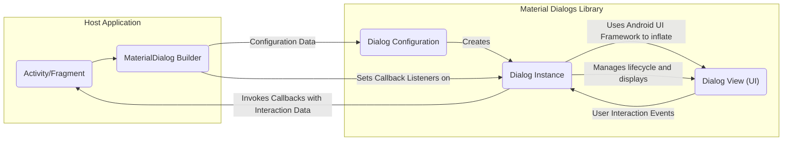

# Project Design Document: Material Dialogs Library

**Version:** 1.1
**Date:** October 26, 2023
**Author:** AI Software Architect

## 1. Project Overview

This document outlines the design of the Material Dialogs library for Android, as represented by the project at [https://github.com/afollestad/material-dialogs](https://github.com/afollestad/material-dialogs). This library provides a fluent and customizable API for creating and displaying dialogs that adhere to Material Design principles within Android applications. This document will serve as a basis for subsequent threat modeling activities, focusing on the library's internal workings and potential security considerations.

## 2. Goals

*   Provide a simple and intuitive API for creating various types of dialogs (e.g., basic, confirmation, input, list, custom).
*   Offer extensive customization options for dialog appearance (theming, styling) and behavior (button actions, dismiss listeners).
*   Adhere to Material Design guidelines to ensure a consistent and modern user experience within Android applications.
*   Simplify the process of displaying common dialog patterns, reducing the need for developers to write repetitive boilerplate code.
*   Improve developer productivity by offering a well-structured and easy-to-use library for dialog management.

## 3. Non-Goals

*   Implementing complex business logic or data processing directly within the dialogs. The library's primary focus is on presentation and user interaction.
*   Providing network communication capabilities (e.g., fetching data to display in a list dialog). This remains the responsibility of the host application.
*   Offering data persistence mechanisms. The library does not handle saving or retrieving data beyond the immediate dialog interaction.
*   Implementing custom UI components beyond the scope of standard Material Design elements and the library's provided building blocks.
*   Supporting older Android versions beyond the library's stated compatibility range.

## 4. Architecture

The Material Dialogs library employs a builder pattern for constructing dialog instances, promoting a fluent and readable API. The interaction between key components is illustrated below:



**Explanation:**

*   **Host Application (Activity/Fragment):** The Android component that initiates the dialog creation process by interacting with the `MaterialDialog Builder`.
*   **MaterialDialog Builder:** A class within the library providing a chainable API for configuring all aspects of the dialog, such as title, message, buttons, items, and input fields.
*   **Dialog Configuration:** An internal object that holds all the configuration parameters specified through the `MaterialDialog Builder`. This object is used to create the `Dialog Instance`.
*   **Dialog Instance:** The core `MaterialDialog` object. It manages the dialog's lifecycle (creation, showing, dismissal), inflates the appropriate layout, and handles user interaction events.
*   **Dialog View (UI):** The actual Android `View` hierarchy representing the visual elements of the dialog. This is constructed by inflating layout XML files using the Android UI framework.
*   **Callback Listeners:** Interfaces defined by the library that the host application implements to receive notifications about user interactions within the dialog (e.g., button clicks, item selections, input text changes).

## 5. Data Flow

The flow of data within the library during the dialog creation and interaction process is as follows:

*   **Configuration Input:** The host application provides configuration data to the `MaterialDialog Builder` through its various methods. This data includes:
    *   Textual content (title, message, button labels, input hints).
    *   Resource IDs for icons and other visual elements.
    *   Lists of items for list dialogs.
    *   Callbacks to handle user interactions.
    *   Theming and styling information.
*   **Configuration Processing:** The `MaterialDialog Builder` stores this configuration data and uses it to create a `Dialog Configuration` object.
*   **Dialog Initialization:** The `Dialog Instance` receives the `Dialog Configuration` and uses it to:
    *   Inflate the appropriate layout XML based on the dialog type.
    *   Populate the UI elements in the inflated view with the provided data (e.g., setting `TextView` text, populating `RecyclerView` with list items).
    *   Set up listeners for user interactions on buttons and other interactive elements.
*   **User Interaction:** When the user interacts with the dialog (e.g., clicks a button, enters text), the Android UI framework triggers events.
*   **Callback Invocation:** The `Dialog Instance` handles these user interaction events and invokes the corresponding callback listeners registered by the host application. The data passed in these callbacks includes:
    *   Information about the specific interaction (e.g., which button was clicked).
    *   User input from input dialogs (text entered).
    *   The index or data of selected items in list dialogs.

## 6. Key Components

*   **`MaterialDialog` Class:** The central class responsible for managing the dialog's lifecycle, displaying the UI, and handling user interactions. It extends Android's `AlertDialog` or `Dialog` class.
*   **`MaterialDialog.Builder` Class:** Provides a fluent and expressive API for configuring and creating `MaterialDialog` instances. It handles different dialog types and various customization options.
*   **Dialog Layouts (XML):** Defines the structure and arrangement of UI elements for different dialog types (e.g., `dialog_basic.xml`, `dialog_input.xml`, `dialog_list.xml`). These layouts utilize standard Android UI components.
*   **Button Handling Logic:** Manages the behavior of positive, negative, and neutral buttons, including setting click listeners and invoking associated callbacks.
*   **List Adapters and ViewHolders:** For list dialogs, efficient data binding and view recycling are handled using `RecyclerView.Adapter` and `RecyclerView.ViewHolder` implementations.
*   **Input Handling Logic:** For input dialogs, manages the `EditText` field, retrieves user input, and may provide basic input type configuration.
*   **Theme and Style Management:** Allows customization of the dialog's appearance through Android themes and style attributes, providing a consistent look and feel.
*   **Callback Interfaces (e.g., `onPositive`, `onNegative`, `onItemSelected`):** Defines interfaces for the host application to receive notifications about user interactions within the dialog.

## 7. Security Considerations (Initial)

This section outlines initial security considerations relevant to the Material Dialogs library. A more detailed threat model will be developed based on this design.

*   **Improper Handling of User-Provided Data (Configuration):** While the library primarily displays data, if the host application provides untrusted or unsanitized data for display (e.g., in the message or list items), this could potentially lead to UI rendering issues or, in extreme cases, vulnerabilities if the underlying Android components have exploitable rendering flaws.
*   **Callback Injection/Manipulation:**  The library relies on callbacks to communicate user interactions back to the host application. While unlikely within the library's scope, vulnerabilities in the host application's handling of these callbacks could be exploited.
*   **Information Disclosure through Logging/Error Handling:**  Care should be taken to avoid logging sensitive information within the library's internal workings or error messages that could be exposed.
*   **Insecure Defaults:**  The library should strive for secure defaults in its configuration and behavior. For example, default button actions should not perform potentially dangerous operations without explicit configuration.
*   **Potential for UI Redressing/Clickjacking (Limited):** While less likely for standard dialogs, if custom views or complex layouts are used within the dialog, there's a theoretical risk of UI redressing or clickjacking if not implemented carefully.
*   **Dependency Vulnerabilities:**  As with any software, vulnerabilities in the library's dependencies could pose a security risk. Regular updates and dependency checks are important.
*   **Custom View Security (If Supported):** If the library allows embedding custom views, the security of those custom views becomes the responsibility of the developer providing them. The library should provide clear guidance on this. (Note: This library primarily uses its own defined layouts).
*   **Locale Handling:** Ensure proper handling of different locales to prevent unexpected behavior or display issues that could be exploited.

## 8. Deployment Model

The Material Dialogs library is deployed as a standard Android library dependency. Developers integrate it into their Android projects by adding the appropriate dependency declaration to their module-level `build.gradle` file:

```gradle
dependencies {
    // ... other dependencies
    implementation("com.afollestad.material-dialogs:core:3.3.0") // Example
    implementation("com.afollestad.material-dialogs:input:3.3.0") // Example for input dialogs
    // ... other modules if needed
}
```

Once the dependency is added, developers can use the `MaterialDialog.Builder` class within their Activities or Fragments to create and display dialogs.

## 9. Assumptions and Constraints

*   **Android Platform:** The library is designed specifically for the Android platform and relies on the Android SDK.
*   **Material Design Principles:** The library aims to adhere to Google's Material Design guidelines for visual appearance and user interaction patterns.
*   **Host Application Responsibility:** The host application is responsible for:
    *   Providing valid and safe data to the dialogs.
    *   Properly handling the callbacks received from the dialogs.
    *   Ensuring the overall security of the application.
*   **UI Thread Execution:** Dialog creation and interaction primarily occur on the main UI thread of the Android application.
*   **Dependency Management:** Developers are responsible for managing the library's dependencies and ensuring they are up-to-date.
*   **No Implicit Permissions:** The library itself should not require any sensitive Android permissions beyond what is necessary for basic UI rendering.
