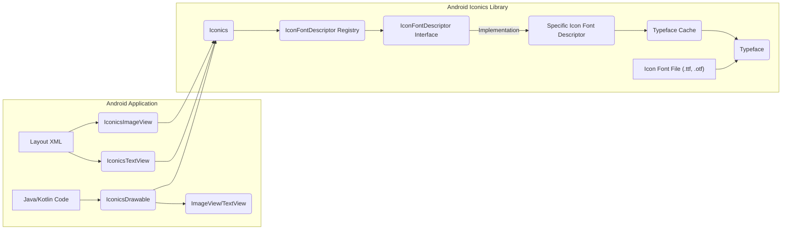
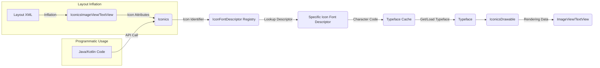

# Project Design Document: Android Iconics Library

**Project Link:** [https://github.com/mikepenz/android-iconics](https://github.com/mikepenz/android-iconics)

**Version:** 1.1

**Date:** October 26, 2023

## 1. Introduction

The Android Iconics library is a lightweight Android library designed to simplify the integration and styling of vector-based icon fonts within Android applications. It provides a flexible and performant way to utilize icons from various icon font providers, enhancing the visual appeal and scalability of Android UIs. This document details the architectural design of the library, serving as a foundation for subsequent threat modeling activities.

## 2. Goals

*   **Ease of Use:** Provide a straightforward API for developers to integrate and use icon fonts in both XML layouts and programmatically within their Android applications.
*   **Broad Icon Font Support:**  Facilitate the integration of a wide range of popular icon font libraries through a plugin mechanism.
*   **Customization Flexibility:** Offer extensive customization options for icon appearance, including color, size, padding, and more.
*   **Performance Optimization:** Ensure efficient rendering of icons to minimize performance impact on the host application.
*   **Lightweight Core:** Maintain a small core library with minimal dependencies to reduce the application's footprint.
*   **Extensibility:**  Enable the development of extension modules for adding support for new icon fonts or specialized functionalities.

## 3. Non-Goals

*   **Bundling Icon Fonts:** The library will not include any icon font files directly. It is the responsibility of the integrating application to provide the necessary font files.
*   **Advanced Icon Animation:**  Complex or timeline-based icon animations are outside the scope of this library. Basic tinting and resizing are supported.
*   **General Vector Graphics Manipulation:** The library is specifically focused on icon font rendering and is not intended as a general-purpose vector graphics library.
*   **Icon Font Licensing Management:** The library does not handle the licensing or distribution aspects of icon fonts. Developers are responsible for adhering to the licenses of the icon fonts they use.

## 4. Architecture Overview

## 5. Component Details

*   **Layout XML:**  Standard Android XML layout files where custom `IconicsImageView` and `IconicsTextView` components are declared.
    *   **Functionality:** Defines the structure and initial properties of UI elements, including the specification of icons via attributes.
    *   **Input:** XML layout definitions with attributes like `ico_icon`, `ico_color`, etc.
    *   **Output:** Instantiated `IconicsImageView` or `IconicsTextView` objects within the Android view hierarchy.
    *   **Reasoning:** Provides a declarative way to integrate icons into the UI.
    *   **Dependencies:** Android View system.

*   **IconicsImageView:** A custom `ImageView` subclass responsible for rendering icons based on attributes set in the layout XML or programmatically.
    *   **Functionality:** Extends `ImageView` to handle icon-specific attributes and delegate rendering to `IconicsDrawable`.
    *   **Input:** Icon identifier string (e.g., "faw-android"), styling attributes (color, size).
    *   **Output:** Displays the rendered vector icon within its bounds.
    *   **Reasoning:** Offers a direct replacement for `ImageView` with built-in icon support.
    *   **Dependencies:** `Iconics`, Android `ImageView`.

*   **IconicsTextView:** A custom `TextView` subclass that allows embedding icons within the text content using a specific syntax.
    *   **Functionality:** Extends `TextView` to parse text for icon identifiers and render them inline.
    *   **Input:** Text containing icon identifiers (e.g., "{faw-android}"), styling attributes.
    *   **Output:** Displays text with embedded icons.
    *   **Reasoning:** Enables the integration of icons directly within textual content.
    *   **Dependencies:** `Iconics`, Android `TextView`.

*   **Java/Kotlin Code:**  Application code where the `Iconics` API is used to programmatically create and configure `IconicsDrawable` instances.
    *   **Functionality:** Allows dynamic creation and manipulation of icon drawables.
    *   **Input:** Icon identifier, styling parameters, `Context`.
    *   **Output:** `IconicsDrawable` instance.
    *   **Reasoning:** Provides programmatic control over icon rendering.
    *   **Dependencies:** `Iconics`.

*   **Iconics:** The central class of the library, providing the main API for registering icon fonts, retrieving icons, and managing the `Typeface` cache.
    *   **Functionality:** Acts as a facade for the library's core functionalities.
    *   **Input:** Icon identifier, styling parameters, `Context`.
    *   **Output:** `IconicsDrawable` instances, manages icon font registration.
    *   **Reasoning:**  Provides a single entry point for interacting with the library.
    *   **Dependencies:** `IconFontDescriptor Registry`, `Typeface Cache`.

*   **IconicsDrawable:** A custom `Drawable` implementation responsible for rendering the vector icon using the specified `Typeface` and styling.
    *   **Functionality:** Handles the drawing of the icon onto the Android `Canvas`.
    *   **Input:** Icon identifier, color, size, other styling attributes, `Typeface`.
    *   **Output:** A drawable that can be used as the source of an `ImageView` or as compound drawables for a `TextView`.
    *   **Reasoning:** Encapsulates the icon rendering logic.
    *   **Dependencies:** Android `Drawable`, `Typeface`.

*   **IconFontDescriptor Registry:** A component that holds a collection of registered `IconFontDescriptor` implementations.
    *   **Functionality:** Manages the available icon font definitions.
    *   **Input:** `IconFontDescriptor` implementations.
    *   **Output:**  Provides access to registered `IconFontDescriptor` instances based on font prefixes.
    *   **Reasoning:** Allows the library to support multiple icon fonts.
    *   **Dependencies:** `IconFontDescriptor Interface`.

*   **IconFontDescriptor Interface:** Defines the contract that specific icon font descriptor implementations must adhere to.
    *   **Functionality:** Specifies the methods required to retrieve information about an icon font (e.g., mapping between identifiers and character codes).
    *   **Input:** None (interface definition).
    *   **Output:**  Defines the structure for icon font metadata access.
    *   **Reasoning:** Enables a plugin-based architecture for supporting different icon fonts.
    *   **Dependencies:** None.

*   **Specific Icon Font Descriptor:** Concrete implementations of the `IconFontDescriptor` interface for individual icon font libraries (e.g., Font Awesome, Material Design Icons).
    *   **Functionality:** Provides the specific logic to map icon identifiers to character codes within a particular font.
    *   **Input:** Icon font metadata (e.g., font name, character mappings).
    *   **Output:** Methods to retrieve character codes for given icon identifiers.
    *   **Reasoning:** Bridges the gap between the library and specific icon font formats.
    *   **Dependencies:** None.

*   **Typeface Cache:** A cache to store loaded `Typeface` objects in memory to avoid repeatedly loading font files from disk.
    *   **Functionality:** Optimizes performance by reusing loaded font resources.
    *   **Input:** Font file path or identifier.
    *   **Output:** `Typeface` object.
    *   **Reasoning:** Improves icon rendering speed and reduces resource consumption.
    *   **Dependencies:** Android `Typeface`.

*   **Typeface:** Android's class for representing font faces.
    *   **Functionality:** Provides the underlying font data used for rendering text and icons.
    *   **Input:** Font file (.ttf, .otf).
    *   **Output:** Renderable font data.
    *   **Reasoning:**  The fundamental building block for text and icon rendering.
    *   **Dependencies:** Android OS.

*   **Icon Font File (.ttf, .otf):** The actual font files containing the vector icon glyph definitions.
    *   **Functionality:** Contains the visual representation of the icons.
    *   **Input:** None (static files bundled with the application).
    *   **Output:** Font data used by the `Typeface` object.
    *   **Reasoning:** The source of the icon visuals.
    *   **Dependencies:** None (external resource).

## 6. Data Flow

**Data Flow Description:**

1. **Layout Inflation:** When Android inflates a layout containing `IconicsImageView` or `IconicsTextView`, the library extracts icon-related attributes.
2. **Programmatic Usage:** Developers can directly call methods on the `Iconics` class to request an `IconicsDrawable`.
3. **Icon Font Descriptor Resolution:** The `Iconics` class uses the icon identifier's prefix to look up the appropriate `Specific Icon Font Descriptor` from the `IconFontDescriptor Registry`.
4. **Character Code Retrieval:** The `Specific Icon Font Descriptor` maps the icon identifier to its corresponding character code within the font.
5. **Typeface Management:** The character code is used as a key to retrieve the `Typeface` from the `Typeface Cache`. If not present, the `Typeface` is loaded from the font file.
6. **Drawable Creation:** An `IconicsDrawable` is instantiated using the retrieved `Typeface` and any specified styling parameters.
7. **Rendering:** The `IconicsDrawable` is then set as the source for the `ImageView` or used to render icons within the `TextView`.

## 7. Security Considerations (Initial)

*   **Icon Font Source Integrity:**
    *   **Concern:** Maliciously crafted icon font files could potentially exploit vulnerabilities in the font rendering libraries or the operating system.
    *   **Mitigation:** Developers should only include icon font files from trusted sources and consider implementing integrity checks (e.g., checksum verification) for these files.
*   **Dependency Management:**
    *   **Concern:** While the core library has minimal dependencies, extension modules or the icon font files themselves could introduce vulnerabilities.
    *   **Mitigation:** Carefully vet all dependencies and regularly update them to address known security issues. Utilize dependency scanning tools.
*   **Resource Loading and Path Traversal:**
    *   **Concern:** If the library were to dynamically load icon fonts based on user input (which it doesn't by design), path traversal vulnerabilities could allow access to arbitrary files.
    *   **Mitigation:** The current design mitigates this by relying on statically bundled assets. Avoid introducing dynamic font loading based on untrusted input.
*   **Denial of Service (DoS):**
    *   **Concern:**  Excessive requests for complex icons or a large number of different icons could potentially strain resources and lead to performance degradation or DoS.
    *   **Mitigation:** Implement appropriate resource management and consider limiting the number of dynamically rendered icons in performance-critical areas.
*   **Data Injection (Indirect):**
    *   **Concern:** If user-provided data is used to construct icon identifiers without proper sanitization, it could lead to unexpected icon rendering or potentially trigger unintended behavior if icon identifiers have special meanings.
    *   **Mitigation:** Sanitize and validate any user input that influences icon selection or styling.
*   **Typeface Loading Vulnerabilities:**
    *   **Concern:** Potential vulnerabilities in the underlying Android `Typeface` loading mechanism could be exploited through crafted font files.
    *   **Mitigation:** Keep the target Android API level up-to-date to benefit from platform security patches.
*   **Information Disclosure:**
    *   **Concern:** While less direct, if error messages or logging inadvertently reveal information about the included icon fonts or internal library workings, it could aid attackers in reconnaissance.
    *   **Mitigation:**  Review logging and error handling to avoid exposing sensitive information.

## 8. Deployment Model

The Android Iconics library is distributed as an Android Archive (AAR) file, typically hosted on Maven Central or similar repositories. Developers integrate the library into their Android projects by adding a dependency declaration to their application's `build.gradle` file. The icon font files are generally included as assets within the application's APK. Specific icon font support is often added through separate dependency declarations for the corresponding icon font descriptor modules.

## 9. Technology Stack

*   **Programming Languages:** Kotlin, Java
*   **Build Tool:** Gradle
*   **Android SDK:**  Targeting a minimum and compile SDK version as defined in the library's `build.gradle`.
*   **Icon Font Formats:** TTF (TrueType Font), OTF (OpenType Font)
*   **Distribution:** Maven Central (or similar)

## 10. Assumptions and Constraints

*   **Assumption:** Developers will correctly include and manage the licensing of the icon font files used in their applications.
*   **Assumption:** The icon font files are valid and conform to the TTF or OTF specifications.
*   **Constraint:** The library's rendering capabilities are limited by the features provided by the Android `Canvas` and `Typeface` classes.
*   **Constraint:** Performance can be impacted by the complexity of the icon paths within the font files and the number of icons being rendered simultaneously.
*   **Constraint:** The correct functioning of the library relies on accurate implementations of the `IconFontDescriptor` interface for each supported icon font.
*   **Constraint:** The library assumes a standard Android application environment and may not function correctly in highly customized or restricted environments.
