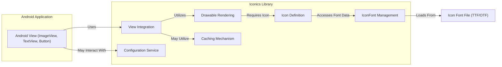
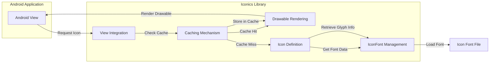

# Project Design Document: Android Iconics Library

**Version:** 1.1
**Date:** October 26, 2023
**Author:** Gemini (AI Language Model)

## 1. Introduction

This document provides a detailed design overview of the `android-iconics` library, an open-source Android library that simplifies the use of vector-based icons (font icons) within Android applications. This document is specifically tailored to serve as a foundation for subsequent threat modeling activities by providing a comprehensive understanding of the library's architecture and functionality.

## 2. Goals and Objectives

The primary goals of this design document are to:

*   Provide a clear and detailed description of the architecture and individual components of the `android-iconics` library.
*   Illustrate the data flow and interactions between the library's components and the integrating Android application.
*   Identify key areas and components that are relevant for security considerations and the subsequent threat modeling process.
*   Establish a common understanding of the library's internal workings for security analysts and developers.

## 3. Scope

This document covers the design of the core functionalities within the `android-iconics` library, including:

*   The process of loading and managing icon font resources.
*   The mechanism for mapping icon identifiers to specific glyphs within loaded fonts.
*   The rendering pipeline for displaying icons in various Android UI elements (e.g., `ImageView`, `TextView`, `Button`).
*   The customization options available for modifying the appearance of rendered icons (color, size, padding, etc.).
*   The implementation and behavior of the internal caching mechanisms used for performance optimization.

This document explicitly excludes:

*   The internal structure and encoding of specific icon font files (e.g., the detailed structure of `.ttf` or `.otf` files).
*   The specifics of the library's build process, release management, or distribution channels.
*   The design and implementation of example applications or demonstration code that utilize the library.

## 4. High-Level Architecture

The `android-iconics` library interacts with the host Android application through a set of well-defined interfaces and can be conceptually broken down into the following key modules:

*   **"IconFont Management":** Responsible for loading, parsing, and storing icon font data.
*   **"Icon Definition":** Represents individual icons within a font and their associated metadata.
*   **"Drawable Rendering":**  Handles the creation and styling of `Drawable` objects for displaying icons.
*   **"View Integration":** Provides helper classes and extension functions to simplify the integration with standard Android UI elements.
*   **"Caching Mechanism":**  Implements caching to improve performance by reusing rendered icon drawables.
*   **"Configuration Service":**  Allows for global customization of the library's behavior.

## 5. Detailed Design

### 5.1. IconFont Management

*   **Purpose:** To manage the lifecycle of icon font resources within the library.
*   **Responsibilities:**
    *   Loading font data from asset files, resource files, or potentially external sources.
    *   Parsing the font file to extract glyph information and metadata.
    *   Storing the parsed font data in an efficient and accessible manner.
    *   Providing access to individual `Icon` definitions within the loaded fonts.
*   **Key Components:**
    *   `IconFontCache`: A central registry for storing loaded `IconFont` instances, keyed by their identifier.
    *   `IconFontLoader`: Responsible for the actual process of loading and parsing font files. Different loaders might exist for different font sources.
*   **Implementation Details:**
    *   Leverages Android's `Typeface` class for handling font data.
    *   Parsing involves interpreting the font file format to map character codes to glyph outlines.

### 5.2. Icon Definition

*   **Purpose:** To represent a single, identifiable icon within a loaded font.
*   **Responsibilities:**
    *   Holding the unique identifier (name or key) of the icon.
    *   Providing access to the corresponding glyph information (character code, font family) within its associated `IconFont`.
    *   Potentially storing metadata about the icon (e.g., tags, descriptions).
*   **Key Components:**
    *   `Icon`: An interface or abstract class defining the common properties of an icon.
    *   Concrete `Icon` implementations (often enums) that represent the available icons within a specific font.
*   **Implementation Details:**
    *   Icon identifiers are typically strings or enum values.
    *   The glyph information is retrieved from the associated `IconFont` instance.

### 5.3. Drawable Rendering

*   **Purpose:** To create and style `Drawable` objects that visually represent icons.
*   **Responsibilities:**
    *   Taking an `Icon` object and styling parameters (color, size, etc.) as input.
    *   Creating an `IconicsDrawable` instance.
    *   Drawing the icon glyph onto the `Canvas` within the `IconicsDrawable`.
    *   Applying the specified styling attributes.
*   **Key Components:**
    *   `IconicsDrawable`: A custom `Drawable` subclass responsible for rendering icons.
    *   `IconicsPaint`:  A utility class for managing `Paint` objects used for drawing the icon.
*   **Implementation Details:**
    *   Utilizes Android's `Canvas` and `Paint` classes for drawing operations.
    *   Retrieves the glyph character code from the associated `Icon`.
    *   Applies transformations and styling based on the configured attributes of the `IconicsDrawable`.

### 5.4. View Integration

*   **Purpose:** To provide convenient and streamlined ways to display icons in standard Android UI elements.
*   **Responsibilities:**
    *   Offering extension functions or helper methods for common `View` classes like `ImageView`, `TextView`, and `Button`.
    *   Simplifying the process of creating and setting `IconicsDrawable` instances on these views.
    *   Handling the underlying logic of setting the drawable (e.g., using `setImageDrawable` or `setCompoundDrawablesWithIntrinsicBounds`).
*   **Key Components:**
    *   Extension functions for `ImageView` (e.g., `setIconicsDrawable`).
    *   Extension functions for `TextView` (e.g., `setLeftIcon`, `setRightIcon`).
    *   Helper classes or builder patterns for creating styled `IconicsDrawable` instances.
*   **Implementation Details:**
    *   Leverages Android's built-in methods for setting drawables on views.

### 5.5. Caching Mechanism

*   **Purpose:** To enhance performance by storing and reusing previously rendered `IconicsDrawable` instances.
*   **Responsibilities:**
    *   Storing created `IconicsDrawable` objects based on a key derived from their configuration (icon, color, size, etc.).
    *   Retrieving cached drawables when an identical request is made.
    *   Managing the cache's size and eviction policy to prevent excessive memory usage.
*   **Key Components:**
    *   `IconicsCache`:  The central component responsible for managing the cache.
    *   Internal cache storage (e.g., `LruCache` or a similar implementation).
*   **Implementation Details:**
    *   Uses a caching mechanism like `LruCache` to store `IconicsDrawable` instances in memory.
    *   The cache key typically includes the icon identifier and relevant styling attributes.

### 5.6. Configuration Service

*   **Purpose:** To provide a centralized point for configuring the library's global settings and behavior.
*   **Responsibilities:**
    *   Allowing developers to set default values for icon color, size, and other styling options.
    *   Providing mechanisms for registering custom `IconFont` implementations or loaders.
    *   Offering options for controlling the behavior of the caching mechanism (e.g., enabling/disabling, setting maximum size).
*   **Key Components:**
    *   `Iconics`: A singleton class or a set of static methods providing access to configuration options.
    *   Configuration properties (e.g., default color, default size, cache settings).
*   **Implementation Details:**
    *   Often implemented using a singleton pattern to ensure a single point of access to configuration settings.

## 6. Data Flow

The typical sequence of operations when an icon is requested and rendered involves the following steps:

1. The Android View (e.g., an `ImageView`) requires an icon to be displayed, typically initiated through the `View Integration` components.
2. The `View Integration` layer first interacts with the `Caching Mechanism` to check if a pre-rendered `Drawable` for the requested icon and style exists in the cache.
3. **Cache Hit:** If a matching `Drawable` is found, it is retrieved from the `Caching Mechanism` and passed directly to the `Drawable Rendering` component (or directly back to the View).
4. **Cache Miss:** If no matching `Drawable` is found in the cache:
    *   The `View Integration` component interacts with the `Icon Definition` component to identify the specific icon being requested.
    *   The `Icon Definition` component utilizes the `IconFont Management` component to access the necessary font data. If the font is not already loaded, `IconFont Management` will load and parse the `Icon Font File`.
    *   The `Icon Definition` component retrieves the glyph information (character code, etc.) from the loaded font data.
    *   The `Drawable Rendering` component takes the `Icon` and any specified styling parameters and creates a new `IconicsDrawable`.
    *   The newly rendered `IconicsDrawable` is then passed back to the `View Integration` component and subsequently set on the Android View for display.
    *   The `Drawable Rendering` component might also interact with the `Caching Mechanism` to store the newly created `Drawable` for future use.

## 7. Security Considerations (Detailed)

Considering the architecture and data flow, potential security considerations for threat modeling include:

*   **Malicious Font Files (IconFont Management):** If the application, through configuration or unintended usage, allows loading arbitrary font files, a maliciously crafted font file could exploit vulnerabilities in the font parsing logic within the `IconFont Management` component. This could potentially lead to:
    *   **Buffer overflows:** If the parser doesn't handle malformed font data correctly.
    *   **Denial of Service (DoS):** By providing extremely large or complex font files that consume excessive resources during parsing.
    *   **Code execution (less likely but possible):** In highly complex scenarios involving vulnerabilities in the underlying font rendering libraries.
*   **Resource Exhaustion through Cache Manipulation (Caching Mechanism):** An attacker might try to manipulate the cache by repeatedly requesting icons with unique styling parameters to bypass the cache and force the creation of numerous `Drawable` objects, leading to:
    *   **Memory exhaustion:**  Causing the application to crash due to excessive memory usage.
    *   **Performance degradation:**  Slowing down the application due to the overhead of creating and managing a large number of uncached drawables.
*   **Data Integrity Issues (Caching Mechanism):** Although less probable, vulnerabilities in the `Caching Mechanism` could potentially lead to:
    *   **Serving incorrect icons:** If the cache key generation or retrieval logic is flawed, the application might display the wrong icon.
    *   **Cache poisoning:**  If an attacker can somehow inject malicious or incorrect `Drawable` objects into the cache.
*   **Information Disclosure (Icon Definition):** While not a direct vulnerability in the library itself, if icon identifiers or naming conventions reveal sensitive information about the application's functionality, this could be a minor information disclosure risk.
*   **Injection Vulnerabilities (View Integration - Indirect):** While the library primarily deals with rendering static icons, if the application logic incorrectly incorporates user input into icon identifiers or styling parameters passed to the `View Integration` components, it could potentially lead to unexpected behavior or, in extreme cases, be a vector for other vulnerabilities in the application's rendering pipeline.
*   **Dependency Vulnerabilities:** The `android-iconics` library itself depends on the Android framework. Vulnerabilities within the underlying Android framework's font rendering or drawing capabilities could indirectly affect the security of applications using this library.

## 8. Deployment

The `android-iconics` library is typically integrated into Android application projects as a dependency managed by build tools like Gradle. Developers add the library's coordinates to their module-level `build.gradle` file.

## 9. Assumptions and Constraints

*   The security of the underlying Android platform's font rendering and drawing capabilities is assumed.
*   Developers are responsible for ensuring the integrity and trustworthiness of the icon font files they include in their applications.
*   The library's primary function is to render vector icons; it does not handle network communication, data storage, or other potentially sensitive operations directly.

## 10. Future Considerations

*   Implementing more robust input validation and sanitization within the `IconFont Management` component to mitigate risks associated with malicious font files.
*   Exploring more sophisticated caching strategies with configurable eviction policies and size limits.
*   Providing mechanisms for verifying the integrity of loaded font files.
*   Regularly updating dependencies to address potential vulnerabilities in the underlying Android framework.

This improved design document provides a more detailed and nuanced understanding of the `android-iconics` library's architecture and functionality, specifically focusing on aspects relevant to security considerations and threat modeling. The expanded descriptions of components, refined data flow, and more specific examples of potential threats should facilitate a more thorough and effective threat modeling process.