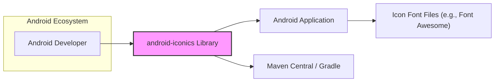
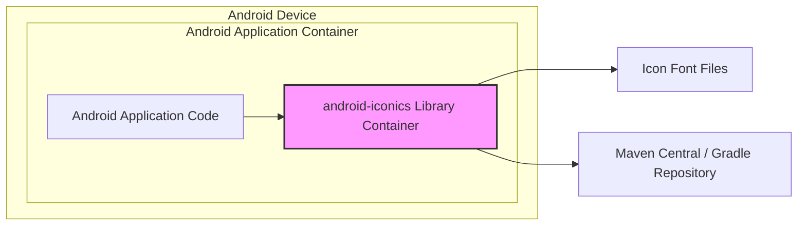
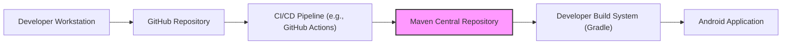
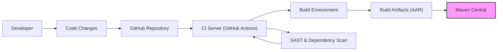

# BUSINESS POSTURE

- Business Priorities and Goals:
  - The primary goal of the android-iconics project is to provide Android developers with a convenient and efficient way to integrate icon fonts into their applications.
  - This aims to improve the visual appeal and user experience of Android applications by simplifying the use of vector icons.
  - The project prioritizes ease of use, flexibility in icon font selection, and seamless integration into the Android development workflow.

- Business Risks:
  - Supply Chain Risks: As a library consumed by other projects, any compromise in the android-iconics library could propagate to dependent applications, posing a supply chain risk. This includes risks related to compromised dependencies or malicious code injection into the library itself.
  - Availability Risks: If the library becomes unavailable or unusable due to unforeseen issues (e.g., repository compromise, critical bugs), developers relying on it may face disruptions in their development process and application updates.
  - Reputational Risk: Security vulnerabilities or malicious code found in the library could damage the reputation of the project and potentially impact the trust of developers using it.
  - Maintainability Risk: Lack of active maintenance and updates could lead to the library becoming outdated, incompatible with newer Android versions, or vulnerable to newly discovered security threats.

# SECURITY POSTURE

- Existing Security Controls:
  - security control: Open Source Code Review - The project is hosted on GitHub and is open source, allowing for community review of the code. This can help identify potential security vulnerabilities and improve code quality. Implemented: GitHub Repository.
  - security control: Version Control - The project uses Git for version control, providing traceability of changes and the ability to revert to previous versions if necessary. Implemented: GitHub Repository.
  - security control: Dependency Management - The project uses Gradle for dependency management, allowing for controlled inclusion of external libraries. Implemented: build.gradle files.

- Accepted Risks:
  - accepted risk: Reliance on Third-Party Icon Fonts - The library depends on external icon font files, which are not directly controlled by the project. The security and licensing of these external fonts are implicitly accepted risks.
  - accepted risk: Open Source Vulnerabilities - As an open-source project, vulnerabilities might be discovered and publicly disclosed before a fix is available. The risk of exploitation during this window is implicitly accepted.

- Recommended Security Controls:
  - security control: Dependency Scanning - Implement automated dependency scanning to identify known vulnerabilities in the project's dependencies.
  - security control: Static Application Security Testing (SAST) - Integrate SAST tools into the build process to automatically scan the codebase for potential security vulnerabilities.
  - security control: Software Bill of Materials (SBOM) Generation - Generate SBOM for each release to provide transparency into the components included in the library, aiding in vulnerability management for consumers.
  - security control: Code Signing - Sign the released artifacts (e.g., AAR files) to ensure integrity and authenticity, allowing consumers to verify that the library has not been tampered with.
  - security control: Regular Security Audits - Conduct periodic security audits of the codebase and build process to proactively identify and address potential security weaknesses.

- Security Requirements:
  - Authentication: Not applicable - The library itself does not handle user authentication as it is a client-side library.
  - Authorization: Not applicable - The library does not enforce authorization as it operates within the context of the application using it.
  - Input Validation:
    - The library should validate any input it receives, such as icon names or font paths, to prevent unexpected behavior or potential vulnerabilities.
    - Input validation should be implemented to ensure that only expected and safe values are processed.
    - Validation should occur at the point of input to prevent issues from propagating through the library.
  - Cryptography: Not applicable - The library is not expected to perform cryptographic operations. If cryptography were to be introduced, it would require careful design and implementation to ensure security.

# DESIGN

## C4 CONTEXT

- Context Diagram Elements:
  - - Name: Android Developer
    - Type: Person
    - Description: Software developers who use the android-iconics library to integrate icon fonts into their Android applications.
    - Responsibilities: Integrate the android-iconics library into their Android projects, select and use icon fonts, and ensure proper usage within their applications.
    - Security controls: Responsible for securely integrating and using the library within their applications, following secure coding practices in their own projects.

  - - Name: android-iconics Library
    - Type: Software System
    - Description: An Android library that simplifies the integration of icon fonts into Android applications. It provides APIs to easily use icons from various icon font libraries within Android layouts and code.
    - Responsibilities: Provide a convenient API for Android developers to use icon fonts, handle icon rendering and management, and support various icon font libraries.
    - Security controls: Input validation, dependency scanning, SAST, SBOM generation, code signing, regular security audits.

  - - Name: Android Application
    - Type: Software System
    - Description: Android applications developed by Android developers that utilize the android-iconics library to display icons.
    - Responsibilities: Display icons using the android-iconics library, handle user interactions, and provide application functionality.
    - Security controls: Application-level security controls, secure coding practices, input validation, authorization, data protection within the application.

  - - Name: Icon Font Files (e.g., Font Awesome)
    - Type: External System
    - Description: External resources containing icon definitions in font format. These are typically hosted online or bundled within applications.
    - Responsibilities: Provide icon definitions and glyphs for use by the android-iconics library and Android applications.
    - Security controls: Security of these files is generally outside the scope of the android-iconics library, but developers should ensure they are using reputable and trusted icon font sources.

  - - Name: Maven Central / Gradle
    - Type: External System
    - Description: Package repositories used for distributing the android-iconics library to Android developers. Gradle is the build system that developers use to download and manage dependencies. Maven Central is a common repository for Java and Android libraries.
    - Responsibilities: Host and distribute the android-iconics library, manage library versions, and provide access to developers for downloading the library.
    - Security controls: Repository security controls, such as access control, integrity checks, and vulnerability scanning of hosted packages.

## C4 CONTAINER

- Container Diagram Elements:
  - - Name: Android Application Code
    - Type: Application
    - Description: The code of the Android application that is being developed by the Android developer. This code integrates and uses the android-iconics library.
    - Responsibilities: Application logic, UI rendering, handling user interactions, and utilizing the android-iconics library to display icons.
    - Security controls: Application-level security controls, secure coding practices, input validation, authorization, data protection within the application.

  - - Name: android-iconics Library Container
    - Type: Library
    - Description: The compiled and packaged android-iconics library, which is integrated into Android applications. It contains the code responsible for icon font handling and rendering.
    - Responsibilities: Providing the API for using icon fonts, managing icon resources, rendering icons within Android views, and interacting with icon font files.
    - Security controls: Input validation within the library, dependency scanning, SAST, SBOM generation, code signing.

  - - Name: Icon Font Files
    - Type: Data Store (Files)
    - Description: Files containing the icon font data, which are used by the android-iconics library to render icons. These files can be bundled with the application or accessed remotely.
    - Responsibilities: Storing icon definitions and glyph data.
    - Security controls: Ensuring integrity and availability of font files. Developers should choose reputable sources for icon fonts.

  - - Name: Maven Central / Gradle Repository
    - Type: External System
    - Description: The repository from which the android-iconics library is downloaded and managed as a dependency by Android projects using Gradle.
    - Responsibilities: Hosting and distributing the android-iconics library.
    - Security controls: Repository security controls, access control, integrity checks, vulnerability scanning of hosted packages.

## DEPLOYMENT

Deployment of the android-iconics library itself is primarily about its distribution to developers, not its runtime deployment as it's a library. The 'deployment' in this context refers to how the library is made available for developers to use in their Android applications.

- Deployment Diagram Elements:
  - - Name: Developer Workstation
    - Type: Environment
    - Description: The development environment used by the library developers to write, test, and build the android-iconics library.
    - Responsibilities: Code development, testing, and pushing code changes to the GitHub repository.
    - Security controls: Developer workstation security practices, code review, secure coding practices.

  - - Name: GitHub Repository
    - Type: Environment
    - Description: The Git repository hosted on GitHub where the source code of the android-iconics library is stored and managed.
    - Responsibilities: Version control, source code management, collaboration, and triggering CI/CD pipelines.
    - Security controls: GitHub's security controls, access control, branch protection, vulnerability scanning.

  - - Name: CI/CD Pipeline (e.g., GitHub Actions)
    - Type: Environment
    - Description: Automated pipeline for building, testing, and publishing the android-iconics library. This could be GitHub Actions or another CI/CD system.
    - Responsibilities: Automated build process, running tests, performing security checks (SAST, dependency scanning), and publishing artifacts to Maven Central.
    - Security controls: Secure CI/CD pipeline configuration, secrets management, build environment security, integration of security scanning tools.

  - - Name: Maven Central Repository
    - Type: Environment
    - Description: The central repository for Maven and Gradle dependencies where the compiled android-iconics library (AAR file) is published for consumption by Android developers.
    - Responsibilities: Hosting and distributing the android-iconics library artifacts.
    - Security controls: Maven Central's security controls, integrity checks, vulnerability scanning of hosted packages.

  - - Name: Developer Build System (Gradle)
    - Type: Environment
    - Description: The build system (Gradle) used by Android developers to build their Android applications. Gradle is configured to download the android-iconics library from Maven Central as a dependency.
    - Responsibilities: Managing project dependencies, downloading libraries, building Android applications.
    - Security controls: Dependency management, vulnerability scanning of dependencies within the developer's build environment.

  - - Name: Android Application
    - Type: Environment
    - Description: The final Android application built by the developer, which includes the android-iconics library.
    - Responsibilities: Running on Android devices, displaying icons using the integrated library, providing application functionality.
    - Security controls: Application-level security controls, runtime security, user data protection.

## BUILD

- Build Process Elements:
  - - Name: Developer
    - Type: Actor
    - Description: Software developer who writes and modifies the code for the android-iconics library.
    - Responsibilities: Writing code, committing changes, and initiating the build process through code pushes.
    - Security controls: Secure coding practices, code review, workstation security.

  - - Name: Code Changes
    - Type: Data
    - Description: Modifications to the source code of the android-iconics library.
    - Responsibilities: Representing the changes to be built and integrated.
    - Security controls: Version control, code review to prevent malicious or vulnerable code introduction.

  - - Name: GitHub Repository
    - Type: System
    - Description: The Git repository hosting the source code, acting as the central point for code integration and triggering the build process.
    - Responsibilities: Source code management, version control, triggering CI/CD pipelines.
    - Security controls: Access control, branch protection, audit logs, vulnerability scanning by GitHub.

  - - Name: CI Server (GitHub Actions)
    - Type: System
    - Description: Automated CI/CD system (e.g., GitHub Actions) that orchestrates the build, test, and release process.
    - Responsibilities: Automating the build process, running tests, performing security checks, and publishing artifacts.
    - Security controls: Secure pipeline configuration, secrets management, access control, audit logs.

  - - Name: Build Environment
    - Type: System
    - Description: The environment where the code is compiled, tested, and packaged. This is typically a containerized or virtualized environment managed by the CI server.
    - Responsibilities: Compiling code, running tests, packaging artifacts, and providing a consistent and isolated build environment.
    - Security controls: Hardened build environment, minimal software installed, access control, regular updates, and security scanning of the environment itself.

  - - Name: Build Artifacts (AAR)
    - Type: Data
    - Description: The compiled Android Archive (AAR) file, which is the distributable package of the android-iconics library.
    - Responsibilities: Representing the compiled and packaged library ready for distribution.
    - Security controls: Code signing to ensure integrity and authenticity, storage in secure locations before publishing.

  - - Name: Maven Central
    - Type: System
    - Description: The public repository where the build artifacts are published for consumption by Android developers.
    - Responsibilities: Hosting and distributing the android-iconics library artifacts.
    - Security controls: Maven Central's security controls, integrity checks, vulnerability scanning of hosted packages, access control for publishing.

  - - Name: SAST & Dependency Scan
    - Type: System
    - Description: Security scanning tools integrated into the CI/CD pipeline to perform Static Application Security Testing (SAST) on the code and scan dependencies for known vulnerabilities.
    - Responsibilities: Identifying potential security vulnerabilities in the code and dependencies during the build process.
    - Security controls: Configuration and maintenance of SAST and dependency scanning tools, vulnerability reporting and remediation processes.

# RISK ASSESSMENT

- Critical Business Processes:
  - Distribution of the android-iconics library to Android developers is the most critical business process. Ensuring the library is available, functional, and secure is paramount for its continued adoption and use.
  - Maintaining the integrity and trustworthiness of the library is also critical, as compromised library versions could negatively impact applications that depend on it.

- Data to Protect and Sensitivity:
  - Library Source Code: Sensitivity - Publicly available, but integrity and confidentiality during development are important to prevent unauthorized modifications before release.
  - Build Artifacts (AAR files): Sensitivity - Publicly available, but integrity and authenticity are critical to ensure developers are using legitimate and untampered versions of the library.
  - Build Environment and CI/CD Pipeline Configurations: Sensitivity - Confidential. These configurations contain sensitive information like build processes, secrets, and access credentials. Compromise could lead to supply chain attacks.
  - Developer Credentials and Access Keys: Sensitivity - Confidential. Necessary for accessing and managing the repository, CI/CD pipeline, and publishing artifacts. Compromise could lead to unauthorized modifications and malicious releases.

# QUESTIONS & ASSUMPTIONS

- BUSINESS POSTURE:
  - Assumption: The primary business goal is to provide a free and open-source library for the Android developer community.
  - Assumption: The project's success is measured by its adoption rate and positive feedback from the developer community.
  - Question: Are there any specific business stakeholders or sponsors for this project?
  - Question: What are the long-term maintenance and support plans for the library?

- SECURITY POSTURE:
  - Assumption: Security is a significant concern for the project, especially given its nature as a library used in other applications.
  - Assumption: The project aims to follow secure software development lifecycle best practices within the constraints of an open-source, community-driven project.
  - Question: Are there any specific security compliance requirements or industry standards that the project needs to adhere to?
  - Question: Is there a dedicated security team or individual responsible for overseeing the security aspects of the project?

- DESIGN:
  - Assumption: The library is designed to be lightweight and have minimal dependencies to reduce the attack surface and improve performance.
  - Assumption: The library's API is designed to be simple and intuitive to minimize the risk of misuse by developers, which could lead to security vulnerabilities in consuming applications.
  - Question: Are there any specific performance requirements or constraints that influenced the design of the library?
  - Question: Are there plans to extend the library's functionality in the future, and how will security be considered in those extensions?