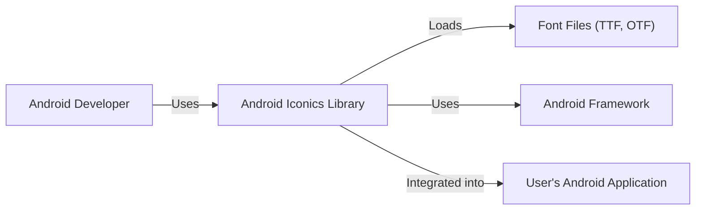
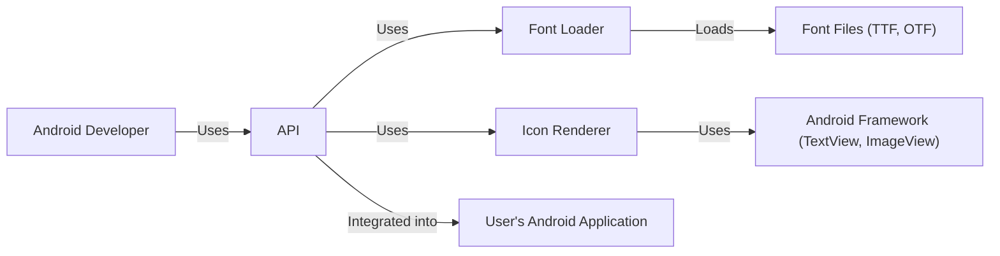
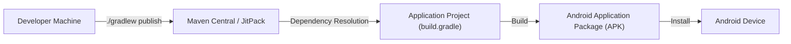
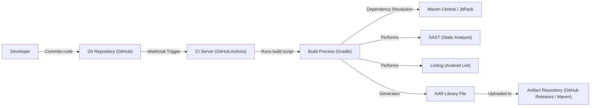

# BUSINESS POSTURE

Business Priorities and Goals:

*   Provide a library for Android developers to easily incorporate custom fonts and icons into their applications.
*   Offer a wide variety of pre-existing icon fonts, while also allowing developers to easily integrate their own custom fonts.
*   Simplify the process of using icons in Android development, reducing boilerplate code and improving developer productivity.
*   Maintain a lightweight and performant library to minimize impact on application size and performance.
*   Provide comprehensive documentation and support to ensure ease of use and adoption.
*   Foster a community around the library, encouraging contributions and feedback.

Business Risks:

*   Malicious code injection: If the library is compromised, attackers could inject malicious code that could be executed within applications using the library.
*   Supply chain attacks: Compromised dependencies could introduce vulnerabilities into the library.
*   Denial of service: Bugs or vulnerabilities in the library could be exploited to cause application crashes or performance degradation.
*   Data leakage: Although unlikely given the library's function, improper handling of custom fonts could potentially lead to font fingerprinting or other privacy concerns.
*   Intellectual property theft: Custom fonts provided by users could be stolen or misused if not handled securely.
*   Reputational damage: Security vulnerabilities or functional issues could damage the reputation of the library and its maintainers.

# SECURITY POSTURE

Existing Security Controls:

*   security control: Code reviews: The project is open-source and subject to community review, which can help identify potential security issues. (Described in GitHub repository)
*   security control: Static analysis: The project may use static analysis tools to identify potential vulnerabilities. (Not explicitly mentioned, but common practice)
*   security control: Dependency management: The project uses Gradle for dependency management, which helps ensure that dependencies are tracked and updated. (Described in build.gradle files)
*   security control: Open source license: The project uses a permissive open-source license (Apache 2.0), which encourages scrutiny and contributions from the security community. (Described in LICENSE file)

Accepted Risks:

*   accepted risk: The library relies on third-party font libraries, which may contain vulnerabilities.
*   accepted risk: The library does not provide explicit mechanisms for protecting custom fonts provided by users.
*   accepted risk: The library does not currently implement specific security hardening measures beyond standard Android development practices.

Recommended Security Controls:

*   security control: Implement a robust Software Bill of Materials (SBOM) management process to track all dependencies and their versions.
*   security control: Integrate Static Application Security Testing (SAST) tools into the build process to automatically scan for vulnerabilities.
*   security control: Perform regular Dynamic Application Security Testing (DAST) to identify runtime vulnerabilities.
*   security control: Consider implementing Content Security Policy (CSP) if the library interacts with web resources.
*   security control: Provide guidelines and best practices for users on securely handling custom fonts.
*   security control: Establish a clear vulnerability disclosure process.
*   security control: Regularly audit the codebase for potential security issues.

Security Requirements:

*   Authentication: Not directly applicable to this library.
*   Authorization: Not directly applicable to this library.
*   Input Validation:
    *   The library should validate user-provided font file paths and names to prevent path traversal vulnerabilities.
    *   The library should validate font data to prevent buffer overflows or other memory corruption issues.
*   Cryptography: Not directly applicable, unless the library handles encrypted fonts, in which case standard cryptographic best practices should be followed.

# DESIGN

## C4 CONTEXT

Element Descriptions:

*   Element:
    *   Name: Android Developer
    *   Type: Person
    *   Description: A software developer building Android applications.
    *   Responsibilities: Integrates the Android Iconics library into their application, configures icon fonts, and uses the library's API to display icons.
    *   Security controls: Follows secure coding practices when integrating the library.

*   Element:
    *   Name: Android Iconics Library
    *   Type: Software System
    *   Description: A library that simplifies the use of custom fonts and icons in Android applications.
    *   Responsibilities: Provides an API for loading and displaying icons, manages font resources, and handles rendering.
    *   Security controls: Input validation of font file paths and data, dependency management, code reviews.

*   Element:
    *   Name: Font Files (TTF, OTF)
    *   Type: Data
    *   Description: TrueType Font (TTF) or OpenType Font (OTF) files containing icon glyphs.
    *   Responsibilities: Store the visual representation of icons.
    *   Security controls: None directly within the library's control; relies on the security of the file system and the integrity of the font files themselves.

*   Element:
    *   Name: Android Framework
    *   Type: Software System
    *   Description: The underlying Android operating system and its APIs.
    *   Responsibilities: Provides core functionality for rendering text and graphics, managing resources, and interacting with the device.
    *   Security controls: Android's built-in security features, such as sandboxing and permission management.

*   Element:
    *   Name: User's Android Application
    *   Type: Software System
    *   Description: The Android application that integrates the Android Iconics library.
    *   Responsibilities: Utilizes the library to display icons within its user interface.
    *   Security controls: Dependent on the developer's implementation; should follow secure coding practices.

## C4 CONTAINER

Element Descriptions:

*   Element:
    *   Name: Android Developer
    *   Type: Person
    *   Description: A software developer building Android applications.
    *   Responsibilities: Integrates the Android Iconics library into their application, configures icon fonts, and uses the library's API to display icons.
    *   Security controls: Follows secure coding practices when integrating the library.

*   Element:
    *   Name: API
    *   Type: API
    *   Description: The public interface of the Android Iconics library.
    *   Responsibilities: Provides methods for developers to load fonts, create icon drawables, and configure icon appearance.
    *   Security controls: Input validation of parameters passed to API methods.

*   Element:
    *   Name: Font Loader
    *   Type: Component
    *   Description: Responsible for loading font files from various sources (assets, resources, external storage).
    *   Responsibilities: Reads font data, parses font information, and makes it available to the Icon Renderer.
    *   Security controls: Input validation of font file paths, checks for file integrity (if possible).

*   Element:
    *   Name: Icon Renderer
    *   Type: Component
    *   Description: Responsible for rendering icon glyphs into bitmaps or drawables.
    *   Responsibilities: Uses the Android Framework's text and graphics APIs to draw icons based on the loaded font data.
    *   Security controls: Relies on the security of the Android Framework's rendering mechanisms.

*   Element:
    *   Name: Font Files (TTF, OTF)
    *   Type: Data
    *   Description: TrueType Font (TTF) or OpenType Font (OTF) files containing icon glyphs.
    *   Responsibilities: Store the visual representation of icons.
    *   Security controls: None directly within the library's control; relies on the security of the file system and the integrity of the font files themselves.

*   Element:
    *   Name: Android Framework (TextView, ImageView)
    *   Type: Software System
    *   Description: Components of the Android Framework used for displaying text and images.
    *   Responsibilities: Render the icon drawables created by the Icon Renderer.
    *   Security controls: Android's built-in security features.

*   Element:
    *   Name: User's Android Application
    *   Type: Software System
    *   Description: The Android application that integrates the Android Iconics library.
    *   Responsibilities: Utilizes the library to display icons within its user interface.
    *   Security controls: Dependent on the developer's implementation; should follow secure coding practices.

## DEPLOYMENT

Possible Deployment Solutions:

1.  **Local Library Project:** The library is included as a local module within the application project.
2.  **Maven Central/JitPack:** The library is published to a repository like Maven Central or JitPack and included as a dependency in the application's build.gradle file.
3.  **Manual AAR Import:** The library is compiled into an AAR file and manually imported into the application project.

Chosen Solution (Maven Central/JitPack):

Element Descriptions:

*   Element:
    *   Name: Developer Machine
    *   Type: Infrastructure Node
    *   Description: The developer's workstation where the library code is developed and built.
    *   Responsibilities: Hosts the source code, build tools, and publishing scripts.
    *   Security controls: Standard development environment security practices (e.g., secure coding, access control).

*   Element:
    *   Name: Maven Central / JitPack
    *   Type: Infrastructure Node
    *   Description: A public repository for hosting Java and Android libraries.
    *   Responsibilities: Stores and distributes the compiled Android Iconics library.
    *   Security controls: Repository-specific security measures (e.g., access control, integrity checks).

*   Element:
    *   Name: Application Project (build.gradle)
    *   Type: Software System
    *   Description: The Android application project that depends on the Android Iconics library.
    *   Responsibilities: Declares the library as a dependency in its build.gradle file.
    *   Security controls: Dependency management, secure coding practices.

*   Element:
    *   Name: Android Application Package (APK)
    *   Type: Data
    *   Description: The final packaged application file that is installed on Android devices.
    *   Responsibilities: Contains the compiled application code, resources, and the Android Iconics library.
    *   Security controls: Android's application signing and verification mechanisms.

*   Element:
    *   Name: Android Device
    *   Type: Device
    *   Description: The end-user's Android device where the application is installed.
    *   Responsibilities: Runs the application, including the Android Iconics library.
    *   Security controls: Android's built-in security features.

## BUILD

Build Process Description:

1.  **Code Commit:** A developer commits code changes to the Git repository (GitHub).
2.  **CI Trigger:** A webhook triggers the CI server (GitHub Actions) upon code commit.
3.  **Build Execution:** The CI server runs the build script (Gradle).
4.  **Dependency Resolution:** Gradle resolves dependencies from Maven Central/JitPack.
5.  **Static Analysis:** SAST tools (e.g., FindBugs, PMD, Checkstyle) are executed to analyze the code for potential vulnerabilities.
6.  **Linting:** Android Lint is used to identify potential code quality and style issues.
7.  **AAR Generation:** Gradle compiles the library code and generates the AAR (Android Archive) file.
8.  **Artifact Upload:** The AAR file is uploaded to an artifact repository (GitHub Releases or Maven Central/JitPack).

Security Controls:

*   security control: **Dependency Management:** Gradle manages dependencies, ensuring that specific versions are used and tracked.
*   security control: **SAST:** Static analysis tools are integrated into the build process to identify potential vulnerabilities before deployment.
*   security control: **Linting:** Android Lint helps enforce coding standards and identify potential issues that could lead to security vulnerabilities.
*   security control: **CI/CD:** The use of a CI server (GitHub Actions) automates the build and testing process, ensuring consistency and reducing the risk of manual errors.
*   security control: **Signed Releases:** Releases should be digitally signed to ensure their integrity and authenticity.

# RISK ASSESSMENT

Critical Business Processes:

*   Providing a reliable and functional library for Android developers.
*   Maintaining the reputation and trust of the library and its maintainers.

Data Protection:

*   **Font Files (TTF, OTF):** While the library itself doesn't store sensitive data, it handles font files provided by users. The sensitivity of these files depends on the user's content. If a user provides a custom font containing sensitive information (e.g., a proprietary font used for branding), that information could be exposed if the font file is not handled securely.  Sensitivity: Low to Medium (depending on user-provided content).
*   **Library Code:** The library's source code itself is not considered sensitive data, as it is publicly available. However, vulnerabilities in the code could be exploited to compromise applications using the library. Sensitivity: Low (source code), High (vulnerabilities).
*   **No other user data is handled by the library.**

# QUESTIONS & ASSUMPTIONS

Questions:

*   Are there any specific performance requirements or limitations for the library?
*   Are there any plans to support other platforms besides Android in the future?
*   What is the expected frequency of updates and releases?
*   What level of support is provided to users of the library?
*   Are there any specific legal or compliance requirements that the library needs to adhere to?
*   Are there any plans for monetization of the library?

Assumptions:

*   BUSINESS POSTURE: The primary goal is to provide a free and open-source library for the Android developer community.
*   BUSINESS POSTURE: The project maintainers have a moderate risk appetite, prioritizing functionality and ease of use while still taking reasonable security precautions.
*   SECURITY POSTURE: The project follows standard Android development practices and security best practices.
*   SECURITY POSTURE: The project relies on community contributions and code reviews for security auditing.
*   SECURITY POSTURE: The project uses Gradle for dependency management.
*   DESIGN: The library is primarily used by integrating it into Android applications via Maven Central or JitPack.
*   DESIGN: The library's core functionality is to load and render icons from font files.
*   DESIGN: The library relies on the Android Framework for rendering and resource management.
*   DESIGN: The build process is automated using GitHub Actions and Gradle.