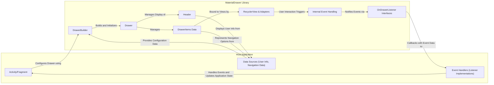
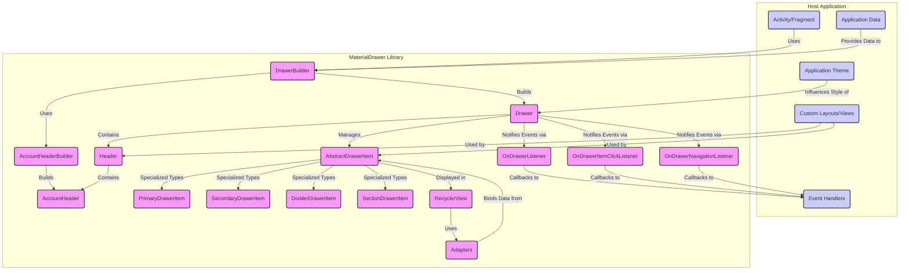
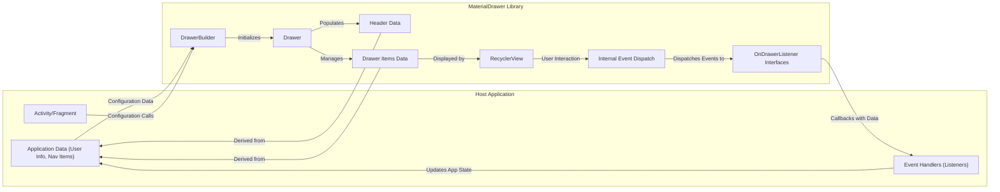

# Project Design Document: MaterialDrawer Android Library

**Version:** 1.1
**Date:** October 26, 2023
**Author:** AI Software Architect

## 1. Introduction

This document provides an enhanced design overview of the MaterialDrawer Android library (as found at [https://github.com/mikepenz/materialdrawer](https://github.com/mikepenz/materialdrawer)). Building upon the initial design, this version aims for greater clarity and detail, specifically focusing on aspects relevant to threat modeling. The goal is to provide a comprehensive understanding of the library's architecture, data flows, and integration points to facilitate the identification of potential security vulnerabilities.

## 2. Project Overview

The MaterialDrawer library is a well-established open-source Android library designed to simplify the implementation of Material Design navigation drawers. It offers extensive customization options and features, enabling developers to create user-friendly and visually appealing navigation experiences within their Android applications.

## 3. Goals

* Provide a detailed and refined architectural overview of the MaterialDrawer library.
* Clearly identify key components, their responsibilities, and their interactions.
* Precisely describe the flow of data within the library and its interaction with the host application, highlighting potential security implications.
* Explicitly outline the integration points between the library and the host Android application, focusing on areas relevant to security.
* Serve as a robust and informative foundation for conducting thorough threat modeling activities.

## 4. Architecture and Components

The MaterialDrawer library employs a modular architecture, promoting flexibility and extensibility. Key components and their roles are detailed below:

* **`DrawerBuilder`:**
    *  Serves as the primary interface for developers to instantiate and configure the navigation drawer.
    *  Allows setting various drawer attributes programmatically, such as:
        *   Defining the drawer header content (e.g., user profile information).
        *   Adding and configuring individual drawer items (e.g., navigation links, dividers).
        *   Registering event listeners for drawer interactions (e.g., item clicks, drawer open/close events).
    *  Crucially, it dictates how the library interacts with the host application's data and logic.
* **`Drawer`:**
    *  Represents the materialized navigation drawer UI element within the application.
    *  Manages the drawer's lifecycle, including its opening and closing animations and states.
    *  Holds references to the constituent parts of the drawer, such as the header and the list of items.
    *  Internally utilizes Android's `DrawerLayout` to provide the sliding drawer functionality.
* **`Header`:**
    *  The visual section at the top of the navigation drawer.
    *  Can display user-specific information like profile pictures, names, and email addresses.
    *  Often incorporates an account switcher for applications supporting multiple user accounts.
    *  Its content is typically populated with data provided by the host application.
* **`AbstractDrawerItem` and Concrete Implementations (e.g., `PrimaryDrawerItem`, `SecondaryDrawerItem`, `DividerDrawerItem`, `SectionDrawerItem`):**
    *  `AbstractDrawerItem` defines the common interface and properties for all items within the drawer.
    *  Concrete implementations represent different types of drawer entries:
        *   `PrimaryDrawerItem`: Standard clickable navigation items.
        *   `SecondaryDrawerItem`:  Often used for less prominent actions or settings.
        *   `DividerDrawerItem`: Visual separators within the drawer.
        *   `SectionDrawerItem`:  Headers to group related drawer items.
    *  Each item can have associated metadata like icons, text, identifiers, and click listeners.
* **`AccountHeader` and `AccountHeaderBuilder`:**
    *  Facilitates the creation and management of the account switcher within the drawer header.
    *  Allows displaying multiple user accounts and providing UI for switching between them.
    *  Relies on data provided by the host application to populate account details.
* **Internal `RecyclerView.Adapter` Implementations:**
    *  The library leverages Android's `RecyclerView` for efficiently rendering and managing the potentially large list of drawer items.
    *  Internal adapter classes are responsible for binding the data associated with each `DrawerItem` to the corresponding view in the `RecyclerView`.
* **`OnDrawerListener` Interfaces (e.g., `OnDrawerListener`, `OnDrawerItemClickListener`, `OnDrawerNavigationListener`):**
    *  Provide a mechanism for the host application to receive notifications about events occurring within the drawer.
    *   `OnDrawerListener`: General drawer state changes (opening, closing).
    *   `OnDrawerItemClickListener`:  Specifically handles clicks on individual drawer items, providing the clicked item and its position.
    *   `OnDrawerNavigationListener`: A higher-level listener for navigation events triggered by item selections.
    *  These listeners are crucial integration points where the library interacts with the host application's logic.
* **Customizable Views and Layouts:**
    *  The library allows developers to replace default layouts and views with custom implementations for elements like the header and drawer items.
    *  This offers flexibility but also introduces potential security considerations if custom components are not implemented securely.
* **Theme Integration:**
    *  The library respects and integrates with the application's defined themes and styles, ensuring visual consistency.

## 5. Data Flow

Understanding how data flows through the MaterialDrawer library is crucial for identifying potential vulnerabilities. The primary data flow can be described as follows:

* **Configuration Data Input:** The host application provides configuration data to the `DrawerBuilder`. This includes:
    *   **User Profile Data:** Information for the header, such as user name, email, and profile picture (often retrieved from local storage, network, or authentication providers).
    *   **Drawer Items Data:**  Definitions of the items to be displayed in the drawer, including text, icons, identifiers, and associated actions. This data often represents the application's navigation structure.
    *   **Listener Implementations:**  The host application provides implementations of the `OnDrawerListener` interfaces to handle events. These implementations contain the application's logic for responding to drawer interactions.
* **Drawer Initialization and Data Binding:**
    *   When `DrawerBuilder.build()` is called, the library initializes the `Drawer` object.
    *   The provided data for the header and drawer items is then used to populate the corresponding UI elements.
    *   Internal adapters bind the `DrawerItem` data to the `RecyclerView`, creating the visual representation of the drawer.
* **User Interaction and Event Handling:**
    *   User actions within the drawer (e.g., opening, closing, clicking on an item) trigger events.
    *   The `RecyclerView` detects item clicks.
    *   Internal logic within the `Drawer` and its components determines which listeners to notify.
* **Event Callback to Host Application:**
    *   When an event occurs (e.g., a drawer item is clicked), the registered listeners in the host application are invoked.
    *   The listener methods receive information about the event, such as the clicked `DrawerItem` and its identifier.
    *   The host application's listener implementation then executes the appropriate action, which might involve:
        *   Navigating to a different activity or fragment.
        *   Updating the application's state.
        *   Performing network requests.
        *   Accessing local data.

## 6. Integration Points

The MaterialDrawer library integrates with the host Android application through several key points:

* **Gradle Dependency:** Inclusion of the library as a dependency in the application's `build.gradle` file. This is the fundamental integration step.
* **`DrawerBuilder` API Usage:** Developers utilize the `DrawerBuilder` class within their Activities or Fragments to create and configure the drawer. This involves providing data and registering listeners.
* **Layout Integration:** The library's `DrawerLayout` is typically used as the root layout in the Activity's layout XML, wrapping the main content view. This structure is essential for the drawer to function correctly.
* **Listener Implementations:** The host application must implement the various `OnDrawerListener` interfaces to respond to drawer events. The security of the application can be impacted by how these listeners are implemented (e.g., proper intent handling, data validation).
* **Data Provision:** The application is responsible for providing the data displayed in the drawer, including user profile information and the structure of the navigation menu. Vulnerabilities in how this data is sourced or sanitized can have security implications.
* **Theme and Style Customization:** While providing flexibility, incorrect or insecure theme customizations could potentially lead to UI issues or even subtle ways to mislead users.
* **Custom View Integration:**  When developers provide custom layouts or views for the header or drawer items, they introduce their own code, which may contain vulnerabilities if not developed with security in mind.

## 7. Security Considerations (Pre-Threat Modeling)

Based on the architecture and data flow, several potential security considerations emerge:

* **Data Injection through Header Information:** If the host application does not properly sanitize user data (e.g., name, email) before displaying it in the drawer header, it could be susceptible to injection attacks (like HTML or script injection) leading to UI disruptions or potentially more serious issues if the `WebView` is involved in rendering.
* **Insecure Handling of Intent Data in `OnDrawerItemClickListener`:**  If the `OnDrawerItemClickListener` implementation in the host application uses data from the clicked `DrawerItem` (e.g., its identifier) to construct intents for navigation, vulnerabilities could arise if this data is not validated. An attacker might potentially manipulate the drawer item identifiers (if they have control over the data source) to trigger unintended activities or expose sensitive information.
* **Clickjacking/UI Redressing via Custom Layouts:** If developers use custom layouts for the drawer or its items without proper security considerations, they might inadvertently create opportunities for clickjacking or UI redressing attacks. Malicious overlays could trick users into performing unintended actions.
* **Information Disclosure through Exposed User Data:**  Care must be taken to ensure that the user information displayed in the drawer header is appropriate for the context and does not inadvertently expose sensitive data to unauthorized individuals (e.g., on shared devices).
* **Vulnerabilities in Third-Party Libraries (Indirect):** While not a direct vulnerability in MaterialDrawer itself, the library depends on other Android support libraries. Vulnerabilities in these dependencies could indirectly impact applications using MaterialDrawer. Regular dependency updates are crucial.
* **Misconfiguration of Drawer Settings:** Certain configuration options, if misused, could potentially introduce security risks. For example, if deep linking is handled through drawer item clicks, improper configuration could lead to vulnerabilities.
* **Lack of Input Validation in Custom Views:** If custom views are used for drawer items and they handle user input, proper input validation is essential to prevent vulnerabilities like cross-site scripting (if the input is displayed in a web view) or other injection attacks.
* **Sensitive Data in Drawer Item Identifiers:** Avoid storing sensitive information directly within the identifiers of `DrawerItem` objects, as these might be logged or exposed in debugging information.

## 8. Diagrams

### 8.1. Component Diagram (Detailed)

### 8.2. Data Flow Diagram (Detailed)

## 9. Assumptions and Constraints

* This design document is based on the publicly available information and source code of the MaterialDrawer library as of the current date.
* It assumes a typical integration scenario where the library is used to create a standard navigation drawer within an Android application.
* The security considerations outlined are preliminary and intended to guide further, more detailed threat modeling activities.
* The focus is on architectural aspects and data flow relevant to security. Implementation details within the library are not exhaustively covered.

## 10. Future Considerations

* Conducting a detailed analysis of the library's handling of deep linking and navigation events.
* Investigating potential security implications related to accessibility service interactions with the drawer.
* Performing static and dynamic code analysis of the library to identify potential vulnerabilities.
* Developing specific use cases and attack scenarios to thoroughly assess the identified security considerations.
* Reviewing the library's dependency tree for known vulnerabilities and ensuring timely updates.
