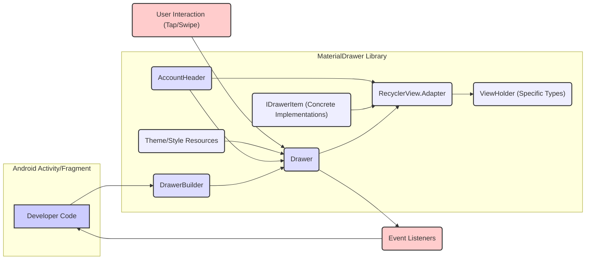

# Project Design Document: MaterialDrawer Android Library

**Version:** 1.1
**Date:** October 26, 2023
**Author:** AI Software Architect

## 1. Introduction

This document provides an enhanced design overview of the MaterialDrawer Android library, an open-source UI component available on GitHub at [https://github.com/mikepenz/materialdrawer](https://github.com/mikepenz/materialdrawer). This revised document aims to offer a more detailed and structured understanding of the library's architecture, core components, and data flow, specifically tailored for subsequent threat modeling activities. It builds upon the previous version by providing more granular details and clarifying key interactions.

## 2. Goals and Objectives

The primary goal of the MaterialDrawer library is to empower Android developers with a highly customizable, user-friendly, and Material Design compliant navigation drawer component. Key objectives include:

*   Providing a declarative and flexible API for defining a wide range of drawer items, including primary items, secondary items, dividers, expandable items, and custom items.
*   Supporting diverse drawer header configurations, ranging from simple headers to complex account switchers.
*   Offering extensive customization capabilities for visual styling and theming, allowing seamless integration with various application designs.
*   Simplifying the integration process into existing Android applications with minimal boilerplate code.
*   Maintaining a well-organized, modular, and maintainable codebase to facilitate contributions and updates.
*   Ensuring a consistent and intuitive user experience for navigation.

## 3. Architectural Overview

The MaterialDrawer library adopts a component-based architecture, deeply integrated with the Android UI framework, particularly leveraging `RecyclerView` for efficient item management. It primarily interacts within the lifecycle of an Android `Activity` or `Fragment` and manipulates the View hierarchy.

*   **Core Architectural Elements:**
    *   **`DrawerBuilder`:** Serves as the central entry point for constructing and configuring the navigation drawer instance using a fluent builder pattern.
    *   **`Drawer`:** Represents the materialized navigation drawer, managing its state (open/closed), the collection of drawer items, and user interactions.
    *   **`IDrawerItem` Interface:** A core interface defining the contract for all types of drawer items, ensuring a consistent structure and behavior.
    *   **Concrete `DrawerItem` Implementations:**  Specific classes implementing `IDrawerItem`, such as `PrimaryDrawerItem`, `SecondaryDrawerItem`, `DividerDrawerItem`, `ExpandableDrawerItem`, and `CustomAbstractDrawerItem`, each representing a distinct type of drawer element.
    *   **`AccountHeader`:** A specialized component for managing user account information within the drawer header, supporting features like account switching and profile display.
    *   **`RecyclerView.Adapter` Implementation:**  An internal adapter responsible for efficiently binding and displaying drawer items within the `RecyclerView`.
    *   **Specialized `ViewHolder` Implementations:**  Custom `ViewHolder` classes tailored to render the specific layout and data of each `DrawerItem` type.
    *   **Event Listener Interfaces:** Interfaces like `OnDrawerItemClickListener`, `OnDrawerListener`, and `OnDrawerNavigationListener` to facilitate handling user interactions and drawer state changes.
    *   **Theme Attributes and Style Resources:** Defines customizable visual properties of the drawer and its items, allowing developers to align the drawer's appearance with their application's theme.

*   **Key Interaction Points:**
    *   The developer instantiates `DrawerBuilder` within an Android `Activity` or `Fragment` to initiate the drawer creation process.
    *   Drawer items, headers, and listeners are configured and added to the `DrawerBuilder`.
    *   The `DrawerBuilder` constructs the `Drawer` instance and integrates it into the specified view hierarchy of the `Activity` or `Fragment`.
    *   The `Drawer` manages the underlying `RecyclerView`, populating it with the configured drawer items.
    *   User interactions (taps, swipes) on drawer items are intercepted and handled by the `RecyclerView` and the `Drawer`.
    *   Registered event listeners are invoked to notify the developer's code about user interactions and drawer state changes.
    *   The library updates the UI dynamically based on user interactions, configuration changes, or programmatic updates.

## 4. Component Design Details

This section provides a more detailed breakdown of the key components and their functionalities.

*   **`DrawerBuilder`:**
    *   Purpose:  To provide a structured and readable way to configure all aspects of the navigation drawer.
    *   Responsibilities:
        *   Accepting the Android `Activity` or `Fragment` context.
        *   Defining the drawer's placement (e.g., attached to the left or right edge).
        *   Adding various types of drawer items (`PrimaryDrawerItem`, `SecondaryDrawerItem`, `DividerDrawerItem`, etc.).
        *   Configuring the optional `DrawerHeader` or `AccountHeader`.
        *   Setting listeners for item clicks (`OnDrawerItemClickListener`), drawer open/close events (`OnDrawerListener`), and navigation events (`OnDrawerNavigationListener`).
        *   Applying custom themes and styles to the drawer and its items.
        *   Providing methods to build the final `Drawer` object.
        *   Allowing for programmatically setting the initial selected item.

*   **`Drawer`:**
    *   Purpose:  To encapsulate the navigation drawer's logic and manage its lifecycle.
    *   Responsibilities:
        *   Managing the drawer's open and closed state, including animations.
        *   Holding and managing the collection of `IDrawerItem` instances.
        *   Initializing and managing the underlying `RecyclerView` and its adapter.
        *   Handling user touch events and gestures related to the drawer.
        *   Dispatching events to registered listeners.
        *   Providing methods for programmatically opening, closing, and toggling the drawer.
        *   Offering methods to programmatically select or update drawer items.

*   **`IDrawerItem` and Concrete Implementations (e.g., `PrimaryDrawerItem`, `SecondaryDrawerItem`, `DividerDrawerItem`, `ExpandableDrawerItem`):**
    *   Purpose: To represent the different types of elements that can be displayed within the navigation drawer.
    *   Responsibilities:
        *   Storing item-specific data, such as text, icons (using `Drawable` or `Uri`), identifiers, and tags.
        *   Defining the visual representation of the item through layout resources or programmatic view creation.
        *   Implementing methods for binding data to the corresponding `ViewHolder`.
        *   Handling item selection state (selected or unselected).
        *   Providing mechanisms for enabling or disabling items.
        *   For `ExpandableDrawerItem`, managing a list of child drawer items.

*   **`AccountHeader`:**
    *   Purpose: To provide a specialized header for managing user accounts within the drawer.
    *   Responsibilities:
        *   Displaying user profile information (e.g., avatar, name, email).
        *   Supporting multiple user accounts and allowing switching between them.
        *   Handling clicks on account profiles or the header itself.
        *   Providing customization options for the header's appearance.
        *   Managing account addition and removal actions.

*   **`RecyclerView.Adapter` and Specialized `ViewHolder`s:**
    *   Purpose: To efficiently manage and render the potentially large list of drawer items.
    *   Responsibilities:
        *   Creating appropriate `ViewHolder` instances based on the type of `IDrawerItem`.
        *   Binding the data from each `IDrawerItem` to the corresponding views within the `ViewHolder`.
        *   Handling item clicks within the `RecyclerView` and notifying the `Drawer`.
        *   Optimizing view recycling for smooth scrolling performance.
        *   Supporting different layout configurations for various item types.

*   **Event Listener Interfaces (e.g., `OnDrawerItemClickListener`, `OnDrawerListener`):**
    *   Purpose: To provide a clear and decoupled way for developers to respond to user interactions and drawer state changes.
    *   Responsibilities:
        *   `OnDrawerItemClickListener`: Receiving callbacks when a drawer item is clicked, providing the clicked item, the view, and the touch position.
        *   `OnDrawerListener`: Receiving callbacks for drawer open, close, and slide events.
        *   `OnDrawerNavigationListener`: Receiving callbacks when the user navigates away from the current screen via a drawer item click (useful for handling back stack management).

## 5. Data Flow

The data flow within the MaterialDrawer library involves the following stages:

**Detailed Data Flow Description:**

*   **Configuration:** The developer's code utilizes the `DrawerBuilder` to configure the drawer, providing data for `IDrawerItem` instances (text, icons, identifiers, etc.) and `AccountHeader` information. Theme and style resources are also applied during this stage.
*   **Initialization and Binding:** The `DrawerBuilder` constructs the `Drawer` object. The `Drawer` initializes the `RecyclerView` and its adapter. The adapter retrieves data from the configured `IDrawerItem` instances.
*   **View Creation and Population:** The `RecyclerView.Adapter` creates appropriate `ViewHolder` instances based on the type of `IDrawerItem`. It then binds the data from the `IDrawerItem` to the views within the `ViewHolder`.
*   **UI Rendering:** The `RecyclerView` renders the `ViewHolder`s, displaying the drawer items and header within the `Activity` or `Fragment`'s view hierarchy.
*   **User Interaction Handling:** When the user interacts with the drawer (e.g., taps an item, swipes to open/close), the Android framework detects the interaction. The `RecyclerView` intercepts item click events.
*   **Event Dispatching:** The `Drawer` handles the user interaction events. For item clicks, it identifies the clicked `IDrawerItem` and notifies the registered `OnDrawerItemClickListener`. For drawer state changes, it notifies the `OnDrawerListener`.
*   **Callback to Developer Code:** The registered event listeners in the developer's code receive the event, providing information about the interaction (e.g., the clicked item, the drawer state). The developer's code can then perform actions based on the event.
*   **Dynamic Updates:** The developer can programmatically update the drawer's state or the data of individual items, which triggers updates in the `RecyclerView` and the UI.

## 6. Security Considerations

While the MaterialDrawer library primarily focuses on UI presentation, several security considerations are important for developers using the library:

*   **Input Validation and Sanitization of Developer-Provided Data:** Developers are responsible for providing data for drawer items. If this data originates from untrusted sources (e.g., user input, external APIs), it's crucial to validate and sanitize it *before* passing it to the MaterialDrawer library. Failure to do so could lead to:
    *   **UI Rendering Issues:** Maliciously crafted strings could disrupt the layout or appearance of the drawer.
    *   **Cross-Site Scripting (XSS) via UI Injection:** If HTML or JavaScript code is injected into item text and not properly escaped by the developer *and* the underlying Android components don't handle it, it could potentially lead to XSS vulnerabilities. While less likely in standard `TextView` usage, custom views within drawer items might be susceptible.
*   **Secure Handling of Sensitive Information:** If sensitive information (e.g., API keys, user credentials, personal data) is displayed within the drawer (even temporarily), developers must implement appropriate security measures to prevent unauthorized access or exposure. The library itself does not provide specific mechanisms for securing this data; it's the developer's responsibility. Consider:
    *   **Avoiding direct display of highly sensitive data.**
    *   **Using appropriate masking or encryption if display is necessary.**
*   **Dependency Management and Vulnerability Scanning:** The MaterialDrawer library relies on external Android libraries. Developers should regularly update the library and its dependencies to the latest versions to patch known security vulnerabilities. Utilizing dependency scanning tools can help identify potential risks.
*   **Deep Linking and Intent Security:** If drawer items trigger deep links or launch intents, developers must carefully validate the target URLs or intent data to prevent malicious redirects or the execution of unintended actions. Ensure that intents are explicitly targeted and that data passed within intents is sanitized.
*   **Custom View Security:** If developers use custom views within drawer items, they are responsible for ensuring the security of those custom views. Vulnerabilities in custom view implementations could be exploited.
*   **Theme and Style Security:** While customization is a feature, developers should be cautious about applying themes or styles from untrusted sources, as they could potentially introduce unexpected behavior or visual spoofing.

## 7. Dependencies

The MaterialDrawer library typically depends on the following core Android libraries:

*   `androidx.recyclerview:recyclerview` (for efficient list rendering)
*   `androidx.appcompat:appcompat` (for compatibility and UI elements)
*   `com.google.android.material:material` (for Material Design components)
*   Potentially other support libraries or third-party libraries for specific features like image loading or custom animations. Refer to the library's `build.gradle` file for a definitive list.

## 8. Deployment

The MaterialDrawer library is distributed as an Android Archive (AAR) file and integrated into Android projects using Gradle dependency management. Developers add the library as a dependency within their module-level `build.gradle` file.

## 9. Future Considerations

Potential future improvements and considerations for the MaterialDrawer library include:

*   Enhanced accessibility features to ensure usability for all users.
*   More advanced and flexible customization options for item layouts and animations.
*   Built-in support for common UI patterns within the drawer (e.g., badges, notifications).
*   Performance optimizations for smoother scrolling and reduced memory usage.
*   Regular security audits and updates to proactively address potential vulnerabilities and maintain a secure codebase.
*   Exploration of Jetpack Compose integration for modern Android UI development.

This revised document provides a more in-depth and structured design overview of the MaterialDrawer Android library, with a stronger emphasis on details relevant for threat modeling. It clarifies the architecture, component responsibilities, and data flow, offering a solid foundation for identifying and mitigating potential security risks.