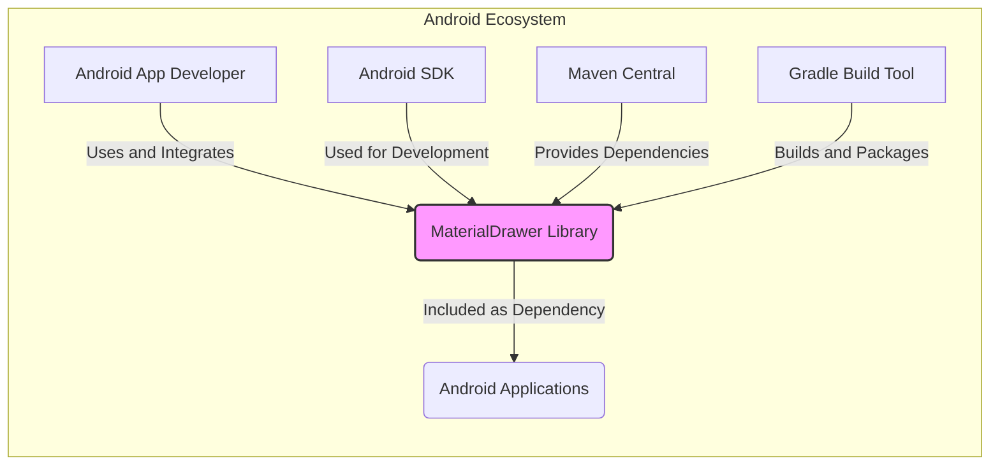
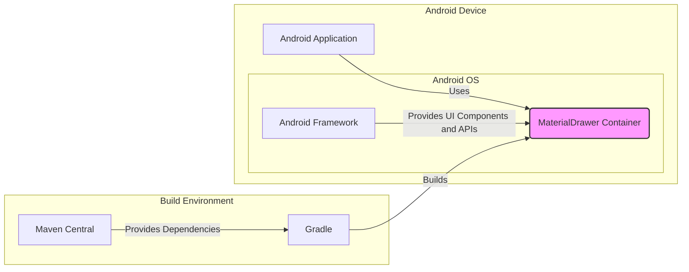
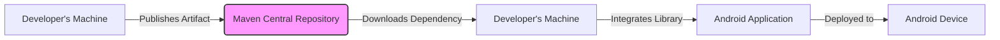
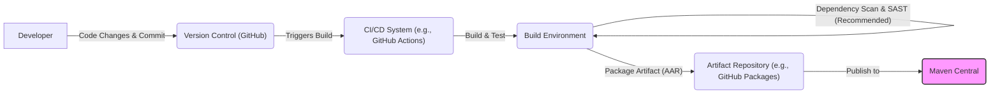

# BUSINESS POSTURE

This project is an Android UI component library, specifically a Drawer (navigation menu) implementation called MaterialDrawer.

- Business Priorities and Goals:
  - Provide Android developers with a reusable, customizable, and Material Design compliant Drawer component.
  - Simplify the process of adding navigation drawers to Android applications.
  - Offer a feature-rich and well-maintained alternative to building drawers from scratch.
  - Enable developers to create consistent and user-friendly navigation experiences in their Android apps.
  - Foster a community around the library for contributions and improvements.

- Business Risks:
  - Security vulnerabilities in the library could be inherited by applications using it, potentially impacting a large number of Android users.
  - Poor performance or instability of the library could negatively affect the user experience of applications using it.
  - Lack of maintenance or updates could lead to the library becoming outdated and incompatible with newer Android versions or security standards.
  - Supply chain risks if dependencies used by the library have vulnerabilities.
  - Negative reputation if the library is perceived as insecure or unreliable, impacting adoption and community trust.

# SECURITY POSTURE

- Existing Security Controls:
  - security control: Open Source Review - The project is open source, allowing for community review of the code. Implemented: Github repository visibility.
  - security control: Issue Reporting - Github issue tracker allows users to report bugs and potential security vulnerabilities. Implemented: Github issue tracker.
  - security control: Dependency Management - Gradle is used for dependency management, allowing for some control over included libraries. Implemented: build.gradle files.

- Accepted Risks:
  - accepted risk: Reliance on community for security audits and vulnerability discovery.
  - accepted risk: Potential for vulnerabilities to exist in dependencies.
  - accepted risk: No formal security development lifecycle is explicitly documented.

- Recommended Security Controls:
  - security control: Implement automated dependency scanning to identify known vulnerabilities in dependencies.
  - security control: Integrate static analysis security testing (SAST) tools into the build process to identify potential code-level vulnerabilities.
  - security control: Establish a clear vulnerability reporting and response process.
  - security control: Consider code signing of the library artifact to ensure integrity and authenticity.
  - security control: Document secure coding practices followed during development.

- Security Requirements:
  - Authentication: Not directly applicable to a UI library itself. Authentication is handled by applications using the library.
  - Authorization: Not directly applicable to a UI library itself. Authorization is handled by applications using the library.
  - Input Validation: While a UI library receives input indirectly through Android framework events, ensure proper handling of potentially malicious or unexpected input data passed to the library's components to prevent unexpected behavior or crashes. Focus on validating data that library processes directly, if any.
  - Cryptography:  Likely not directly required for a UI library. If any sensitive data handling is introduced in future, appropriate cryptography should be used.

# DESIGN

## C4 CONTEXT

- Context Diagram Elements:
  - - Name: Android App Developer
    - Type: Person
    - Description: Developers who build Android applications and want to use a navigation drawer component.
    - Responsibilities: Integrate the MaterialDrawer library into their Android projects, configure and customize the drawer, and use it within their applications.
    - Security controls: Responsible for securely integrating and using the library within their applications, following secure coding practices in their own application development.

  - - Name: MaterialDrawer Library
    - Type: Software System
    - Description: An Android library providing a Material Design compliant navigation drawer component.
    - Responsibilities: Provide a reusable, customizable, and feature-rich Drawer component for Android applications. Handle UI rendering and user interactions related to the drawer.
    - Security controls: Implement secure coding practices during development, address reported vulnerabilities, and ensure the library itself does not introduce security weaknesses into applications using it.

  - - Name: Android Applications
    - Type: Software System
    - Description: Android applications that incorporate the MaterialDrawer library to provide navigation functionality.
    - Responsibilities: Utilize the MaterialDrawer library to enhance their user interface and navigation. Handle user authentication, authorization, and data security within the application itself.
    - Security controls: Implement application-level security controls, including authentication, authorization, input validation, and data protection, independent of the MaterialDrawer library.

  - - Name: Android SDK
    - Type: Software System
    - Description: The Android Software Development Kit, providing tools and libraries necessary for developing Android applications and libraries.
    - Responsibilities: Provide the platform and APIs for developing Android software.
    - Security controls: Android SDK itself is maintained by Google and undergoes security reviews. Developers using the SDK are responsible for using it securely.

  - - Name: Maven Central
    - Type: Software System
    - Description: A central repository for Java and Android libraries, used to distribute the MaterialDrawer library and its dependencies.
    - Responsibilities: Host and distribute Java and Android libraries. Ensure availability and integrity of hosted artifacts.
    - Security controls: Maven Central has its own security measures to protect the repository and ensure the integrity of artifacts.

  - - Name: Gradle Build Tool
    - Type: Software System
    - Description: A build automation tool used for building, testing, and packaging Android projects, including the MaterialDrawer library.
    - Responsibilities: Automate the build process, manage dependencies, compile code, run tests, and package the library.
    - Security controls: Gradle itself has security considerations. Secure build practices should be followed when using Gradle, including dependency verification and secure plugin management.

## C4 CONTAINER

- Container Diagram Elements:
  - - Name: MaterialDrawer Container
    - Type: Container (Software Library)
    - Description: The compiled and packaged MaterialDrawer library (likely an AAR file for Android). It contains the Kotlin/Java code, resources, and assets for the Drawer component.
    - Responsibilities: Provide the UI logic and rendering for the navigation drawer within an Android application. Handle user interactions and customization options.
    - Security controls:  Security controls are primarily focused on secure development practices during the library's creation, including code reviews, static analysis (recommended), and dependency scanning (recommended).

  - - Name: Android Application
    - Type: Container (Android Application)
    - Description: The Android application that integrates and uses the MaterialDrawer library.
    - Responsibilities: Host and run the MaterialDrawer library within its process. Manage the application's overall functionality, including navigation, data handling, and user interactions.
    - Security controls: Application-level security controls, such as authentication, authorization, input validation, data protection, and secure communication, are the responsibility of the application developer.

  - - Name: Android Framework
    - Type: Container (Operating System Framework)
    - Description: The Android operating system framework, providing UI components, APIs, and runtime environment for Android applications and libraries.
    - Responsibilities: Provide the underlying platform and services for Android applications to run. Manage system resources and enforce security policies at the OS level.
    - Security controls: Android OS has its own security architecture and mechanisms, including permissions, sandboxing, and security updates, managed by Google and device manufacturers.

  - - Name: Gradle
    - Type: Container (Build Tool)
    - Description: The Gradle build tool used to compile, test, and package the MaterialDrawer library.
    - Responsibilities: Automate the build process, manage dependencies, compile code, run tests, and package the library into an AAR file.
    - Security controls: Secure build practices should be followed when using Gradle, including dependency verification, secure plugin management, and access control to build environments.

  - - Name: Maven Central
    - Type: Container (Dependency Repository)
    - Description: Maven Central repository hosting dependencies used by the MaterialDrawer library during the build process.
    - Responsibilities: Provide access to required dependencies for building the library. Ensure availability and integrity of hosted artifacts.
    - Security controls: Maven Central has its own security measures to protect the repository and ensure the integrity of artifacts.

## DEPLOYMENT

Deployment for a library is about publishing and distributing it for developers to use, not traditional application deployment to servers.

- Deployment Architecture: Library Distribution via Maven Central

- Deployment Diagram Elements:
  - - Name: Developer's Machine (Publisher)
    - Type: Infrastructure (Developer Workstation)
    - Description: The development machine used by the library maintainers to build, test, and publish the MaterialDrawer library.
    - Responsibilities: Development, testing, and publishing of the library artifact to Maven Central.
    - Security controls: Secure development environment, access control to publishing credentials, code signing (recommended) of the published artifact.

  - - Name: Maven Central Repository
    - Type: Infrastructure (Artifact Repository)
    - Description: The Maven Central repository where the MaterialDrawer library (AAR file) is published and made available for download by Android developers.
    - Responsibilities: Host and distribute the MaterialDrawer library artifact. Ensure availability and integrity of the artifact.
    - Security controls: Maven Central's security controls to protect the repository and ensure artifact integrity.

  - - Name: Developer's Machine (Consumer)
    - Type: Infrastructure (Developer Workstation)
    - Description: The development machine used by Android application developers to download and integrate the MaterialDrawer library into their projects.
    - Responsibilities: Download the library dependency using build tools like Gradle, integrate it into their Android applications.
    - Security controls: Developer's responsibility to use trusted sources for dependencies and verify dependency integrity (though often implicitly handled by build tools).

  - - Name: Android Application
    - Type: Infrastructure (Application Package)
    - Description: The Android application package (APK or AAB) that includes the MaterialDrawer library as a dependency.
    - Responsibilities: Run on Android devices, provide application functionality including navigation using the MaterialDrawer.
    - Security controls: Application-level security controls are deployed within the application package.

  - - Name: Android Device
    - Type: Infrastructure (Mobile Device)
    - Description: End-user Android devices where applications using MaterialDrawer are installed and run.
    - Responsibilities: Execute Android applications, provide user interface, and interact with users.
    - Security controls: Android OS security controls on the device protect applications and user data.

## BUILD

- Build Process Elements:
  - - Name: Developer
    - Type: Person
    - Description: Software developer contributing to the MaterialDrawer library.
    - Responsibilities: Write code, commit changes to version control, and potentially trigger builds.
    - Security controls: Secure coding practices, secure workstation, and access control to the repository.

  - - Name: Version Control (GitHub)
    - Type: Software System (Code Repository)
    - Description: GitHub repository hosting the MaterialDrawer source code and build configurations.
    - Responsibilities: Store and manage source code, track changes, and trigger CI/CD pipelines.
    - Security controls: GitHub's access control, branch protection, and audit logging.

  - - Name: CI/CD System (e.g., GitHub Actions)
    - Type: Software System (Automation Platform)
    - Description: A Continuous Integration/Continuous Delivery system (like GitHub Actions) that automates the build, test, and publishing process.
    - Responsibilities: Automate build steps, run tests, perform security checks (recommended), and publish artifacts.
    - Security controls: Secure CI/CD configuration, secrets management, access control to CI/CD workflows, and build environment security.

  - - Name: Build Environment
    - Type: Infrastructure (Build Server/Container)
    - Description: The environment where the build process is executed, including necessary tools, dependencies, and configurations.
    - Responsibilities: Execute build steps, compile code, run tests, and package artifacts.
    - Security controls: Secure build environment configuration, hardened OS, minimal installed tools, and access control.

  - - Name: Artifact Repository (e.g., GitHub Packages)
    - Type: Software System (Artifact Storage)
    - Description: An intermediate artifact repository (like GitHub Packages or similar) to store build artifacts before publishing to Maven Central.
    - Responsibilities: Store and manage build artifacts temporarily.
    - Security controls: Access control to the artifact repository.

  - - Name: Maven Central
    - Type: Software System (Public Artifact Repository)
    - Description: The public Maven Central repository where the final library artifact is published for consumption by developers.
    - Responsibilities: Host and distribute the library artifact publicly.
    - Security controls: Maven Central's security controls for artifact integrity and availability.

# RISK ASSESSMENT

- Critical Business Processes:
  - Development and maintenance of the MaterialDrawer library.
  - Distribution of the library to Android developers.
  - Integration of the library into Android applications.
  - Reliable and secure operation of Android applications using the library.

- Data to Protect and Sensitivity:
  - Source code of the MaterialDrawer library (Moderate Sensitivity - Confidentiality and Integrity).
  - Build artifacts (AAR file) (Moderate Sensitivity - Integrity and Availability).
  - Credentials for publishing to Maven Central (High Sensitivity - Confidentiality and Integrity).
  - No direct user data is processed or stored by the library itself. Indirectly, vulnerabilities could impact user data in applications using the library.

# QUESTIONS & ASSUMPTIONS

- Questions:
  - What CI/CD system is currently used for building and publishing the library (if any)?
  - Are there any automated security checks (SAST, dependency scanning) currently in place in the build process?
  - What is the process for handling reported security vulnerabilities?
  - Are there any specific security requirements from the community or users of the library?
  - Is code signing of the library artifact considered or implemented?

- Assumptions:
  - Standard open-source development practices are followed.
  - The library is intended for wide public use by Android developers.
  - Maven Central is the primary distribution channel.
  - Security is a concern for the project maintainers and users, even if not explicitly stated in detail.
  - The project aims to provide a reliable and stable UI component.