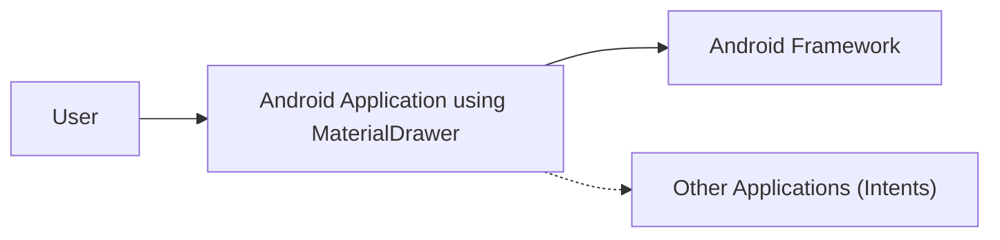
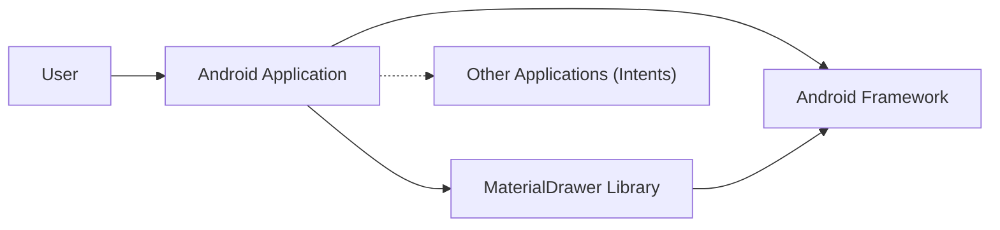
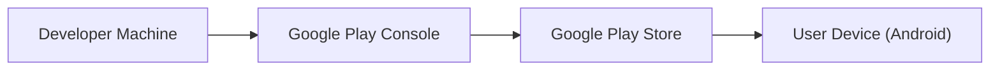
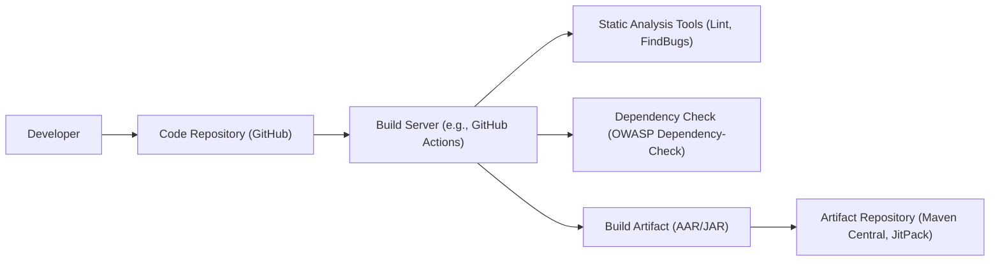

Okay, let's create a design document for the MaterialDrawer library.

# BUSINESS POSTURE

Business Priorities and Goals:

*   Provide a flexible and easy-to-use navigation drawer component for Android developers.
*   Reduce development time for implementing navigation drawers that adhere to Material Design guidelines.
*   Offer extensive customization options to match diverse app themes and branding.
*   Maintain a high level of code quality and stability to ensure a reliable user experience.
*   Foster a vibrant open-source community around the library.
*   Attract a large user base and maintain high usage statistics.

Business Risks:

*   Incompatibility with future Android versions or Material Design updates, leading to broken functionality or visual inconsistencies.
*   Security vulnerabilities that could be exploited in applications using the library.
*   Lack of maintenance and updates, causing the library to become obsolete.
*   Competition from other navigation drawer libraries or built-in Android components.
*   Negative user reviews or community feedback due to bugs, usability issues, or lack of features.
*   Licensing issues or conflicts.

# SECURITY POSTURE

Existing Security Controls:

*   security control: The library itself primarily deals with UI components and does not directly handle sensitive data or perform security-critical operations. (Implicit in the library's function)
*   security control: Standard Android security model applies to applications using the library. (Assumed, based on the Android platform)
*   security control: Proguard/R8 rules are provided for shrinking and obfuscation. (Mentioned in the README)

Accepted Risks:

*   accepted risk: The library relies on the security of the underlying Android framework and the application using it.
*   accepted risk: The library does not implement specific security features like encryption or authentication, as these are outside its scope.

Recommended Security Controls:

*   security control: Implement regular dependency updates to address potential vulnerabilities in third-party libraries.
*   security control: Conduct static code analysis (e.g., using Android Lint, FindBugs, or similar tools) to identify potential security issues in the library's codebase.
*   security control: Provide clear documentation and guidelines for developers on how to use the library securely, especially regarding handling user input and data.
*   security control: Establish a process for handling security vulnerability reports from the community.

Security Requirements:

*   Authentication: Not directly applicable to the library itself. Authentication should be handled by the application using the library.
*   Authorization: Not directly applicable. Authorization logic resides in the application.
*   Input Validation: The library should handle user input (e.g., clicks on drawer items) gracefully and prevent potential crashes or unexpected behavior due to invalid input.  The application using the library is responsible for validating any data associated with drawer items.
*   Cryptography: Not directly applicable. Cryptography, if needed, should be handled by the application.

# DESIGN

## C4 CONTEXT

Element Descriptions:

*   Element:
    *   Name: User
    *   Type: Person
    *   Description: The end-user interacting with the Android application.
    *   Responsibilities: Interacts with the application's UI, including the navigation drawer.
    *   Security controls: Relies on the security controls implemented by the Android application and the Android Framework.

*   Element:
    *   Name: Android Application using MaterialDrawer
    *   Type: Software System
    *   Description: An Android application that integrates the MaterialDrawer library to provide a navigation drawer.
    *   Responsibilities: Provides the main application functionality, handles user input, manages data, and displays the UI, including the navigation drawer.
    *   Security controls: Implements application-specific security controls, such as authentication, authorization, and data validation. Relies on the Android Framework's security features.

*   Element:
    *   Name: Android Framework
    *   Type: Software System
    *   Description: The underlying Android operating system and its core libraries.
    *   Responsibilities: Provides the foundation for running Android applications, managing resources, and handling system-level operations.
    *   Security controls: Implements core security features of the Android platform, such as sandboxing, permissions, and secure inter-process communication.

*   Element:
    *   Name: Other Applications (Intents)
    *   Type: Software System
    *   Description: Other applications installed on the device that may interact with the application via Intents.
    *   Responsibilities: Varies depending on the specific applications and their functionalities.
    *   Security controls: Relies on the Android Framework's security features for inter-application communication, such as permission checks for Intents.

## C4 CONTAINER

Element Descriptions:

*   Element:
    *   Name: User
    *   Type: Person
    *   Description: The end-user interacting with the Android application.
    *   Responsibilities: Interacts with the application's UI, including the navigation drawer.
    *   Security controls: Relies on the security controls implemented by the Android application and the Android Framework.

*   Element:
    *   Name: Android Application
    *   Type: Mobile App
    *   Description: An Android application that integrates the MaterialDrawer library.
    *   Responsibilities: Provides the main application functionality, handles user input, manages data, and displays the UI.
    *   Security controls: Implements application-specific security controls.

*   Element:
    *   Name: MaterialDrawer Library
    *   Type: Library
    *   Description: The MaterialDrawer library providing the navigation drawer component.
    *   Responsibilities: Provides the UI elements and logic for the navigation drawer.
    *   Security controls: Relies on the security of the underlying Android framework.

*   Element:
    *   Name: Android Framework
    *   Type: Software System
    *   Description: The underlying Android operating system and its core libraries.
    *   Responsibilities: Provides the foundation for running Android applications.
    *   Security controls: Implements core security features of the Android platform.

*   Element:
    *   Name: Other Applications (Intents)
    *   Type: Software System
    *   Description: Other applications installed on the device that may interact with the application via Intents.
    *   Responsibilities: Varies depending on the specific applications and their functionalities.
    *   Security controls: Relies on the Android Framework's security features for inter-application communication, such as permission checks for Intents.

## DEPLOYMENT

Possible Deployment Solutions:

1.  Direct APK Installation: Users download and install the APK file directly onto their devices.
2.  Google Play Store: The application is published on the Google Play Store, and users install it through the store.
3.  Other App Stores: The application is published on alternative app stores (e.g., Amazon Appstore, F-Droid).

Chosen Deployment Solution (Google Play Store):

Element Descriptions:

*   Element:
    *   Name: Developer Machine
    *   Type: Infrastructure Node
    *   Description: The developer's computer used for building and signing the application.
    *   Responsibilities: Compiles the code, builds the APK, and signs it with a developer certificate.
    *   Security controls: Secure development environment, secure storage of signing keys.

*   Element:
    *   Name: Google Play Console
    *   Type: Software System
    *   Description: The web interface provided by Google for managing app releases.
    *   Responsibilities: Uploading the APK, managing app metadata, and publishing releases.
    *   Security controls: Google's security measures for the Play Console, including authentication and access controls.

*   Element:
    *   Name: Google Play Store
    *   Type: Software System
    *   Description: Google's official app store for Android applications.
    *   Responsibilities: Distributing the application to users, managing updates, and handling installations.
    *   Security controls: Google's security measures for the Play Store, including app signing verification and malware scanning.

*   Element:
    *   Name: User Device (Android)
    *   Type: Infrastructure Node
    *   Description: The end-user's Android device.
    *   Responsibilities: Running the installed application.
    *   Security controls: Android's built-in security features, such as sandboxing and permission controls.

## BUILD

Build Process Description:

1.  Developer commits code changes to the GitHub repository.
2.  A build server (e.g., GitHub Actions, Travis CI, or a local build system) is triggered.
3.  The build server checks out the code from the repository.
4.  Static analysis tools (e.g., Android Lint, FindBugs) are run to identify potential code quality and security issues.
5.  Dependency checks (e.g., OWASP Dependency-Check) are performed to identify known vulnerabilities in third-party libraries.
6.  The project is built, resulting in a build artifact (AAR or JAR file).
7.  The build artifact is published to an artifact repository (e.g., Maven Central, JitPack).

Security Controls in Build Process:

*   security control: Code reviews before merging changes into the main branch.
*   security control: Static analysis tools to identify potential code quality and security issues.
*   security control: Dependency checking to identify known vulnerabilities in third-party libraries.
*   security control: Secure build environment (e.g., using a trusted CI/CD service).
*   security control: Secure storage and management of signing keys (if applicable).

# RISK ASSESSMENT

Critical Business Processes:

*   Providing a functional and reliable navigation drawer component.
*   Maintaining compatibility with Android versions and Material Design guidelines.
*   Ensuring the library's code quality and security.

Data Protection:

*   The library itself does not handle sensitive user data directly.
*   Data sensitivity is primarily determined by the application using the library. The application is responsible for protecting any sensitive data it handles, regardless of whether it uses this library.

# QUESTIONS & ASSUMPTIONS

Questions:

*   Are there any specific compliance requirements (e.g., GDPR, HIPAA) that the applications using this library typically need to adhere to? This would influence recommendations for application developers using the library.
*   What is the expected frequency of updates and releases for the library?
*   What is the process for handling security vulnerability reports from the community?
*   Are there any plans to integrate with specific testing frameworks or services?

Assumptions:

*   BUSINESS POSTURE: The primary goal is to provide a high-quality, open-source library, and maintaining a positive reputation within the developer community is crucial.
*   SECURITY POSTURE: The library itself does not handle sensitive data directly. Security is primarily the responsibility of the applications that integrate the library.
*   DESIGN: The library is used within the context of a larger Android application. The Android Framework provides the underlying security mechanisms. The deployment model is assumed to be primarily through the Google Play Store, although other distribution methods are possible. The build process is assumed to involve standard tools and practices for Android library development.