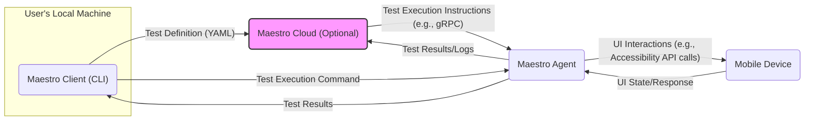

# Project Design Document: Maestro - Mobile UI Automation Framework

**Version:** 1.1
**Date:** October 26, 2023
**Prepared By:** Gemini (AI Architecture Expert)

## 1. Introduction

This document provides an enhanced design overview of the Maestro project, an open-source mobile UI automation framework. The primary goal of this document is to offer a clear and detailed articulation of the system's architecture, components, and data flow, specifically tailored to facilitate effective threat modeling. The information presented is based on the publicly available repository: [https://github.com/mobile-dev-inc/maestro](https://github.com/mobile-dev-inc/maestro).

### 1.1. Project Overview

Maestro is a mobile-native UI testing framework that employs a declarative approach. Users define UI tests using a straightforward YAML syntax. These tests are then executed on mobile devices, encompassing simulators, emulators, and physical devices. The framework's core objective is to simplify mobile UI testing, thereby enhancing accessibility and efficiency for both developers and QA engineers.

### 1.2. Goals of this Document

*   Present a comprehensive and refined architectural overview of the Maestro system.
*   Clearly identify key components and meticulously describe their interactions.
*   Detail the data flow within the system, including data formats where relevant.
*   Serve as a robust and detailed foundation for subsequent threat modeling activities, providing specific areas of focus.

## 2. System Architecture

The Maestro system comprises the following core components, which interact to facilitate mobile UI automation:

*   **Maestro Client (CLI):** The command-line interface, serving as the primary point of interaction for developers.
*   **Maestro Cloud (Optional):** A cloud-based service offering advanced features for device management, test orchestration, and comprehensive reporting.
*   **Maestro Agent:** A process executing on a host machine, responsible for direct interaction with the mobile device under test.
*   **Mobile Device (Simulator/Emulator/Real Device):** The target environment where the mobile application resides and the UI tests are executed.

## 3. Component Details

This section provides an in-depth description of each component, outlining its purpose, responsibilities, and potential sub-components.

### 3.1. Maestro Client (CLI)

*   **Purpose:** To provide the primary user interface for defining, executing, and managing Maestro tests.
*   **Key Responsibilities:**
    *   Parsing and validating user-defined test specifications written in YAML format.
    *   Establishing communication with the Maestro Agent to initiate and manage test execution.
    *   Presenting real-time test execution progress and comprehensive results to the user.
    *   Optionally interacting with the Maestro Cloud for advanced features such as device selection and centralized reporting.
*   **Technologies:** Likely implemented using languages such as Go or similar, chosen for their efficiency in command-line interface development.
*   **Communication Methods:** Interacts with the Agent (and potentially the Cloud) via network calls, likely using protocols like gRPC or REST.
*   **Potential Sub-components:**
    *   "YAML Parser": Responsible for interpreting the test definition files.
    *   "Command Handler": Processes user commands and orchestrates actions.
    *   "Communication Module": Manages network communication with the Agent and Cloud.
    *   "Result Reporter": Formats and displays test execution results.

### 3.2. Maestro Cloud (Optional)

*   **Purpose:** To offer a centralized, scalable platform for managing and orchestrating mobile UI tests across multiple devices and environments.
*   **Key Responsibilities:**
    *   Comprehensive device management, including connecting to and managing simulators, emulators, and physical devices.
    *   Intelligent test orchestration, enabling scheduling and distribution of tests across available devices.
    *   Centralized test reporting and analytics, providing insights into test performance and trends.
    *   Robust user authentication and authorization mechanisms to control access.
    *   Secure storage of test definitions, execution history, and results.
*   **Technologies:** Likely based on a microservices architecture deployed on major cloud platforms (e.g., AWS, GCP, Azure), leveraging technologies such as:
    *   "Containerization": (Docker, Kubernetes) for deployment and scaling.
    *   "Databases": (e.g., PostgreSQL, MongoDB) for persistent data storage.
    *   "Message Queues": (e.g., Kafka, RabbitMQ) for asynchronous communication.
    *   "API Gateway": To manage and route external requests.
    *   "Authentication/Authorization Services": (e.g., OAuth 2.0, Keycloak) for secure access control.
*   **Communication Methods:**  Exposes APIs (likely REST or gRPC) for communication with the Client and Agent. Agents might connect to the Cloud via persistent connections.
*   **Potential Sub-components:**
    *   "Device Management Service": Handles the lifecycle of connected devices.
    *   "Test Orchestration Service": Manages test scheduling and distribution.
    *   "Reporting Service": Generates and presents test reports and analytics.
    *   "User Management Service": Handles user accounts, authentication, and authorization.
    *   "API Gateway": Provides a single entry point for external requests.
    *   "Data Storage": Manages persistent storage of test data and configurations.

### 3.3. Maestro Agent

*   **Purpose:** To act as a crucial intermediary, facilitating communication and interaction between the Maestro Client/Cloud and the mobile device under test.
*   **Key Responsibilities:**
    *   Receiving and interpreting test execution instructions from the Client or Cloud.
    *   Translating these instructions into specific UI interactions applicable to the target mobile device.
    *   Interacting directly with the mobile device's accessibility APIs or instrumentation frameworks to perform UI actions.
    *   Capturing the real-time state of the UI and reporting it back to the Client or Cloud.
    *   Collecting detailed test results, logs, and potentially performance metrics.
*   **Technologies:** Likely implemented using languages that offer robust interaction with mobile device APIs, such as Java/Kotlin for Android and Swift/Objective-C for iOS. May utilize:
    *   "ADB (Android Debug Bridge)": For communication with Android devices.
    *   "XCTest/UI Test": For interacting with iOS devices.
    *   "gRPC": For efficient and structured communication with the Client and Cloud.
*   **Communication Methods:** Communicates with the Client and Cloud primarily via gRPC. Interacts with the mobile device using platform-specific APIs.
*   **Potential Sub-components:**
    *   "Communication Handler (gRPC Server/Client)": Manages communication with the Client and Cloud.
    *   "Android Interaction Module": Handles UI interactions on Android devices.
    *   "iOS Interaction Module": Handles UI interactions on iOS devices.
    *   "Result Aggregator": Collects and formats test results and logs.
    *   "Logging Module": Manages the Agent's internal logging.

### 3.4. Mobile Device (Simulator/Emulator/Real Device)

*   **Purpose:** To serve as the target execution environment for the mobile application under test, where UI tests are performed.
*   **Key Responsibilities:**
    *   Running the mobile application that is being tested.
    *   Responding to UI interaction commands received from the Maestro Agent.
    *   Providing feedback on UI state changes resulting from the executed actions.
*   **Technologies:** The underlying operating system of the mobile device (Android or iOS) and the specific implementation of the application under test.
*   **Communication Methods:** Receives commands from the Agent via platform-specific mechanisms (e.g., ADB for Android, XCTest for iOS).
*   **Potential Sub-components:**
    *   "Operating System (Android/iOS)": Provides the runtime environment.
    *   "Application Under Test": The target application being automated.
    *   "Accessibility Services": Used by the Agent to interact with the UI.
    *   "Instrumentation Frameworks": (e.g., Espresso, UIAutomator for Android; XCTest for iOS) potentially used by the Agent.

## 4. Data Flow

The following outlines the typical data flow during a test execution, highlighting the movement of information between components:

```mermaid
flowchart LR
    subgraph "User's Local Machine"
        A("User defines test in YAML")
    end
    subgraph "Maestro Client"
        B("Client parses YAML")
        C("Client sends execution request to Agent (or Cloud)")
    end
    subgraph "Maestro Cloud (Optional)"
        D("Cloud receives request")
        E("Cloud authenticates/authorizes request")
        F("Cloud schedules test on available device")
        G("Cloud sends execution instructions to Agent (gRPC)")
    end
    subgraph "Maestro Agent"
        H("Agent receives instructions (gRPC)")
        I("Agent translates instructions to UI actions")
        J("Agent sends UI actions to Mobile Device (e.g., ADB, XCTest)")
    end
    subgraph "Mobile Device"
        K("Device executes UI actions")
        L("Device returns UI state/response to Agent")
    end
    subgraph "Maestro Agent"
        M("Agent receives UI state/response")
        N("Agent collects test results and logs")
        O("Agent sends results back to Client (or Cloud) (gRPC)")
    end
    subgraph "Maestro Cloud (Optional)"
        P("Cloud receives results (gRPC)")
        Q("Cloud stores and displays results")
    end
    subgraph "Maestro Client"
        R("Client receives results")
        S("Client displays results to user")
    end

    A --> B
    B --> C
    C --> G
    G --> H
    H --> I
    I --> J
    J --> K
    K --> L
    L --> M
    M --> N
    N --> O
    O --> Q

    C --> D
    D --> E
    E --> F
    F --> G
    N --> P
    P --> Q
    O --> R
    R --> S
```

**Detailed Steps:**

*   **Test Definition:** The user creates a YAML file defining the sequence of UI test steps.
*   **Parsing:** The Maestro Client parses the YAML file to understand the intended test actions.
*   **Execution Request:** The Client initiates test execution, sending a request either directly to the Agent or to the Cloud for orchestration.
*   **Cloud Orchestration (Optional):** If Maestro Cloud is involved:
    *   The Cloud receives the execution request.
    *   The request is authenticated and authorized.
    *   The Cloud schedules the test on a suitable device.
    *   Execution instructions are sent to the designated Agent via gRPC.
*   **Instruction Delivery:** The Maestro Agent receives the test execution instructions, typically via gRPC.
*   **Action Translation:** The Agent translates the high-level instructions into platform-specific UI interactions.
*   **UI Interaction:** The Agent sends commands to the mobile device to perform the specified UI actions (e.g., using ADB for Android, XCTest for iOS).
*   **Execution on Device:** The mobile device executes the UI actions on the application under test.
*   **State Feedback:** The mobile device provides feedback on the resulting UI state changes to the Agent.
*   **Result Collection:** The Maestro Agent gathers UI state information, logs, and other relevant test results.
*   **Result Reporting:** The Agent sends the collected test results back to the Maestro Client (for direct connections) or to the Maestro Cloud via gRPC.
*   **Cloud Storage and Display (Optional):** The Maestro Cloud stores the test results and provides a centralized platform for viewing and analysis.
*   **Client Display:** The Maestro Client receives the test results and presents them to the user.

## 5. Deployment Architecture

The deployment of Maestro can vary significantly based on the utilization of the optional Cloud component.

**Scenario 1: Client and Agent Only (Local Execution)**

*   The Maestro Client is installed on the developer's local machine.
*   The Maestro Agent runs either on the same local machine or on a machine directly connected to the mobile device (e.g., via USB for physical devices or network for emulators/simulators).
*   Test execution is initiated directly from the Client to the Agent.

**Scenario 2: Client, Agent, and Cloud (Centralized Management)**

*   The Maestro Client is installed on developer machines.
*   Maestro Agents can be deployed in various configurations:
    *   Locally on developer machines for individual testing.
    *   On dedicated test machines within a lab environment.
    *   As containerized applications within cloud environments (e.g., using Docker and Kubernetes).
*   Maestro Cloud is deployed as a managed service or self-hosted on cloud infrastructure providers (e.g., AWS, GCP, Azure).
*   The Client interacts with the Cloud to manage devices, schedule tests, and view reports.
*   The Cloud orchestrates test execution by communicating with registered Agents.

## 6. Security Considerations (Detailed for Threat Modeling)

This section provides a more detailed breakdown of security considerations, categorized for effective threat modeling.

*   **Authentication and Authorization:**
    *   **Maestro Cloud Access:** How are users authenticated to access the Maestro Cloud (e.g., username/password, API keys, OAuth)? What authorization mechanisms are in place to control access to resources and functionalities?
    *   **Agent Registration/Authentication:** How are Agents authenticated when connecting to the Cloud? Is there a secure registration process?
    *   **Inter-Component Communication:** Is communication between the Client, Agent, and Cloud mutually authenticated and encrypted (e.g., using TLS with client certificates)?
*   **Data Security:**
    *   **Test Definition Security:** How are YAML test definitions stored and protected, both in transit and at rest? Could a malicious actor inject harmful commands through manipulated YAML?
    *   **Test Result Security:** How are test results and logs stored and secured, especially if they contain sensitive application data or credentials? Is data encrypted at rest? Who has access to these results?
    *   **Secrets Management:** How are sensitive credentials (e.g., API keys, device access tokens) managed and protected within the system?
*   **Agent Security:**
    *   **Agent Compromise:** What are the potential impacts if an Agent is compromised? Could it be used to gain unauthorized access to the host machine or connected devices?
    *   **Code Injection:** Could a malicious test definition or command lead to code injection on the Agent?
    *   **Resource Exhaustion:** Could a malicious test overload the Agent or the connected device?
*   **Mobile Device Security:**
    *   **Accessibility Abuse:** Could a malicious test leverage accessibility services to perform unintended actions on the device outside the application under test?
    *   **Data Exfiltration:** Could a compromised Agent or a malicious test exfiltrate data from the mobile device?
    *   **Device Tampering:** Could a malicious test or Agent tamper with the device's settings or data?
*   **Network Security:**
    *   **Man-in-the-Middle Attacks:** How is communication between components protected against eavesdropping and tampering? Is TLS enforced?
    *   **Firewall Considerations:** What firewall rules are necessary to allow communication between components while restricting unauthorized access?
*   **Input Validation:**
    *   **YAML Parsing Vulnerabilities:** Are there potential vulnerabilities in the YAML parsing logic that could be exploited?
    *   **Command Injection:** Is user input properly sanitized to prevent command injection attacks?

## 7. Assumptions and Constraints

*   This design document is based on publicly available information from the Maestro GitHub repository and common cloud architecture patterns.
*   Specific implementation details of the Maestro Cloud are inferred and may not perfectly reflect the actual implementation.
*   The primary focus of this document is on the architectural aspects relevant for threat modeling.
*   Detailed internal implementation specifics of individual components are not exhaustively covered.

This enhanced design document provides a more detailed and structured overview of the Maestro project, specifically tailored to facilitate comprehensive threat modeling. The identified components, detailed data flows, and categorized security considerations offer a strong foundation for identifying potential vulnerabilities and designing appropriate security mitigations.