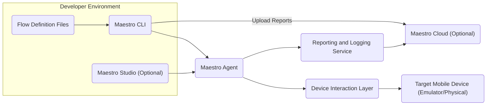
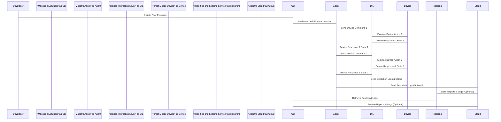

# Project Design Document: Maestro - Mobile UI Automation Tool

**Version:** 1.1
**Date:** October 26, 2023
**Author:** AI Software Architect

## 1. Introduction

This document provides an enhanced architectural design for the Maestro project, a mobile UI automation tool as found in the repository [https://github.com/mobile-dev-inc/maestro](https://github.com/mobile-dev-inc/maestro). This revised document aims to provide greater clarity and detail regarding the system's components, their interactions, and data flows. This document will serve as the foundation for subsequent threat modeling activities.

## 2. Goals

*   Clearly define the major components of the Maestro system with enhanced descriptions.
*   Describe the interactions and data flow between these components with greater precision.
*   Provide sufficient detail for effective and comprehensive threat modeling.
*   Establish a common and more detailed understanding of the system's architecture.

## 3. High-Level Architecture

The Maestro system can be broadly divided into the following key components:

*   **Maestro CLI:** The primary command-line interface for developers.
*   **Maestro Studio (Optional):** A potential graphical user interface for enhanced usability.
*   **Maestro Agent:** A background process responsible for executing automation flows on devices.
*   **Device Interaction Layer:** The mechanism for communicating with target mobile devices.
*   **Flow Definition Files:** Structured files defining the automation steps.
*   **Reporting and Logging Service:**  Generates and manages execution reports and logs.
*   **Maestro Cloud (Optional):** A cloud-based service for extended capabilities.

## 4. Detailed Component Description

### 4.1. Maestro CLI

*   **Functionality:**
    *   Serves as the primary interface for users to interact with Maestro.
    *   Allows users to create, validate, and execute automation flows defined in Flow Definition Files.
    *   Provides options to specify target devices using identifiers or connection parameters.
    *   Displays real-time execution progress, logs, and errors.
    *   Manages the lifecycle of Flow Definition Files (creation, modification, deletion).
    *   Can potentially interact with Maestro Cloud for functionalities like remote execution, report uploading, and device management.
*   **Technology:** Likely implemented using Kotlin, aligning with the project's codebase, or other suitable scripting languages.
*   **Key Interactions:**
    *   Sends flow definitions and execution commands to the Maestro Agent.
    *   Receives real-time execution status updates, logs, and error messages from the Maestro Agent.
    *   Reads and writes Flow Definition Files from the local file system.
    *   Authenticates with Maestro Cloud (if applicable) to access cloud-based services.
    *   Uploads generated reports to Maestro Cloud (if configured).

### 4.2. Maestro Studio (Optional)

*   **Functionality:**
    *   Offers a user-friendly graphical interface for creating and managing automation flows, potentially simplifying the process compared to directly writing YAML.
    *   Provides features such as a visual flow editor, code completion, syntax highlighting, and debugging capabilities for Flow Definition Files.
    *   May include a UI recording feature to automatically generate steps for Flow Definition Files based on user interactions with a mobile device.
    *   Facilitates the configuration and connection to target devices.
*   **Technology:** Could be implemented as a desktop application using frameworks like Electron or JavaFX, or as a web-based application.
*   **Key Interactions:**
    *   Sends structured flow definitions and execution requests to the Maestro Agent.
    *   Receives execution status, logs, and reports from the Maestro Agent for display within the GUI.
    *   Interacts with the local file system to save and load Flow Definition Files.
    *   Potentially communicates with Maestro Cloud for features like shared flow repositories or remote device access.

### 4.3. Maestro Agent

*   **Functionality:**
    *   Acts as the core execution engine of Maestro, responsible for interpreting and executing automation flows.
    *   Receives flow definitions and execution commands from the Maestro CLI or Studio.
    *   Manages connections to target mobile devices through the Device Interaction Layer.
    *   Orchestrates the sequence of UI interactions defined in the Flow Definition Files.
    *   Collects real-time logs and execution status from the Device Interaction Layer.
    *   Generates execution reports summarizing the outcome of the automation flow.
    *   May communicate with Maestro Cloud for reporting, device management, or remote execution coordination.
*   **Technology:** Likely implemented in Kotlin or Java, allowing for robust system-level interactions and efficient communication.
*   **Key Interactions:**
    *   Receives structured flow definitions and execution commands from the Maestro CLI or Studio.
    *   Sends specific device interaction commands to the Device Interaction Layer.
    *   Receives device state information, responses to commands, and logs from the Device Interaction Layer.
    *   Sends execution status updates and logs back to the Maestro CLI or Studio.
    *   Transmits generated reports and logs to the Reporting and Logging Service and potentially Maestro Cloud.

### 4.4. Device Interaction Layer

*   **Functionality:**
    *   Provides the low-level communication bridge and control mechanisms necessary to interact with target mobile devices.
    *   Translates Maestro's abstract commands (e.g., "tap on element X") into platform-specific actions that the device can understand.
    *   Captures the current state of the device's UI, including element properties and screenshots, enabling assertions and decision-making within automation flows.
    *   Handles the complexities of device communication protocols (e.g., ADB for Android, WebDriverAgent for iOS).
*   **Technology:** Primarily relies on platform-specific debugging and automation tools like ADB (Android Debug Bridge) for Android devices and XCTest UI framework (via tools like WebDriverAgent) for iOS devices. May involve custom-built libraries or wrappers to abstract these platform-specific details.
*   **Key Interactions:**
    *   Receives high-level interaction commands from the Maestro Agent.
    *   Sends low-level commands to the target mobile device using platform-specific APIs and protocols.
    *   Receives responses from the target mobile device, including UI element information, screenshots, and error messages.
    *   Provides feedback and status updates to the Maestro Agent.

### 4.5. Target Mobile Device (Emulator/Physical)

*   **Functionality:**
    *   Hosts the mobile application under test.
    *   Receives and executes automation commands sent by the Device Interaction Layer.
    *   Provides feedback on the execution of commands and its current state to the Device Interaction Layer.
*   **Technology:** Runs either the Android or iOS operating system. Requires appropriate debugging and automation support to be enabled.
*   **Key Interactions:**
    *   Receives automation commands (e.g., tap, swipe, text input) from the Device Interaction Layer.
    *   Sends responses indicating the success or failure of commands, along with UI state information, to the Device Interaction Layer.

### 4.6. Flow Definition Files

*   **Functionality:**
    *   Define the sequence of user interface interactions and assertions that constitute an automated test or workflow.
    *   Specify actions to be performed on the target application, such as tapping on specific elements, entering text, swiping, and making assertions about the UI state.
    *   Typically written in a human-readable, structured format like YAML, allowing for easy creation and modification.
    *   May support conditional logic and looping constructs to create more complex automation flows.
*   **Technology:** Primarily utilizes YAML (or potentially other structured data formats like JSON).
*   **Key Interactions:**
    *   Read and parsed by the Maestro CLI and Maestro Studio.
    *   Passed to the Maestro Agent as the blueprint for automation execution.

### 4.7. Reporting and Logging Service

*   **Functionality:**
    *   Centralizes the generation, storage, and management of reports summarizing test execution results.
    *   Provides detailed logs of the execution process, including commands sent, device responses, timestamps, and any errors encountered.
    *   Supports various report formats (e.g., HTML, JUnit XML) for easy integration with other tools and platforms.
    *   May offer features for filtering, searching, and analyzing logs and reports.
*   **Technology:** Could be implemented as a separate microservice or integrated within the Maestro Agent. Might utilize database technologies for storing reports and logs and reporting libraries for generating different formats.
*   **Key Interactions:**
    *   Receives execution status updates and detailed logs from the Maestro Agent.
    *   Stores logs and generates reports based on the received data.
    *   Provides access to stored reports and logs for the Maestro CLI, Studio, and potentially Maestro Cloud.

### 4.8. Maestro Cloud (Optional)

*   **Functionality:**
    *   Offers a centralized, cloud-based platform for enhancing Maestro's capabilities.
    *   May provide features such as remote device management, allowing users to access and control devices hosted in the cloud.
    *   Facilitates the storage and sharing of test reports and logs.
    *   Could enable distributed test execution across multiple devices in the cloud.
    *   May offer user authentication and authorization features for secure access to cloud resources.
    *   Could provide analytics and dashboards based on aggregated test results.
*   **Technology:** Likely built on cloud platforms like AWS, Azure, or GCP, leveraging services like databases, object storage, message queues, and API gateways.
*   **Key Interactions:**
    *   Receives reports and logs from the Reporting and Logging Service and/or the Maestro Agent.
    *   Provides device management commands and status information to the Maestro Agent.
    *   Authenticates users from the Maestro CLI and Studio.
    *   Stores and serves test reports and logs.
    *   Potentially orchestrates distributed test executions.

## 5. Data Flow

The typical data flow for executing an automation flow is as follows:

1. A developer creates or modifies a **Flow Definition File** on their local workstation.
2. The developer uses the **Maestro CLI** or **Maestro Studio** to initiate the execution of the flow, specifying the target device.
3. The **Maestro CLI/Studio** sends the **Flow Definition File** and execution command to the **Maestro Agent**.
4. The **Maestro Agent** parses the **Flow Definition File** to understand the sequence of actions.
5. For each step in the flow, the **Maestro Agent** sends specific, actionable commands to the **Device Interaction Layer**.
6. The **Device Interaction Layer** translates these commands into platform-specific instructions and sends them to the **Target Mobile Device**.
7. The **Target Mobile Device** executes the received instructions and sends back responses and its current state to the **Device Interaction Layer**.
8. The **Device Interaction Layer** relays these responses and state information back to the **Maestro Agent**.
9. The **Maestro Agent** records detailed logs and the overall execution status.
10. Once the flow execution is complete (either successfully or with errors), the **Maestro Agent** generates an execution **Report**.
11. The **Maestro Agent** sends the generated **Report** and accumulated **Logs** to the **Reporting and Logging Service**.
12. The **Reporting and Logging Service** stores the **Report** and **Logs**.
13. Optionally, the **Maestro Agent** or the **Reporting and Logging Service** may upload the **Report** and **Logs** to **Maestro Cloud**.
14. The developer can view the execution status and access the **Reports** and **Logs** through the **Maestro CLI/Studio** or the **Maestro Cloud** interface.

## 6. Security Considerations (Initial Thoughts for Threat Modeling)

This section outlines initial security considerations for each component, serving as a starting point for a more in-depth threat modeling process.

*   **Maestro CLI:**
    *   Risk of executing maliciously crafted Flow Definition Files that could potentially harm the testing environment or leak sensitive information.
    *   Potential for credential compromise if interacting with Maestro Cloud using insecure methods or storing credentials improperly.
    *   Vulnerabilities within the CLI application itself could be exploited by attackers.
*   **Maestro Studio:**
    *   Similar risks to the CLI regarding the handling of potentially malicious Flow Definition Files.
    *   Vulnerabilities in the GUI application could allow for arbitrary code execution or information disclosure.
    *   Risk of exposing sensitive information if the Studio stores connection details or credentials insecurely.
*   **Maestro Agent:**
    *   Requires secure communication channels with the CLI/Studio and Maestro Cloud to prevent eavesdropping and tampering.
    *   Needs robust mechanisms for securely handling Flow Definition Files and any device access credentials.
    *   If the Agent exposes network services, it becomes a potential target for network-based attacks.
    *   Improper handling of device connections could lead to unauthorized access or control of mobile devices.
*   **Device Interaction Layer:**
    *   Security heavily relies on the underlying communication protocols (e.g., ADB) and their inherent vulnerabilities.
    *   Potential for unauthorized device control if the communication channel is compromised or not properly authenticated.
    *   Risk of information leakage if device state information or screenshots are not handled securely.
*   **Target Mobile Device:**
    *   The security posture of the target device itself is a factor. Compromised devices could lead to unreliable test results or security breaches.
    *   Maestro's actions could potentially uncover or even trigger vulnerabilities within the application under test.
*   **Flow Definition Files:**
    *   Should avoid storing sensitive information (e.g., API keys, passwords) directly within the files. Consider using secure vault mechanisms or environment variables.
    *   Need mechanisms to ensure the integrity and authenticity of Flow Definition Files to prevent tampering.
*   **Reporting and Logging Service:**
    *   Logs may contain sensitive information about the application under test and the testing environment, requiring secure storage and access controls.
    *   Access to reports should be restricted to authorized personnel.
    *   Vulnerabilities in the reporting service could lead to information disclosure or manipulation of test results.
*   **Maestro Cloud:**
    *   Requires strong authentication and authorization mechanisms to control access to resources and data.
    *   Data at rest and in transit needs to be encrypted to protect confidentiality.
    *   Susceptible to common cloud security threats such as data breaches, account hijacking, and denial-of-service attacks.
    *   Proper access control and data isolation are crucial for multi-tenant environments.

## 7. Deployment Considerations

*   **Maestro CLI:** Typically installed directly on developer workstations as a command-line tool.
*   **Maestro Studio:** Installed on developer workstations if a GUI is desired.
*   **Maestro Agent:** Can be deployed in various ways:
    *   Locally on the developer's machine for individual testing.
    *   On dedicated testing servers or within a CI/CD pipeline for automated testing.
    *   As a containerized application (e.g., using Docker) for easier deployment and management.
*   **Device Interaction Layer:** Often integrated within the Maestro Agent or provided as a separate library. Requires platform-specific tools (like ADB) to be installed and configured on the machine where the Agent is running.
*   **Target Mobile Devices:** Can be:
    *   Physical devices connected via USB or network.
    *   Emulators or simulators running locally on the same machine as the Agent or remotely.
    *   Cloud-hosted devices managed by services like Firebase Test Lab or AWS Device Farm.
*   **Reporting and Logging Service:** Can be:
    *   Integrated within the Maestro Agent for simpler setups.
    *   Deployed as a separate service (potentially containerized) for scalability and better resource management.
*   **Maestro Cloud:** Deployed as a managed cloud service, potentially utilizing container orchestration platforms like Kubernetes for scalability and resilience.

## 8. Future Considerations

*   **Enhanced Reporting and Analytics:** Implement more sophisticated reporting features, including customizable dashboards, trend analysis, and integration with test management tools.
*   **Improved Integration with CI/CD Pipelines:** Provide seamless integration with popular CI/CD platforms (e.g., Jenkins, GitLab CI, GitHub Actions) for automated testing as part of the software delivery lifecycle.
*   **Expanded Device Platform Support:** Extend support to a wider range of mobile operating systems, embedded devices, or even web browsers.
*   **Advanced Flow Control and Logic:** Enhance the Flow Definition File syntax to support more complex programming constructs like loops, conditional statements, and data-driven testing.
*   **More Robust Device Management Capabilities:** Develop more advanced features for managing and provisioning test devices, including remote access, device health monitoring, and automated setup.
*   **AI-Powered Test Generation and Maintenance:** Explore the use of artificial intelligence to automatically generate test flows or assist in maintaining existing flows by identifying potential issues or suggesting improvements.

This revised document provides a more detailed and comprehensive overview of the Maestro project's architecture, offering a stronger foundation for subsequent threat modeling activities. The enhanced descriptions of components, interactions, and data flows will enable a more thorough identification of potential vulnerabilities and the development of appropriate security mitigations.
