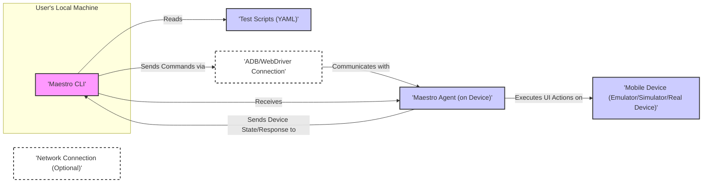

## Project Design Document: Maestro - Mobile UI Automation Tool

**1. Introduction**

This document provides a detailed design overview of Maestro, a mobile UI automation tool. The primary purpose of this document is to clearly articulate the system's architecture, components, and data flows, specifically to serve as a foundation for subsequent threat modeling activities. A comprehensive understanding of the system's design is crucial for identifying potential security vulnerabilities.

**2. Goals and Non-Goals**

* **Goals:**
    * Provide a clear and comprehensive description of Maestro's architecture and components, focusing on aspects relevant to security.
    * Detail the data flow within the system, highlighting sensitive data and interaction points.
    * Identify key interactions and dependencies between components, emphasizing potential security implications.
    * Establish a solid foundation for subsequent threat modeling exercises by providing sufficient detail about the system's workings.
* **Non-Goals:**
    * Provide a detailed implementation plan, including specific algorithms or code snippets.
    * Include specific code examples or implementation details beyond architectural descriptions.
    * Analyze specific security vulnerabilities or propose mitigations in this document (that is the purpose of the subsequent threat modeling).
    * Document every single feature or edge case of Maestro.

**3. System Architecture**

Maestro's architecture involves several key components interacting to facilitate mobile UI automation. The following diagram illustrates the high-level architecture:

**4. Detailed Component Description**

* **Maestro CLI:**
    * The primary command-line interface through which users interact with Maestro.
    * **Responsibilities:**
        * **Test Script Parsing and Validation:** Reads and validates the YAML-based test scripts, ensuring correct syntax and structure.
        * **Device Connection Management:** Establishes and manages connections to target mobile devices using platform-specific tools (ADB for Android, WebDriver/XCTest for iOS). This includes device discovery and selection.
        * **Command Translation and Dispatch:** Translates high-level commands from the test script into low-level instructions understood by the Maestro Agent.
        * **Communication with Maestro Agent:** Sends commands to the Agent and receives responses, device state information, and logs.
        * **Result Aggregation and Reporting:** Collects and aggregates results from the Agent, providing feedback to the user on test execution status (success, failure, errors).
        * **Agent Deployment (if necessary):**  Handles the installation or update of the Maestro Agent on the target device.
* **Test Scripts (YAML):**
    * Declarative files written in YAML that define the automated UI test flows.
    * **Content:**
        * Sequences of user actions (taps, swipes, text input).
        * Assertions to verify the state of the application's UI.
        * Configuration parameters for test execution (e.g., app launch details).
        * Potentially sensitive information, such as test data or credentials (though best practices discourage this).
* **Mobile Device (Emulator/Simulator/Real Device):**
    * The target environment where the mobile application under test is running.
    * **Characteristics:**
        * Can be a virtualized environment (emulator/simulator) or a physical device.
        * Has its own operating system (Android or iOS) and security mechanisms.
        * Contains the application under test and potentially other sensitive data.
* **Maestro Agent (on Device):**
    * A lightweight application or service running on the target mobile device.
    * **Responsibilities:**
        * **Command Reception:** Listens for and receives commands from the Maestro CLI.
        * **UI Interaction:** Executes UI actions on the application under test by interacting with the operating system's accessibility services or UI automation frameworks.
        * **State Observation:** Captures the current state of the application's UI, including the hierarchy of elements and their properties.
        * **Response Transmission:** Sends responses, device state information, and logs back to the Maestro CLI.
        * **Resource Management:** May manage resources on the device related to test execution.
* **ADB/WebDriver Connection:**
    * The communication channel used by the Maestro CLI to interact with the mobile device's operating system.
    * **Details:**
        * **Android Debug Bridge (ADB):** Used for communication with Android devices. Requires USB debugging to be enabled.
        * **WebDriver/XCTest:** Used for communication with iOS devices. Involves the `WebDriverAgent` running on the iOS device.
        * This connection allows for sending commands to install/launch apps, forward ports, and interact with the device at a lower level.
* **Network Connection (Optional):**
    * Network communication may be used in specific scenarios.
    * **Examples:**
        * Downloading the Maestro Agent from a remote server.
        * Communicating with external services for test data or reporting (less common for core UI automation).
        * Potential communication between the Maestro Agent and external services (depending on implementation).

**5. Data Flow**

The data flow during a typical Maestro test execution involves the following steps:

1. **Test Initiation:** The user initiates a test run by executing a Maestro command on their local machine, specifying the test script.
2. **Script Loading:** The Maestro CLI reads and parses the specified YAML test script. This involves loading the script content into memory.
3. **Device Connection Establishment:** The CLI establishes a connection to the target mobile device using ADB (for Android) or WebDriver/XCTest (for iOS). This may involve authentication and authorization steps depending on the device setup.
4. **Agent Deployment/Verification:** The CLI checks if the Maestro Agent is running on the device. If not, it may deploy the Agent to the device over the established connection. This involves transferring the Agent's binary to the device.
5. **Command Transmission:** The CLI translates commands from the test script into messages and sends them to the Maestro Agent over the ADB/WebDriver connection. These messages contain instructions for UI actions.
6. **Agent Command Processing:** The Maestro Agent receives the commands. It interprets these commands and interacts with the mobile operating system's UI automation frameworks to perform the requested actions on the application under test.
7. **State Capture:** After performing an action, the Agent captures the current state of the application's UI, including element properties and hierarchy.
8. **Response Transmission:** The Agent sends a response back to the Maestro CLI, indicating the success or failure of the action and including the captured UI state or other relevant information (e.g., logs, screenshots).
9. **Result Aggregation and Reporting:** The Maestro CLI receives the responses from the Agent. It aggregates these responses to determine the overall test outcome and reports the results to the user.
10. **Looping:** Steps 5-9 are repeated for each command in the test script until the test is complete or an error occurs.

**6. Key Interactions and Dependencies**

* **Maestro CLI and Test Scripts:**
    * **Interaction:** The CLI directly consumes and interprets the test scripts.
    * **Dependency:** The CLI's functionality is entirely dependent on the correct syntax and semantics of the YAML test scripts. Malformed scripts will lead to errors.
    * **Security Implication:**  If test scripts are sourced from untrusted locations or are tampered with, malicious commands could be injected and executed on the mobile device.
* **Maestro CLI and Mobile Device (via ADB/WebDriver):**
    * **Interaction:** The CLI uses ADB/WebDriver to establish a connection, deploy the Agent, and send commands.
    * **Dependency:** A functional and secure ADB/WebDriver connection is crucial for Maestro to operate.
    * **Security Implication:** Vulnerabilities in ADB/WebDriver or insecure device configurations could allow unauthorized access and control of the mobile device.
* **Maestro CLI and Maestro Agent:**
    * **Interaction:** The CLI and Agent communicate using a defined protocol to exchange commands and responses.
    * **Dependency:** Both components must be compatible in terms of the communication protocol and command formats.
    * **Security Implication:**  Compromise of either the CLI or the Agent could lead to unauthorized actions on the mobile device. The communication channel needs to be secure to prevent eavesdropping or tampering.
* **Maestro Agent and Mobile OS:**
    * **Interaction:** The Agent interacts directly with the mobile operating system's UI automation frameworks (e.g., Accessibility Services on Android, UI Automation on iOS).
    * **Dependency:** The Agent's functionality is tightly coupled with the underlying OS. Changes in the OS can break the Agent's ability to interact with the UI.
    * **Security Implication:**  Bugs or vulnerabilities in the Agent or the OS's automation frameworks could be exploited. The Agent requires appropriate permissions to function, which could be a target for abuse.
* **Mobile Application and Maestro Agent:**
    * **Interaction:** The Agent manipulates the UI elements of the application under test.
    * **Dependency:** The Agent relies on the structure and accessibility of the application's UI elements.
    * **Security Implication:**  If the application has vulnerabilities that can be triggered through UI interactions, Maestro could be used to exploit them.

**7. Deployment Considerations**

* **Maestro CLI Installation:**
    * Typically installed on the developer's workstation.
    * Installation methods may include downloading pre-built binaries, using package managers (e.g., `brew`, `npm`), or building from source.
    * **Security Consideration:**  Ensuring the integrity of the downloaded binaries and the security of the installation process is important to prevent the introduction of malicious software.
* **Mobile Device Setup:**
    * Requires enabling developer options and USB debugging (for Android) or configuring the device for remote automation (for iOS).
    * **Security Consideration:** Enabling developer options and USB debugging can increase the attack surface of the device if not properly managed.
* **Maestro Agent Deployment:**
    * The Agent needs to be present and running on the target mobile device.
    * Deployment can happen automatically when the CLI connects to the device for the first time, or it might require manual installation in some scenarios.
    * **Security Consideration:** The process of deploying the Agent should be secure to prevent the installation of a malicious or tampered Agent. The Agent should be signed and its integrity verified. Network connections used for downloading the Agent should be secure (e.g., HTTPS).

**8. Future Considerations (Relevant for Threat Modeling)**

* **Secure Communication Channels:**
    * How is the communication between the Maestro CLI and the Maestro Agent secured? Is the data transmitted encrypted (e.g., using TLS)?
    * Are there authentication and authorization mechanisms in place to ensure only authorized CLIs can communicate with the Agent?
    * How is the integrity of the communication ensured to prevent tampering of commands or responses?
* **Maestro Agent Security:**
    * How is the integrity and authenticity of the Maestro Agent verified on the mobile device? Is code signing used?
    * What permissions does the Maestro Agent require on the mobile device, and are these permissions the minimum necessary?
    * Are there any vulnerabilities in the Maestro Agent itself that could be exploited?
    * How are updates to the Maestro Agent handled, and is the update process secure?
* **Test Script Security:**
    * Where are the test scripts stored, and what access controls are in place to protect them?
    * Do test scripts ever contain sensitive information (e.g., credentials, API keys)? If so, how is this information handled and protected?
    * Can test scripts be loaded from remote sources? If so, how is the integrity and authenticity of these remote scripts verified?
* **Device Access Control and Isolation:**
    * How is access to the mobile devices used for testing controlled? Are devices dedicated to testing, or are they shared?
    * Could a compromised Maestro setup be used to gain unauthorized access to the data or functionality of the mobile device beyond the application under test?
    * Are there mechanisms to isolate test environments to prevent interference or data leakage between tests?
* **Data Handling and Logging:**
    * What data is collected and logged by Maestro during test execution (e.g., screenshots, logs, performance metrics)?
    * Where is this data stored, and what security measures are in place to protect it?
    * Does the logging process inadvertently capture sensitive information?
    * How is the deletion or retention of test data handled?
* **Third-Party Dependencies:**
    * What third-party libraries or dependencies does Maestro rely on?
    * Are these dependencies kept up-to-date with security patches?
    * Could vulnerabilities in these dependencies be exploited?
* **User Authentication and Authorization (for Maestro CLI):**
    * If Maestro is used in a collaborative environment, how are users authenticated and authorized to perform actions?
    * Are there different roles and permissions for different users?

This improved design document provides a more detailed and security-focused overview of the Maestro project. The enhanced descriptions, data flow details, and expanded "Future Considerations" section should be valuable for conducting a thorough threat modeling exercise.