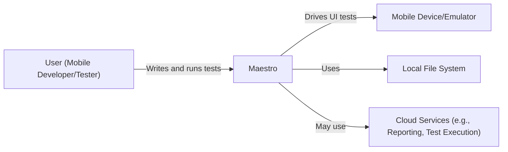
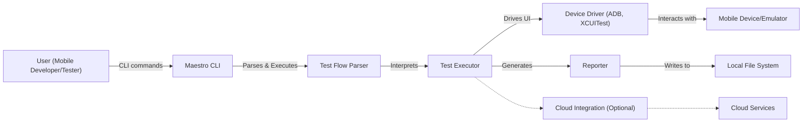
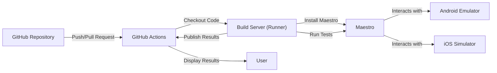
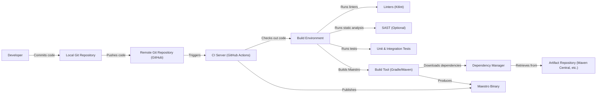

Okay, let's create a detailed design document for the Maestro project, focusing on aspects relevant for threat modeling.

# BUSINESS POSTURE

Maestro is a tool designed to improve the efficiency and reliability of mobile UI testing.  It appears to be targeted at mobile development teams, potentially ranging from small startups to larger enterprises, although the open-source nature suggests a broader appeal, including individual developers and hobbyists.

Priorities:

*   Reduce the flakiness of UI tests.
*   Simplify the creation and maintenance of UI tests.
*   Improve developer productivity by speeding up the testing process.
*   Support cross-platform testing (Android and iOS).
*   Provide a user-friendly experience (easy-to-learn and use).
*   Maintain a good reputation and trust within the mobile development community (given its open-source nature).

Goals:

*   Become a widely adopted tool for mobile UI testing.
*   Establish a strong community around the project.
*   Potentially offer commercial support or features in the future (this is speculative, but common for successful open-source projects).

Business Risks:

*   Data Breach: Although Maestro itself doesn't seem to handle sensitive user data directly (it operates on UI definitions and test scripts), a compromise of the Maestro infrastructure (e.g., build servers, cloud instances if used) could expose test scripts, potentially revealing information about the application being tested.
*   Supply Chain Attack: Compromise of Maestro's dependencies or build process could lead to malicious code being injected into the tool, affecting all users.
*   Reputational Damage: Security vulnerabilities in Maestro, especially if exploited, could damage the project's reputation and erode trust within the community.
*   Denial of Service: While not directly processing user data, a DoS attack against Maestro's infrastructure (e.g., cloud instances) could disrupt the testing workflows of its users.
*   Code Injection: If an attacker can modify test scripts or configurations, they might be able to inject malicious code into the application being tested, especially if the application under test loads external resources during testing.
*   Incorrect Configuration: Misconfiguration of Maestro, or the environment in which it runs, could lead to unintended behavior or security vulnerabilities.

# SECURITY POSTURE

Existing Security Controls:

*   security control: Code Reviews: The GitHub repository indicates the use of pull requests, suggesting that code reviews are part of the development process. (Inferred from GitHub workflow).
*   security control: Static Analysis: The presence of linters (like Kotlin lint) suggests some level of static analysis is performed. (Inferred from build configuration).
*   security control: Dependency Management: Use of a package manager (likely Gradle or Maven, given the Kotlin/Java nature) helps manage dependencies, although the specific security practices around dependency updates are unclear. (Inferred from project structure).
*   security control: Least Privilege: Maestro itself runs as a command-line tool, likely inheriting the privileges of the user executing it. Best practices would dictate running it with the least necessary privileges. (Inferred from usage).
*   security control: Input validation: Maestro is using declarative approach to define test flows, this approach reduce risk of common vulnerabilities, like injections. (Inferred from usage).

Accepted Risks:

*   accepted risk: Reliance on Third-Party Services: Maestro interacts with mobile devices/emulators and potentially with cloud services (e.g., for reporting or test execution). The security of these services is outside the direct control of the Maestro project.
*   accepted risk: User-Controlled Environment: Maestro is executed in an environment controlled by the user (developer's machine, CI server). The security of this environment is the user's responsibility.
*   accepted risk: Limited Input Validation: While Maestro's declarative approach reduces injection risks, there might be edge cases or unforeseen attack vectors related to how it parses and processes test flow definitions.

Recommended Security Controls:

*   Implement Software Composition Analysis (SCA): Integrate an SCA tool to automatically identify and track known vulnerabilities in dependencies.
*   Implement Static Application Security Testing (SAST): Integrate a SAST tool to scan the Maestro codebase for potential security vulnerabilities.
*   Implement Regular Security Audits: Conduct periodic security audits and penetration testing of the Maestro codebase and infrastructure.
*   Implement Security Hardening Guidelines: Provide documentation on how to securely configure and run Maestro, including recommendations for the execution environment.
*   Implement a Vulnerability Disclosure Program: Establish a clear process for security researchers to report vulnerabilities.

Security Requirements:

*   Authentication: Not directly applicable to Maestro itself, as it's a command-line tool. However, if Maestro were to integrate with cloud services, authentication would be crucial.
*   Authorization: Not directly applicable in the current form. If Maestro were extended to support multi-user environments or access control, authorization mechanisms would be needed.
*   Input Validation: Maestro should rigorously validate all inputs, including test flow definitions, configuration files, and command-line arguments, to prevent injection attacks or unexpected behavior.  The declarative nature helps, but edge cases should be considered.
*   Cryptography: If Maestro handles sensitive data (e.g., API keys, credentials for cloud services), it should use strong, industry-standard cryptographic practices for storage and transmission. Currently, this seems limited, but future features might require it.

# DESIGN

## C4 CONTEXT

Element Descriptions:

*   Element:
    *   Name: User (Mobile Developer/Tester)
    *   Type: Person
    *   Description: The person who writes, runs, and maintains UI tests using Maestro.
    *   Responsibilities:
        *   Writing Maestro test flows.
        *   Configuring Maestro.
        *   Running Maestro tests.
        *   Analyzing test results.
        *   Maintaining the testing environment.
    *   Security controls:
        *   Runs Maestro with least privilege.
        *   Securely manages any credentials used by Maestro.
        *   Follows secure coding practices when writing test flows.

*   Element:
    *   Name: Maestro
    *   Type: Software System
    *   Description: The core Maestro UI testing framework.
    *   Responsibilities:
        *   Parsing and interpreting test flow definitions.
        *   Interacting with mobile devices/emulators.
        *   Executing UI commands.
        *   Reporting test results.
    *   Security controls:
        *   Input validation of test flow definitions.
        *   Secure handling of any configuration data.
        *   Regular security audits and penetration testing.

*   Element:
    *   Name: Mobile Device/Emulator
    *   Type: External System
    *   Description: The Android or iOS device/emulator on which the UI tests are executed.
    *   Responsibilities:
        *   Running the application under test.
        *   Responding to UI commands from Maestro.
    *   Security controls:
        *   Device/emulator should be properly secured and isolated.
        *   Application under test should follow secure development practices.

*   Element:
    *   Name: Local File System
    *   Type: External System
    *   Description: The file system where Maestro test flows, configuration files, and reports are stored.
    *   Responsibilities:
        *   Storing and retrieving files.
    *   Security controls:
        *   Appropriate file system permissions should be used.

*   Element:
    *   Name: Cloud Services (e.g., Reporting, Test Execution)
    *   Type: External System
    *   Description: Optional cloud services that Maestro might integrate with.
    *   Responsibilities:
        *   Varies depending on the specific service (e.g., storing test results, managing test execution).
    *   Security controls:
        *   Secure communication with Maestro (e.g., HTTPS).
        *   Authentication and authorization mechanisms.
        *   Data encryption at rest and in transit.

## C4 CONTAINER

Element Descriptions:

*   Element:
    *   Name: User (Mobile Developer/Tester)
    *   Type: Person
    *   Description: The person interacting with Maestro.
    *   Responsibilities: Same as in the Context diagram.
    *   Security controls: Same as in the Context diagram.

*   Element:
    *   Name: Maestro CLI
    *   Type: Container (Command-Line Interface)
    *   Description: The entry point for users to interact with Maestro.
    *   Responsibilities:
        *   Parsing command-line arguments.
        *   Loading configuration files.
        *   Initiating test execution.
    *   Security controls:
        *   Input validation of command-line arguments.

*   Element:
    *   Name: Test Flow Parser
    *   Type: Container (Component)
    *   Description: Parses the Maestro test flow definitions (YAML files).
    *   Responsibilities:
        *   Validating the syntax and structure of test flows.
        *   Converting test flows into an internal representation.
    *   Security controls:
        *   Rigorous input validation to prevent injection attacks.

*   Element:
    *   Name: Test Executor
    *   Type: Container (Component)
    *   Description: Executes the parsed test flows.
    *   Responsibilities:
        *   Managing the test execution lifecycle.
        *   Interacting with the Device Driver.
        *   Generating test reports.
    *   Security controls:
        *   Secure handling of any sensitive data used during test execution.

*   Element:
    *   Name: Device Driver (ADB, XCUITest)
    *   Type: Container (Component)
    *   Description: Interacts with the mobile device/emulator using platform-specific tools (ADB for Android, XCUITest for iOS).
    *   Responsibilities:
        *   Sending UI commands to the device/emulator.
        *   Receiving responses from the device/emulator.
    *   Security controls:
        *   Secure communication with the device/emulator.

*   Element:
    *   Name: Mobile Device/Emulator
    *   Type: External System
    *   Description: The target device for UI testing.
    *   Responsibilities: Same as in the Context diagram.
    *   Security controls: Same as in the Context diagram.

*   Element:
    *   Name: Reporter
    *   Type: Container (Component)
    *   Description: Generates test reports in various formats.
    *   Responsibilities:
        *   Collecting test results.
        *   Formatting test reports.
        *   Writing reports to the file system.
    *   Security controls:
        *   Secure handling of any sensitive data included in reports.

*   Element:
    *   Name: Local File System
    *   Type: External System
    *   Description: Storage for test flows, reports, and configuration.
    *   Responsibilities: Same as in the Context diagram.
    *   Security controls: Same as in the Context diagram.

*   Element:
    *   Name: Cloud Integration (Optional)
    *   Type: Container (Component)
    *   Description: Handles integration with optional cloud services.
    *   Responsibilities:
        *   Communicating with cloud services.
        *   Sending/receiving data.
    *   Security controls:
        *   Secure communication (HTTPS).
        *   Authentication and authorization.

*   Element:
    *   Name: Cloud Services
    *   Type: External System
    *   Description: External cloud services used by Maestro.
    *   Responsibilities: Same as in the Context diagram.
    *   Security controls: Same as in the Context diagram.

## DEPLOYMENT

Possible Deployment Solutions:

1.  Local Machine: The user downloads and installs Maestro directly on their development machine.
2.  CI/CD Pipeline: Maestro is integrated into a CI/CD pipeline (e.g., GitHub Actions, Jenkins, CircleCI) and runs as part of the build process.
3.  Cloud-Based Testing Service: Maestro is used within a cloud-based testing service (e.g., AWS Device Farm, Firebase Test Lab), potentially leveraging the service's infrastructure for device management and test execution.

Chosen Solution (for detailed description): CI/CD Pipeline (GitHub Actions)

Element Descriptions:

*   Element:
    *   Name: GitHub Repository
    *   Type: Infrastructure Node
    *   Description: The source code repository for the application being tested and the Maestro test flows.
    *   Responsibilities:
        *   Storing code and test definitions.
        *   Triggering CI/CD workflows.
    *   Security controls:
        *   Access control to the repository.
        *   Branch protection rules.

*   Element:
    *   Name: GitHub Actions
    *   Type: Infrastructure Node
    *   Description: The CI/CD platform used to automate the build and testing process.
    *   Responsibilities:
        *   Orchestrating the workflow.
        *   Provisioning build servers.
        *   Reporting results.
    *   Security controls:
        *   Secure configuration of workflows.
        *   Least privilege access for workflows.

*   Element:
    *   Name: Build Server (Runner)
    *   Type: Infrastructure Node
    *   Description: The virtual machine or container where the build and tests are executed.
    *   Responsibilities:
        *   Running the build and test steps.
    *   Security controls:
        *   Ephemeral environments (destroyed after each build).
        *   Secure configuration of the build server.

*   Element:
    *   Name: Maestro
    *   Type: Software System
    *   Description: The Maestro testing framework, installed on the build server.
    *   Responsibilities: Same as in previous diagrams.
    *   Security controls: Same as in previous diagrams.

*   Element:
    *   Name: Android Emulator
    *   Type: Infrastructure Node
    *   Description: An instance of the Android emulator running on the build server.
    *   Responsibilities:
        *   Running the application under test.
    *   Security controls:
        *   Secure configuration of the emulator.

*   Element:
    *   Name: iOS Simulator
    *   Type: Infrastructure Node
    *   Description: An instance of the iOS simulator running on the build server.
    *   Responsibilities:
        *   Running the application under test.
    *   Security controls:
        *   Secure configuration of the simulator.
*   Element:
    *   Name: User
    *   Type: Person
    *   Description:  Developer that is reviewing results of CI build.
    *   Responsibilities: Review and react to build and test results.
    *   Security controls:
        *   Access control to the repository.

## BUILD

Build Process Description:

1.  Developer commits code changes to their local Git repository.
2.  Developer pushes changes to the remote Git repository (GitHub).
3.  The push triggers a CI workflow on the CI server (GitHub Actions).
4.  The CI server checks out the code into a build environment.
5.  Linters (e.g., Ktlint) are run to enforce code style and identify potential issues.
6.  (Optionally) A SAST tool is run to scan for security vulnerabilities.
7.  Unit and integration tests are executed.
8.  The build tool (Gradle or Maven) is used to build Maestro.
9.  The dependency manager downloads required dependencies from artifact repositories (e.g., Maven Central).
10. The build tool produces the Maestro binary (executable).
11. The CI server publishes the Maestro binary.

Security Controls:

*   security control: Code Reviews: Pull requests on GitHub enforce code reviews before merging changes.
*   security control: Linting: Linters (Ktlint) help maintain code quality and identify potential issues.
*   security control: (Recommended) SAST: Static analysis can identify security vulnerabilities in the codebase.
*   security control: Dependency Management: Gradle/Maven manage dependencies, but SCA is recommended for vulnerability tracking.
*   security control: Build Automation: GitHub Actions automates the build process, ensuring consistency and reproducibility.
*   security control: (Recommended) Software Bill of Materials (SBOM): Generate an SBOM to track all components and dependencies.
*   security control: (Recommended) Signed Commits: Developers should sign their commits to ensure authenticity.

# RISK ASSESSMENT

Critical Business Processes:

*   Mobile Application Development: Maestro directly supports the development and testing of mobile applications.
*   Continuous Integration/Continuous Delivery (CI/CD): Maestro is often integrated into CI/CD pipelines.
*   Software Quality Assurance: Maestro plays a key role in ensuring the quality and reliability of mobile applications.

Data Protection:

*   Test Scripts: While not typically considered highly sensitive, test scripts might contain information about the application's internal structure or logic. Sensitivity: Low-Medium.
*   Configuration Files: Maestro configuration files might contain API keys or other credentials if interacting with external services. Sensitivity: Medium-High.
*   Application Code (Indirectly): A compromise of Maestro could potentially lead to the compromise of the application being tested. Sensitivity: High (depending on the application).
*   Test Results: Test results might reveal information about application behavior or vulnerabilities. Sensitivity: Low-Medium.

# QUESTIONS & ASSUMPTIONS

Questions:

*   Are there any specific compliance requirements (e.g., GDPR, HIPAA) that Maestro needs to consider, even indirectly?
*   What are the specific cloud services (if any) that Maestro integrates with?
*   What is the expected scale of usage (number of users, frequency of tests)? This impacts the design of any cloud-based components.
*   Are there any plans to support authentication or authorization in the future?
*   What is the process for handling security vulnerabilities discovered in Maestro?
*   What level of support is provided for different versions of Android and iOS?
*   How are updates to Maestro distributed and installed?

Assumptions:

*   BUSINESS POSTURE: The primary goal is to provide a reliable and efficient UI testing tool. Monetization is not the immediate priority, but building a strong community and reputation is.
*   SECURITY POSTURE: Users are responsible for the security of their own development and testing environments. Maestro itself does not handle highly sensitive user data directly. The project follows basic secure development practices (code reviews, linting), but there's room for improvement (SCA, SAST).
*   DESIGN: Maestro is primarily a command-line tool that interacts with mobile devices/emulators. It can be integrated into CI/CD pipelines and may optionally interact with cloud services. The design is relatively simple and modular.