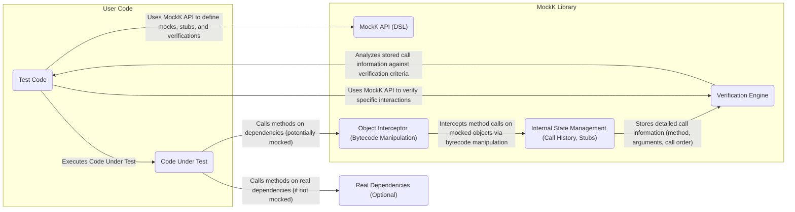

## Project Design Document: MockK Kotlin Mocking Library (Improved)

**1. Introduction**

This document provides an enhanced design overview of the MockK Kotlin mocking library (hereafter referred to as "MockK"). It aims to provide a more detailed understanding of the library's architecture, internal mechanisms, and interactions. This improved document will serve as a robust foundation for subsequent threat modeling activities, enabling a more granular and effective security analysis of the project.

**1.1. Purpose**

The primary purpose of this document is to offer a clear, comprehensive, and more detailed understanding of the MockK library's design. This deeper understanding is crucial for identifying a wider range of potential security vulnerabilities and risks associated with its functionality and implementation.

**1.2. Scope**

This document covers the core architectural components and functionalities of the MockK library as represented in the linked GitHub repository. It provides a more in-depth look at the internal workings of the library, its interactions with user code, and key dependencies. While external dependencies are mentioned, the focus remains on the internal design and potential security implications within MockK itself.

**1.3. Goals**

*   Clearly articulate the high-level architecture of MockK with greater detail.
*   Describe the key components and their specific responsibilities and internal workings.
*   Illustrate the data flow and interactions between components with more precision.
*   Provide sufficient and specific detail to facilitate a more effective and targeted threat modeling process.

**2. System Overview**

MockK is a powerful mocking library for Kotlin that empowers developers to create sophisticated mock objects for rigorous testing. It facilitates the isolation of code units by replacing their dependencies with controlled substitutes, enabling focused testing. The core functionality centers around intercepting method calls on mocked objects, defining specific behaviors for those calls, and meticulously verifying interactions.

**3. Detailed Design**

This section provides a more granular examination of the key components within the MockK library and their intricate interactions.

**3.1. MockK API (DSL)**

*   **Description:** This is the publicly accessible interface of the MockK library, offering a fluent and expressive Domain Specific Language (DSL) for all mocking operations.
*   **Functionality:**
    *   Provides functions to instantiate mock objects (`mockk`, `spyk`, `mockkClass`).
    *   Offers a powerful mechanism (`every`) to define specific behaviors (stubbing) for method calls on mocks, including return values, exceptions, and answers.
    *   Enables comprehensive verification of method calls and their arguments (`verify`, `confirmVerified`, `verifyAll`), supporting various cardinality constraints (e.g., `exactly`, `atLeast`, `atMost`).
    *   Supports a rich set of argument matchers (`any`, `eq`, `capture`, `and`, `or`, custom matchers) for flexible and precise verification.
    *   Provides features for mocking constructors and static methods.
*   **Key Considerations:** As the primary entry point for users, this component is a critical area for security considerations. Malicious or poorly written test code leveraging the API could potentially lead to unexpected behavior or expose vulnerabilities if not handled correctly internally.

**3.2. Object Interceptor (Bytecode Manipulation)**

*   **Description:** This core component is responsible for the dynamic interception of method calls on mocked objects at runtime. It achieves this through sophisticated bytecode manipulation techniques.
*   **Functionality:**
    *   Leverages a bytecode manipulation library (likely Byte Buddy or similar) to dynamically alter the bytecode of classes at runtime.
    *   Intercepts method invocations on mocked objects, redirecting control flow to MockK's internal handling logic.
    *   Manages the creation and lifecycle of mock instances, including handling inheritance and interfaces.
    *   Implements logic for handling different types of methods (virtual, final, abstract).
*   **Key Considerations:** This component's reliance on bytecode manipulation introduces inherent security considerations. Vulnerabilities within the underlying bytecode manipulation library or flaws in MockK's manipulation logic could lead to arbitrary code execution, memory corruption, or other security breaches. The process of modifying bytecode needs to be meticulously designed and tested to prevent unintended side effects or security vulnerabilities.

**3.3. Verification Engine**

*   **Description:** This component is responsible for the detailed verification of interactions with mock objects, ensuring that expected method calls occurred with the correct parameters and frequency.
*   **Functionality:**
    *   Compares recorded method call details (method name, arguments, call order, etc.) against the specified verification criteria defined through the MockK API.
    *   Supports various verification modes, including sequential verification and verification with timeouts.
    *   Provides informative and detailed error messages when verifications fail, aiding in debugging.
    *   Manages the state of verification contexts, allowing for complex verification scenarios.
*   **Key Considerations:** The logic for comparing method calls and arguments needs to be robust and secure to prevent potential bypasses or inconsistencies. Care must be taken to avoid vulnerabilities related to type confusion or incorrect handling of argument matchers.

**3.4. Internal State Management (Call History, Stubs)**

*   **Description:** This crucial component manages the internal state of mock objects, including a comprehensive history of method calls and the defined stubbed behaviors.
*   **Functionality:**
    *   Stores a detailed history of method calls made on mock objects, including the method signature, arguments passed, the order of calls, and the return value or exception thrown.
    *   Maintains the defined behavior (stubbing) for mocked methods, associating specific actions with method calls based on the `every` blocks.
    *   Tracks verification requests and their outcomes, providing context for subsequent verifications.
    *   Manages the lifecycle of mock objects and their associated state.
*   **Key Considerations:** The storage and management of this internal state must be secure to prevent unauthorized access or modification. Consider potential vulnerabilities related to memory leaks, race conditions if accessed concurrently, or the exposure of sensitive information stored within the call history.

**4. Data Flow and Interactions**

The following provides a more detailed description of the typical data flow during the usage of MockK:

1. **Mock Definition and Stubbing:** The user employs the MockK API (DSL) to define mock objects (using `mockk`, `spyk`, etc.) and specify the desired behavior for their methods using the `every` block. This stubbing information, including argument matchers and return values/exceptions, is meticulously stored within the Internal State Management.
2. **Code Under Test Execution:** The code under test interacts with the dependencies, some of which are mocked objects created by MockK.
3. **Method Call Interception:** When a method is called on a mocked object, the Object Interceptor, leveraging bytecode manipulation, intercepts this call *before* it reaches the actual method implementation (if any).
4. **Call Recording and Stub Matching:** The Object Interceptor forwards the intercepted call information (method signature, arguments) to the Internal State Management. The Internal State Management then attempts to match this call against the defined stubs.
5. **Stubbed Behavior Execution (if matched):** If a matching stub is found, the Internal State Management instructs the Object Interceptor to execute the defined behavior (return a value, throw an exception, execute an answer block).
6. **Call History Recording:** Regardless of whether a stub was matched, the details of the intercepted method call are recorded in the call history within the Internal State Management.
7. **Verification Invocation:** The user utilizes the MockK API (DSL) to initiate verification of specific interactions using the `verify` block.
8. **Verification Processing and Analysis:** The Verification Engine retrieves the recorded call history from the Internal State Management. It then meticulously analyzes this history against the specified verification criteria, taking into account argument matchers and cardinality constraints.
9. **Verification Result Reporting:** The Verification Engine reports the outcome of the verification (success or failure), providing detailed messages in case of failure, highlighting discrepancies between expected and actual interactions.

**5. Security Considerations**

This section provides a more specific and detailed outline of potential security considerations relevant to MockK, offering potential attack vectors and areas of concern for threat modeling.

*   **Bytecode Manipulation Vulnerabilities:**
    *   **Malicious Bytecode Injection:** If vulnerabilities exist in the underlying bytecode manipulation library (e.g., Byte Buddy), malicious actors could potentially inject arbitrary bytecode during the mocking process, leading to arbitrary code execution within the test environment or even the application under test if mocking is misused in production.
    *   **Memory Corruption:** Flaws in MockK's bytecode manipulation logic could lead to memory corruption vulnerabilities, potentially causing crashes or allowing for exploitation.
    *   **Bypassing Security Checks:** Incorrect bytecode manipulation could inadvertently bypass security checks or access modifiers, allowing access to restricted methods or data.
*   **Code Injection through Stubbing and Answers:**
    *   **Arbitrary Code Execution in Tests:** If the `answer` functionality within the `every` block allows for the execution of arbitrary code based on external input or untrusted sources, it could be exploited to execute malicious code within the test environment.
    *   **Data Exfiltration:** Maliciously crafted stubs could be used to exfiltrate sensitive data from the application under test during the testing process.
*   **Denial of Service (DoS):**
    *   **Excessive Mocking:** Creating an extremely large number of mocks or mocks with complex stubbing logic could consume excessive memory or CPU resources, leading to a denial of service.
    *   **Verification Complexity:** Highly complex verification scenarios with numerous matchers and constraints could also lead to performance degradation and potential DoS.
*   **Information Disclosure:**
    *   **Exposure of Sensitive Data in Call History:** If sensitive information is passed as arguments to mocked methods, this information is stored in the internal call history. If this internal state is not properly protected or if error messages inadvertently expose this data, it could lead to information disclosure.
    *   **Logging of Sensitive Information:** Debug logs or error messages generated by MockK might inadvertently log sensitive information related to mocked method calls.
*   **Dependency Vulnerabilities:**
    *   **Transitive Dependencies:** MockK relies on other libraries (e.g., a bytecode manipulation library). Vulnerabilities in these transitive dependencies could indirectly affect the security of MockK. Regular dependency scanning and updates are crucial.
*   **Build and Distribution Pipeline Security:**
    *   **Compromised Build Artifacts:** If the build pipeline for MockK is compromised, malicious code could be injected into the distributed JAR files.
    *   **Supply Chain Attacks:**  Dependencies used during the build process could be compromised, leading to the inclusion of malicious code.
*   **Misuse of Mocking in Production Code:**
    *   **Unexpected Behavior:** Using mocking libraries in production code can lead to unexpected behavior and make debugging difficult.
    *   **Security Vulnerabilities:**  If mocks are not properly configured or if they inadvertently bypass security checks in production, it could introduce security vulnerabilities.
*   **Reflection Vulnerabilities:**
    *   **Accessing Private Members:** If MockK utilizes reflection extensively, it could be susceptible to vulnerabilities associated with reflection, such as bypassing access controls and manipulating private members.

**6. Deployment Considerations**

MockK is primarily deployed as a library dependency within Kotlin projects. Its usage is predominantly within the testing phase of the software development lifecycle. Understanding its deployment context is crucial for assessing potential security impacts:

*   **Development Environment:** Developers integrate MockK into their projects using build tools like Gradle or Maven. It is used extensively during local development and unit testing.
*   **Testing Environment:** MockK is a fundamental component of unit, integration, and potentially end-to-end tests executed in dedicated testing environments.
*   **CI/CD Pipelines:** MockK plays a vital role in automated testing within Continuous Integration and Continuous Deployment pipelines, ensuring code quality and preventing regressions.

**7. Future Considerations**

*   **New Features and API Changes:** Future development of MockK might introduce new features or modify existing APIs, potentially requiring updates to this design document and further security analysis to assess any new attack surfaces.
*   **Performance Optimizations and Architectural Refactoring:** Changes aimed at improving performance or refactoring the internal architecture could have unintended security implications that need careful evaluation.
*   **Security Audits and Penetration Testing:** Regular security audits and penetration testing are highly recommended to proactively identify and address potential vulnerabilities within MockK.
*   **Adoption of Newer Bytecode Manipulation Libraries:** If MockK migrates to a newer bytecode manipulation library, a thorough security review of the new library and the migration process is essential.

This improved document provides a more detailed and nuanced understanding of the MockK library's design, offering a stronger foundation for effective threat modeling. The more specific security considerations outlined here will enable a more targeted and comprehensive assessment of potential risks and the development of appropriate mitigation strategies.
