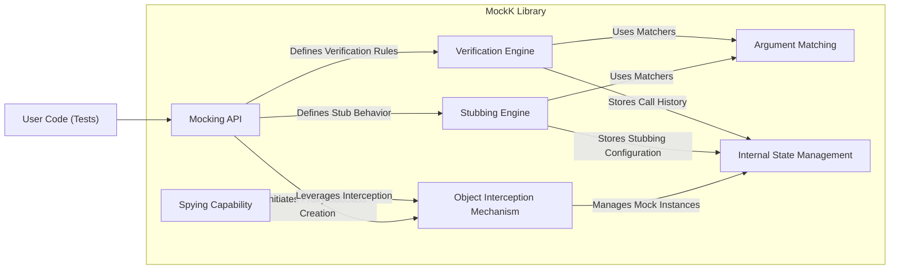
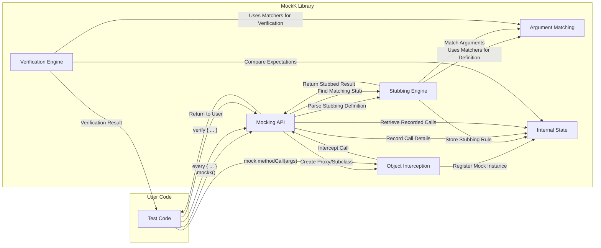

# Project Design Document: MockK

**Version:** 1.1
**Date:** October 26, 2023
**Author:** AI Software Architect

## 1. Introduction

This document provides an enhanced design overview of the MockK library, a powerful and widely-used mocking framework for Kotlin. This document is specifically crafted to serve as a robust foundation for subsequent threat modeling activities. It details the library's purpose, refined architecture, key components with clearer interactions, data flow with more context, dependencies with specific examples, and a more detailed analysis of security considerations.

### 1.1. Purpose

MockK empowers developers to create mock objects in Kotlin for rigorous testing. It facilitates the isolation of units of code by replacing real dependencies with controlled substitutes, enabling focused unit testing and precise verification of interactions between software components. This allows for testing specific logic without the complexities and potential side effects of real dependencies.

### 1.2. Scope

This design document focuses on the internal mechanisms and architecture of the MockK library. It does not delve into specific developer usage patterns or broader testing strategies. The scope is strictly limited to the library's internal workings and its interactions with the host application during test execution. We are analyzing the library itself, not the tests written using it.

### 1.3. Goals

* Provide a clear, detailed, and technically accurate depiction of MockK's internal design and operation.
* Precisely identify key components, their responsibilities, and their interactions within the library.
* Describe the data flow within MockK during the mocking, stubbing, and verification lifecycles with illustrative examples.
* Explicitly list and categorize relevant dependencies, highlighting their potential security and operational impact.
* Thoroughly outline potential security considerations stemming from the library's design, dependencies, and typical usage scenarios.
* Serve as a comprehensive and actionable input for identifying potential threats, vulnerabilities, and attack vectors during threat modeling sessions.

## 2. System Architecture

MockK's architecture is centered around the dynamic interception and manipulation of method calls on Kotlin objects. It leverages Kotlin's language features and bytecode manipulation techniques to provide a fluent and expressive mocking API.

### 2.1. High-Level Components

* **Mocking API:** This is the public-facing interface developers use to interact with MockK. It provides functions for creating mocks (`mockk()`, `spyk()`), defining stubbed behavior (`every {}`), and verifying interactions (`verify {}`, `confirmVerified()`).
* **Object Interception Mechanism:** MockK employs bytecode manipulation, typically using libraries like Byte Buddy or similar, to dynamically create proxy objects or subclasses of the classes being mocked. This allows it to intercept method calls before they reach the original object. For spied objects, it intercepts calls to mocked methods while allowing others to proceed to the real object.
* **Stubbing Engine:** This component manages the defined behavior for mocked methods. It stores mappings between method calls (identified by method signature and argument matchers) and their corresponding return values, exceptions to be thrown, or custom "answer" functions to be executed.
* **Verification Engine:** This component tracks the actual calls made to mocked objects during test execution. It compares these recorded calls against the expected interactions defined within `verify {}` blocks, using argument matchers for flexible matching.
* **Argument Matching:** MockK offers a rich set of argument matchers (e.g., `any()`, `eq()`, `capture()`, `ofType()`) that allow developers to define flexible criteria for matching method arguments during both stubbing and verification. This allows for specifying conditions beyond simple equality.
* **Spying Capability:** MockK allows the creation of "spies" on real objects. This means some methods of the real object can be mocked, while calls to other methods are delegated to the actual object's implementation. This uses the same interception mechanism but with conditional forwarding.
* **Internal State Management:** MockK maintains internal data structures to keep track of created mock objects, their defined stubs, and the recorded calls made to them. This state is typically scoped to the current test execution context to prevent interference between tests.

### 2.2. Component Diagram

## 3. Data Flow

The following outlines the typical flow of data and control within MockK during its operation:

* **Mock Creation Example:**
    * User code calls `mockk<MyClass>()`.
    * The "Mocking API" receives the request.
    * The "Object Interception Mechanism" dynamically generates a proxy class or subclass of `MyClass`.
    * The "Internal State Management" registers this new mock instance.

* **Stubbing Example:**
    * User code uses `every { mock.someMethod(any()) } returns "stubbed value"`.
    * The "Mocking API" parses the expression, identifying the target method and argument matcher.
    * The "Stubbing Engine" stores this information, associating the method signature and matcher with the specified return value for the given mock object.

* **Method Invocation on a Mocked Object Example:**
    * User code calls `mock.someMethod("actual argument")`.
    * The "Object Interception Mechanism" intercepts this call.
    * Control is passed to MockK's internal logic.
    * The "Stubbing Engine" is queried to find a matching stub based on the method signature and the "actual argument" being matched against the defined argument matchers.
    * If a match is found, the stubbed value ("stubbed value" in this example) is returned to the user code.
    * The "Internal State Management" records this method call, including the arguments used.

* **Verification Example:**
    * User code uses `verify { mock.someMethod(eq("expected argument")) }`.
    * The "Mocking API" receives the verification request, including the expected method call and argument matcher.
    * The "Verification Engine" retrieves the recorded calls for the `mock` object from the "Internal State Management".
    * It compares the expected call ( `someMethod` with argument equal to "expected argument") against the recorded calls.
    * The verification process succeeds or fails based on whether a matching call was recorded.

### 3.1. Data Flow Diagram (Detailed)

## 4. Dependencies

MockK relies on external libraries to provide its core functionality. Understanding these dependencies is crucial for assessing potential risks and compatibility issues.

* **Kotlin Standard Library (`kotlin-stdlib`):**  A fundamental dependency for any Kotlin project, providing core language features and utilities.
* **Bytecode Manipulation Library (e.g., Byte Buddy, Objenesis):**  Used for the dynamic generation of proxy classes and the manipulation of object instances. Byte Buddy is a common choice, but others might be used or configurable. Objenesis can be used for creating instances without invoking constructors.
* **Reflection Libraries (Indirectly via Bytecode Manipulation):** While not a direct dependency often declared by the user, the bytecode manipulation libraries themselves heavily rely on Java reflection APIs.
* **Testing Framework Integration Libraries (e.g., JUnit, Kotest):** While not strictly required for MockK's core functionality, integration libraries provide convenient extensions and assertions tailored for specific testing frameworks.

It is critical to maintain awareness of the versions of these dependencies, as security vulnerabilities discovered in these libraries could potentially affect MockK. Dependency management tools should be used to track and update these dependencies.

## 5. Security Considerations

While primarily a testing library, MockK's design and usage introduce several security considerations:

* **Dependency Vulnerabilities:** The most significant security risk likely stems from vulnerabilities in MockK's dependencies, particularly the bytecode manipulation library. A compromised bytecode manipulation library could potentially allow for arbitrary code execution or memory manipulation during test execution. Regularly auditing and updating dependencies is paramount.
* **Reflection Abuse (Indirect):** Although MockK aims to provide a type-safe API, the underlying bytecode manipulation relies heavily on reflection. If vulnerabilities exist in the reflection implementation of the JVM or within the bytecode manipulation library, they could be exploited.
* **Internal State Manipulation (Low Risk):** While less likely, if an attacker could somehow manipulate MockK's internal state during test execution (e.g., by manipulating memory or intercepting internal calls), it could lead to misleading test results, potentially masking real vulnerabilities in the system under test. This would require a high degree of access and control over the test environment.
* **Denial of Service (Test Environment):**  Maliciously crafted tests using MockK could potentially create an excessive number of mock objects or define extremely complex stubbing scenarios, leading to excessive memory consumption or CPU usage, effectively causing a denial of service within the test environment. This is more of a resource exhaustion issue than a direct security vulnerability in MockK itself but can hinder development and testing.
* **Code Injection via Custom Answers (Potential):** If developers use MockK's `answers` feature with dynamically generated or untrusted code, this could introduce code injection vulnerabilities within the test environment. The risk here lies in the developer's usage of MockK's features rather than a flaw in MockK itself.
* **Information Disclosure (Limited):** Depending on the complexity of the mocked objects and the stubbed behavior, there's a theoretical possibility of unintentionally exposing sensitive information within the test environment's memory if not handled carefully. However, this risk is generally low.

## 6. Deployment

MockK is deployed as a standard library dependency within a Kotlin project. Developers typically include it in their project's build configuration file (e.g., `build.gradle.kts` for Gradle, `pom.xml` for Maven). It is primarily intended for use during the testing phase of the software development lifecycle and is usually included as a `testImplementation` dependency. There is no separate deployment process for the library itself beyond its publication to a package repository like Maven Central.

## 7. Threat Modeling Inputs

Based on the detailed design described above, the following elements are key inputs for conducting a thorough threat model of MockK:

* **Entry Points:**
    * Public API methods for mock creation: `mockk()`, `spyk()`, `mockkClass()`, etc.
    * Public API methods for stubbing: `every {}` block.
    * Public API methods for verification: `verify {}`, `confirmVerified()`, `verifyAll {}`, etc.
    * Mechanisms for defining custom argument matchers.
    * The `answers` feature allowing custom code execution during stubbing.

* **Exit Points:**
    * Return values from mocked method invocations.
    * Exceptions thrown from mocked method invocations (either stubbed or unmocked for spies).
    * Side effects resulting from the execution of custom `answers` functions.
    * The outcome of verification assertions (success or failure).

* **Assets:**
    * The mock objects themselves and their internal state (managed by MockK).
    * The defined stubbing rules and their associated behavior.
    * The history of recorded method calls and their arguments.
    * The internal data structures and state of the MockK library during test execution.
    * The bytecode generated dynamically by the Object Interception Mechanism.

* **Trust Boundaries:**
    * The boundary between the developer's test code and the MockK library code.
    * The boundary between the MockK library and its external dependencies (especially the bytecode manipulation library).
    * The boundary between the test execution environment and external systems (if custom answers interact with external resources).

This improved design document provides a more comprehensive and detailed understanding of the MockK library's architecture and operation. This enhanced information will enable a more effective and granular threat modeling process, leading to a more robust assessment of potential security risks associated with the library and its usage.