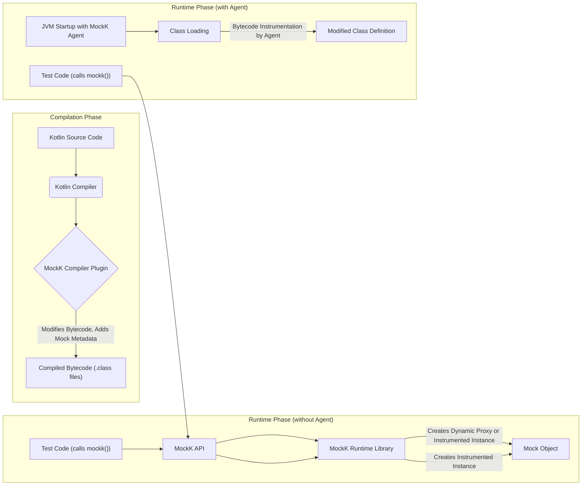
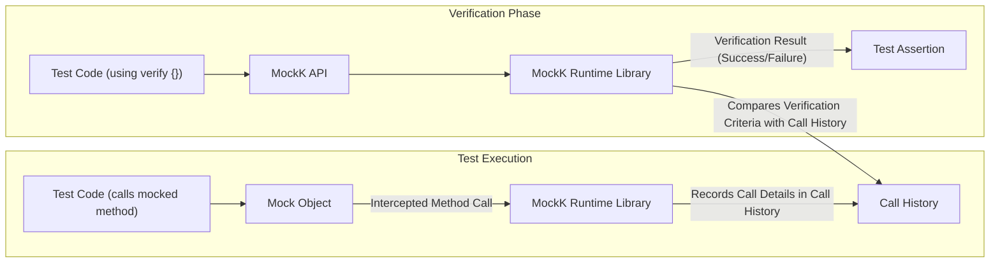

# Project Design Document: MockK Mocking Library

**Version:** 1.1
**Date:** October 26, 2023
**Author:** AI Software Architect

## 1. Introduction

This document provides an enhanced and more detailed design overview of the MockK mocking library for Kotlin, specifically tailored for threat modeling purposes. It elaborates on the key architectural components, data flow, and security considerations to facilitate a comprehensive understanding of the system's inner workings and the identification of potential security vulnerabilities. This document serves as a robust foundation for subsequent security analysis and the development of targeted threat mitigation strategies.

## 2. Goals and Non-Goals

**Goals:**

*   Present a comprehensive and in-depth architectural overview of the MockK library, emphasizing security-relevant aspects.
*   Thoroughly describe the key components and their intricate interactions, highlighting potential attack surfaces.
*   Clearly illustrate the data flow within the library during both mock object creation and method call verification, pinpointing data transformation and potential manipulation points.
*   Identify and elaborate on potential security considerations, providing concrete examples relevant for threat modeling exercises.
*   Serve as a well-defined and detailed basis for future security analysis, penetration testing, and the development of robust threat mitigation strategies.

**Non-Goals:**

*   Provide a granular, line-by-line code-level implementation guide.
*   Offer specific, actionable security hardening recommendations within this document (these will be the focus of the subsequent threat modeling and security analysis phases).
*   Document every single feature, configuration option, or obscure edge case of the library.
*   Engage in a comparative analysis of MockK with other mocking libraries or testing frameworks.

## 3. Architectural Overview

MockK is a powerful and widely used mocking library for the Kotlin programming language, designed to facilitate effective unit testing. It empowers developers to create mock objects and precisely define their behavior during test execution. MockK leverages several key Kotlin features, including coroutines, inline classes, and extension functions, to offer a concise, expressive, and efficient mocking experience. The core architecture of MockK comprises three primary elements: the Compiler Plugin, the optional Agent, and the Runtime Library, each playing a distinct role in the mocking process.

## 4. Key Components

*   **MockK Compiler Plugin:**
    *   This is a fundamental component tightly integrated with the Kotlin compiler pipeline.
    *   It operates during the compilation phase, analyzing and modifying the bytecode of Kotlin classes that are targeted for mocking. This includes classes annotated with `@MockK`, `@SpyK`, or involved in `mockk()` and `spyk()` calls.
    *   Its primary responsibilities include:
        *   **Opening Classes and Functions:**  Making classes and functions eligible for mocking by removing the `final` modifier if present, as standard JVM mocking mechanisms require non-final members.
        *   **Injecting Interception Hooks:**  Inserting specific bytecode instructions that allow the MockK runtime library to intercept method calls on mock objects.
        *   **Generating Mock Metadata:**  Creating and embedding metadata within the compiled bytecode. This metadata is crucial for the MockK runtime to correctly manage mock object behavior, track interactions, and perform verification.
    *   The compiler plugin's actions are essential for enabling MockK's core functionality and are a critical point to consider for potential bytecode manipulation vulnerabilities.

*   **MockK Agent (Optional):**
    *   The MockK Agent is a standard Java agent that can be attached to the Java Virtual Machine (JVM) at runtime.
    *   Its primary purpose is to overcome limitations of standard JVM mocking techniques and the compiler plugin by enabling the mocking of `final` classes and methods without requiring code modification or the use of the `all-open` compiler plugin.
    *   The agent achieves this through runtime bytecode instrumentation using libraries like Byte Buddy or similar.
    *   Key functionalities include:
        *   **Runtime Bytecode Modification:**  Dynamically altering the bytecode of loaded classes to remove `final` modifiers and inject interception logic.
        *   **Enabling Mocking of Final Members:**  Providing the capability to mock members that would otherwise be impossible to mock using standard techniques.
    *   The agent's operation at runtime, with its ability to modify loaded classes, introduces significant security considerations, as any vulnerabilities could lead to arbitrary code execution or other severe impacts. Its usage is optional and typically configured through JVM arguments.

*   **MockK API:**
    *   This represents the public and user-facing interface of the MockK library. It provides a fluent and expressive Domain Specific Language (DSL) for developers to define mock object behavior and verify interactions within their unit tests.
    *   Key API elements include functions such as:
        *   `mockk<T>()`:  Creates a mock object of type `T`.
        *   `spyk<T>()`: Creates a spy object of type `T`, which delegates to the real implementation by default.
        *   `every { ... } returns ...`: Defines the behavior of a mocked method when specific conditions are met.
        *   `verify { ... }`:  Asserts that certain interactions with mock objects occurred as expected.
        *   `confirmVerified(...)`: Ensures that all specified interactions have been verified.
    *   The API is implemented in Kotlin and provides a user-friendly abstraction over the underlying mocking mechanisms. Security considerations here primarily revolve around potential misuse or unexpected behavior arising from complex stubbing or verification scenarios.

*   **MockK Runtime Library:**
    *   This library contains the core logic that powers the mocking functionality at runtime. It is responsible for managing mock object instances, intercepting method calls on these mocks, and matching those calls against the defined stubbed behaviors.
    *   Key responsibilities include:
        *   **Mock Object Management:**  Creating and tracking instances of mock and spy objects.
        *   **Method Call Interception:**  Using either dynamic proxies (for interfaces and open classes when the agent is not involved) or the instrumentation injected by the compiler plugin or agent to intercept method invocations on mock objects.
        *   **Stubbing Logic:**  Storing and evaluating the conditions and return values defined in `every {}` blocks.
        *   **Verification Logic:**  Comparing the actual method calls made on mock objects with the expectations defined in `verify {}` blocks.
        *   **Call History Recording:** Maintaining a record of interactions with mock objects, including method names, arguments, and call order.
    *   The runtime library relies heavily on reflection and dynamic proxy mechanisms, which, while powerful, can be potential targets for security exploits if not implemented and handled securely.

## 5. Data Flow

The following diagrams illustrate the data flow during two fundamental operations within MockK: the creation of mock objects and the verification of method calls on those mocks.

### 5.1. Mock Object Creation



**Description:**

*   **Compilation Phase:** The process begins with Kotlin source code that utilizes the MockK API (e.g., `mockk()`). The Kotlin compiler processes this code, and the MockK Compiler Plugin intercepts the compilation process. The plugin modifies the bytecode of classes intended for mocking, adding metadata necessary for the runtime library.
*   **Runtime Phase (without Agent):** When the test code executes and calls `mockk()`, the MockK API interacts with the MockK Runtime Library. The runtime library dynamically creates a mock object instance. For interfaces and open classes, this typically involves creating a dynamic proxy. For classes modified by the compiler plugin, it might involve instantiating the instrumented class directly.
*   **Runtime Phase (with Agent):** If the MockK Agent is active, it instruments classes as they are loaded into the JVM, potentially modifying `final` classes. When `mockk()` is called, the runtime library can then create instances of these agent-modified classes.

### 5.2. Method Call Verification



**Description:**

*   **Test Execution:** During test execution, when a method is called on a mock object, the call is intercepted by the MockK Runtime Library. This interception is facilitated by either dynamic proxies or the bytecode instrumentation performed by the compiler plugin or agent.
*   **Call History Recording:** The runtime library records detailed information about the intercepted method call, including the method signature, arguments passed, and the order of calls. This information is stored in the Call History.
*   **Verification Phase:** When the test code uses the `verify {}` block, the MockK API communicates the verification criteria to the Runtime Library. The Runtime Library then compares these criteria against the recorded Call History. The result of this comparison (success or failure) determines whether the test assertion passes or fails.

## 6. Security Considerations

This section provides a more detailed exploration of potential security considerations relevant for threat modeling the MockK library.

*   **Malicious Dependencies:**
    *   MockK relies on external libraries for its functionality (e.g., ASM for bytecode manipulation, potentially Byte Buddy for the agent). If these dependencies are compromised, malicious code could be introduced into MockK.
    *   Transitive dependencies also pose a risk. A vulnerability in a library that MockK's direct dependencies rely on could indirectly affect MockK's security.
    *   **Example Threat:** A compromised dependency could allow for arbitrary code execution during the compilation or runtime phases.

*   **Compiler Plugin Vulnerabilities:**
    *   Bugs or vulnerabilities within the MockK compiler plugin could lead to the generation of flawed or malicious bytecode. This could potentially bypass security checks or introduce unexpected behavior in the compiled application.
    *   **Example Threat:** A vulnerability could be exploited to inject code that bypasses authentication or authorization checks.

*   **Agent-Based Vulnerabilities:**
    *   The MockK Agent operates with elevated privileges within the JVM. Vulnerabilities in the agent could allow for arbitrary bytecode manipulation at runtime, potentially leading to severe security breaches, including arbitrary code execution or data exfiltration.
    *   **Example Threat:** A compromised agent could be used to inject code that steals sensitive data from the application's memory.

*   **Reflection and Dynamic Proxy Exploitation:**
    *   MockK's heavy reliance on reflection and dynamic proxies introduces potential attack vectors. Improper handling of reflection calls or vulnerabilities in the underlying reflection implementation could be exploited.
    *   **Example Threat:** An attacker could craft specific scenarios that exploit reflection vulnerabilities to gain unauthorized access to private members or methods.

*   **Information Disclosure:**
    *   Error messages, logging output, or debugging information generated by MockK could inadvertently reveal sensitive information about the application's internal state or configuration.
    *   **Example Threat:** Detailed stack traces in error messages could expose internal class names or file paths, aiding attackers in understanding the application's structure.

*   **Denial of Service (DoS):**
    *   While less likely, carefully crafted mocking scenarios or malicious input could potentially lead to excessive resource consumption (CPU, memory) or infinite loops within the MockK runtime, causing a denial of service.
    *   **Example Threat:**  A test suite with a large number of complex mock interactions could be engineered to overwhelm the testing environment.

*   **Test Pollution and Manipulation:**
    *   Vulnerabilities that allow manipulation of test results could lead to a false sense of security. If an attacker can influence test outcomes, they might be able to hide the presence of vulnerabilities.
    *   **Example Threat:**  A vulnerability in the verification logic could be exploited to make failing tests appear to pass.

*   **Integration with Untrusted Code:**
    *   When MockK is used to mock interactions with external or untrusted code, vulnerabilities in MockK's mocking logic could be exploited to bypass security checks or introduce unexpected behavior when interacting with these external systems.
    *   **Example Threat:**  Mocking interactions with a payment gateway could be manipulated to simulate successful transactions without actual payment processing.

## 7. Deployment and Integration

MockK is typically integrated into a Kotlin project by adding it as a dependency in the project's build configuration file (e.g., `build.gradle.kts` for Gradle or `pom.xml` for Maven).

*   **Gradle Example:**
    ```kotlin
    dependencies {
        testImplementation("io.mockk:mockk:1.13.8") // Replace with the desired version
    }

    kotlin {
        compilerOptions {
            plugins {
                freeCompilerArgs += "-Xplugin=dependencies/io.mockk/mockk-plugin.jar" // Path might vary
            }
        }
    }
    ```
    The compiler plugin needs to be explicitly applied to the Kotlin compilation process, often by specifying it in the `build.gradle.kts` file. The path to the plugin JAR might vary depending on the dependency management setup.

*   **Maven Example:**
    ```xml
    <dependencies>
        <dependency>
            <groupId>io.mockk</groupId>
            <artifactId>mockk</artifactId>
            <version>1.13.8</version>
            <scope>test</scope>
        </dependency>
    </dependencies>

    <build>
        <plugins>
            <plugin>
                <groupId>org.jetbrains.kotlin</groupId>
                <artifactId>kotlin-maven-plugin</artifactId>
                <version>${kotlin.version}</version>
                <executions>
                    <execution>
                        <id>compile</id>
                        <phase>compile</phase>
                        <goals>
                            <goal>compile</goal>
                        </goals>
                        <configuration>
                            <compilerPlugins>
                                <plugin>dependencies/io.mockk/mockk-plugin.jar</plugin>
                            </compilerPlugins>
                        </configuration>
                    </execution>
                    <execution>
                        <id>test-compile</id>
                        <phase>test-compile</phase>
                        <goals>
                            <goal>test-compile</goal>
                        </goals>
                        <configuration>
                            <compilerPlugins>
                                <plugin>dependencies/io.mockk/mockk-plugin.jar</plugin>
                            </compilerPlugins>
                        </configuration>
                    </execution>
                </executions>
            </plugin>
        </plugins>
    </build>
    ```
    Similar to Gradle, the Maven configuration requires adding the MockK dependency and configuring the Kotlin Maven plugin to include the MockK compiler plugin.

The MockK Agent, if required for mocking final classes or methods, is typically attached to the JVM when running tests using JVM arguments.

*   **Example JVM Argument:**
    ```
    -javaagent:<path-to-mockk-agent.jar>
    ```

## 8. Technologies Used

*   **Kotlin:** The primary programming language for the MockK library and its API.
*   **Java:** Used for the optional MockK Agent component and for leveraging core JVM functionalities.
*   **ASM Bytecode Manipulation Library:**  Likely used by the MockK compiler plugin for analyzing and modifying bytecode during the compilation process.
*   **Byte Buddy (or similar):**  Potentially used by the MockK Agent for runtime bytecode instrumentation.
*   **Reflection API:** Extensively used by the MockK runtime library for inspecting and manipulating classes and methods at runtime.
*   **Dynamic Proxies (java.lang.reflect.Proxy):** Used for creating mock object instances for interfaces and open classes when the agent is not involved.

## 9. Future Considerations

*   **Regular Security Audits:** Conducting periodic and thorough security audits of the MockK codebase is crucial for proactively identifying and addressing potential vulnerabilities. These audits should include both static and dynamic analysis techniques.
*   **Robust Dependency Management:** Implementing strict dependency management practices, including the use of dependency scanning tools and vulnerability databases, to mitigate risks associated with compromised or vulnerable dependencies. Regularly updating dependencies is also essential.
*   **Sandboxing for the Agent:** Exploring options for running the MockK Agent in a more sandboxed or isolated environment to limit its potential impact in case of a compromise. This could involve using custom classloaders or security managers.
*   **Input Validation and Sanitization:** Implementing robust input validation and sanitization within the MockK API and runtime library to prevent unexpected behavior or vulnerabilities arising from maliciously crafted mocking scenarios or inputs.
*   **Secure Defaults:** Ensuring that default configurations and settings for MockK prioritize security. For example, disabling features that introduce higher security risks by default.
*   **Enhanced Logging and Monitoring:** Implementing more comprehensive logging and monitoring capabilities within MockK to aid in detecting and responding to potential security incidents.
*   **Community Engagement and Vulnerability Reporting:** Fostering a strong community engagement process and establishing clear channels for reporting potential security vulnerabilities. Implementing a responsible disclosure policy is crucial.

This enhanced document provides a more in-depth understanding of the MockK library's architecture, data flow, and security considerations. This detailed information will be invaluable for conducting a comprehensive threat modeling exercise to identify specific threats and develop effective mitigation strategies.