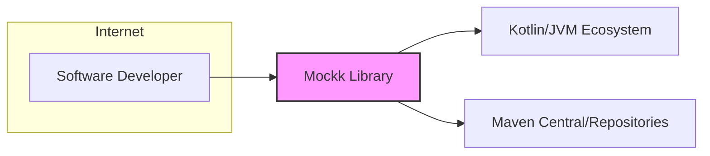
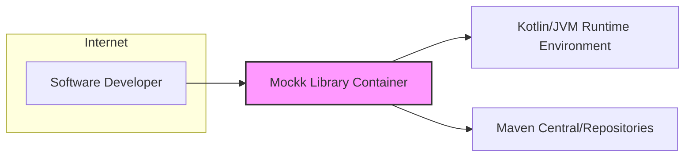

# BUSINESS POSTURE

- Business Priorities and Goals:
  - Priority: Provide a flexible and user-friendly mocking library for Kotlin and Java developers.
  - Goal: Enable developers to write effective and efficient unit tests by simplifying the mocking process.
  - Goal: Foster a strong community around the library, encouraging contributions and ensuring long-term maintainability.
  - Goal: Maintain the library's performance and stability to ensure it remains a reliable tool for developers.

- Business Risks:
  - Business Risk: Security vulnerabilities in the library could be exploited by malicious actors in downstream applications that depend on Mockk. This could lead to data breaches, service disruptions, or other security incidents in user projects.
  - Business Risk: Lack of trust in the library due to security concerns could lead to decreased adoption and community engagement.
  - Business Risk: Supply chain attacks targeting the library's dependencies or build process could compromise the integrity of Mockk releases, impacting all users.
  - Business Risk: Performance regressions or instability introduced by malicious or poorly vetted contributions could negatively impact user experience and project stability.

# SECURITY POSTURE

- Existing Security Controls:
  - Security control: Open source code - The entire codebase is publicly accessible on GitHub, allowing for community review and scrutiny. (Location: GitHub repository)
  - Security control: Public issue tracking - GitHub Issues are used to report bugs, feature requests, and potentially security vulnerabilities, enabling community reporting and discussion. (Location: GitHub Issues)
  - Security control: Pull Request review process - Contributions are submitted as pull requests and are subject to review by maintainers before being merged, providing a degree of code quality and security oversight. (Location: GitHub Pull Requests)
  - Security control: Reliance on GitHub's infrastructure security - The project benefits from GitHub's security measures for code hosting, access control, and infrastructure protection. (Location: GitHub platform)

- Accepted Risks:
  - Accepted risk:  Reliance on community vigilance for identifying and reporting security vulnerabilities. The project's security posture is heavily dependent on the active participation of the open-source community to identify and report potential issues.
  - Accepted risk: Potential delay in vulnerability patching.  The response time for addressing reported vulnerabilities depends on maintainer availability and community contributions.
  - Accepted risk:  Risk of supply chain vulnerabilities in dependencies. The project relies on external dependencies, which could introduce vulnerabilities if compromised.

- Recommended Security Controls:
  - Recommended security control: Implement automated dependency scanning to identify known vulnerabilities in project dependencies. This can be integrated into the CI/CD pipeline to proactively detect and address vulnerable dependencies.
  - Recommended security control: Integrate Static Application Security Testing (SAST) tools into the build process to automatically analyze the codebase for potential security flaws and coding vulnerabilities.
  - Recommended security control: Introduce code signing for releases to ensure the integrity and authenticity of distributed artifacts, protecting against tampering and supply chain attacks.
  - Recommended security control: Establish a clear security policy and vulnerability disclosure process to guide users on how to report security issues and to outline the project's commitment to security.
  - Recommended security control: Conduct periodic security audits or penetration testing to proactively identify and address potential vulnerabilities in the codebase and infrastructure.

- Security Requirements:
  - Authentication: Not directly applicable as Mockk is a library consumed by other applications and does not directly handle user authentication.
  - Authorization: Not directly applicable as Mockk is a library and does not enforce authorization policies.
  - Input Validation: Input validation is crucial within the Mockk API to prevent unexpected behavior or vulnerabilities in user code. Mockk should validate inputs to its public API methods to ensure data integrity and prevent injection attacks or other input-related vulnerabilities in applications using Mockk.
  - Cryptography: While Mockk itself may not directly implement cryptographic functions, it should avoid introducing vulnerabilities through its dependencies or usage patterns that could weaken the security of applications using it. If Mockk needs to handle sensitive data (even indirectly), it should do so securely and follow security best practices.

# DESIGN

- C4 CONTEXT



- C4 CONTEXT Elements:
  - Element:
    - Name: Software Developer
    - Type: Person
    - Description: Developers who use Mockk library to write unit tests for their Kotlin and Java applications.
    - Responsibilities: Uses Mockk API to create mocks and stubs in their tests. Reports issues and contributes to the library.
    - Security controls:  Responsible for securely using Mockk in their applications and reporting any potential security vulnerabilities they discover in the library.

  - Element:
    - Name: Mockk Library
    - Type: Software System
    - Description: A mocking library for Kotlin and Java, designed to simplify unit testing by allowing developers to easily create mock objects and define their behavior.
    - Responsibilities: Provides API for creating mocks, stubs, and verifying interactions.  Maintains code quality, security, and performance. Distributes releases through package repositories.
    - Security controls: Input validation within API, secure build and release process, dependency management, vulnerability scanning (recommended).

  - Element:
    - Name: Kotlin/JVM Ecosystem
    - Type: External System
    - Description: The broader ecosystem of Kotlin and Java programming languages, including the standard libraries, runtime environments (JVM), and related tools.
    - Responsibilities: Provides the runtime environment and core libraries that Mockk depends on.
    - Security controls: Security of the JVM and Kotlin standard libraries is assumed to be managed by their respective maintainers. Mockk relies on the security of these underlying platforms.

  - Element:
    - Name: Maven Central/Repositories
    - Type: External System
    - Description: Public and private repositories (like Maven Central, JCenter, or company-internal repositories) used to distribute and host Java and Kotlin libraries, including Mockk.
    - Responsibilities: Hosts and distributes Mockk library releases. Provides access control and infrastructure for package distribution.
    - Security controls: Repository providers are responsible for the security of their infrastructure and the integrity of hosted packages. Mockk relies on the security of these repositories for distribution. Code signing (recommended) can add an extra layer of security.

- C4 CONTAINER



- C4 CONTAINER Elements:
  - Element:
    - Name: Software Developer
    - Type: Person
    - Description: Developers who integrate the Mockk library into their projects.
    - Responsibilities:  Integrates Mockk into their build process, uses Mockk API in their tests.
    - Security controls: Secure development practices in their own projects, responsible for managing dependencies securely.

  - Element:
    - Name: Mockk Library Container
    - Type: Container (JAR File)
    - Description:  The Mockk library packaged as a JAR (Java Archive) file. This is the distributable unit of the library.
    - Responsibilities: Provides mocking functionality through its API. Contains all the compiled code and resources of the Mockk library.
    - Security controls:  Code signing of the JAR artifact (recommended), input validation within the library code, secure compilation process.

  - Element:
    - Name: Kotlin/JVM Runtime Environment
    - Type: Container (Runtime Environment)
    - Description: The Java Virtual Machine (JVM) or Kotlin/Native runtime environment where applications using Mockk are executed.
    - Responsibilities: Executes the code of applications that use Mockk. Provides core runtime services.
    - Security controls: Security of the JVM/Kotlin runtime environment is managed by its vendors (e.g., Oracle, OpenJDK, JetBrains). Mockk relies on the security of the underlying runtime.

  - Element:
    - Name: Maven Central/Repositories
    - Type: Container (Repository)
    - Description:  Package repositories that store and serve the Mockk JAR file.
    - Responsibilities: Hosts and distributes the Mockk JAR file. Manages package metadata and versions.
    - Security controls: Repository security is managed by the repository providers. HTTPS for download, checksum verification, and code signing (recommended) enhance security.

- DEPLOYMENT

```mermaid
flowchart LR
    subgraph Developer Machine
    A[Developer IDE]
    end
    subgraph Build Server (CI)
    B[Build System]
    end
    subgraph Maven Central/Repositories
    C[Maven Repository]
    end
    D[Software Project]

    A -- Develops & Tests --> D
    D -- Depends on --> C
    B -- Builds & Publishes --> C
    style C fill:#f9f,stroke:#333,stroke-width:2px
```

- DEPLOYMENT Elements:
  - Element:
    - Name: Developer IDE
    - Type: Environment
    - Description: The Integrated Development Environment used by developers to write code and unit tests that utilize Mockk.
    - Responsibilities:  Provides a development environment for writing and testing code.
    - Security controls: Developer machine security practices, IDE security features, secure coding practices.

  - Element:
    - Name: Build System (CI)
    - Type: Environment
    - Description:  Continuous Integration (CI) server or system (e.g., GitHub Actions, Jenkins) that automates the build, test, and release process of Mockk.
    - Responsibilities: Automates building, testing, and publishing Mockk releases. May perform security checks during the build process (recommended).
    - Security controls: Access control to CI system, secure configuration of build pipelines, secrets management for publishing credentials, implementation of automated security scans (recommended).

  - Element:
    - Name: Maven Repository
    - Type: Environment
    - Description:  Maven Central or other repositories where the compiled Mockk JAR file is deployed for distribution.
    - Responsibilities: Stores and serves the Mockk JAR file to developers.
    - Security controls: Repository security provided by the hosting platform, access control, HTTPS for distribution, checksum verification, code signing of artifacts (recommended).

  - Element:
    - Name: Software Project
    - Type: Environment
    - Description:  Developer's software projects that depend on and integrate the Mockk library for unit testing.
    - Responsibilities:  Uses Mockk library for testing. Includes Mockk as a dependency in project build files.
    - Security controls: Secure dependency management practices, vulnerability scanning of project dependencies, secure coding practices in the project itself.

- BUILD

```mermaid
flowchart LR
    A[Developer] --> B{Code Changes};
    B --> C[GitHub Repository];
    C --> D[CI System (GitHub Actions)];
    D --> E{Build & Test};
    E --> F{SAST & Dependency Scan (Recommended)};
    F --> G[Build Artifact (JAR)];
    G --> H[Code Signing (Recommended)];
    H --> I[Maven Central/Repositories];
    style I fill:#f9f,stroke:#333,stroke-width:2px
```

- BUILD Elements:
  - Element:
    - Name: Developer
    - Type: Actor
    - Description:  Software developer who writes code and contributes to the Mockk project.
    - Responsibilities: Writes code, runs local builds and tests, submits code changes via pull requests.
    - Security controls: Secure coding practices, local development environment security.

  - Element:
    - Name: Code Changes
    - Type: Data
    - Description:  Modifications to the Mockk codebase submitted by developers.
    - Responsibilities: Represents the source code changes being integrated into the project.
    - Security controls: Code review process, version control system (Git) integrity.

  - Element:
    - Name: GitHub Repository
    - Type: System
    - Description:  The Git repository hosted on GitHub that stores the Mockk source code and history.
    - Responsibilities: Version control, code hosting, pull request management.
    - Security controls: GitHub's platform security, access control to the repository, branch protection rules.

  - Element:
    - Name: CI System (GitHub Actions)
    - Type: System
    - Description:  GitHub Actions or another CI system used to automate the build, test, and release process.
    - Responsibilities: Automated build, test execution, static analysis (recommended), dependency scanning (recommended), artifact publishing.
    - Security controls: Secure CI configuration, secrets management, access control to CI system, build pipeline security.

  - Element:
    - Name: Build & Test
    - Type: Process
    - Description:  The automated process of compiling the code, running unit tests, and performing integration tests.
    - Responsibilities:  Ensures code compiles correctly and meets quality standards through automated testing.
    - Security controls: Secure build environment, test isolation, reporting of test failures.

  - Element:
    - Name: SAST & Dependency Scan (Recommended)
    - Type: Process
    - Description:  Static Application Security Testing and dependency vulnerability scanning integrated into the build pipeline (recommended security enhancement).
    - Responsibilities:  Identifies potential security vulnerabilities in the code and dependencies before release.
    - Security controls: SAST tool configuration, vulnerability database updates, reporting of identified vulnerabilities.

  - Element:
    - Name: Build Artifact (JAR)
    - Type: Data
    - Description:  The compiled Mockk library packaged as a JAR file.
    - Responsibilities:  Distributable artifact of the Mockk library.
    - Security controls: Integrity of the build process, secure storage of artifacts before publishing.

  - Element:
    - Name: Code Signing (Recommended)
    - Type: Process
    - Description:  Digitally signing the JAR artifact to ensure its authenticity and integrity (recommended security enhancement).
    - Responsibilities:  Provides tamper-evidence and verifies the publisher of the artifact.
    - Security controls: Secure key management, code signing process, verification of signatures by users.

  - Element:
    - Name: Maven Central/Repositories
    - Type: System
    - Description:  Maven Central or other repositories where the signed JAR artifact is published.
    - Responsibilities:  Distribution of the Mockk library to developers.
    - Security controls: Repository security, HTTPS distribution, checksum verification, signature verification (if code signing is implemented).

# RISK ASSESSMENT

- Critical Business Processes:
  - Critical Business Process: Software development lifecycle for projects that depend on Mockk.  Mockk facilitates unit testing, which is a crucial part of ensuring software quality and reliability.
  - Critical Business Process: Distribution of the Mockk library to the developer community.  Ensuring the library is available, accessible, and trustworthy is essential for its continued adoption and use.

- Data Sensitivity:
  - Data: Mockk Source Code. Sensitivity: Public. The source code is open source and publicly available on GitHub. Integrity is important to prevent malicious modifications.
  - Data: Mockk Build Artifacts (JAR files). Sensitivity: Public.  JAR files are distributed publicly. Integrity and authenticity are crucial to prevent supply chain attacks and ensure users are using legitimate and untampered versions of the library.
  - Data: Vulnerability Reports (GitHub Issues). Sensitivity: Public/Confidential (initially). Vulnerability reports are typically public to facilitate community discussion and transparency. However, in some cases, initial reports might be treated confidentially to allow for coordinated disclosure and patching before public announcement.

# QUESTIONS & ASSUMPTIONS

- Questions:
  - Question: Are there currently any automated security scans (SAST, dependency scanning) integrated into the Mockk build pipeline?
  - Question: Is there a documented security policy or vulnerability disclosure process for the Mockk project?
  - Question: Are releases of Mockk currently code-signed?
  - Question: What is the process for managing and reviewing dependencies of the Mockk project?
  - Question: Are there any plans to conduct formal security audits or penetration testing of the Mockk library?

- Assumptions:
  - Assumption: The Mockk project is maintained by a community of developers and relies on open-source principles for development and security.
  - Assumption: The project uses GitHub Actions for CI/CD, or a similar automated build system.
  - Assumption: Releases are distributed through Maven Central or similar public/private Maven repositories.
  - Assumption: The primary goal of the project is to provide a useful and reliable mocking library for the Kotlin/JVM ecosystem, and security is a secondary but important consideration.
  - Assumption: The project benefits from the inherent security measures provided by the GitHub platform and Maven Central/repository infrastructure.