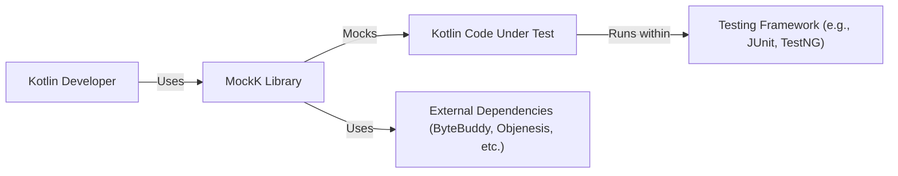
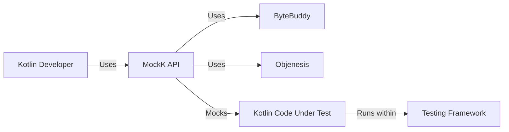
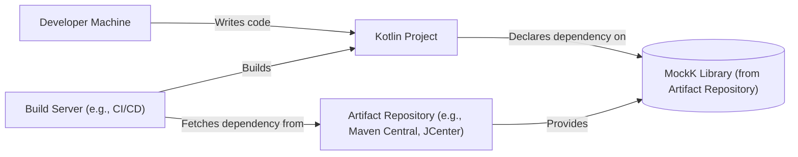
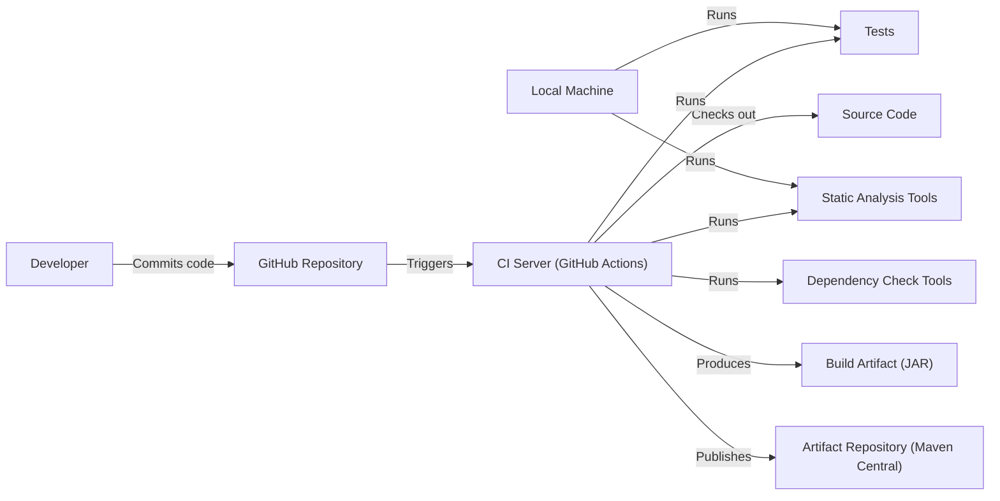

# BUSINESS POSTURE

Business Priorities and Goals:

*   Provide a robust and versatile mocking library for Kotlin developers.
*   Support various Kotlin features, including coroutines, extension functions, and data classes.
*   Offer a user-friendly API that simplifies the creation and management of mocks.
*   Maintain high performance and minimal overhead.
*   Ensure compatibility with different Kotlin versions and testing frameworks.
*   Foster a strong community and encourage contributions.

Business Risks:

*   Inability to mock specific Kotlin language features, limiting the library's usefulness.
*   Performance bottlenecks or excessive memory consumption, impacting test execution speed.
*   Compatibility issues with new Kotlin releases or popular testing frameworks.
*   Security vulnerabilities within the library itself or introduced through its misuse, potentially leading to test manipulation or information disclosure.
*   Lack of adoption due to complexity, poor documentation, or insufficient community support.
*   Competition from other mocking libraries, potentially leading to reduced usage and relevance.

# SECURITY POSTURE

Existing Security Controls:

*   security control: Code reviews are performed, as indicated by the pull request process on GitHub.
*   security control: Static analysis is likely used, although the specific tools are not mentioned in the repository's top-level README.
*   security control: Testing is heavily emphasized, suggesting a focus on preventing regressions and identifying potential issues.
*   accepted risk: The library inherently involves manipulating program behavior, which could be misused if not carefully applied. This is a fundamental aspect of mocking.
*   accepted risk: The library relies on external dependencies (e.g., ByteBuddy, Objenesis), which could introduce vulnerabilities. The project should keep these dependencies up-to-date.

Recommended Security Controls:

*   security control: Implement a regular static analysis process using tools specifically designed for security vulnerability detection (e.g., SpotBugs with security plugins, or dedicated Kotlin security analyzers).
*   security control: Introduce dependency vulnerability scanning to automatically identify and address known vulnerabilities in third-party libraries.
*   security control: Consider fuzz testing to explore edge cases and uncover unexpected behavior that could lead to security issues.
*   security control: Provide clear documentation and guidelines on secure usage of the library, emphasizing potential risks and best practices.

Security Requirements:

*   Authentication: Not directly applicable to a mocking library.
*   Authorization: Not directly applicable to a mocking library.
*   Input Validation: The library should handle invalid or unexpected input gracefully, preventing crashes or unexpected behavior. This is particularly relevant for features that involve dynamic code generation or reflection.
*   Cryptography: Not directly applicable, unless the library is used to mock cryptographic operations. In such cases, it should not introduce weaknesses or bypass security mechanisms.

# DESIGN

## C4 CONTEXT

Context Diagram Element Description:

*   Element:
    *   Name: Kotlin Developer
    *   Type: Person
    *   Description: A software developer writing tests for Kotlin code.
    *   Responsibilities: Uses MockK to create mocks and write unit/integration tests.
    *   Security controls: Follows secure coding practices.

*   Element:
    *   Name: MockK Library
    *   Type: Software System
    *   Description: The MockK mocking library for Kotlin.
    *   Responsibilities: Provides APIs for creating and managing mocks, intercepting calls, and verifying behavior.
    *   Security controls: Input validation, regular static analysis, dependency vulnerability scanning, fuzz testing.

*   Element:
    *   Name: Kotlin Code Under Test
    *   Type: Software System
    *   Description: The Kotlin code being tested using MockK.
    *   Responsibilities: Executes the business logic being tested.
    *   Security controls: Depends on the specific code being tested.

*   Element:
    *   Name: Testing Framework (e.g., JUnit, TestNG)
    *   Type: Software System
    *   Description: The testing framework used to run the tests.
    *   Responsibilities: Provides the test execution environment and reporting.
    *   Security controls: Relies on the security of the testing framework itself.

*   Element:
    *   Name: External Dependencies (ByteBuddy, Objenesis, etc.)
    *   Type: Software System
    *   Description: Third-party libraries used by MockK.
    *   Responsibilities: Provide underlying functionality (e.g., bytecode manipulation, object creation).
    *   Security controls: Dependency vulnerability scanning.

## C4 CONTAINER

Container Diagram Element Description:

*   Element:
    *   Name: Kotlin Developer
    *   Type: Person
    *   Description: A software developer writing tests for Kotlin code.
    *   Responsibilities: Uses MockK to create mocks and write unit/integration tests.
    *   Security controls: Follows secure coding practices.

*   Element:
    *   Name: MockK API
    *   Type: Container (Library)
    *   Description: The public API of the MockK library.
    *   Responsibilities: Provides functions for creating mocks, defining behavior, and verifying interactions.
    *   Security controls: Input validation, regular static analysis.

*   Element:
    *   Name: ByteBuddy
    *   Type: Container (Library)
    *   Description: A library for bytecode generation and manipulation.
    *   Responsibilities: Used by MockK to create mock objects and intercept method calls.
    *   Security controls: Dependency vulnerability scanning.

*   Element:
    *   Name: Objenesis
    *   Type: Container (Library)
    *   Description: A library for creating objects without calling constructors.
    *   Responsibilities: Used by MockK to instantiate mock objects.
    *   Security controls: Dependency vulnerability scanning.

*   Element:
    *   Name: Kotlin Code Under Test
    *   Type: Software System
    *   Description: The Kotlin code being tested.
    *   Responsibilities: Executes business logic.
    *   Security controls: Dependent on the code itself.

*   Element:
    *   Name: Testing Framework
    *   Type: Software System
    *   Description: JUnit, TestNG, or other testing frameworks.
    *   Responsibilities: Executes tests and reports results.
    *   Security controls: Relies on the security of the testing framework.

## DEPLOYMENT

Deployment Solutions:

1.  **Library Dependency:** MockK is typically used as a library dependency within a Kotlin project. Developers add it to their project's build configuration (e.g., using Gradle or Maven). This is the most common and recommended approach.
2.  **Standalone JAR (Unlikely):** While technically possible, it's unlikely that MockK would be deployed as a standalone JAR file. Its primary purpose is to be integrated into other projects.

Chosen Solution (Detailed Description): Library Dependency

Deployment Diagram Element Description:

*   Element:
    *   Name: Developer Machine
    *   Type: Infrastructure Node
    *   Description: The developer's local workstation.
    *   Responsibilities: Writing code, running tests locally.
    *   Security controls: Standard development environment security practices.

*   Element:
    *   Name: Build Server (e.g., CI/CD)
    *   Type: Infrastructure Node
    *   Description: A server that automates the build and testing process.
    *   Responsibilities: Building the project, running tests, publishing artifacts.
    *   Security controls: Secure configuration, access control, vulnerability scanning.

*   Element:
    *   Name: Artifact Repository (e.g., Maven Central, JCenter)
    *   Type: Infrastructure Node
    *   Description: A repository that stores compiled libraries (JAR files).
    *   Responsibilities: Providing access to MockK and other dependencies.
    *   Security controls: Access control, integrity checks, vulnerability scanning.

*   Element:
    *   Name: Kotlin Project
    *   Type: Software System
    *   Description: The Kotlin project that uses MockK.
    *   Responsibilities: Contains the code under test and the test code.
    *   Security controls: Depends on the project's specific security measures.

*   Element:
    *   Name: MockK Library (from Artifact Repository)
    *   Type: Container
    *   Description: The compiled MockK library (JAR file).
    *   Responsibilities: Provides mocking functionality.
    *   Security controls: Inherits security measures from the build and deployment process.

## BUILD

Build Process Description:

1.  **Developer Action:** A developer writes code and unit tests locally, using MockK for mocking. They commit their changes to the MockK repository on GitHub.
2.  **Local Build (Optional):** Developers can optionally run builds and tests locally before committing.
3.  **Continuous Integration (CI):** GitHub Actions (or a similar CI system) is triggered by the commit.
4.  **Checkout Code:** The CI server checks out the latest code from the repository.
5.  **Build:** The CI server builds the MockK library using a build tool (likely Gradle, based on the `build.gradle.kts` file).
6.  **Run Tests:** The CI server executes the unit and integration tests.
7.  **Static Analysis:** Static analysis tools (e.g., linters, code quality checkers, and security analyzers) are run to identify potential issues.
8.  **Dependency Check:** Dependency scanning tools check for known vulnerabilities in the project's dependencies.
9.  **Artifact Creation:** If all checks pass, the build process creates the MockK JAR file (the build artifact).
10. **Publish Artifact:** The CI server publishes the JAR file to an artifact repository (e.g., Maven Central), making it available for other projects to use.

Security Controls in Build Process:

*   security control: **Code Review:** Pull requests on GitHub enforce code review before changes are merged.
*   security control: **Automated Testing:** Extensive unit and integration tests are run on every build to catch regressions and ensure functionality.
*   security control: **Static Analysis:** Static analysis tools are used to identify potential code quality and security issues.
*   security control: **Dependency Scanning:** Dependency scanning tools are used to detect known vulnerabilities in third-party libraries.
*   security control: **CI/CD Pipeline:** The use of a CI/CD pipeline (GitHub Actions) ensures a consistent and automated build process, reducing the risk of manual errors.
*   security control: **Signed artifacts**: Release artifacts are signed.

# RISK ASSESSMENT

Critical Business Processes:

*   **Software Development:** MockK is a tool used in the software development process, specifically for testing. Its primary function is to support the creation of reliable and maintainable software.
*   **Testing:** MockK directly impacts the testing process by enabling developers to isolate units of code and verify their behavior.

Data Protection:

*   MockK itself does not handle or store sensitive data directly. It operates on code and objects within the testing environment.
*   Data Sensitivity: The sensitivity of the data MockK interacts with depends entirely on the code being tested. If the code under test handles sensitive data (e.g., personal information, financial data), then MockK *could* be used to interact with that data during testing. However, this is a property of the code being tested, not MockK itself. MockK does not inherently increase or decrease the sensitivity of the data.

# QUESTIONS & ASSUMPTIONS

Questions:

*   What specific static analysis tools are currently used (if any)?
*   What is the process for updating dependencies and addressing identified vulnerabilities?
*   Are there any specific security concerns or past incidents related to MockK or similar mocking libraries?
*   What is the release process and how are artifacts signed?
*   What are the specific testing frameworks supported and tested against?

Assumptions:

*   BUSINESS POSTURE: The MockK project prioritizes providing a stable and reliable mocking library for the Kotlin community.
*   SECURITY POSTURE: The project follows basic secure development practices, but there is room for improvement by implementing more robust security checks.
*   DESIGN: The design is relatively straightforward, leveraging established libraries like ByteBuddy and Objenesis for core functionality. The deployment model is standard for a library dependency. The build process is automated using GitHub Actions.