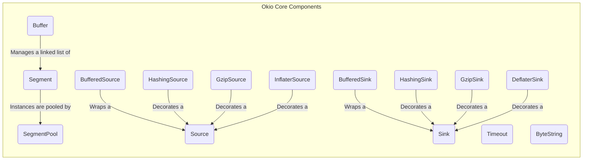
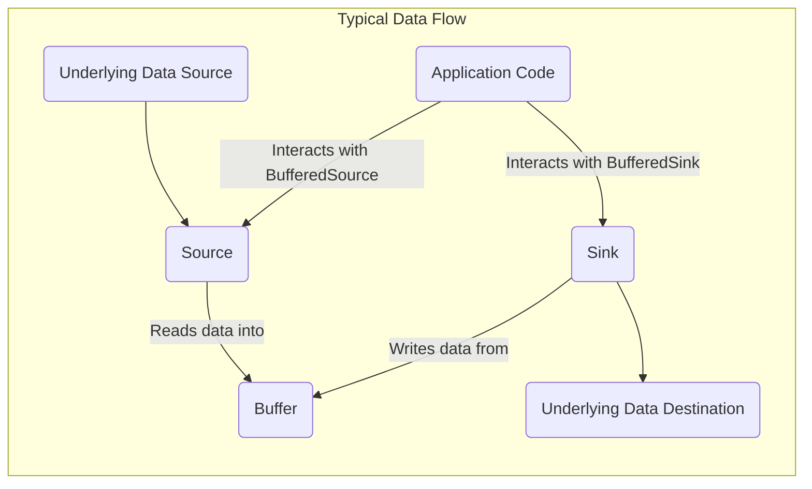

# Project Design Document: Okio Library

**Version:** 1.1
**Date:** October 26, 2023
**Author:** AI Software Architect

## 1. Introduction

This document provides an enhanced and detailed design overview of the Okio library, a library that complements `java.io` and `java.nio` to simplify data access, storage, and processing in Java and Kotlin. This document is specifically tailored to serve as a robust foundation for subsequent threat modeling activities. It meticulously outlines the key components, architectural patterns, and data flow mechanisms within Okio, explicitly highlighting potential areas of interest and concern for security analysts.

## 2. Goals

* Deliver a comprehensive and refined architectural overview of the Okio library, suitable for security analysis.
* Clearly identify and describe the core components of Okio and their intricate interactions.
* Detail the typical and critical data flow paths within Okio, emphasizing potential interception or manipulation points.
* Explicitly highlight potential security considerations and vulnerabilities inherent in the design and usage of Okio.
* Serve as a precise and actionable foundation for subsequent threat modeling exercises, enabling the identification of specific threats and attack vectors.

## 3. Scope

This document focuses on the core architectural design and fundamental abstractions of the Okio library as represented in the provided GitHub repository. It delves deeper into the relationships between key components and their responsibilities. While it doesn't cover every single class or method implementation detail, it provides sufficient depth for effective threat modeling. The focus is on the library's internal workings and its interaction with external data sources and sinks.

## 4. Target Audience

This document is primarily intended for:

* Security architects and engineers directly responsible for conducting threat modeling, security assessments, and penetration testing of systems utilizing Okio.
* Software architects and developers requiring a thorough understanding of Okio's design, particularly its security implications, to build secure applications.
* Anyone involved in the security analysis, risk assessment, or compliance evaluation of applications that incorporate the Okio library.

## 5. High-Level Overview

Okio is a powerful library for Java and Kotlin designed to streamline and enhance I/O operations. It offers elegant abstractions like `Source` for reading data and `Sink` for writing data, along with the efficient `Buffer` for in-memory data manipulation. Its key strengths include:

* **Unified and Intuitive API:** Presents a consistent and easy-to-use API for diverse I/O operations, abstracting away complexities.
* **High-Performance Buffering:** Features a sophisticated `Buffer` class that internally manages data using a linked list of `Segment` objects, optimizing memory usage and performance.
* **Seamless Interoperability:** Designed to integrate smoothly with existing Java I/O (`java.io`) and NIO (`java.nio`) APIs.
* **Built-in Utilities:** Includes convenient utilities for common data transformations such as hashing, encoding, and compression.

## 6. Architectural Design

The architecture of Okio is centered around a set of well-defined abstractions that collaborate to manage data flow efficiently and reliably.

### 6.1. Key Components

* **`Buffer`:** The central data container in Okio. It's a dynamically resizable sequence of bytes, implemented as a linked list of `Segment` objects. This structure allows for efficient appending and consuming of data without requiring large contiguous memory blocks.
* **`Segment`:** A fixed-size (typically 8 KiB) contiguous block of bytes. `Buffer` reuses `Segment` instances from the `SegmentPool` to minimize memory allocation overhead. Each `Segment` maintains pointers to the next and previous segments in the `Buffer`.
* **`SegmentPool`:** A static pool of reusable `Segment` instances. This mechanism significantly reduces the frequency of garbage collection by providing pre-allocated memory blocks. The pool has a maximum size to prevent unbounded memory consumption.
* **`Source`:** An interface defining the contract for reading a stream of data. Implementations of `Source` are responsible for fetching data from an underlying source. Concrete examples include `FileSource` (reading from files), `InputStreamSource` (reading from Java `InputStream`), and `SocketSource` (reading from network sockets).
* **`Sink`:** An interface defining the contract for writing a stream of data. Implementations of `Sink` handle the process of writing data to an underlying destination. Examples include `FileSink` (writing to files), `OutputStreamSink` (writing to Java `OutputStream`), and `SocketSink` (writing to network sockets).
* **`BufferedSource`:** An interface that extends `Source` and introduces internal buffering. This allows reading data in larger, more efficient chunks from the underlying `Source`, improving performance by reducing the number of calls to the underlying data source.
* **`BufferedSink`:** An interface that extends `Sink` and provides internal buffering capabilities. It accumulates data in an internal buffer before writing it to the underlying `Sink` in larger blocks, enhancing write performance.
* **`Timeout`:** A utility class for setting deadlines on I/O operations. This is crucial for preventing indefinite blocking and improving the resilience of applications using Okio, especially when dealing with potentially unreliable external resources.
* **`ByteString`:** An immutable sequence of bytes. This class is useful for representing fixed binary data, such as cryptographic keys or hash values, where immutability is desired for security and correctness.
* **`HashingSource` and `HashingSink`:** Decorator classes that wrap a `Source` or `Sink` and calculate cryptographic hashes of the data being read or written. This allows for easy integration of data integrity checks into I/O operations. The specific hashing algorithm is configurable.
* **`GzipSource` and `GzipSink`:** Decorator classes that provide gzip compression and decompression capabilities on top of a `Source` or `Sink`. These are essential for reducing data transfer sizes and storage requirements.
* **`DeflaterSink` and `InflaterSource`:** More general decorator classes for DEFLATE compression and decompression, offering flexibility beyond the gzip format.

### 6.2. Component Diagram

### 6.3. Data Flow

The fundamental data flow pattern in Okio involves a `Source` reading data into a `Buffer`, and a `Sink` writing data from a `Buffer`. `BufferedSource` and `BufferedSink` optimize this process by managing internal buffers.

## 7. Security Considerations

The architectural design of Okio presents several potential security considerations that need careful evaluation during threat modeling:

* **Resource Exhaustion via `SegmentPool` Manipulation:** A malicious actor could attempt to exhaust the `SegmentPool` by intentionally allocating a large number of `Buffer` objects and retaining them. This could lead to a denial-of-service (DoS) condition by preventing legitimate operations from acquiring necessary memory. Consider the maximum size of the pool and the potential for uncontrolled growth.
* **Memory Management Vulnerabilities:** While Java's garbage collection mitigates many memory safety issues, improper handling of `Buffer` objects or `Segment` references could still lead to memory leaks if buffers are not properly closed or released. In scenarios involving native interop or complex custom `Source`/`Sink` implementations, the risk of memory corruption could increase.
* **Lack of Implicit Input Validation in `Source`:** Okio's `Source` implementations are designed to read data efficiently but do not inherently perform input validation. Applications consuming data from a `Source` must implement their own validation logic to prevent vulnerabilities such as buffer overflows, format string bugs, or injection attacks if the data source is untrusted or potentially malicious. For example, reading excessively long strings or malformed data structures without validation could lead to exploitable conditions.
* **Absence of Implicit Output Sanitization in `Sink`:** Similarly, Okio's `Sink` implementations focus on writing data efficiently without performing output sanitization. Applications writing data to a `Sink`, especially if the destination is an external system or user interface, must ensure proper encoding and sanitization to prevent vulnerabilities like cross-site scripting (XSS), command injection, or SQL injection.
* **Dependency Chain Vulnerabilities:** Okio, while having minimal direct dependencies, might be used in projects with a complex dependency tree. Vulnerabilities in transitive dependencies could indirectly impact the security of applications using Okio. Regular dependency scanning and updates are crucial.
* **Cryptographic Weaknesses in `HashingSink`/`HashingSource`:** When using `HashingSink` or `HashingSource`, the security relies heavily on the chosen hashing algorithm. Using weak or outdated algorithms (e.g., MD5, SHA1 for sensitive data) could lead to collision attacks or other cryptographic weaknesses. Ensure strong, up-to-date hashing algorithms are used and that the implementation is correct.
* **Compression/Decompression Vulnerabilities in `GzipSink`/`Source`, `DeflaterSink`/`InflaterSource`:**  Vulnerabilities in the underlying compression or decompression algorithms or their implementations could be exploited. "Billion laughs" attacks (decompression bombs) could lead to denial of service by consuming excessive memory and CPU. Ensure the libraries used for compression are up-to-date and consider setting limits on decompression ratios or buffer sizes.
* **Inadequate `Timeout` Handling:**  Failing to set appropriate timeouts on I/O operations or ignoring `Timeout` exceptions can lead to denial-of-service conditions, especially when interacting with unreliable or slow external systems. Ensure robust timeout mechanisms are in place and that exceptions are handled correctly.
* **Data Integrity Issues:** While Okio provides `HashingSink` and `HashingSource` for integrity checks, the application is ultimately responsible for implementing and verifying these checks. Failure to do so can lead to undetected data corruption or manipulation. Secure storage and transmission of hash values are also critical.

## 8. Dependencies

Okio is designed to have minimal external dependencies, which reduces the attack surface. However, it's essential to review the project's build configuration (e.g., `build.gradle` for Gradle projects) to identify any direct or transitive dependencies. Pay close attention to the versions of these dependencies and ensure they are not known to have security vulnerabilities.

## 9. Deployment Considerations

Okio is typically deployed as a library embedded within other applications. Its security posture is therefore intrinsically linked to the security of the host application and the environment in which it operates. Consider the following during deployment:

* **Permissions:** Ensure the application has the necessary permissions to access the data sources and sinks it interacts with. Avoid granting excessive permissions.
* **Isolation:** In multi-tenant environments, ensure proper isolation between tenants to prevent one tenant from impacting others through resource exhaustion or data access vulnerabilities related to Okio usage.
* **Configuration:** Securely configure any settings related to Okio, such as buffer sizes or timeout values.

## 10. Future Considerations

* **Regular Security Audits and Penetration Testing:** Periodic security audits and penetration testing specifically targeting Okio usage within applications are crucial for identifying and mitigating potential vulnerabilities.
* **Formal Verification of Core Components:** Exploring formal verification techniques for critical components like `Buffer` and `SegmentPool` could provide stronger assurances about their correctness and security properties.
* **Guidance on Secure Usage:** Providing clear and comprehensive documentation and examples on how to use Okio securely, especially regarding input validation, output sanitization, and secure cryptographic practices, would be beneficial.
* **Consideration of Memory Limits:**  Explore mechanisms to enforce stricter limits on memory usage by `Buffer` and `SegmentPool` to further mitigate resource exhaustion attacks.

## 11. Conclusion

This enhanced design document provides a more in-depth understanding of the Okio library's architecture, data flow, and critical security considerations. By leveraging this information, security professionals can conduct more effective threat modeling exercises to identify potential vulnerabilities and recommend appropriate security controls. This document serves as a valuable resource for building secure applications that utilize the Okio library.