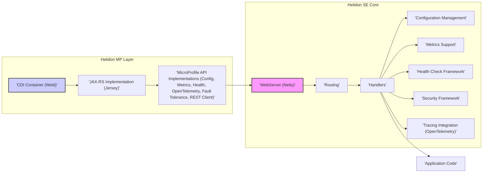
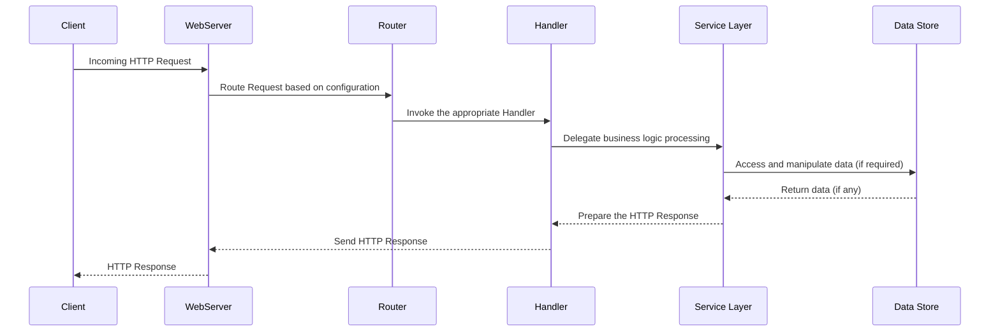

# Project Design Document: Helidon

**Version:** 1.1
**Date:** October 26, 2023
**Prepared By:** AI Architecture Expert

## 1. Project Overview

Helidon is a modern, lightweight, and fast set of Java libraries for developing microservices and cloud-native applications. It provides two distinct programming models to cater to different development preferences and project requirements:

*   **Helidon SE (Standard Edition):** A reactive programming model offering a functional and lightweight approach to building microservices. It emphasizes speed, efficiency, and direct control over the underlying infrastructure.
*   **Helidon MP (MicroProfile):** An implementation of the Eclipse MicroProfile specification, providing a standards-based approach to microservices development using familiar annotations and APIs.

This document details the architectural design of the Helidon project, focusing on its key components, their interactions, and relevant security considerations. This design will serve as the basis for subsequent threat modeling activities.

## 2. Goals and Objectives

The primary goals of the Helidon project are to:

*   **Boost Developer Productivity:** Offer intuitive and efficient APIs for building microservices in Java.
*   **Achieve High Performance and Efficiency:** Provide a lightweight runtime environment with minimal resource overhead.
*   **Ensure Standards Compliance (for Helidon MP):**  Fully implement the Eclipse MicroProfile specification.
*   **Facilitate Cloud-Native Development:** Design for easy deployment, scaling, and management in cloud environments.
*   **Offer Flexibility in Programming Models:** Provide a choice between reactive (SE) and standards-based (MP) approaches.

## 3. Target Audience

The intended audience for Helidon includes:

*   Java developers building and deploying microservices.
*   Teams seeking lightweight and high-performance microservices frameworks.
*   Organizations adopting cloud-native architectures and practices.
*   Developers who prefer reactive programming models (Helidon SE).
*   Developers who prefer standards-based microservices development using MicroProfile (Helidon MP).

## 4. High-Level Architecture

Helidon's architecture is designed with modularity and separation of concerns in mind. Both Helidon SE and MP share some foundational components, while MP builds upon the SE core.

**Explanation:**

*   **Helidon SE Core:**
    *   **WebServer (Netty):**  The underlying non-blocking, event-driven network server responsible for handling HTTP communication.
    *   **Routing:** The component responsible for mapping incoming HTTP requests to specific handlers based on defined rules.
    *   **Handlers:**  Units of code that process incoming requests and generate responses.
    *   **Configuration Management:**  Provides a system for loading, managing, and accessing application configuration from various sources.
    *   **Metrics Support:**  Enables the collection and exposition of application metrics in standard formats.
    *   **Health Check Framework:**  Allows defining health endpoints to monitor the application's operational status.
    *   **Security Framework:**  Provides mechanisms for authentication, authorization, and other security-related features.
    *   **Tracing Integration (OpenTelemetry):**  Offers integration with OpenTelemetry for distributed tracing of requests.
*   **Helidon MP Layer:**
    *   **CDI Container (Weld):**  A Contexts and Dependency Injection container that manages the lifecycle and dependencies of application components.
    *   **JAX-RS Implementation (Jersey):**  An implementation of the JAX-RS specification for building RESTful web services.
    *   **MicroProfile API Implementations:**  Implementations of various MicroProfile specifications, providing standardized APIs for common microservices functionalities.
*   **Application Code:**  The custom business logic developed by the user.

## 5. Key Components

Detailed descriptions of the major components within the Helidon architecture:

*   **Helidon WebServer (Netty):**
    *   A high-performance, asynchronous, and event-driven network application framework.
    *   Handles low-level network operations, request parsing, and response construction.
    *   Provides a foundation for building reactive and scalable applications by efficiently managing network connections and I/O operations.
*   **Helidon Routing:**
    *   Defines the rules for mapping incoming HTTP requests to specific handlers.
    *   Supports various matching criteria, including HTTP method, path, and headers.
    *   Enables the creation of request processing pipelines using interceptors and filters.
*   **Helidon Handlers:**
    *   Implement the logic for processing incoming requests.
    *   Can perform tasks such as data retrieval, business logic execution, and response generation.
    *   In Helidon SE, handlers are often implemented as functional interfaces.
*   **Helidon Configuration Management:**
    *   Provides a flexible and extensible way to manage application configuration.
    *   Supports loading configuration from various sources like files (e.g., YAML, properties), environment variables, and system properties.
    *   Allows for type-safe access to configuration values and supports configuration updates.
*   **Helidon Metrics Support:**
    *   Enables the collection and exposition of application metrics in standard formats like Prometheus.
    *   Provides built-in metrics for various aspects of the application (e.g., request latency, CPU usage).
    *   Allows developers to register custom metrics to monitor specific business logic.
*   **Helidon Health Check Framework:**
    *   Provides a standardized way to define health endpoints that can be used by monitoring systems to assess the application's health.
    *   Supports different types of health checks (e.g., liveness, readiness).
    *   Allows integration with external systems to check dependencies.
*   **Helidon Security Framework:**
    *   Offers features for securing Helidon applications, including authentication and authorization.
    *   Supports various authentication mechanisms like basic authentication, JWT, and custom authentication schemes.
    *   Provides role-based access control (RBAC) for authorization.
*   **Helidon Tracing Integration (OpenTelemetry):**
    *   Integrates with OpenTelemetry to enable distributed tracing of requests across services.
    *   Allows tracking requests as they propagate through different components and services.
    *   Helps in identifying performance bottlenecks and understanding the flow of requests in complex microservice architectures.
*   **CDI Container (Weld):**
    *   Provides dependency injection and other enterprise services for Helidon MP applications.
    *   Manages the lifecycle of application components (beans).
    *   Enables loose coupling and improves the testability of the application.
*   **JAX-RS Implementation (Jersey):**
    *   Implements the JAX-RS specification for building RESTful APIs in Helidon MP.
    *   Handles request routing based on annotations, parameter binding, and response serialization.
    *   Provides a standardized way to define and expose REST endpoints.
*   **MicroProfile API Implementations:**
    *   Includes implementations of various Eclipse MicroProfile specifications, such as:
        *   **Config:** Standardized API for accessing configuration data.
        *   **Metrics:** Standardized API for collecting and exposing metrics.
        *   **Health:** Standardized API for defining health check endpoints.
        *   **OpenTelemetry:** Standardized API for distributed tracing.
        *   **Fault Tolerance:** Provides annotations and APIs for implementing resilience patterns like retries, circuit breakers, and timeouts.
        *   **REST Client:** A type-safe HTTP client for consuming RESTful services.

## 6. Data Flow

The typical data flow within a Helidon application involves the following steps:

**Explanation:**

1. A **Client** sends an HTTP request to the Helidon application.
2. The **WebServer** (Netty) receives the incoming request.
3. The **Router** analyzes the request (e.g., URL path, HTTP method) and determines the appropriate **Handler** to process it.
4. The **Router** invokes the selected **Handler**.
5. The **Handler** often delegates the core business logic processing to a **Service Layer**.
6. The **Service Layer** may interact with a **Data Store** (e.g., database, external API) to retrieve or persist data.
7. The **Data Store** returns the requested data (if any) to the **Service Layer**.
8. The **Service Layer** processes the data and prepares the response.
9. The **Handler** constructs the HTTP response based on the processed data.
10. The **WebServer** sends the HTTP response back to the **Client**.

## 7. Technology Stack

Helidon utilizes the following key technologies:

*   **Primary Programming Language:** Java
*   **Helidon SE Core:** Custom-built, reactive framework.
*   **Helidon MP Implementation:** Weld (for CDI), Jersey (for JAX-RS), implementations of Eclipse MicroProfile specifications.
*   **Underlying Web Server:** Netty (non-blocking I/O).
*   **Configuration Management:**  Custom built with support for various formats.
*   **Metrics:** Custom built with integration for Micrometer.
*   **Health Checks:** Custom built framework.
*   **Security:** Custom built framework with pluggable authentication providers.
*   **Distributed Tracing:** Integration with OpenTelemetry.
*   **Build Tool:** Maven.
*   **Testing Frameworks:** JUnit, TestNG.

## 8. Deployment Model

Helidon applications can be deployed in various environments:

*   **Executable JAR:** Packaged as a self-contained JAR file with an embedded web server, simplifying deployment.
*   **Docker Containers:** Containerized using Docker for consistent and portable deployments.
*   **Kubernetes Clusters:** Deployed and managed within Kubernetes environments for scalability and resilience.
*   **Serverless Platforms:** Suitable for deployment on serverless platforms, requiring consideration of cold start characteristics.

## 9. Security Considerations (High-Level)

Security is a crucial aspect of Helidon. Key considerations include:

*   **Authentication Mechanisms:**
    *   Support for various authentication methods like Basic Authentication, OAuth 2.0, OpenID Connect, and JWT.
    *   Pluggable authentication providers allowing integration with different identity providers.
*   **Authorization Controls:**
    *   Role-Based Access Control (RBAC) for managing user permissions.
    *   Mechanisms for defining and enforcing access policies to protect sensitive resources.
*   **Input Validation and Sanitization:**
    *   Importance of validating and sanitizing all user inputs to prevent injection attacks (e.g., SQL injection, cross-site scripting).
    *   Utilizing appropriate libraries and techniques for input validation.
*   **Output Encoding:**
    *   Ensuring proper encoding of output data to prevent Cross-Site Scripting (XSS) vulnerabilities.
    *   Using context-aware encoding based on the output destination.
*   **Dependency Management Security:**
    *   Regularly scanning dependencies for known vulnerabilities using tools like OWASP Dependency-Check.
    *   Keeping dependencies up-to-date with security patches.
*   **Secure Configuration Practices:**
    *   Avoiding hardcoding sensitive information (e.g., passwords, API keys) in configuration files.
    *   Utilizing environment variables or secure vaults for managing secrets.
*   **Transport Layer Security (TLS):**
    *   Enforcing HTTPS for all communication to encrypt data in transit.
    *   Properly configuring TLS certificates and settings.
*   **Rate Limiting and Throttling:**
    *   Implementing rate limiting to protect against denial-of-service (DoS) attacks.
    *   Throttling requests from specific sources or users to prevent abuse.
*   **Logging and Auditing:**
    *   Comprehensive logging of security-related events (e.g., authentication attempts, authorization failures).
    *   Regularly reviewing audit logs for suspicious activity.
*   **CORS Configuration:**
    *   Properly configuring Cross-Origin Resource Sharing (CORS) policies to control which domains can access the application's resources.

These security considerations will be further analyzed and elaborated upon during the threat modeling process to identify potential vulnerabilities and develop mitigation strategies.

## 10. Assumptions and Constraints

The design of Helidon is based on the following assumptions and constraints:

*   **Assumption:** Developers have a working knowledge of Java programming.
*   **Assumption:** The target deployment environment supports the Java Virtual Machine (JVM).
*   **Constraint:** Helidon MP aims for full compliance with the Eclipse MicroProfile specification.
*   **Constraint:** Performance and minimal resource footprint are key design priorities.
*   **Constraint:** The framework should be relatively easy to learn and use for Java developers.
*   **Constraint:**  Integration with common Java ecosystem tools and libraries is desirable.

This document provides a detailed architectural overview of the Helidon project, serving as a valuable resource for understanding its structure and functionality. This understanding is crucial for conducting a thorough threat model to identify and address potential security risks.
