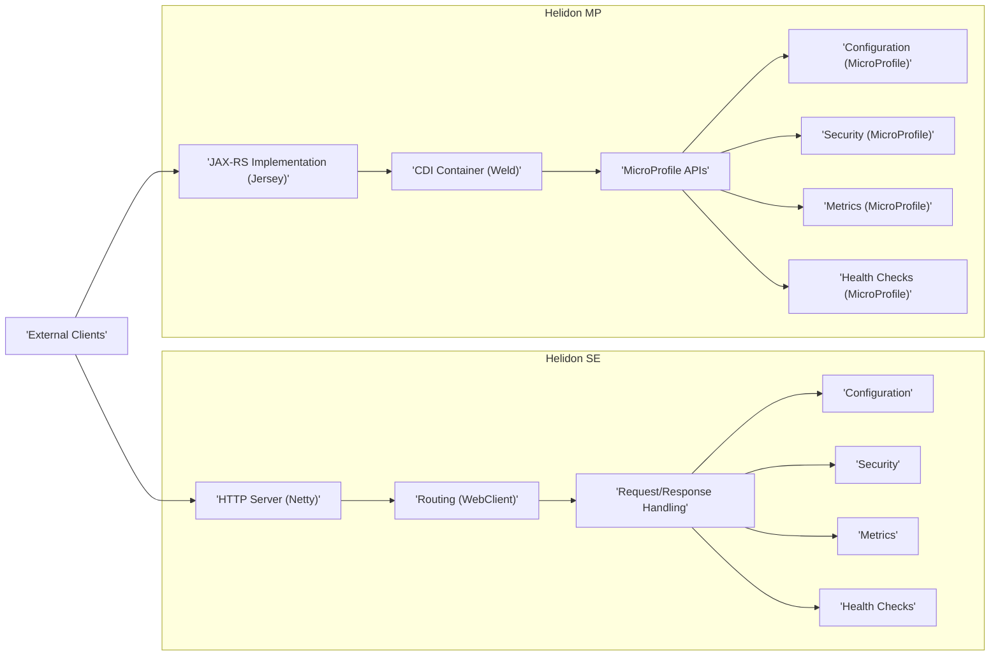
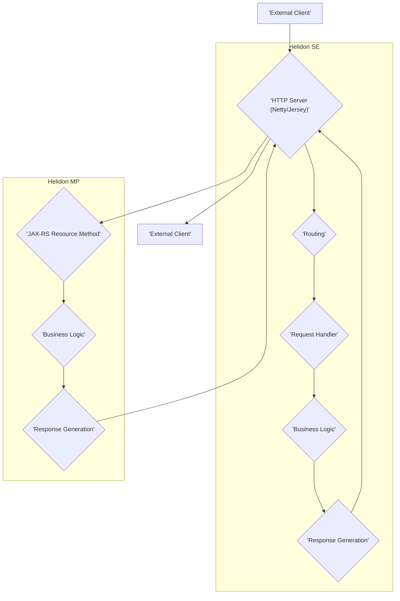

## Project Design Document: Helidon Microservices Framework

**Project Name:** Helidon

**Project Repository:** [https://github.com/oracle/helidon](https://github.com/oracle/helidon)

**Document Version:** 1.1

**Date:** October 26, 2023

**Prepared By:** AI Software Architecture Expert

### 1. Introduction

This document provides a detailed architectural design of the Helidon microservices framework, intended for use in subsequent threat modeling activities. It offers a comprehensive understanding of the system's components, their interactions, data flow, and the underlying technologies.

Helidon is a Java library collection designed for building microservices that run on a lightweight Java SE. It presents two distinct programming models:

*   **Helidon SE:** A reactive, functional-style programming model emphasizing lightweight and efficient development.
*   **Helidon MP:** An implementation of the Eclipse MicroProfile specification, promoting standardization and interoperability.

This document outlines the core architectural elements shared by both models, highlighting key differences where applicable.

### 2. Goals and Objectives

The primary goals of the Helidon project are to:

*   Enable the creation of lightweight and resource-efficient microservices.
*   Offer developers a choice between two programming paradigms (SE and MP) to suit diverse project needs and preferences.
*   Facilitate the development of cloud-native applications optimized for modern deployment environments.
*   Deliver high performance with minimal resource footprint.
*   Provide a developer-friendly and intuitive API.
*   Leverage modern Java features and industry standards.

### 3. High-Level Architecture

Helidon's architecture is characterized by its modularity, built upon a set of independent, focused libraries. These components collaborate to process incoming requests and generate responses.

**Key Architectural Principles:**

*   **Lightweight Design:** Helidon prioritizes essential functionalities, minimizing overhead and maximizing efficiency.
*   **Modular Structure:** Components are designed for independence, allowing selective usage and reducing dependencies.
*   **Reactive Foundation (SE):** Helidon SE leverages reactive programming principles for non-blocking I/O operations, enhancing performance and scalability.
*   **Standards Compliance (MP):** Helidon MP adheres to the Eclipse MicroProfile specification, ensuring compatibility and interoperability with other MicroProfile implementations.

### 4. Detailed Component Design

This section provides a deeper look into the key components within the Helidon framework.

#### 4.1. Helidon SE Components

*   **HTTP Server (Netty):** The foundational non-blocking HTTP server responsible for managing incoming network connections and processing HTTP requests. Its asynchronous nature is crucial for handling concurrent requests efficiently.
*   **Routing (WebClient):**  Directs incoming HTTP requests to the appropriate handlers based on defined routes, matching criteria like URI paths and HTTP methods. The `WebClient` component also facilitates making outbound HTTP requests.
*   **Request/Response Handling:**  Manages the lifecycle of HTTP requests and responses. This includes parsing request parameters, headers, and bodies, as well as constructing and sending responses. Interceptors can be used to add cross-cutting concerns.
*   **Configuration:** Provides mechanisms for loading and accessing application configuration from diverse sources, including configuration files (e.g., YAML, properties), environment variables, and system properties.
*   **Security:** Offers features for securing applications, encompassing authentication (verifying user identities) and authorization (controlling access to resources). This often involves integration with external identity providers or custom security implementations.
*   **Metrics:** Collects and exposes application performance metrics (e.g., request counts, response times, error rates) in a standardized format, enabling monitoring and performance analysis.
*   **Health Checks:** Provides endpoints that report the application's health status, crucial for orchestration platforms to monitor application availability and perform automated recovery actions.

#### 4.2. Helidon MP Components

*   **JAX-RS Implementation (Jersey):** Implements the JAX-RS (Java API for RESTful Web Services) specification, allowing developers to define RESTful endpoints using annotations and standard Java interfaces.
*   **CDI Container (Weld):** Implements the Contexts and Dependency Injection for Java specification, managing the lifecycle and dependencies of application components, promoting loose coupling and modularity.
*   **MicroProfile APIs:** Integrates implementations of various Eclipse MicroProfile specifications, including:
    *   **Config:** A standardized API for accessing configuration data from multiple sources.
    *   **Fault Tolerance:** Mechanisms for building resilient applications by handling failures gracefully (e.g., retries, circuit breakers, fallbacks).
    *   **Health:** Standardized endpoints for reporting application health status.
    *   **Metrics:** A standardized way to collect and expose application metrics.
    *   **OpenAPI:** Enables the generation of OpenAPI (Swagger) documentation for RESTful APIs.
    *   **REST Client:** A type-safe HTTP client for making outbound REST calls.
    *   **JWT Authentication:** Support for securing REST endpoints using JSON Web Tokens.
    *   **OpenTracing/Telemetry:** Provides APIs for distributed tracing and observability.
*   **Configuration (MicroProfile):** Adheres to the MicroProfile Config specification, providing a unified way to access configuration from various sources with support for overrides and converters.
*   **Security (MicroProfile):** Implements the MicroProfile JWT Authentication specification, enabling secure REST endpoints using JWTs for authentication and authorization.
*   **Metrics (MicroProfile):** Provides a standardized way to expose application metrics in formats like Prometheus, as defined by the MicroProfile Metrics specification.
*   **Health Checks (MicroProfile):** Implements the MicroProfile Health specification, providing standardized endpoints (e.g., `/health/live`, `/health/ready`) for reporting application health.

### 5. Data Flow

The typical flow of an incoming HTTP request within a Helidon application can be visualized as follows:

**Detailed Data Flow:**

1. **External Client:** An external entity (e.g., a web browser, another microservice) initiates an HTTP request targeting the Helidon application.
2. **HTTP Server:** The appropriate HTTP server component (Netty for Helidon SE, Jersey for Helidon MP) receives the incoming request.
3. **Routing (SE):** In Helidon SE, the routing component analyzes the request URI and HTTP method to determine the corresponding request handler.
4. **Request Handler (SE):** The designated handler is invoked to process the request. This may involve interacting with other internal components, external services, or data stores.
5. **JAX-RS Resource Method (MP):** In Helidon MP, the JAX-RS implementation maps the incoming request to the appropriate resource method based on JAX-RS annotations.
6. **Business Logic:** The core application logic is executed within the request handler (SE) or resource method (MP) to fulfill the request's purpose. This might involve data manipulation, calculations, or orchestrating calls to other services.
7. **Response Generation:** The application generates an HTTP response, including appropriate headers, a status code indicating success or failure, and a response body containing the requested data or an error message.
8. **HTTP Server:** The HTTP server component sends the generated response back to the originating external client.

### 6. Security Considerations

Security is a paramount concern in microservices architectures. Helidon provides several features and considerations for building secure applications:

*   **Authentication:**
    *   **Basic Authentication:** Supported in both SE and MP for simple credential-based authentication.
    *   **JWT Authentication (MP):** Leverages the MicroProfile JWT Authentication specification for token-based authentication, enabling stateless and scalable security.
    *   **Custom Authentication Mechanisms:** Helidon allows developers to implement custom authentication schemes to integrate with specific identity providers or security requirements.
*   **Authorization:**
    *   **Role-Based Access Control (RBAC):** Helidon enables defining roles and associating them with users or groups to control access to specific resources or functionalities.
    *   **Policy-Based Authorization:** More fine-grained authorization rules can be implemented based on various attributes and conditions.
*   **Transport Layer Security (TLS/SSL):** Essential for encrypting communication between clients and the Helidon server, protecting sensitive data in transit. Helidon supports configuring TLS for its HTTP server.
*   **Input Validation:** Developers are responsible for implementing robust input validation to prevent common injection attacks (e.g., SQL injection, cross-site scripting) and ensure data integrity.
*   **Secure Configuration Management:** Sensitive configuration data, such as database credentials and API keys, should be stored and managed securely, potentially using secrets management solutions or encrypted configuration files.
*   **Dependency Management:** Maintaining up-to-date dependencies and scanning for known vulnerabilities in third-party libraries is crucial for preventing security breaches.
*   **Security Headers:** Helidon allows setting security-related HTTP headers (e.g., `Content-Security-Policy`, `Strict-Transport-Security`, `X-Frame-Options`) to enhance client-side security and mitigate certain types of attacks.
*   **CORS (Cross-Origin Resource Sharing):** Configuration options are available to control which origins are permitted to make requests to the Helidon application, preventing unauthorized cross-domain access.
*   **Rate Limiting and Throttling:** Implementing mechanisms to limit the number of requests from a specific source can help prevent denial-of-service attacks.

### 7. Deployment Model

Helidon applications offer flexibility in deployment options, commonly deployed as standalone Java applications or within containerized environments.

*   **Standalone Deployment:** Helidon applications can be packaged as executable JAR files (uber-jars) and run directly using the Java Virtual Machine (JVM), simplifying deployment for smaller applications or development environments.
*   **Containerization (Docker):** Packaging Helidon applications within Docker containers provides portability, isolation, and consistency across different environments. Docker images can be easily managed and deployed.
*   **Orchestration (Kubernetes):** Kubernetes is a popular platform for orchestrating containerized Helidon applications, providing features like service discovery, load balancing, automated scaling, and self-healing capabilities.
*   **Cloud Platforms:** Helidon applications can be readily deployed on various cloud platforms (e.g., Oracle Cloud Infrastructure, AWS, Azure, Google Cloud Platform), leveraging their respective container orchestration services (e.g., OKE, EKS, AKS, GKE) or serverless compute options.

### 8. Technology Stack

The core technologies underpinning the Helidon framework include:

*   **Java:** The primary programming language for developing Helidon applications.
*   **Netty (SE):** A high-performance, asynchronous event-driven network application framework used for building the Helidon SE HTTP server.
*   **Jersey (MP):** The reference implementation of the JAX-RS specification, used in Helidon MP for building RESTful services.
*   **Weld (MP):** A certified implementation of CDI (Contexts and Dependency Injection for Java), providing dependency injection and lifecycle management in Helidon MP.
*   **Eclipse MicroProfile Specifications (MP):** A collection of enterprise Java specifications for building microservices, implemented within Helidon MP.
*   **Maven or Gradle:** Build automation tools used for managing dependencies, building, and packaging Helidon applications.

### 9. Diagrams

The diagrams illustrating the high-level architecture (Section 3) and data flow (Section 5) provide visual representations of the system's structure and operation.

### 10. Assumptions and Constraints

*   This document provides a general architectural overview of the Helidon framework. Specific implementations and configurations may vary based on individual application requirements and choices.
*   The security considerations outlined are high-level. A dedicated threat modeling exercise, informed by this document, is necessary to identify specific vulnerabilities and define appropriate mitigation strategies.
*   The focus is primarily on the core framework components. Detailed design aspects of integrating with external services, databases, or specific third-party libraries are not covered in this document.

This improved design document offers a more detailed and refined understanding of the Helidon microservices framework, serving as a solid foundation for subsequent threat modeling and development activities.