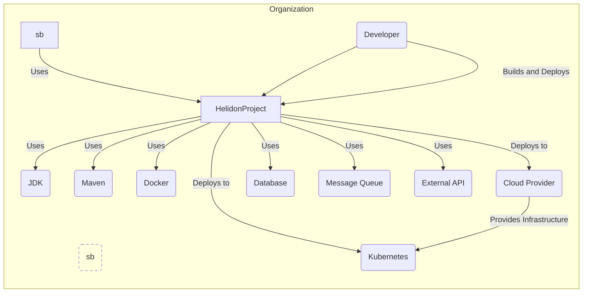
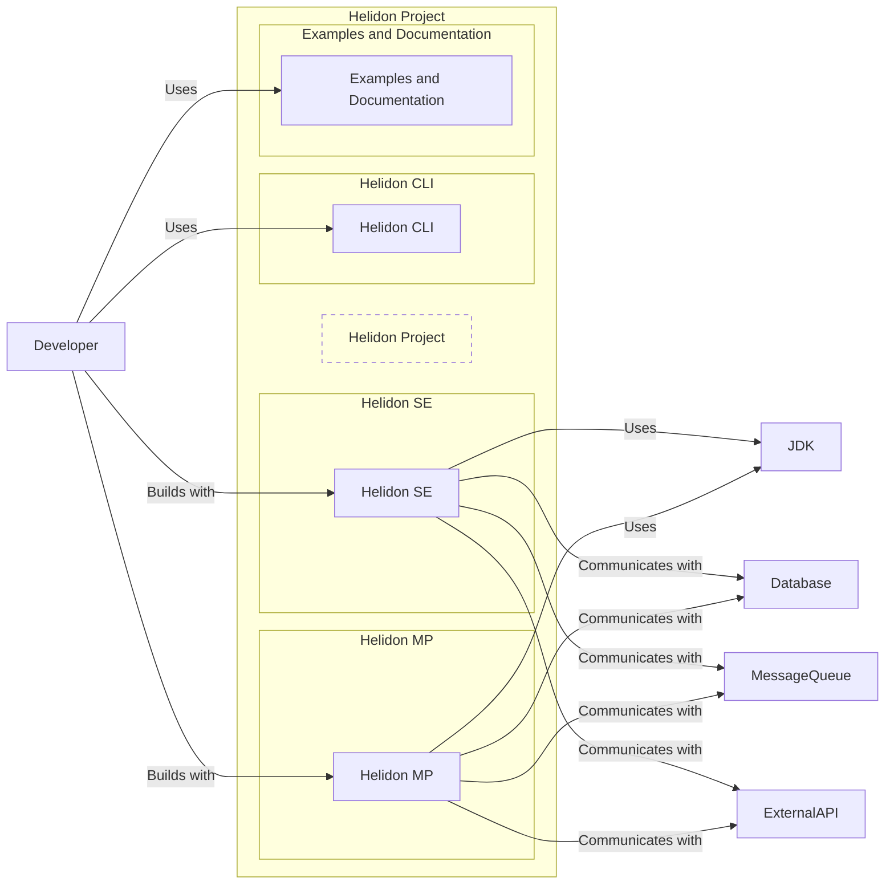
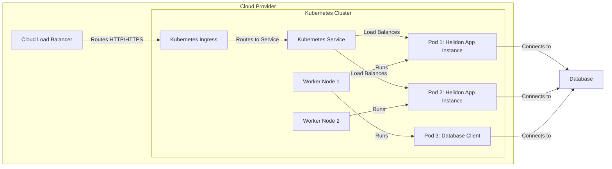
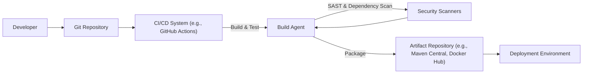

# BUSINESS POSTURE

Helidon is a cloud-native, open-source framework for building microservices and cloud applications in Java. It is designed to be lightweight, fast, and efficient, enabling developers to create applications that are easy to deploy and scale in modern cloud environments. The primary business goal of Helidon is to simplify and accelerate the development of microservices by providing a set of libraries and tools that are optimized for cloud-native architectures.

Business priorities for projects using Helidon would typically include:
- Rapid application development and deployment to meet market demands.
- Efficient resource utilization and cost optimization in cloud environments.
- Scalability and resilience of applications to handle varying workloads.
- Maintainability and ease of updates for long-term application lifecycle.

Key business risks associated with using Helidon and similar frameworks include:
- Complexity of microservices architecture leading to development and operational challenges.
- Security vulnerabilities in the framework or applications built on it, potentially leading to data breaches or service disruptions.
- Vendor lock-in if relying heavily on specific Helidon features or Oracle Cloud integrations.
- Performance bottlenecks if applications are not properly designed and optimized for Helidon.
- Operational risks associated with deploying and managing distributed microservices in cloud environments.

# SECURITY POSTURE

Existing security controls for the Helidon project and applications built with it:
- security control: Secure Software Development Lifecycle (SSDLC) - assumed to be in place, including code reviews, testing, and security considerations during design and development. (Location: General software development best practices)
- security control: Dependency Management - using Maven or Gradle to manage dependencies, allowing for updates and vulnerability patching of libraries. (Location: Build files - pom.xml, build.gradle)
- security control: Input Validation - developers are expected to implement input validation within their applications using Helidon APIs or standard Java libraries. (Location: Application code)
- security control: Authentication and Authorization - Helidon provides APIs and integrations for implementing authentication and authorization in applications. (Location: Helidon Security documentation and libraries)
- security control: Cryptography - Java Cryptography Architecture (JCA) is available for cryptographic operations within Helidon applications. (Location: Java standard library, Helidon documentation for secure communication)
- accepted risk: Open Source Dependencies - reliance on open-source libraries introduces potential vulnerabilities that need to be managed through dependency scanning and updates.
- accepted risk: Developer Security Awareness - security of applications depends on the security knowledge and practices of developers using Helidon.

Recommended security controls to implement for projects using Helidon:
- recommended security control: Automated Security Scanning - integrate Static Application Security Testing (SAST) and Dynamic Application Security Testing (DAST) tools into the CI/CD pipeline to identify vulnerabilities in code and deployed applications.
- recommended security control: Dependency Vulnerability Scanning - automate scanning of project dependencies for known vulnerabilities and ensure timely updates.
- recommended security control: Security Hardening - follow security hardening guidelines for Helidon applications and deployment environments, including secure configuration and least privilege principles.
- recommended security control: Security Training - provide security training for developers on secure coding practices, common vulnerabilities, and Helidon security features.
- recommended security control: Penetration Testing - conduct regular penetration testing of deployed applications to identify and address security weaknesses.

Security requirements for projects using Helidon:
- Authentication:
  - Requirement: Securely authenticate users or services accessing Helidon applications.
  - Requirement: Support various authentication mechanisms, such as OAuth 2.0, OpenID Connect, JWT, and basic authentication.
  - Requirement: Centralized authentication service for microservices architecture.
- Authorization:
  - Requirement: Implement fine-grained authorization to control access to specific resources and functionalities within Helidon applications.
  - Requirement: Role-Based Access Control (RBAC) or Attribute-Based Access Control (ABAC) mechanisms.
  - Requirement: Policy enforcement points to ensure consistent authorization across services.
- Input Validation:
  - Requirement: Validate all inputs to Helidon applications to prevent injection attacks (e.g., SQL injection, cross-site scripting).
  - Requirement: Use appropriate validation techniques for different input types (e.g., data type validation, format validation, range validation).
  - Requirement: Sanitize user inputs before processing or storing them.
- Cryptography:
  - Requirement: Protect sensitive data in transit and at rest using strong encryption algorithms.
  - Requirement: Securely manage cryptographic keys and certificates.
  - Requirement: Implement HTTPS for all communication channels to ensure confidentiality and integrity.
  - Requirement: Consider encryption for sensitive data stored in databases or configuration files.

# DESIGN

## C4 CONTEXT

Context Diagram Elements:

- Element:
  - Name: Developer
  - Type: Person
  - Description: Software developers who use Helidon to build microservices and cloud applications.
  - Responsibilities: Writing application code, configuring Helidon, building and deploying applications.
  - Security controls: Code reviews, secure coding practices, access control to development environments.

- Element:
  - Name: Helidon Project
  - Type: Software System
  - Description: The Helidon framework itself, providing libraries and tools for building cloud-native Java applications.
  - Responsibilities: Providing APIs for microservices development, handling HTTP requests, routing, security, and integration with other systems.
  - Security controls: Secure development lifecycle, vulnerability scanning, security testing, dependency management.

- Element:
  - Name: JDK
  - Type: Software System
  - Description: Java Development Kit, the runtime environment for Helidon applications.
  - Responsibilities: Executing Java bytecode, providing core Java libraries and functionalities.
  - Security controls: Regular updates and patching, secure JVM configuration.

- Element:
  - Name: Maven
  - Type: Software System
  - Description: Build automation tool used to manage dependencies, build, and package Helidon applications.
  - Responsibilities: Dependency resolution, compilation, packaging, build lifecycle management.
  - Security controls: Dependency vulnerability scanning, secure repository configuration, build process security.

- Element:
  - Name: Docker
  - Type: Software System
  - Description: Containerization platform used to package and run Helidon applications in containers.
  - Responsibilities: Container image creation, container runtime environment, container orchestration.
  - Security controls: Container image scanning, container runtime security, secure container registry.

- Element:
  - Name: Kubernetes
  - Type: Software System
  - Description: Container orchestration platform used to deploy, scale, and manage Helidon applications in a cluster.
  - Responsibilities: Application deployment, scaling, load balancing, service discovery, health monitoring.
  - Security controls: Network policies, RBAC, pod security policies, secrets management, cluster security hardening.

- Element:
  - Name: Cloud Provider
  - Type: Software System
  - Description: Cloud infrastructure provider (e.g., AWS, Azure, GCP) hosting Kubernetes clusters and other services.
  - Responsibilities: Providing infrastructure resources, managing cloud services, ensuring infrastructure security and availability.
  - Security controls: Cloud provider security controls, infrastructure security hardening, network security, access management.

- Element:
  - Name: Database
  - Type: Software System
  - Description: External database system used by Helidon applications to store and retrieve data.
  - Responsibilities: Data persistence, data management, data access.
  - Security controls: Database access control, encryption at rest and in transit, database security hardening, regular backups.

- Element:
  - Name: Message Queue
  - Type: Software System
  - Description: Message queue system (e.g., Kafka, RabbitMQ) used for asynchronous communication between Helidon microservices or with external systems.
  - Responsibilities: Message routing, message persistence, message delivery.
  - Security controls: Message queue access control, encryption in transit, message queue security hardening.

- Element:
  - Name: External API
  - Type: Software System
  - Description: External APIs or services that Helidon applications integrate with.
  - Responsibilities: Providing external functionalities, data integration.
  - Security controls: API authentication and authorization, secure API communication, input validation of API responses.

## C4 CONTAINER

Container Diagram Elements:

- Element:
  - Name: Helidon SE
  - Type: Container
  - Description: Lightweight reactive microservices framework within Helidon, built on Netty.
  - Responsibilities: Handling HTTP requests, routing, reactive programming model, core functionalities for microservices.
  - Security controls: Input validation, authentication and authorization APIs, secure communication configurations, vulnerability scanning.

- Element:
  - Name: Helidon MP
  - Type: Container
  - Description: MicroProfile implementation within Helidon, providing standard APIs for enterprise Java microservices.
  - Responsibilities: Implementing MicroProfile specifications, CDI, JAX-RS, JSON-P/B, Config, Health Checks, Metrics, etc.
  - Security controls: MicroProfile security features, input validation, authentication and authorization APIs, secure communication configurations, vulnerability scanning.

- Element:
  - Name: Helidon CLI
  - Type: Container
  - Description: Command-line interface tool for Helidon project creation and management.
  - Responsibilities: Project scaffolding, development utilities, build and deployment assistance.
  - Security controls: Secure CLI distribution, input validation for CLI commands, secure configuration management.

- Element:
  - Name: Examples and Documentation
  - Type: Container
  - Description: Examples and documentation resources for learning and using Helidon.
  - Responsibilities: Providing code examples, tutorials, API documentation, best practices.
  - Security controls: Review and validation of examples for security best practices, secure documentation hosting.

## DEPLOYMENT

Deployment Architecture: Kubernetes on Cloud Provider

Deployment Diagram Elements:

- Element:
  - Name: Cloud Load Balancer
  - Type: Infrastructure
  - Description: Cloud provider's load balancer distributing traffic to the Kubernetes cluster.
  - Responsibilities: Load balancing, SSL termination, traffic routing, DDoS protection.
  - Security controls: SSL/TLS configuration, access control lists, DDoS mitigation, security monitoring.

- Element:
  - Name: Kubernetes Cluster
  - Type: Environment
  - Description: Kubernetes cluster managed by the cloud provider, hosting Helidon applications.
  - Responsibilities: Container orchestration, application deployment, scaling, management.
  - Security controls: Kubernetes RBAC, network policies, pod security policies, secrets management, cluster security hardening.

- Element:
  - Name: Worker Node 1, Worker Node 2
  - Type: Infrastructure
  - Description: Virtual machines or physical servers acting as worker nodes in the Kubernetes cluster.
  - Responsibilities: Running containerized applications, providing compute resources.
  - Security controls: OS hardening, security patching, access control, monitoring.

- Element:
  - Name: Pod 1, Pod 2
  - Type: Container
  - Description: Kubernetes pods running instances of the Helidon application.
  - Responsibilities: Running application code, handling requests, processing data.
  - Security controls: Container security, application-level security controls (authentication, authorization, input validation).

- Element:
  - Name: Pod 3
  - Type: Container
  - Description: Kubernetes pod running a database client or sidecar container for database access.
  - Responsibilities: Managing database connections, providing database access to application pods.
  - Security controls: Database client security, secure connection to database, access control.

- Element:
  - Name: Kubernetes Service
  - Type: Infrastructure
  - Description: Kubernetes service exposing the Helidon application within the cluster.
  - Responsibilities: Service discovery, load balancing within the cluster, abstracting application instances.
  - Security controls: Service account security, network policies.

- Element:
  - Name: Kubernetes Ingress
  - Type: Infrastructure
  - Description: Kubernetes ingress controller managing external access to services within the cluster.
  - Responsibilities: Routing external requests to services, SSL termination, path-based routing.
  - Security controls: Ingress controller security, SSL/TLS configuration, access control.

## BUILD

Build Process Description:

1. Developer commits code changes to the Git Repository.
2. CI/CD System (e.g., GitHub Actions, Jenkins) triggers a build pipeline upon code changes.
3. Build Agent executes the build process, including:
    - Compiling code.
    - Running unit and integration tests.
    - Performing Static Application Security Testing (SAST) to identify potential code vulnerabilities.
    - Scanning dependencies for known vulnerabilities.
4. Security Scanners provide feedback to the Build Agent on identified vulnerabilities. Build process can be configured to fail if critical vulnerabilities are found.
5. Build Agent packages the application into build artifacts (e.g., JAR files, Docker images).
6. Artifact Repository (e.g., Maven Central, Docker Hub, private registry) stores the build artifacts.
7. Deployment Environment retrieves artifacts from the Artifact Repository for deployment.

Build Diagram Elements:

- Element:
  - Name: Developer
  - Type: Person
  - Description: Software developer writing and committing code.
  - Responsibilities: Writing secure code, committing code changes.
  - Security controls: Secure development environment, code reviews, security training.

- Element:
  - Name: Git Repository
  - Type: Software System
  - Description: Version control system (e.g., GitHub, GitLab) storing the source code.
  - Responsibilities: Source code management, version control, collaboration.
  - Security controls: Access control, branch protection, audit logging, secure repository configuration.

- Element:
  - Name: CI/CD System
  - Type: Software System
  - Description: Continuous Integration and Continuous Delivery system automating the build, test, and deployment process.
  - Responsibilities: Build automation, testing, deployment pipeline orchestration.
  - Security controls: Secure CI/CD pipeline configuration, access control, secret management, audit logging.

- Element:
  - Name: Build Agent
  - Type: Software System
  - Description: Server or environment executing the build steps.
  - Responsibilities: Code compilation, testing, packaging, security scanning.
  - Security controls: Build agent hardening, secure build environment, access control.

- Element:
  - Name: Security Scanners
  - Type: Software System
  - Description: SAST and dependency scanning tools integrated into the build pipeline.
  - Responsibilities: Static code analysis, dependency vulnerability scanning, reporting security findings.
  - Security controls: Scanner configuration, vulnerability database updates, secure integration with CI/CD.

- Element:
  - Name: Artifact Repository
  - Type: Software System
  - Description: Repository for storing build artifacts (e.g., JAR files, Docker images).
  - Responsibilities: Artifact storage, versioning, distribution.
  - Security controls: Access control, artifact signing, vulnerability scanning of stored artifacts, secure repository configuration.

- Element:
  - Name: Deployment Environment
  - Type: Environment
  - Description: Target environment where the application is deployed (e.g., Kubernetes cluster).
  - Responsibilities: Running application instances, providing runtime environment.
  - Security controls: Environment security hardening, runtime security controls, access control.

# RISK ASSESSMENT

Critical business processes protected by Helidon applications:
- This depends entirely on the specific applications built using Helidon. Examples could include:
    - E-commerce transactions processing.
    - Financial data processing.
    - Customer data management.
    - Critical infrastructure control systems.

Data being protected and its sensitivity:
- Again, this is application-specific. Data sensitivity can range from public information to highly confidential data, such as:
    - Personally Identifiable Information (PII).
    - Financial data (credit card numbers, bank account details).
    - Protected Health Information (PHI).
    - Intellectual property.
    - Business secrets.

The sensitivity of data and criticality of business processes will determine the required level of security controls for applications built with Helidon. Applications handling highly sensitive data or supporting critical business processes will require more stringent security measures across all layers (application, infrastructure, and build pipeline).

# QUESTIONS & ASSUMPTIONS

Questions:
- What specific types of applications are being built with Helidon? (e.g., public facing web applications, internal microservices, data processing pipelines)
- What is the sensitivity of the data processed by these applications? (e.g., public, internal, confidential, highly confidential)
- What are the compliance requirements for these applications? (e.g., GDPR, PCI DSS, HIPAA)
- What is the organization's risk appetite? (e.g., high, medium, low)
- Are there any existing security policies or standards that need to be followed?
- What is the deployment environment for Helidon applications? (e.g., on-premises, cloud, hybrid)
- What are the performance and scalability requirements for these applications?

Assumptions:
- BUSINESS POSTURE:
    - Helidon is used to build microservices and cloud-native applications.
    - Business priorities include rapid development, scalability, and efficiency.
    - Security is a significant concern for applications built with Helidon.
- SECURITY POSTURE:
    - Basic security development practices are followed.
    - No specific security certifications are currently required for the Helidon framework itself.
    - Security of applications built with Helidon is the responsibility of the developers and deploying organizations.
- DESIGN:
    - Applications are deployed in containerized environments, likely Kubernetes.
    - Typical microservices architecture patterns are used.
    - Build process includes automated steps and security checks.