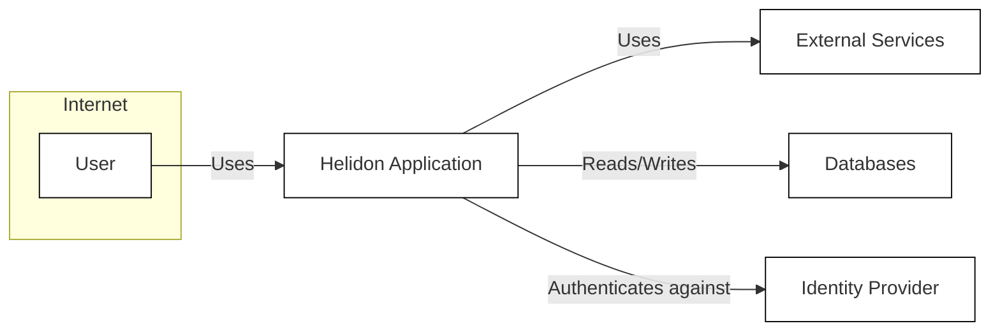
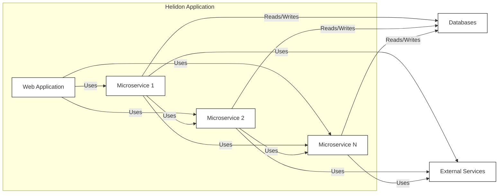
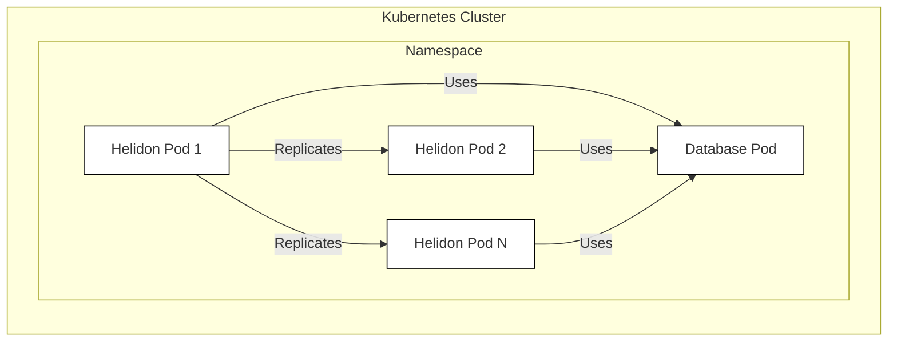

# Project Design Document: Helidon

## BUSINESS POSTURE

Helidon is a collection of Java libraries for writing microservices. It's developed by Oracle, a large, established company. This suggests a lower risk appetite than a startup, with a focus on stability, maintainability, and enterprise-grade security.

Priorities:

*   Provide a lightweight, fast, and flexible framework for building microservices.
*   Support both reactive (Netty-based) and traditional (thread-per-request) programming models.
*   Offer seamless integration with other Oracle products and cloud services (though not exclusively).
*   Maintain a high level of code quality and security.
*   Provide excellent documentation and support.
*   Attract and retain a community of developers.

Goals:

*   Become a leading microservices framework in the Java ecosystem.
*   Enable developers to build and deploy cloud-native applications efficiently.
*   Reduce the operational overhead of managing microservices.

Business Risks:

*   Vulnerabilities in the framework could expose applications built with Helidon to attacks.
*   Performance issues could impact the scalability and responsiveness of applications.
*   Lack of adoption by the developer community could limit the framework's growth and long-term viability.
*   Incompatibility with other popular frameworks or tools could hinder adoption.
*   Failure to keep up with evolving industry standards and best practices could make the framework obsolete.
*   Reputational damage due to security breaches or major bugs.

## SECURITY POSTURE

Existing Security Controls (based on the GitHub repository and general knowledge of Oracle's practices):

*   security control: Secure Coding Practices: Oracle likely follows secure coding guidelines and best practices during development. (Implicit in Oracle's development processes).
*   security control: Static Code Analysis: The project likely uses static code analysis tools to identify potential vulnerabilities. (Evidenced by presence of linters and static analysis tools in build process).
*   security control: Dependency Management: The project uses Maven for dependency management, allowing for tracking and updating of third-party libraries. (Evidenced by pom.xml files).
*   security control: Regular Security Reviews: Oracle likely conducts regular security reviews and audits of the codebase. (Implicit in Oracle's development processes).
*   security control: Vulnerability Disclosure Program: Oracle has a vulnerability disclosure program to encourage responsible reporting of security issues. (Oracle's standard practice).
*   security control: Cryptographic Libraries: Helidon uses standard cryptographic libraries for secure communication and data protection. (Evidenced by dependencies on libraries like Netty and Bouncy Castle).
*   security control: Authentication and Authorization Mechanisms: Helidon provides built-in support for authentication and authorization using various mechanisms like JWT, OAuth2, and OIDC. (Evidenced by documentation and code examples).
*   security control: Input Validation: Helidon encourages input validation to prevent injection attacks. (Evidenced by documentation and best practices).
*   security control: Secure Configuration: Helidon promotes secure configuration practices, such as avoiding hardcoded credentials. (Evidenced by documentation and examples).

Accepted Risks:

*   accepted risk: Complexity of Microservices Architecture: Microservices architectures inherently introduce complexity, which can increase the attack surface. This is mitigated by providing tools and guidance for secure configuration and communication.
*   accepted risk: Reliance on Third-Party Libraries: Helidon, like any framework, relies on third-party libraries. Vulnerabilities in these libraries could impact Helidon's security. This is mitigated by careful selection and regular updates of dependencies.

Recommended Security Controls:

*   Dynamic Application Security Testing (DAST): Implement regular DAST scans to identify runtime vulnerabilities.
*   Software Composition Analysis (SCA): Integrate SCA tools to automatically identify and track known vulnerabilities in third-party dependencies.
*   Security Training for Developers: Provide regular security training to Helidon developers to ensure they are up-to-date on the latest threats and best practices.
*   Fuzz Testing: Incorporate fuzz testing to discover unexpected vulnerabilities by providing invalid or random input to the framework.

Security Requirements:

*   Authentication:
    *   Support for standard authentication protocols like OAuth 2.0 and OpenID Connect.
    *   Integration with identity providers (IdPs).
    *   Secure storage of credentials.
    *   Protection against common authentication attacks (e.g., brute-force, credential stuffing).
*   Authorization:
    *   Role-Based Access Control (RBAC) or Attribute-Based Access Control (ABAC).
    *   Fine-grained access control to resources and APIs.
    *   Protection against privilege escalation attacks.
*   Input Validation:
    *   Validation of all input from external sources (e.g., HTTP requests, messages).
    *   Whitelist validation preferred over blacklist validation.
    *   Protection against common injection attacks (e.g., SQL injection, cross-site scripting).
*   Cryptography:
    *   Use of strong, industry-standard cryptographic algorithms.
    *   Secure key management.
    *   Protection of data in transit and at rest.
    *   Compliance with relevant cryptographic standards (e.g., FIPS 140-2).

## DESIGN

### C4 CONTEXT



*   Elements Description:
    *   1.  Name: User
        *   Type: Person
        *   Description: A user of the Helidon application.
        *   Responsibilities: Interacts with the Helidon application through a web browser, mobile app, or other client.
        *   Security controls: Authentication and authorization mechanisms provided by the Helidon application and potentially the Identity Provider.
    *   2.  Name: Helidon Application
        *   Type: Software System
        *   Description: The application built using the Helidon framework.
        *   Responsibilities: Provides business functionality, handles user requests, interacts with external services and databases.
        *   Security controls: Input validation, authentication, authorization, secure communication, data protection.
    *   3.  Name: External Services
        *   Type: Software System
        *   Description: Third-party services used by the Helidon application (e.g., payment gateways, email services).
        *   Responsibilities: Provide specific functionalities as required by the Helidon application.
        *   Security controls: Secure communication protocols (e.g., HTTPS), API keys, authentication tokens.
    *   4.  Name: Databases
        *   Type: Software System
        *   Description: Databases used by the Helidon application to store data.
        *   Responsibilities: Store and retrieve data as requested by the Helidon application.
        *   Security controls: Access control, encryption at rest, database firewalls.
    *   5.  Name: Identity Provider
        *   Type: Software System
        *   Description: An external service that manages user identities and provides authentication services.
        *   Responsibilities: Authenticate users, issue tokens, manage user accounts.
        *   Security controls: Secure protocols (e.g., OAuth 2.0, OpenID Connect), multi-factor authentication.

### C4 CONTAINER



*   Elements Description:
    *   1.  Name: Web Application
        *   Type: Container
        *   Description: A web application that serves as the entry point for user interactions.
        *   Responsibilities: Handles user requests, interacts with microservices, renders user interfaces.
        *   Security controls: Input validation, authentication, authorization, session management.
    *   2.  Name: Microservice 1
        *   Type: Container
        *   Description: A microservice responsible for a specific business function.
        *   Responsibilities: Performs a specific task, interacts with other microservices and databases.
        *   Security controls: Input validation, authentication, authorization, secure communication.
    *   3.  Name: Microservice 2
        *   Type: Container
        *   Description: Another microservice responsible for a different business function.
        *   Responsibilities: Performs a specific task, interacts with other microservices and databases.
        *   Security controls: Input validation, authentication, authorization, secure communication.
    *   4.  Name: Microservice N
        *   Type: Container
        *   Description: Represents any number of additional microservices.
        *   Responsibilities: Performs specific tasks, interacts with other microservices and databases.
        *   Security controls: Input validation, authentication, authorization, secure communication.
    *   5.  Name: Databases
        *   Type: Container
        *   Description: Databases used by the microservices.
        *   Responsibilities: Store and retrieve data.
        *   Security controls: Access control, encryption at rest, database firewalls.
    *   6.  Name: External Services
        *   Type: Container
        *   Description: External services used by the microservices.
        *   Responsibilities: Provide specific functionalities.
        *   Security controls: Secure communication protocols, API keys, authentication tokens.

### DEPLOYMENT

Possible deployment solutions:

1.  Kubernetes: Helidon applications are well-suited for deployment on Kubernetes.
2.  Virtual Machines: Helidon applications can be deployed on virtual machines (e.g., Oracle Cloud Infrastructure Compute).
3.  Serverless Functions: Parts of a Helidon application can be deployed as serverless functions (e.g., Oracle Functions).
4.  Bare Metal: Helidon applications can be deployed directly on bare metal servers.

Chosen solution for detailed description: Kubernetes



*   Elements Description:
    *   1.  Name: Helidon Pod 1
        *   Type: Node
        *   Description: A Kubernetes pod running one or more Helidon containers.
        *   Responsibilities: Executes the Helidon application code.
        *   Security controls: Network policies, pod security policies, container image security.
    *   2.  Name: Helidon Pod 2
        *   Type: Node
        *   Description: Another Kubernetes pod running one or more Helidon containers (replica of Pod 1).
        *   Responsibilities: Executes the Helidon application code.
        *   Security controls: Network policies, pod security policies, container image security.
    *   3.  Name: Helidon Pod N
        *   Type: Node
        *   Description: Represents any number of additional Helidon pods (replicas).
        *   Responsibilities: Executes the Helidon application code.
        *   Security controls: Network policies, pod security policies, container image security.
    *   4.  Name: Database Pod
        *   Type: Node
        *   Description: A Kubernetes pod running the database.
        *   Responsibilities: Stores and retrieves data.
        *   Security controls: Network policies, pod security policies, database security configuration.

### BUILD

The Helidon build process is primarily based on Maven. The repository contains numerous `pom.xml` files, indicating a modular build structure. GitHub Actions are used for CI/CD.

```mermaid
graph LR
    A[Developer] --> B[GitHub Repository]
    B -- "Push" --> C[GitHub Actions]
    C -- "Maven Build" --> D[Build Artifacts (JARs)]
    C -- "Run Tests" --> E{Tests Pass?}
    E -- "Yes" --> F[Publish Artifacts]
    E -- "No" --> G[Build Fails]
    C -- "Security Checks (SAST, SCA)" --> H{Vulnerabilities Found?}
    H -- "Yes" --> G
    H -- "No" --> D
    classDef box fill:#fff,stroke:#000,stroke-width:1px;
    class A,B,C,D,E,F,G,H box
```

*   Developer commits code to the GitHub repository.
*   GitHub Actions triggers a build pipeline on push events.
*   Maven is used to compile the code, resolve dependencies, and run unit and integration tests.
*   Static Application Security Testing (SAST) and Software Composition Analysis (SCA) are performed as part of the build process (evidenced by presence of relevant plugins and configurations).
*   If tests pass and no critical vulnerabilities are found, build artifacts (JAR files) are produced.
*   Artifacts are published to a repository (e.g., Maven Central).

Security Controls in Build Process:

*   security control: Dependency Management: Maven manages dependencies, allowing for tracking and updating of third-party libraries.
*   security control: Static Code Analysis: SAST tools are used to identify potential vulnerabilities in the code.
*   security control: Software Composition Analysis: SCA tools are used to identify known vulnerabilities in third-party dependencies.
*   security control: Automated Testing: Unit and integration tests are run automatically to ensure code quality and prevent regressions.
*   security control: Build Automation: GitHub Actions automates the build process, ensuring consistency and repeatability.
*   security control: Code Signing: Artifacts can be digitally signed to ensure their integrity and authenticity. (Potentially implemented, but not explicitly confirmed in the repository).

## RISK ASSESSMENT

*   Critical Business Processes:
    *   Providing a stable and reliable framework for building microservices.
    *   Enabling developers to build and deploy applications efficiently.
    *   Maintaining the reputation of Oracle as a provider of high-quality software.

*   Data to Protect:
    *   Source code of the Helidon framework. (Sensitivity: Confidential)
    *   Documentation and examples. (Sensitivity: Public)
    *   User data processed by applications built with Helidon (Sensitivity: Depends on the specific application). This is *not* data handled by Helidon itself, but by applications *using* Helidon. Helidon, as a framework, doesn't inherently handle sensitive user data.
    *   Configuration data for Helidon applications (Sensitivity: Confidential, may contain secrets).

## QUESTIONS & ASSUMPTIONS

*   Questions:
    *   What specific SAST and SCA tools are used in the Helidon build process?
    *   What is the process for handling security vulnerabilities reported through the vulnerability disclosure program?
    *   Are there any specific compliance requirements (e.g., PCI DSS, HIPAA) that Helidon applications need to meet?
    *   What is the frequency of security reviews and audits?
    *   Is there a dedicated security team responsible for Helidon?
    *   Are there any plans to implement fuzz testing?
    *   What are the specific mechanisms used for secure communication between microservices (e.g., mutual TLS)?
    *   How are secrets (e.g., API keys, database credentials) managed in Helidon applications?

*   Assumptions:
    *   BUSINESS POSTURE: Oracle has a low risk appetite and prioritizes security.
    *   SECURITY POSTURE: Oracle follows secure coding practices and conducts regular security reviews. The build process includes SAST and SCA.
    *   DESIGN: Helidon applications are typically deployed on Kubernetes. The build process uses Maven and GitHub Actions. Microservices communicate securely.