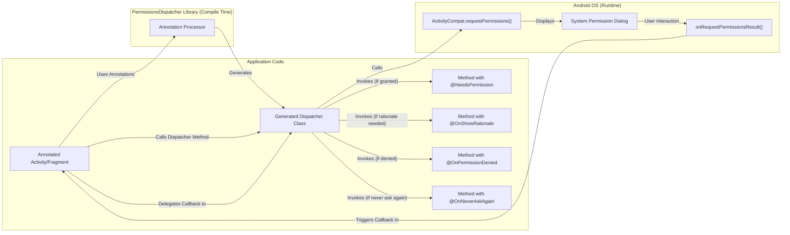

# Project Design Document: PermissionsDispatcher

**Version:** 1.1
**Date:** October 26, 2023
**Author:** AI Software Architect

## 1. Introduction

This document provides an enhanced and detailed design overview of the PermissionsDispatcher library, an open-source Android library designed to simplify the complexities of handling runtime permissions. This document is intended to serve as a robust foundation for subsequent threat modeling activities. It thoroughly outlines the library's architecture, dissects its key components, meticulously traces the data flow, and clarifies its interactions with both the Android operating system and the applications that integrate it.

## 2. Project Overview

PermissionsDispatcher's core objective is to significantly reduce the amount of boilerplate code typically associated with requesting and handling Android runtime permissions. It achieves this through the use of annotation processing, which automatically generates the necessary code for permission checks and requests. This abstraction allows developers to concentrate on the core logic that should be executed once the required permissions are granted or if the request is denied.

## 3. Goals

*   To drastically simplify the process of requesting and managing Android runtime permissions.
*   To minimize boilerplate code within Activities and Fragments related to permission handling.
*   To enhance the readability and maintainability of code segments dealing with permissions.
*   To offer a transparent and intuitive API for developers to interact with the permission system.
*   To ensure the generated code adheres to Android best practices for permission handling.

## 4. Non-Goals

*   To replace or fundamentally alter the underlying Android permission system.
*   To provide custom or stylized UI elements for permission requests beyond the standard Android-provided dialogs.
*   To handle permission requests in background services or address complex permission revocation scenarios beyond the standard Activity/Fragment lifecycle methods.
*   To offer explicit integrations with specific dependency injection frameworks, although it is designed to be compatible with them.
*   To manage or enforce permission groups beyond the individual permission level.

## 5. Architecture

The PermissionsDispatcher library operates in two distinct phases: compile-time processing and runtime execution.

### 5.1. Compile-Time Processing

*   **Annotation Processor (`PermissionsDispatcherProcessor`):** This is the central component of the library during compilation.
*   **Input Analysis:** The processor meticulously scans the application's source code, specifically looking for the presence of defined annotations: `@NeedsPermission`, `@OnShowRationale`, `@OnPermissionDenied`, and `@OnNeverAskAgain`.
*   **Code Generation:** Based on the detected annotations, the processor dynamically generates specialized helper classes. These classes follow a naming convention of `<AnnotatedClass>PermissionsDispatcher`. The generated code encapsulates the intricate details of interacting with the Android permission handling APIs.
*   **Abstraction Layer:**  This generated code acts as an abstraction layer, shielding developers from the direct complexities of `ActivityCompat.requestPermissions()` and the `onRequestPermissionsResult()` callback.

### 5.2. Runtime Execution

*   **Invocation of Generated Dispatcher Methods:** Developers interact with the library by calling specific methods within the generated dispatcher classes. These methods initiate the permission request workflow.
*   **Interaction with Android Permission APIs:** Internally, the generated dispatcher classes leverage the standard Android APIs, primarily `ActivityCompat.requestPermissions()`, to trigger the permission request dialog.
*   **Callback Interception:** When the user responds to the permission request through the system dialog, the Android OS invokes the `onRequestPermissionsResult()` method within the associated Activity or Fragment.
*   **Delegation and Method Invocation:** The generated dispatcher classes intercept this crucial callback. Based on the user's response (granted, denied, or "never ask again"), the dispatcher class intelligently invokes the corresponding method within the original Activity or Fragment that was annotated with `@OnPermissionDenied`, `@OnNeverAskAgain`, or proceeds with the execution of the method annotated with `@NeedsPermission`.

## 6. Data Flow

The primary flow of data centers around the permission strings being requested and the subsequent results of those requests.

*   **Permission Request Initiation:** The developer initiates the process by calling a specifically generated method within the dispatcher class. This call includes the necessary context and the array of permission strings being requested. The generated method then internally calls `ActivityCompat.requestPermissions()`, passing along these permission strings.
*   **System Interaction and User Response:** The Android OS takes over, presenting a standard permission dialog to the user, clearly outlining the permissions being requested. The user then interacts with this dialog, either granting or denying the requested permissions.
*   **Callback with Results:** Upon the user's interaction, the Android OS invokes the `onRequestPermissionsResult()` method within the relevant Activity or Fragment. This callback provides crucial data: the original array of requested permissions, the corresponding grant results (whether each permission was granted or denied), and an integer array representing the grant results.
*   **Dispatcher Processing and Callback Invocation:** The generated dispatcher class intercepts this `onRequestPermissionsResult()` callback. It meticulously analyzes the grant results, matching them back to the original permission requests. Based on this analysis, it determines which of the annotated methods within the original Activity or Fragment should be invoked: the method annotated with `@OnPermissionDenied` (if any permissions were denied), the method annotated with `@OnNeverAskAgain` (if the user selected "Never ask again" for any permission), or the method annotated with `@NeedsPermission` (if all required permissions were granted).

## 7. Key Components

*   **`@NeedsPermission` Annotation:** This annotation is applied to methods that require one or more specific permissions to execute. The generated code ensures that these permissions are granted before allowing the annotated method to be invoked.
*   **`@OnShowRationale` Annotation:** Methods annotated with `@OnShowRationale` are intended to provide a clear and informative explanation to the user *before* the permission is actually requested. This method is invoked by the generated code if the system determines that a rationale should be displayed to the user (e.g., the user has previously denied the permission).
*   **`@OnPermissionDenied` Annotation:** This annotation marks methods that should be executed if the user denies the permission request. The generated code will invoke this method, providing developers with a mechanism to handle the denial gracefully.
*   **`@OnNeverAskAgain` Annotation:** Methods annotated with `@OnNeverAskAgain` are invoked if the user selects the "Never ask again" option for a particular permission. This provides a way for the application to handle this specific scenario, potentially guiding the user to the app's settings to manually grant the permission.
*   **`PermissionsDispatcherProcessor`:** As mentioned, this is the core annotation processor responsible for parsing the annotations and generating the corresponding dispatcher classes during the compilation phase.
*   **Generated Dispatcher Classes (e.g., `MyActivityPermissionsDispatcher`):** These are the helper classes that encapsulate the permission handling logic. Developers interact with these generated classes to initiate the permission request flow. They are not written manually by the developer.

## 8. Security Considerations

While PermissionsDispatcher significantly simplifies permission management, it's imperative to be aware of potential security implications and developer responsibilities:

*   **Bypassing Permission Enforcement:** A critical security consideration is ensuring that developers *always* use the generated dispatcher methods to trigger actions requiring permissions. Directly invoking methods annotated with `@NeedsPermission` will completely bypass the intended permission checks, leading to potential security vulnerabilities.
*   **Rationale Integrity and User Trust:** The implementation of the `@OnShowRationale` method is crucial. Providing misleading, incomplete, or overly technical rationales can erode user trust and lead to users denying necessary permissions, potentially hindering the application's functionality.
*   **Secure Handling of Denial Callbacks:** Methods annotated with `@OnPermissionDenied` and `@OnNeverAskAgain` might handle sensitive data or trigger actions based on the permission denial. Developers must implement these methods with security in mind to prevent unintended data exposure or malicious actions. For instance, avoid logging sensitive information related to the denial.
*   **Reliance on Annotation Processing Security:** The library's functionality hinges on the security and integrity of the Java annotation processing mechanism. While not directly a vulnerability within PermissionsDispatcher, any underlying issues in the annotation processing framework could potentially impact the library's behavior.
*   **Indirect Reflection Concerns:** Although developers don't explicitly use reflection, the generated code might internally utilize reflection or similar dynamic mechanisms. Developers should be aware of potential security implications associated with reflection, even indirectly.
*   **Third-Party Dependency Vulnerabilities (Application Level):** While PermissionsDispatcher itself aims to have minimal dependencies, the integrating application will inevitably have its own set of third-party libraries. Security vulnerabilities within these application-level dependencies could indirectly affect the overall security posture, including aspects related to permission handling. It's crucial to keep application dependencies updated.
*   **Risk of Misconfiguration and Misuse:**  Developers might misunderstand the correct usage patterns of PermissionsDispatcher, leading to incorrect permission handling logic or introducing security vulnerabilities. Comprehensive documentation, clear examples, and thorough testing are vital to mitigate this risk. For example, failing to handle the "Never ask again" scenario appropriately could lead to a degraded user experience.
*   **Potential for TOCTOU (Time-of-check Time-of-use) Issues:** While less likely, there's a theoretical possibility of a TOCTOU issue if the permission status changes between the check performed by the generated code and the actual execution of the method. However, Android's permission model makes this scenario less probable in typical use cases.

## 9. Deployment

Deploying PermissionsDispatcher into an Android application project is straightforward and typically involves dependency management.

*   **Gradle Dependency Declaration:** Add the necessary dependencies to the application's `build.gradle` file. This includes both the runtime dependency for the library itself and the annotation processor dependency to enable code generation during compilation.
*   **Annotation Processing Execution:** During the application's build process, the Gradle build system will invoke the annotation processor. This processor analyzes the code and automatically generates the required dispatcher classes.
*   **Runtime Integration and Usage:** Developers then utilize the generated dispatcher classes within their Activities and Fragments to initiate and manage permission requests, following the library's documented API.

## 10. Future Considerations

*   **First-Class Support for Jetpack Compose:** Adapting the library to seamlessly integrate with Jetpack Compose's declarative UI framework, potentially through composable functions or other Compose-specific mechanisms.
*   **Enhanced Error Reporting and Debugging:** Providing more detailed and informative error messages or debugging tools to assist developers in identifying and resolving issues related to permission handling.
*   **Improved Testability Infrastructure:**  Developing strategies and tools to enhance the testability of components that utilize PermissionsDispatcher, making it easier for developers to write unit and integration tests for their permission-related logic.
*   **Exploration of Kotlin DSL for Enhanced Syntax:** Investigating the feasibility of offering a Kotlin DSL (Domain Specific Language) to provide a more concise and idiomatic syntax for Kotlin developers using the library.
*   **Support for Permission Groups with Granular Control:**  Potentially adding features to manage permission groups more effectively, allowing for more nuanced control over related permissions.

## 11. Conclusion

PermissionsDispatcher provides a valuable abstraction layer that simplifies the often-tedious process of managing Android runtime permissions. This enhanced design document offers a comprehensive and detailed understanding of its architecture, key components, and data flow. This detailed information is crucial for effectively conducting threat modeling activities to identify and mitigate potential security risks associated with the library's usage. Developers must be aware of their responsibilities in using the library securely and correctly to maintain the integrity of their applications.
